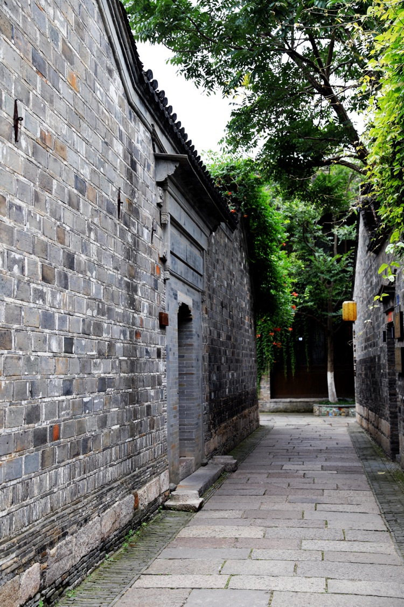
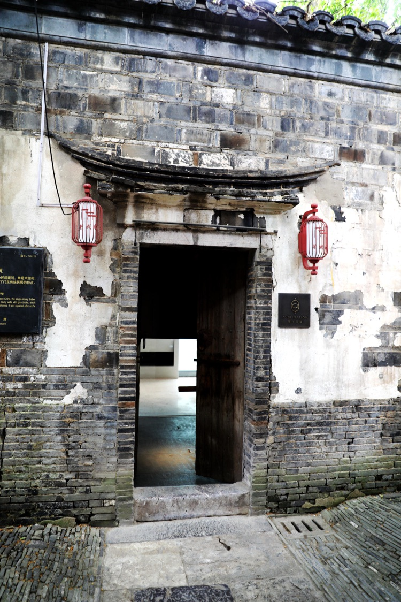
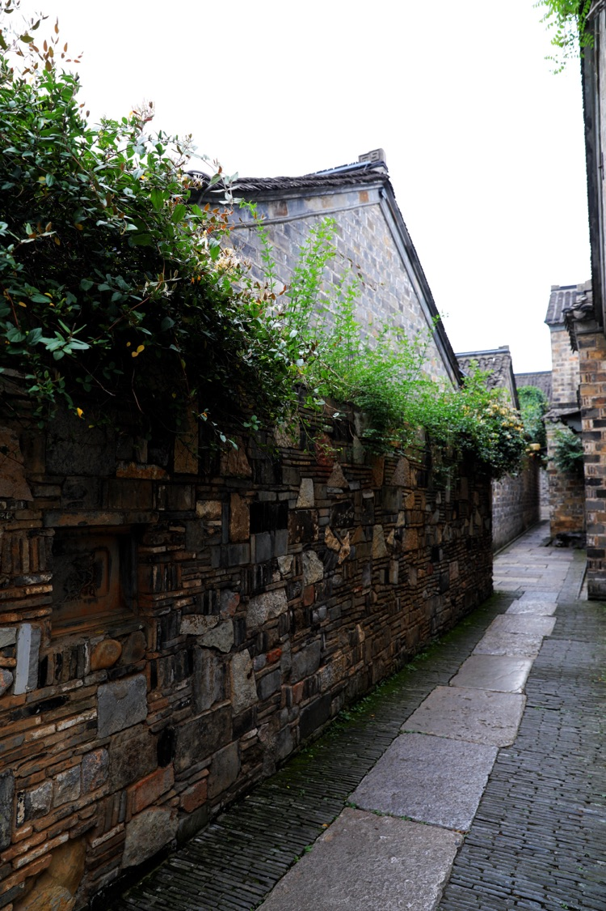
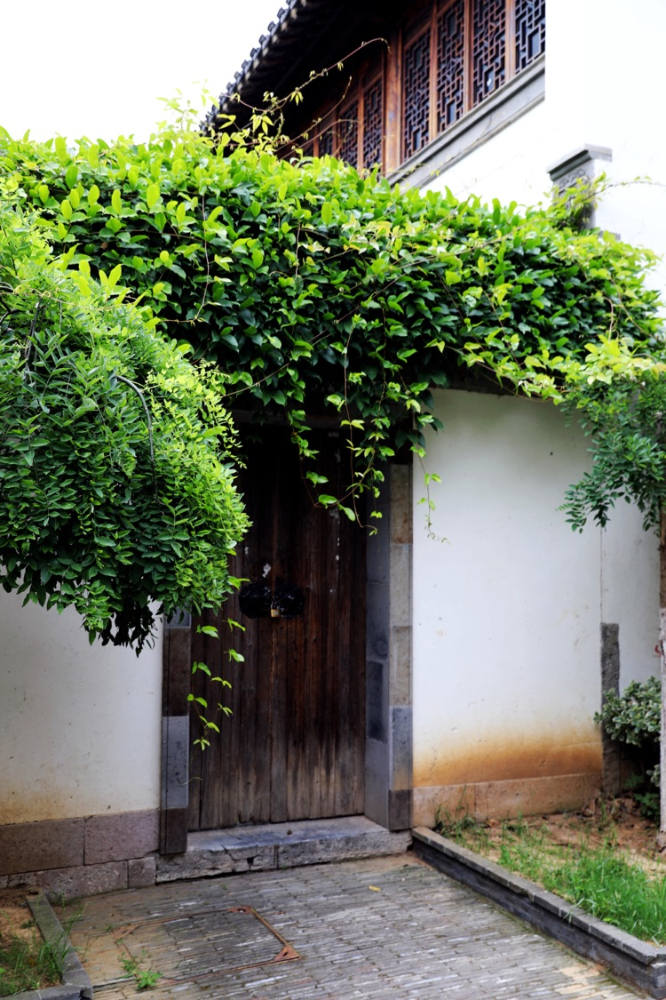
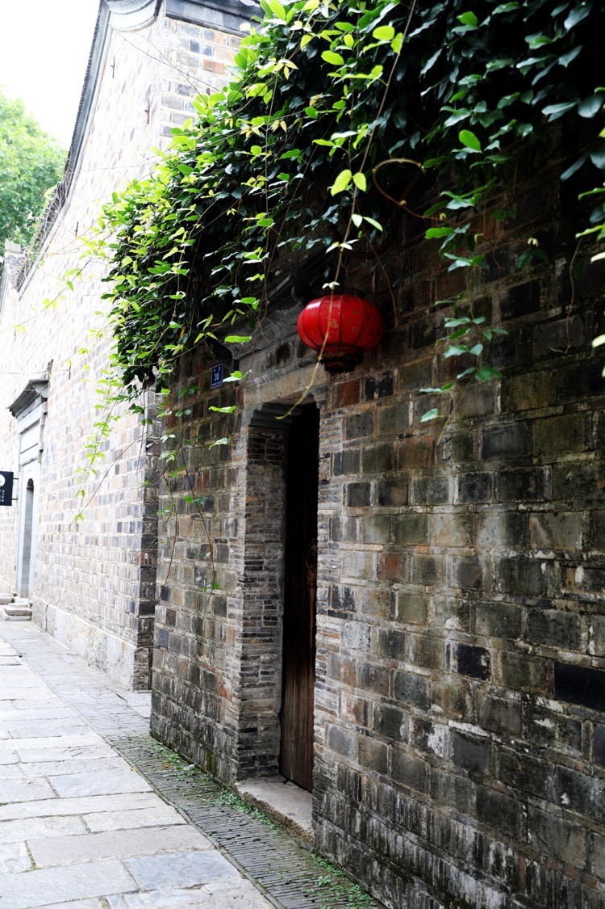
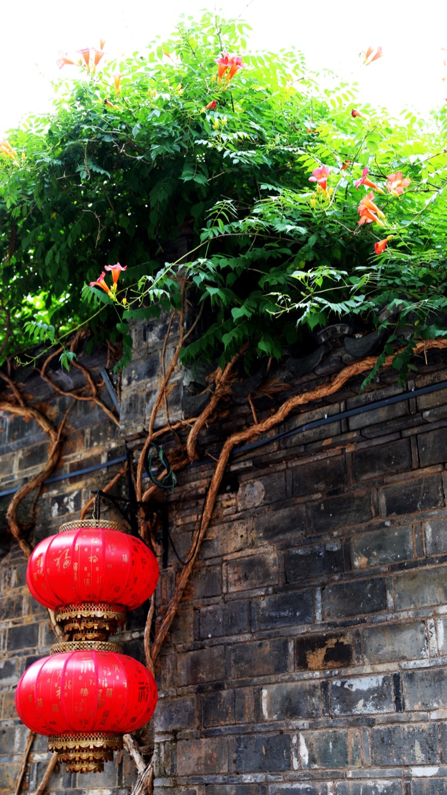
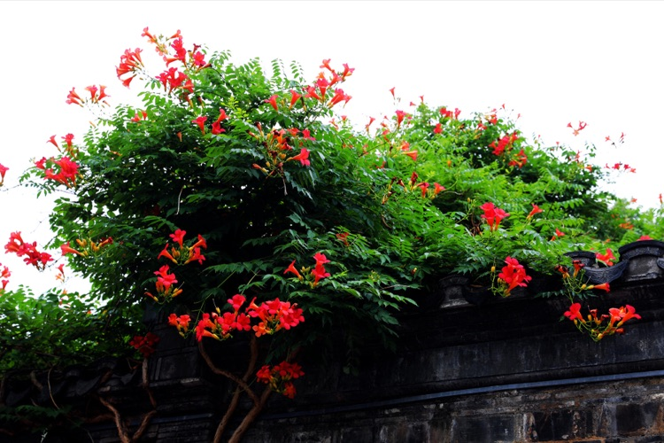

四合取「四面聚合」之意，一家人同住「四合院」表達了「全家人必須齊心合力，發揚光大祖宗家業」之理念。四合院是漢民族傳統民居形式，可追溯到3000年前的周朝，明清時期趨於完善。北京的四合院，後由於皇族的介入，等級分明、定製詳細，而南京的四合院相比之下只能算做簡略型，或者初始型。

<!--more-->

秦磚漢瓦的磚木結構沿用的幾千年，好像是魯班給他的徒弟們定下的規矩，先用木頭按規矩搭個框架，外面用磚砌，頂上鋪上瓦，所以說以前中國的房子都是木匠造的。房子有多大，木頭框架就有多大，木頭框架是一個整體，各種木頭構件通過榫頭相互咬合，每種構件的作用不同，稱呼不同。

房頂是等腰三角形，與三角形底邊平行的木頭構件叫「梁」，支撐「梁」的垂直地面的木頭構件叫「柱」，架在兩根「梁」上與房頂平行的木頭構件叫「檁」，鋪在兩根「檁」上的木頭構件叫「椽」。

標準四合院的正房一般是「七架梁」的房子，「七架梁」的結構指的是有七根「檁」分別架在柱和梁之上。屋頂上最高的檁叫「脊檁」，頂著「脊檁」的柱子，不在山牆裡面的叫「中柱」，在山牆裡面的叫「山柱」；處於屋宇最外邊的檁叫「簷檁」，支撐「簷檁」的柱子叫「簷柱」；「簷柱」與「中柱」之間的柱都叫「金柱」，同樣「脊檁」與「簷檁」之間的檁都叫「金檁」，靠近「脊檁」的叫「上金檁」，靠近「簷檁」的叫「下金檁」；支撐「簷檁」位於「簷柱」與「金柱」之間的短梁叫「抱頭梁」，支撐「下金檁」位於兩「金柱」之間的長梁叫「下梁」，支撐「上金檁」位於兩「童柱」（「童柱」立於「下梁」之上）之間的短梁叫「上梁」。

建築結構上「上梁」短，「下梁」長，「上梁」與「下梁」之間靠「童柱」的固定相互平行。俗話說「上梁不正下梁歪」，取義短的「上梁」都能看出來歪了，長的「下梁」看起來肯定更歪，且「上梁」和「下梁」本來就平行固定，「上梁」歪斜了，「下梁」能正到哪裡去？現在引申的意義就遠了。

李家苑的拆遷屬於「王府園小區舊城改造二期工程」，同期拆遷的地區還包括錦繡坊、慧園街、舊王府、潤德里等。經專家評議，李家苑北出口（偏西）的錦繡坊21號的房屋木結構，建造時用料講究，保存完好，且結構規矩，有鮮明的時代（清末）代表性。故在王府園小區二期的樓盤之間的西花園內，利用原錦繡坊21號房屋的木結構框架，配現在的磚瓦水泥，重新按原貌復建，門口掛一保護牌：「錦繡坊21號古建築」。

李家苑的的老房子基本屬南京地區的「四合院」結構，呈長方形佈局，進門是「前進」、過了天井是「後進」、兩邊是廂房，中間自然形成一小院，四面向下傾斜的屋頂如同「鬥型」，下雨時雨水從瓦溝對稱落下，小院美其名曰「天井」。

大門開在外牆的正中--「四合院」的中軸線上，門前有長條石板砌的台階，台階上面是石頭的門坎，門坎的寬和高都差不多約有20公分，兩端都砌在牆內。過去大門有兩個作用，一是顯赫家世，但在一般百姓人家最重要的作用是第二個--「防盜」。因為主要的功能是防盜，故而做的十分堅固，大門兩扇對開，每扇約200X60cm,即使在一般普通人家，也能常常看到厚約10cm的整板實木的門。

進門在「抱頭梁」長度相當地方，與「金柱」平齊的豎著6扇「皮門」，大門與皮門之間的空檔稱之為「門檔」。「皮門」用薄板蒙嚴，寫著「家訓」、或極有品位的「對子」、或耐人尋味的古詩詞。請人寫好，刻在門面上，再描上金粉。即使你完全看不明白，至少你會覺得這家人有文化、有家世。除非有「婚喪嫁娶」等「紅白喜事」中間兩扇皮門一般是關閉的，通常只開進門方向右手最邊的兩扇皮門，相傳「鬼」只走直線，中間兩扇皮門關閉可以阻擋「鬼」進門，北京的四合院進門的「照壁」（影壁）也有此意。

「前進」多數為「七架梁」的的房子，「柱」和「梁」形成的支撐面用板壁封閉，將「前進」隔為兩間主房和一間「堂屋」，「堂屋」在兩間主房的中間，開檔較兩間主房略寬。  「前進」的「堂屋」可放一到兩張八仙桌，用家中吃飯或辦事請客用。

「後進」與「前進」相似，也為「七架梁」的的房子，用板壁封閉，將「後進」隔為兩間主房、一間後廂房和一間「堂屋」，「後進」的「堂屋」偏小，在後廂房的板壁上掛有中堂，「堂屋」裡擺有供桌和祖宗牌位，用於祭祖等事宜。

兩邊的廂房一般為廚房或雜物間，南京人稱這種廚房為「鍋間」，「鍋間」裡砌有大灶，可燒柴火稻草，有單鍋單膛、也有雙鍋雙膛，大灶內建有煙囪直通房頂，七十年代初期，還時常在傍晚的巷子裡看到裊裊炊煙。那是有人家在燒大鍋飯，飯熟之後再添把草，就能在鍋底炕出厚厚鍋巴，鍋巴不但小孩愛吃，大人也愛吃，直到如今南京好多大飯店的菜單上還有「油炸鍋巴」這道菜，只不過葷素澆頭豐富了很多。要不就是有人家在煮菜粥，大米、蠶豆、青菜一鍋煮，鍋邊貼著稀稀的發麵饅頭，小火慢煮個吧小時，粥熟了，饅頭也熟了，那種整體鬆軟而硬底焦黃的「小腳饅頭」滋味現今只在回憶中。

四合院原則上是一大家人獨住，老太爺老太太住一間主房，依次下來，大兒子結婚住一間，二兒子結婚住一間，小兒子結婚住一間，女兒出嫁不住家裡，不過兒子多了還得再蓋房子。

這個「房」字被引申後大有講究，如指女人，大房指大老婆，二房指二姨太，以此類推。「房」字還可指男人，舊時習慣講大兒子家為大房，二兒子家為二房。如「大房有錢」，「二房開米店」，指大兒子有錢，二兒子開米店。沒搞清楚前可別亂講，以免讓人笑話，這個開米店的二兒子可不是二姨太生的喔。

「堂屋」的「堂」也被後人多多引用，不過一般人對其出處並非很清楚，以前家中有重大事情或是重大節日，一家人全要到堂屋吃飯，老太爺往主席上坐定，兒子來了，孫子也來了，這叫「三世同堂」，要是重孫也出現了，就叫「四世同堂」，那可是多少人嚮往的事喔。

天井裡多半有一小花台，種些月季之類的花草，地方大一點的還能種些果樹，如枇粑、無花果，或養一缸金魚，但最重要的是全院人晾曬衣服的地方，以前沒有人把衣服曬在外面，橫跨小巷的曬衣模式大概在六十年代後期才逐漸出現。前進和後進的屋面上橫擔著兩根長木梁，衣服洗好，檔在竹竿上，再叉到木梁上，遇到晴好天氣或趕上冷熱換季，小小的天井裡曬得是滿滿當當。

南京的四合院裡沒有茅廁，出門要走幾條巷子才有公共廁所（茅廁）。大小方便要在馬桶裡解決，馬桶南京人叫馬子，台灣人不知道沒見過，還是沒聞過，非要把老婆或女朋友叫做「馬子」，真是醉了。以前一家4、5口人住在10到20平米的房子裡十分常見，馬子一般放在大床背後的最為隱秘狹小空間內，俗稱「馬子巷」，大床的蚊帳一年四季是不拆的，起遮擋作用，有人家「馬子巷」口還再掛一布簾。
