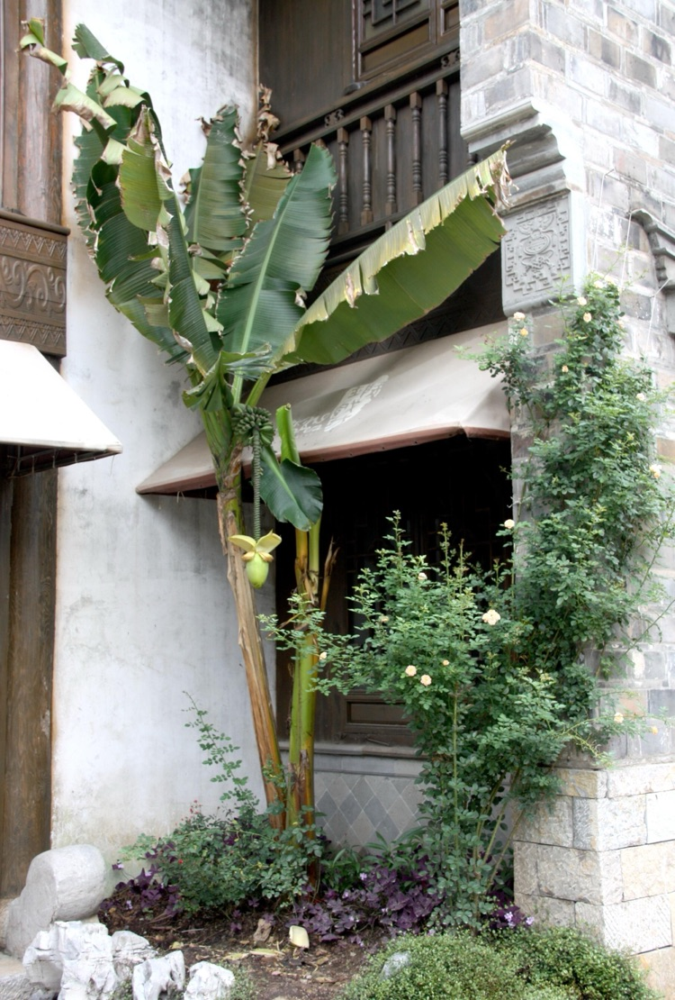
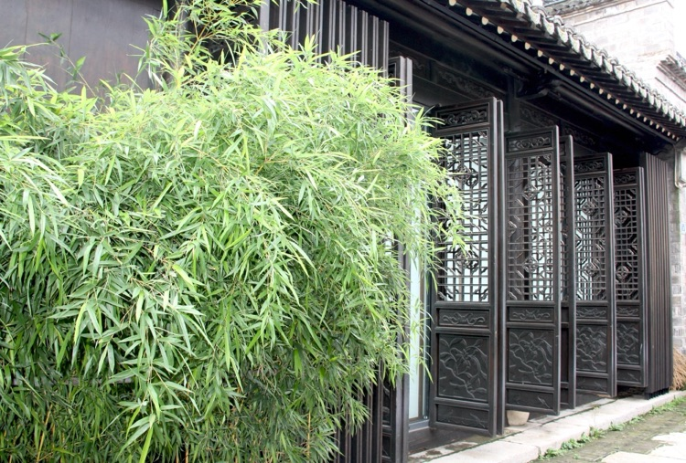
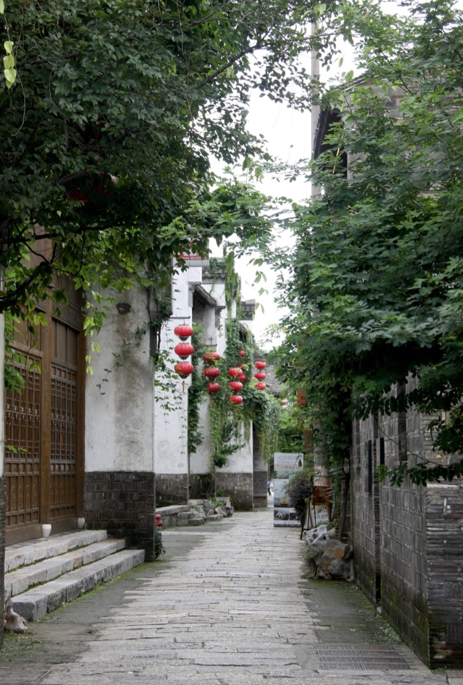
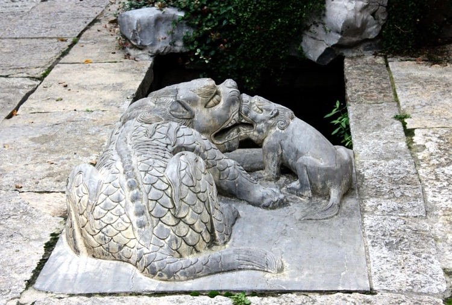
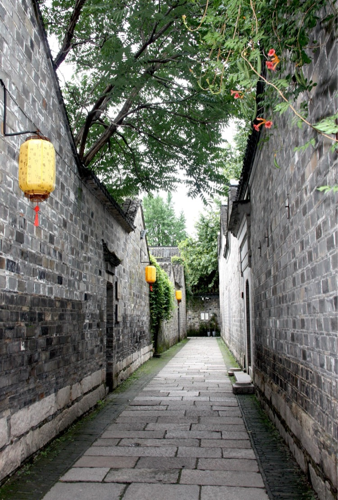
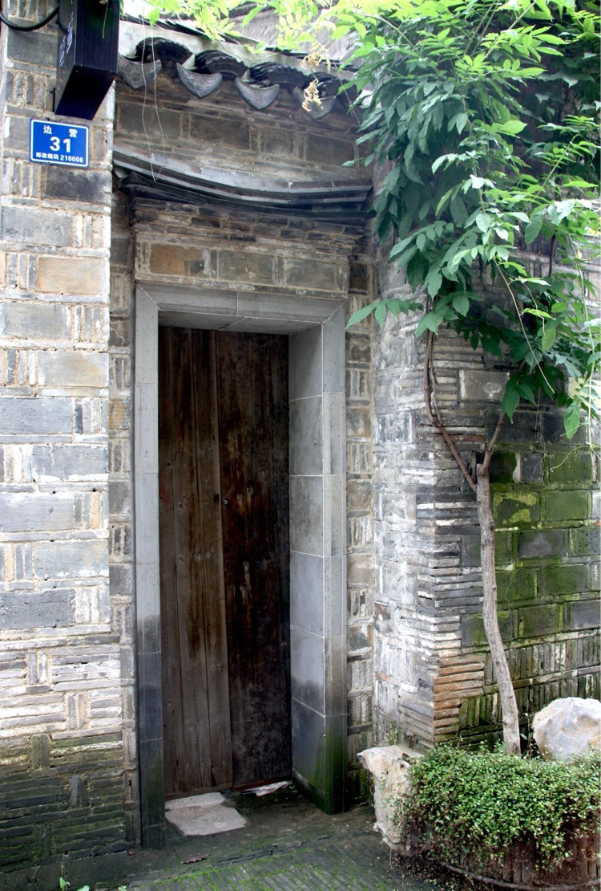
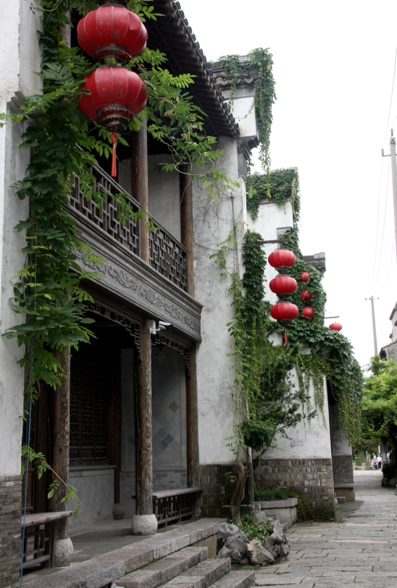
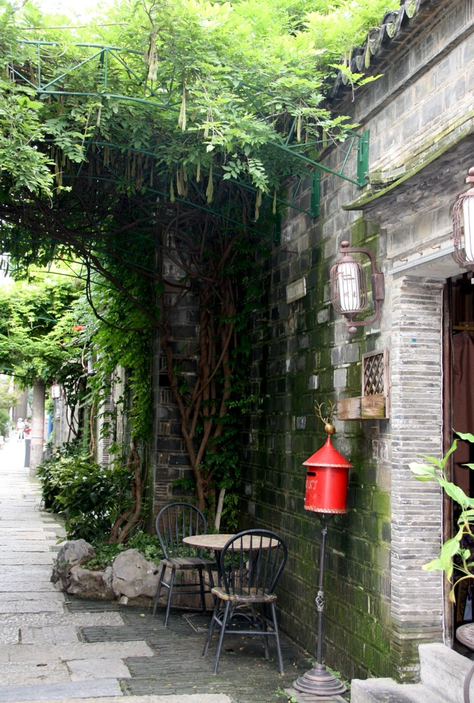

李家苑是南京城南三山街附近一條不規則的小巷，一百多米長，東西走向。東接舊王府，北連錦繡坊，西從26號住戶門內穿過可以直到中華路，這也是李家苑老鄰居記憶中的「兩個半出路」。

<!--more-->

26號是老侉家的房子，來來往往住過多少家房客已無從考證，中華路上的門面房當然是老侉家住，迎街開間紙花店，店內裝著「傳呼電話」，至今很多李家苑的老鄰居還將老侉家稱之為「打電話家」。那時電話計時器還沒有發明，打電話按次不計時。老房翻修時就發現過石灰下被遮擋的舊門牌，上面用繁體字寫著「傳呼電話XXXX」，可見李家苑用「傳呼電話」的歷史久遠，從其他地方打過來的電話，就說「請找李家苑某某號的某某某」 ，老侉家派人去喊，「某某某」來接完電話，交四分錢就行，要是自己直接過去打電話還便宜一分錢。

50、60年代城市中的通訊就是如此，電影《秘密圖紙》中有這樣的場景，特務「王先生」在家聽見樓下喊：「王先生，電話」。於是王先生來到傳呼電話站，和上級「女特務」通過電話接頭，接受指令。

不知是形成初期就刻意追求「鬧中取靜」的意境，還是在不知不覺中形成的自然格局，李家苑的居民彷彿只在別人家的後院圍牆邊蓋房子，東邊巷口左右兩家的大門在舊王府，北邊巷口左右兩家的大門在錦繡坊。總長100多米的巷子，從舊王府進來快50多米了，再拐個不大於的彎才看見李家苑1號的門牌。

神秘門牌的編號一直是纏繞在原居民心中迷，但住久了一切又好像十分正常，巷子南邊是單號，從1號編到9號，巷子南邊是雙號，從2號編到26號。那麼李家苑的門牌號碼大於10號的只有雙號，沒有單號，11號、13號…..25號這些單號門牌是從來就沒有，還是因某種原因從此消失？

巷子南邊中間凹進去一塊空地，就是傳說中的「高屋堆」，「高屋堆」住著8、9家人，早先共用「5號」的門牌，分別按「5號-1、5號-2、5號-3…….」往下編。後來不知那個人頭腦一熱，用「11號、13號、15號…..」這些大單號代替「5號-1、5號-2、5號-3…….」。粗一看沒什麼，細一想，單號這邊就像一根繩中間彎了一道圈，大號往中間一擱，嘿，一根繩中間繫了個套。好在這種壞運氣還沒有擴散影響到李家苑的居民，李家苑就拆遷了。

李家苑的地名從此消失，和整個樓盤一道併入南京最具帝王氣的王府園小區。

「舊時王謝堂前燕，飛入尋常百姓家」。世事變遷，滄海桑田，經歷了幾百年間的改朝換代，戰火洗禮，李家苑歸於平靜，大富大貴之人、高官、商賈隨著歲月流逝煙飛灰滅，歷史上沒有留下一星半點記錄，巷內也沒留下有名或高大華麗的建築，後人籍以憑弔的是一塊名為「高屋堆」的空地，和巷口極不規範的「上馬石」。

「高屋堆」顧名思義就是一很高很大大的房子因故倒塌，形成一堆廢墟。

1972年中央發文傳達毛主席的最高指示「深挖洞、廣積糧、不稱霸」。「廣積糧、不稱霸」離一般人太遠，「深挖洞」卻可落實到每一個人，有院子的在家裡挖，沒院子的在巷子內的空地上挖。居委會主任帶著一群小組長和積極分子，像看風水一樣圍著李家苑前前後後轉來轉去，最終定下在「高屋堆」的空地上挖「巷級防空洞」，後來在街道辦事處的大力支持下「高屋堆防空洞」建成完工了，這是半地下式的人防工事，差不多2米來高，一半埋在地下，一半露出地面，拱形圓頂用紅磚砌成，「高屋堆防空洞」東西向全長10多米，兩頭有兩個出口轉90度朝南。

挖防空洞時還真的挖出好幾塊一米見方的石塊，上下兩個平面被雕刻成圓形，與明故宮公園存放的那幾塊石頭極相似，老人們說這是承恩寺大殿柱子的基石，這正好說明李家苑與承恩寺之間有交集。

承恩寺的建寺經過、規模和佈局，明南翰林學士晉陵王輿在《承恩寺記略》中有記載。承恩寺原為大宦官王瑾的故第。王瑾原名陳蕪，從永樂皇帝時即陪侍皇太孫朱瞻基，朝夕相處。朱瞻基認為他「忠肝義膽」、「心跡雙清」，即位後對他十分寵信倚重，賜名王瑾，參與軍國大事，多次蒙受重賞，積貲累萬，在鬧市區建造巨宅。景泰二年，王瑾奏請舍宅為寺，賜額「承恩寺」。

承恩寺緊靠朱元璋為吳王時所居住的王府園，規模宏偉，基址周長一百二十七丈，共有六座大殿及禪堂、方丈室、僧舍、齋房等一百二十餘間。承恩寺在景泰二年創立後，可考者有成化、萬曆時期兩次重修。承恩寺所統小寺有亭子巷觀音庵、佑國庵、傘巷觀音庵。

1900年，承恩寺在一場大火中被燒燬。

李家苑這條小巷產生於明代，起初這裡稱「承恩裡」，因這條小巷緊臨承恩寺，沿承恩寺向東一拐便進入小巷，故歷史上曾稱承恩裡。那時的承恩裡為一條南北走向主街，和這條東西走向的小巷，為「一街一巷共一地名」。

清代初年，一李姓老闆在此經營同名客棧，後來這條小巷被人們稱為「李家苑」。

李家苑東接舊王府的巷口（外出方向右手）有一塊孤零零的石頭，約10公分厚，20公分寬，高出地面大約30多公分，緊貼旁邊住家的外牆。石頭上沒有文字，不知道何人所立，也不知立了多久，相傳這是塊公用的簡易的「上馬石」，依據是錦繡坊靠近中華路的巷口，也有塊已被人們認可的「上馬石」，與李家苑的這塊石頭相似，略寬點長點，高度差不多，石頭在巷口的位置和走向基本一致。

解放後沒有人騎馬了，錦繡坊巷口的「上馬石」變成了「背娃石」，一些小娃走到巷口就喊「走不動了」，自己就爬上「上馬石」，大人在前面一蹲，小娃往大人背上一趴，大人不吃力，小娃也開心，「背娃」動作一氣呵成，爬過錦繡坊巷口的「上馬石」的小夥伴們一定記憶猶新。

明清時期大富大貴之人一般從大門口的規制就可以看出，大門外有「上馬石」，「L」形呈階梯狀，最外邊還有石鼓，有的石鼓上刻有歷史故事，向人們暗示其主人的家世背景。出門向外走時，右手的為「上馬石」，回家向裡走時，右手則為「下馬石」。由於做官的人忌諱「下馬」二字，故統稱「上馬石」。

李家苑好像缺乏這樣的大富大貴之人，善未發現有哪戶大門外存留「上馬石」的遺蹟。不知哪朝哪代，有積德行善之人，在李家苑的巷口立了一塊「公用」的「上馬石」，住在李家苑的人雖出門不需用「上馬石」，但保不準有騎馬來辦事、或探親訪友者，事完成後，主人送到巷口，客人登上「上馬石」，撇腿上馬，揮手道別。
