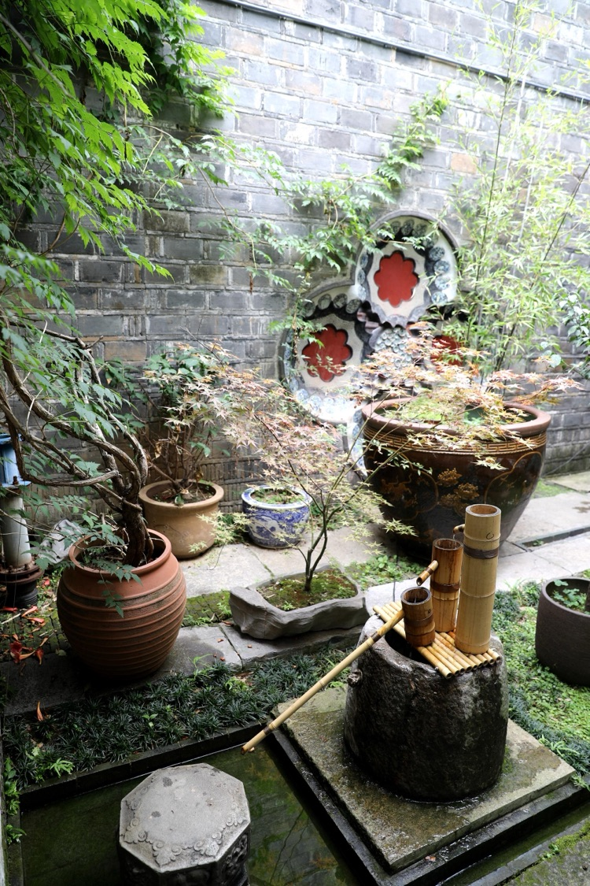
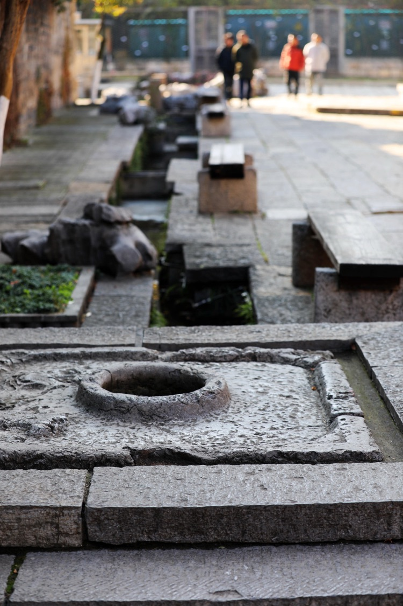
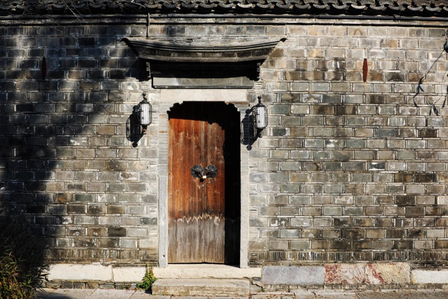
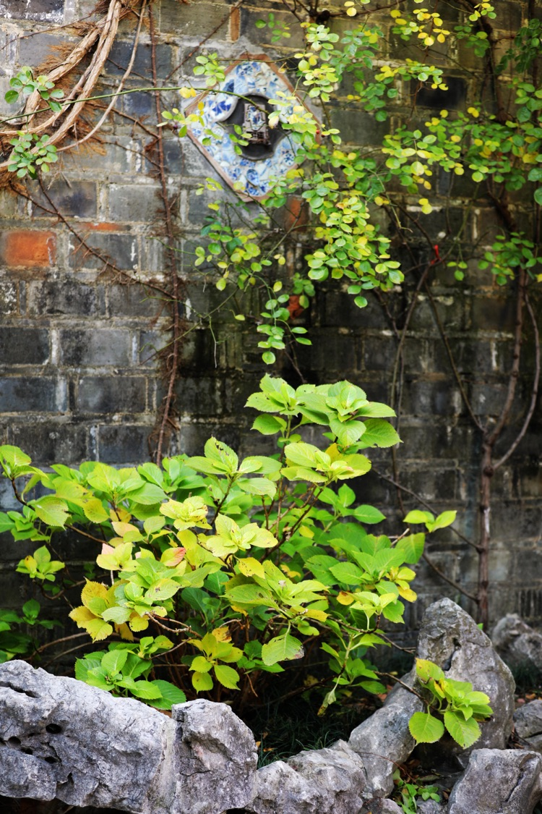
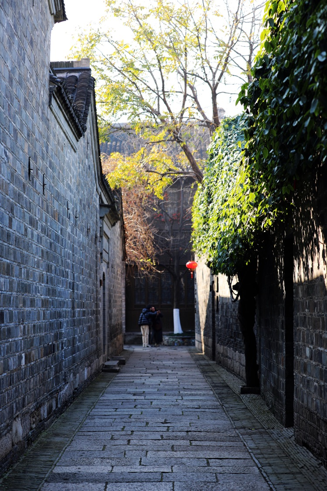
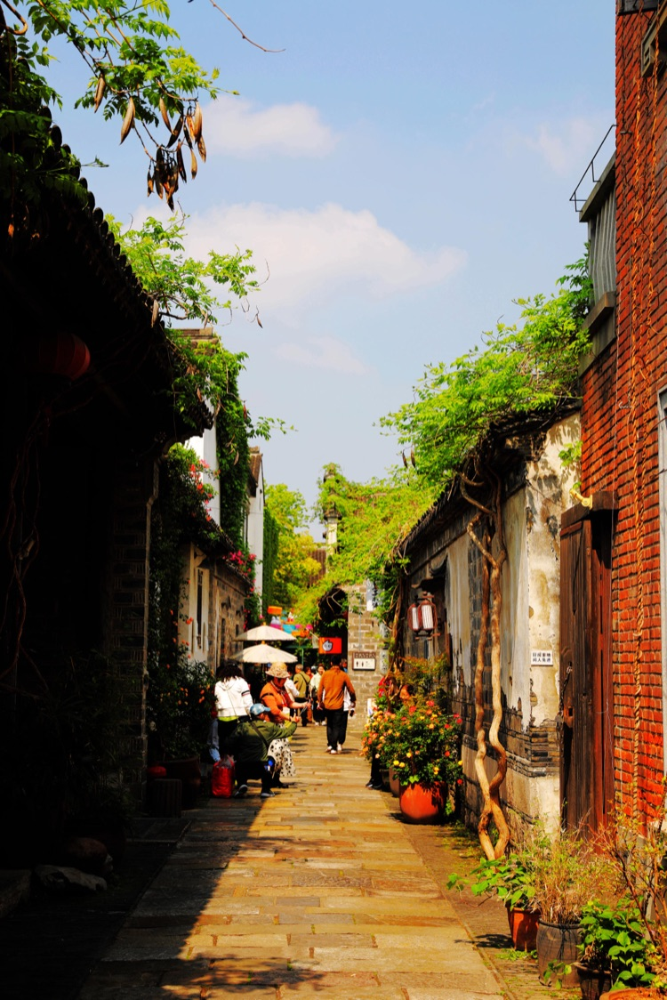
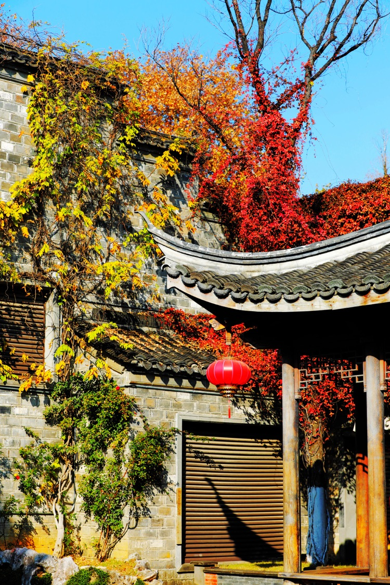

人類生活離不開水，古人大都擇水而居，或臨河，或靠湖泊，而在村落、集市和城市這些大量人群聚集的地方，水井就是水源的唯一選擇，人們只從水井裡取水，用過的水不可以直接倒回井中，倒在地上的溝裡，經過泥土的過濾，重新回到井中，因此，清澈的井水作為飲用水相對安全。

<!--more-->

古制八家為一井，井字就引申為同飲一井水的鄰里鄉親，離開家鄉到外地謀生的人說起「背井離鄉」這個詞都會有深深感觸，其中飽含濃濃的鄉愁和淡淡的無奈。

李家苑始建於明代，即不臨河，也不近水塘，水源只能是水井。直到1988年南京市舊城改造，拆遷前李家苑還保留了兩口公用井，井水依然清澈，但已無人用井水洗衣做飯。

巷東頭的井在8號門前，井欄為整塊大理石雕砌，敦厚圓滑，幾乎無一點損傷，水泥砌成的井台，在三面圍牆的環抱中自成一體。井台前一條排水溝一直延伸到路邊的大楊樹下，排水溝兩邊開闊的空地，可同時容納七八個盆（人）洗菜、洗衣。

巷北出口的井緊貼路邊，井欄相對較小，已經開裂，中間用鐵箍箍著，井欄沿口有繩磨的痕跡，也有桶撞的痕跡。井台由多塊大青石砌成，相互咬合自然，青石表面的稜邊早已被歲月磨得光滑圓潤，不十分平整，但卻無鬆動。井台東面是16號住戶自建的圍牆，用大小各異的磚塊隨意砌成的圍牆，偶爾露個空擋，可以看見主人種在地裡的蔬菜和花果。

8號馬家是回民，不知門前的井是他們家挖的，還是用他們家的地挖的井，知根知底的老鄰居們從不在8號門前的井邊洗豬肉及豬內髒。計劃經濟的那些年代，豬肉是憑票配給的，現在一家三口一天吃掉的豬肉可能是那時五六口人家或是七八口人家一個月的計劃，豬頭和豬內臟是不要票的，個把星期能吃個蘿蔔燉豬肺，紅燒豬大腸已經能讓很多人家羨慕了。

洗豬肺是件非常仔細和幸苦的事，豬肺不能破，洗的時候將豬肺灌滿水，輕輕的在豬肺的所有部位上均勻的拍打，將豬肺內大小管路中的髒物和粘液拍出，並隨水一道排出，反覆多次，直到將粉紅的豬肺洗成白色，整個過程需一個多小時。

洗豬大腸更是枯燥無味且技術性很強的事，除了反覆的灌水，漂洗，還要將大腸翻過來翻過去的洗，其中從大腸上擇除油脂是非常講究技術的，大腸上能夠洗淨的油脂是要儘可能的保留下來的，這樣燒出的大腸口感才好，彈性足，鮮嫩滑爽。當然，無法洗淨的油脂如沒擇除乾淨，燒出的大腸夾帶異味，那就敗人胃口了。

洗豬肺和洗豬大腸這樣的場景在8號門前的井邊是不會看見的，一般鄰居們通常擰水回家，在自家堂屋裡慢慢的洗，或是去北邊的井洗。

在老南京話中，尤其是老城南地區一般把井及井的周圍稱之為「井上」，聽起來像日語，其實是地地道道的老南京土話，如「到井上擰桶水」，指的是去從井裡提桶水；「在井上洗衣裳」，指的是在井邊上洗衣裳；「到井上乘涼」，指的是在井的附近乘涼。

南京是著名的火爐，夏天三十七八度的天氣每年都有好長一段時間，地面是燙的、牆壁是燙的、所觸摸到的一切都是燙的。四十年前，沒有空調、沒有冰箱、甚至沒有電風扇，廉價實用的芭蕉扇（與濟公的扇子同款）隨處可見，清冽的井水是人們極易獲得（關鍵是可以免費獲得）的清涼避暑的「神器」。煮好的綠豆湯，用盆井水「冰鎮」；燒好的稀飯，用盆井水「冰鎮」；挑好的西瓜，用盆井水「冰鎮」。就算洗衣、洗菜、洗碗這些家務活，用井水來做幹起來彷彿不再那麼痛苦。

太陽快要落山的時候，小巷內的人們開始忙碌起來，紛紛從狹小的蒸籠般的家中搬出竹床、鋪板床、摺疊床，躺椅、靠椅等乘涼傢俱，然後提來井水澆地、澆牆，衝竹床、衝鋪板床。太陽完全落山後，這些被井水衝過的竹木製做的床椅，隨著水分的蒸發，熱量基本散到露天的空氣中，坐上去已不怎麼熱了。除了下雨，三伏天裡人們基本住在室外，小巷路兩邊的各種床首尾相接，只在進大門的地方留個進出通道，有些犄角旮旯也會被人插進一張躺椅或摺疊椅，人和人之間的距離很近，你可以在路邊任何一個地方停下，隨意聽別人聊天，也能參加進去一道聊天。

喧鬧了整個夏天的井，隨著氣溫的下降逐步趨於平靜，祖輩留下的告誡顯然起到了警示作用：「過了立秋就不能吃西瓜，不能睡在外面了」。因此，過了立秋，無論天氣再熱，也沒人睡在露天，也沒人吃西瓜。秋後的雨一場涼過一場，當你感到颳倒臉上的風明顯涼了，不知不覺中，清晨房頂上的瓦已結出白霜，樹葉大部分已由綠轉黃，季節已進入冬天。突然有這麼幾天，井上又熱鬧起來，其擁擠的程度超過一年當中的任何一天，那是因為家家戶戶都要在這幾天裡醃醃菜。所謂「小雪醃菜，大雪醃肉」，節氣到了。

家裡沒有冰箱的年代，菜地裡沒有大棚，冬日人們用以佐餐的主要是一種被稱作「醃菜」的醃製品。網上搜索「醃菜」似乎囊括了「醃菜」、「泡菜」、「醬菜」之總和，南京地區醃製的「醃菜」通常只包括「高稈白大青菜」和「雪裡蕻」兩個品種，並只將「高稈白大青菜」稱作「醃菜」，「雪裡蕻」稱作「雪菜」以便於區分。大多數人家「醃菜」論缸醃（150斤～200斤），「雪裡蕻」論壇醃（20斤～50斤）。「醃菜」（高稈白大青菜）性涼，「雪裡蕻」性熱，冬天天燥易上火牙疼，所以，多吃「醃菜」還有「去火」達到平衡身體的作用。

計劃經濟的年代一切都需計劃，買醃菜要憑票，賣醃菜也就一兩天，居委會通知那天該那條巷子的居民買，定好日子，蔬菜大隊的菜農用板車將醃菜送到指定的地點，菜場一邊收票、一邊將成捆的醃菜稱給居民。沒買到的人排著隊，幾十個人一個挨一個，佔據半邊街道，有拿扁擔的、拿捆繩的、還有拖著筐的。已買到的人動用各種運輸工具將蔬菜拖回家，有用板車的、用三輪車的、用自行車的、還有用自制彈子盤（軸承）拖車的。

醃菜買回來要在太陽裡曬一兩天，菜幫子蔫了，才能進行清理、清洗及醃製，否則會造成菜的破損、掉葉，醃菜在整個製作過程中都要保持一個完整的狀態，因為醃製完成的菜也是一顆整菜哦。

清洗醃菜的工作一般從早晨就開始了，先將醃菜上的黃葉、爛葉去掉，然後去井上洗，三個洗菜大木盆一字排開，頭盆洗、二盆三盆過，不時地還要補水、換水，一家總要有兩三個人在忙乎。洗好的醃菜要擺在架子鋪開了上瀝水，於是人們又想出了各種辦法，把家裡能用來架醃菜的物品都拿了出來，有的用竹床、有的用鋪板、有的用躺椅、有的用長條凳、還有更妙的用梯子。

晚飯後，菜基本上瀝乾了水，全家人圍在一起醃菜，主醃的一般是這家的女主人，（除非她手「臭」，即醃的菜發酸的人俗稱「手臭」），其他人做幫手。主醃的人坐在一大木盆前，將菜葉散開，均勻撒入大鹽（大顆粒的醃菜鹽），然後平放入盆內，用力均勻的四面揉搓，主醃的人認為揉到位了，在大缸內一層一層碼放整齊，層與層之間還要再散上一層鹽，所有的菜下缸後還要再在上面壓上一塊壓缸石。

菜醃製十天後，亞硝酸鹽開始下降，15天後亞硝酸鹽下降至安全的劑量範圍內，也就是半個月後醃菜可以吃了，此時，醃好的菜要取出，每顆菜打成一個把子，再分壇保存。分壇這天，小孩會圍著大人身邊，為的是討一根現醃好的菜芯，真的好脆好甜，一輩子忘不掉的記憶，為什麼鹽醃出來的菜會是甜的？
