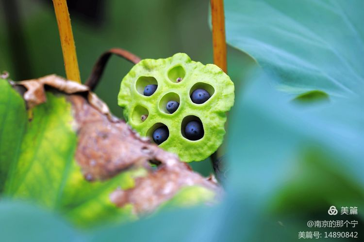

一個東西如果真的好吃，吃完之後必是連湯都喝的一乾二淨，到了南京，這好吃的東西就是鹽水鴨，喝的一乾二淨的是鴨血粉絲湯。都是因鴨而得，同本同源。

<!--more-->

在南京的小吃譜上，五十年前，就是七十年代以前竟然沒有「鴨血粉絲湯」的名錄，湯裡有鴨血的小吃是「鴨腸湯」。南京人愛吃鴨，鴨身上能吃的都被南京人做成了美味，最廉價的鴨腸鴨血流入市井，也被勤儉的南京人加工成一碗鮮美的湯。

七十年代以前，南京的市面上有麵館、包子鋪、甜食糕團店、燒餅油條店，但都不賣鴨腸湯，要想吃的話，一定要等到下午三四點鐘，等到南京人吃「下週兒」的時候，在巷子口或橋邊等稍微寬敞的地方，會出現賣鴨腸湯的攤位，老闆支一張小桌，放幾張小凳，用煤爐燒一鍋湯，來吃的人是些中小學生，或是帶小小孩來的家庭婦女，她們沒多少錢，有點東西哄哄自已的嘴就很好了，吃一碗鴨腸湯需化5分錢。

賣鴨腸湯的老闆總是不厭其煩向顧客表示，賺的是辛苦錢，鴨腸加工起來太麻煩，先要將腸子剖開，用鈍器刮去腸表面的油脂和多餘物，放入鹽或口鹼反复揉搓，以去除黏液和異味，再用清水一次次沖洗，直至鴨腸完全乾淨無異味，洗淨的鴨腸要在水里燙熟，時間短了燙熟的鴨腸會「回生」；時間長了，燙過了頭的鴨子腸老了咬不動。既要熟透，也要口感脆嫩，確實考驗老闆的手藝。相對於鴨腸，鴨血的加工是要簡單的多，從鴨子店買回來的鴨血一般是凝固成型的大塊，沖洗乾淨切成一厘米見方的小塊，就可以下鍋煮，火不能大，煮熟的鴨血以內部無氣孔為佳。湯是從鴨子店買回煮鹽水鴨的湯兌的，那時南京的鴨子店鹽水鴨都是自已製作，每天煮鴨子都留下很大的一鍋湯，大部分賣給周圍的居民回家燒青菜、冬瓜，賣鴨子湯的老闆當然可以每天定購一定量的煮鴨子湯，回家後再按一定的比列兌水，以保證賣出的鴨腸湯既能吃出鴨的味道，也能吃出為鹽水鴨提鮮那股特別的香料味，不濃也不淡，最明顯的特徵湯是「清湯」（不濃、能見度）。

客人要喝鴨腸湯，先找個小凳坐下，老闆隨後從祖傳的罐子裡取出定量的熟鴨腸，放入一隻乾淨的碗內，再順序放入榨菜末、蒜花和川椒麵（白胡椒粉），用大勺在煤火保溫的鍋裡盛出鴨血和湯，散發著幾朵蒜花清香、飄著幾朵湯花。

順便插一句，南京是歷史悠久的“文學之都”，生活中一般規避一些敏感之詞，鴨血在七十年代以前的南京人口中以“鴨晃”代之，因為鴨血凝固後為防止幹癟變形，浸在水中出售，稍受擾動時，便隨水而晃動，故形象的稱其“鴨血”。單位食堂和一些小的飯店會做「鴨晃燒豆腐」的菜餚出售，淋上濃濃的芡汁，下餐的很。

進入八十年代，可能是由於鴨腸加工困難又不賺錢，而隨著川菜及火鍋的不斷擴張，鴨血的社會地位和價格也不斷升高，鴨血的市場供應又遠大於鴨腸，漸漸的鴨腸湯裡的鴨子越來越少，最後連名字也換過來，湯裡只有鴨血，直接就叫「鴨血湯」了。

由於地區的差異，南京人吃的粉絲是細的綠豆粉絲，外形如超市賣的龍口粉絲，粉絲放在湯裡煮，裹著其他東西的鮮味一起吃。因為大家都很窮，一種說法粉絲是魚翅的替代品，還有一種說法是湯裡加了粉絲，吃起來可以更有「撈頭」。

現在的鴨血粉絲湯裡大部分為粗的山芋粉絲，吃起來更有咬勁，山芋粉絲流入南京和砂鍋有關。九十年代初，一種叫砂鍋的小吃風靡南京。砂鍋是一種比藍邊碗略大一點的，可以直接在爐火上加熱的容器，裡面先放豆芽打底，再放浸泡好的山芋粉絲，上面蓋著名義上的主料，如牛肉砂鍋加牛肉、三鮮砂鍋加雞蛋香腸、肥腸砂鍋加肥腸，再注入湯上幾根香菜。

鼎盛時期以「王府園砂鍋一條街」名氣最大，東頭的二老闆為了彰顯他家的砂鍋霸主地位，請人做了「王府園第一家肥腸砂鍋」的橫幅掛在店鋪前。砂鍋的品種繁多，當然少不了南京人心心念念的鴨血，早先也賣鴨血粉絲砂鍋，為了裝飾，裡面還添加了豆腐果、鴨腸、鴨心和鴨肝。

到了九十年代中期，有一家店把鴨血粉絲湯從砂鍋系列中獨立了出來，店名中就有“鴨血粉絲湯”的字樣，店家主要對湯做了改進，用鴨腿老火慢慢燉，熬成一鍋白白的濃湯。有客人需要鴨血粉絲湯，就將浸泡好的粉絲放入鍋裡燙熟裝碗，再放入煮熟的鴨血和陪襯的鴨腸、鴨肫、鴨心和鴨肝，從鍋裡盛出漂著吸滿滷汁豆腐果的靈魂鴨湯，灑上香菜，就可端上客人的桌子了，已擺著鮮紅辣椒的辣椒和紫吃著吃著，好像又餓了，於是再加一個酥燒餅或來一隻鴨腿，更有甚者直接再點一籠湯包。

於是這家店一下火出了圈，結連又開了好多家的加盟店。而其他的同行似乎也聞到商機，參照這種模式，在一些細節上更做功夫。在這些店家的共同努力與推波助瀾下，鴨血粉絲湯在南京餐飲界的江湖地位牢牢的坐穩且舉足輕重。經過多年的沉澱，在南京經營鴨血粉絲湯口碑較好的品牌店恐怕不只十家。這麼幾十年來，漸漸的連南京人自已、以及來南京旅遊的遊客都那麼堅定的認為，「鴨血粉絲湯」是南京久負盛名的傳統特色小吃。

前不久發小們聚會，無意間談到「鴨血粉絲湯」的過往今生，也講不出現在的鴨血粉絲湯哪兒不好，只能講豪華版的鴨血粉絲湯過於奢侈，於是有人提議，自已做一次「懷舊版」的鴨腸湯，細細品一品，看看能不能還原當年的味道、吃出那種質樸的情感？並約定第二天下午，都來我家吃「下週兒」。

第二天上午，我去菜場裡面心儀的那家鴨子店，先買了一斤蒜蓉口味的熟鴨腸和幾隻白煮的熟鴨肝，又買了一塊養在水里的“鴨晃”（生鴨血），說明來意和老闆要了幾袋鹽水鴨的蘸料（回去兌湯）。

到了下午，我早早的準備好榨菜末、蒜花和川椒粉，鴨血洗淨切塊備著，點火燒湯，幾袋鹽水鴨的蘸料再加了些水，開始煮鴨血。鴨血煮熟後，發小們也都來了，阿四還特地帶了幾塊黃橋燒餅。我把鴨腸均勻的分到各個小碗，再放入榨菜末、蒜花和切好的鴨肝，灑上一點川椒粉，從鍋裡盛出熱氣騰騰的鴨血和湯，一下子滿屋飄香，大家忽然都不說話，一邊吃著燒餅，一邊喝著“懷舊版”的鴨腸湯。

眾人放下碗後，只見阿四仰著頭，久久不著聲，不知是努力尋覓那失散多年的記憶？還是想忍一忍突如其來的那份惆悵？過了好一會，阿四長長的嘆了口氣：

「東西還是那幾樣東西，味道也還是那個味道，就是沒吃出那種感覺。是不是、也可能，因為我們現在不餓」。

聽的發小們大笑：「人老了，有資格品味人生了」。

其實，真的沒必要那麼認真，難得糊塗，歡樂餘生。

