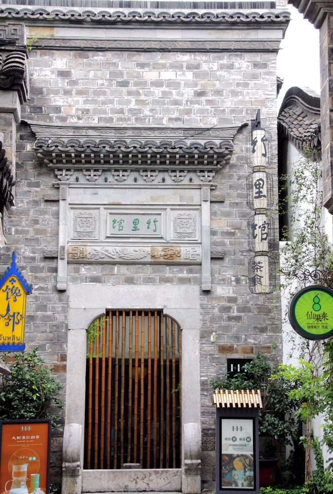

為了表示南京人多麼愛吃鴨子，南京人竟編造出「沒有一隻鴨子能活著離開南京」的神奇故事，講了很多年後，南京人自已信了，外地來南京的遊客也信了。

<!--more-->

自從朱元璋定都南京，他的一群洪澤湖邊長大的兄弟就把愛吃鴨的習俗帶到了南京，漸漸的鴨子又成了送人的禮物，在一些明清小說裡我們可以看到歷史上南京的四大土特產就是：板鴨、香腸、香肚和鹹鴨肫。

南京位於江南，水系四通八達相，當孵出來的小鴨能夠自行在水里覓食，遠在蘇北或是安徽的鴨農就劃一條帶著斗篷小木船，船上裝足了途中放鴨人吃的糧食和鴨子的飼料，一邊放鴨、一邊趕路。白天小鴨沿途在河裡吃著小魚小蝦和螺絲，必要時給鴨子加餵點飼料，到了晚上，鴨農用簡單的圍欄圍起鴨群，鴨農在自已的小船上休息，一般一條船養幾十隻鴨，經過幾個月的時間，鴨也趕到了南肥，而且個膘肥體壯，正好上市銷售。

從水上趕到南京的鴨，絕大部分從水西門外的秦淮河上岸，因此水西門外的秦淮河邊上許多收購、銷售和加工鴨子的作坊應運而生，因為這些鴨子在南京上岸的時間基本是八月桂花開的時節，一些好事的文人給這些鴨子起了個非常有文化的名字：“八月桂花鴨”，鴨還沒吃到嘴就引人們的浮想聯翩，南京的著名品牌“桂花鴨”和這個傳說究竟有多少牽連就不得而知。如你有興趣，可以在南京的大街小巷去數一數，至少有幾十家，甚至可能會達上百家的滷菜店，門頭高掛“水西門鴨子店”，店主就是想用店招告訴眾人，他們家開店年代很久，口味極佳，到現在也不敢改店名。

如果從明朝算起南京人愛吃鴨子，應該有好幾百年的歷史，但利用冷庫大量的保存鮮鴨只有幾十年的時間，成品鴨的上市一般集中在八月桂花開的時候，要想在一年的時間裡都能吃到鴨子，過去的人們想到了用鹽和密不外傳的香料對鴨子進行完善的醃製，再用竹枝撐平晾乾，經過多年的不斷改進，於是有了聞名的「南京板鴨」。

許多人會問，南京歷史上有名的是“板鴨”，為什麼我們現在在南京吃的是“鹽水鴨”，這兩個名稱是不是一個東西？或是兩者之間有什麼相互關係？

板鴨是鹹乾貨，烹調前需在清水中浸泡，使鴨肉鬆軟，並去除多餘的鹹味。而製作鹽水鴨的鴨坯是鮮貨，鴨肉鬆軟，只需在老鹵中浸泡一段時間，使鴨坯浸入鹹味和香料味，餘下板鴨和鹽水鴨的加工過程差不多一致，小火慢慢燜熟。

從某種意義上講，鹽水鴨是板鴨的簡化版，以前常年可以吃到板鴨，而鹽水鴨只能在有大量鮮鴨上市的時候才能吃到。板鴨在製作過程中經過鹽和香料長時間的醃漬，及在空氣中長期的風乾，留在鴨肉裡濃濃的臘香早已掩蓋了長期生長在水邊鴨子體內的那種腥味。而鹽水鴨製作時在老滷中浸泡的時間不長，且沒有風乾，鴨肉內的臘香相比與板鴨有所欠缺，稍不留神還會流露出鴨子體內的那一絲絲腥味。但板鴨畢竟是風乾的臘味製品，無論烹調的手法多高，鴨肉也無法做出以鮮鴨直接製成的鹽水鴨那麼鮮嫩。近年來，由於人們生活節奏的加快，冷藏保鮮技術的普及，鹽水鴨已成為南京人生活中最常見的一種食品，而板鴨，自上世紀八十年代末已鮮見於市，變成南京的一段歷史，南京人的一段回憶，南京老街區的一段故事。

但不管是南京的板鴨還是南京的鹽水鴨，要問“正宗不正宗”，那些生活在南京老街舊巷裡的資深傳人和食客，會異口同聲的告訴你七個字真言：“黃皮紅肉綠骨頭”。
城南的升州路上靠近評事街路口有家“章雲板鴨店”，幾十年來幾乎每天都有許多人排隊買鴨子。有顧客不理解問道夥計：“你家叫板鴨店，為什麼賣的是鹽水鴨？”夥計有點凡爾賽，操著一口城南腔答：“懂的都懂，我家店開的年代久鬧奧，鹽水鴨的前頭就是板鴨噯。”

現在南京的年青人喜歡在抖音上炫，在網紅店裡吃一碗老滷麵，還必須到隔壁的鴨子店斬四分之一的鴨子，說是標配。殊不知在六、七十年代，雖然日子已經過的比自然災害那幾年好了很多，但吃鴨子還是一件十分奢侈的事。別人看見你家斬了碗鴨子，必定要解釋一下，你家是來客人了還是辦什麼事？

巷口的二娘剛從街邊的鴨子店斬了碗鴨子往回走，沿途被鄰居們問了三四回，二娘也重複了回答了好幾遍。這兩天支邊的兒子小龍回家探親，進門就給了二娘十元錢，二娘心疼兒子多年在新疆受苦，堅決不肯收，兒子一定要媽收，二娘無奈收下小龍的錢，為了在明處表示沒有刮佔兒子的錢，二娘每天在鴨子店斬一塊錢鴨子，小龍一家在南京鴨子在南京那時一大家人在一起吃飯差不多也有十幾口，一碗鴨子一人也攤不到2、3塊，吃鴨子不僅僅嘴上快活，還是一種愛和幸福的表達，「天天吃鴨子」是那個年代多少人的夢想。

三舅批評他的孫子喜歡洋快餐不喜歡鹽水鴨，吃鹽水鴨是南京人的一種情懷，五十年前，能吃到鴨子就開心的不得了，鴨子上有除不盡的毛，爺爺那時吃鴨子是不吐毛的。講的小學六年級的孫子一頭霧水，於是三舅一邊喝著“夢之藍”，一邊給孫子講吃鴨子不吐毛的緣由。

八十年代以前，街上賣的鴨子基本上是“麻鴨”，那時沒有“規模化生產”的加工廠，而製作鹽水鴨的店家不會採用“松香”“柏油”等“不道德”的脫毛工藝，因此，鹽水鴨上帶毛是十分正常的現象，大家早已司空見慣。鴨腿和鴨脯處理的乾淨些，脊背和鴨頸的小黑毛基本上是肉眼可見，所以你撿到碗裡的那塊鴨子肯定有毛。吃之前你可以把帶毛的皮撕掉，只吃鴨肉，這樣大人會罵你造孽。如果你認真的將皮上的毛一根根拔除，那恐怕你只能吃到一塊鴨子。所以絕大部分人是連毛一起吃的，吃慣了也不會覺得有什麼不適。

但鄰居們議論的最多的還是梅師傅家，有人說應該，有人說不應該。梅師傅在國營大廠工作，拿七級工的工資，相當於普通人的兩倍工資，發工資這天，梅師母一定打了酒，斬碗鴨子，等梅師傅回家吃飯。吃飯時，七個小孩排好隊，梅師母依序每人撿一塊大小差不多的鴨子，然後讓小孩各自去旁邊吃飯，碗裡剩下的鴨子全留給梅師傅喝酒。鄰居說梅師傅霸道，梅師傅不以為然的搖搖手，我吃的都是些骨頭骨腦，只能砸砸味，沒有肉的。

還是那個年代，常常發生一個近乎腦筋急轉彎的事，鴨子店每天開門營業之前就有很多人排隊，手裡拿著大大小小各種不同的鍋，現在的年青人想破頭也不會猜出他們要幹什麼？他們在等著買鴨子店今天煮鹽水鴨的湯（備註一下，不是醃鴨子的老滷）。鴨子店開門第一件事就是賣鴨湯，大師傅手拿一把大勺，嘴裡喊著一分錢一勺，一桶鴨湯很快售罄，一般人買2、3分錢的湯，買到的人心滿意足，沒買到的人還會嘰咕幾句。鴨湯買回家可以煮青菜、也可以煮冬瓜，既能吃到鴨的香味，還有一點油水。經歷過那個年代的人，才真正體會能那句俗語：「老母豬放個屁，沾點蕎氣」。

記不清什麼時間在網上看的一個非常有趣的段子講，南京人（或許是指中國人）要想表示對另外一個人好，就一個勁的請他吃，而且就大部分是自已愛吃的東西。生活在南京的人們對鹽水鴨都有一份說不清的情感，每個人的記憶中都有一家特別好吃鴨子店，他們從不懷疑南京的鹽水鴨是一種風味獨特的美味，且有很深的文化底蘊以及許多耐人尋味的故事。外地到南京來的人，無論是明星還是普通的遊客，你問他到南京想吃什麼，他一定告訴你想吃鹽水鴨，吃過後一定會豎起大拇指說好吃。

當鹽水鴨被當作禮物送到外地，朋友嚐過後會委婉的告訴你，南京的鹽水鴨口感並不如傳說的那麼驚艷，仔細想想外地的朋友講的也確有其事。

中式烹調有一句深入人心的廣告：「現出鍋子的」。潛台詞，現出鍋的一定最好吃。

街邊的鴨子店賣的鴨子一定是當天製作剛出鍋的，確保鴨子香味正宗、鹹度適中，且鮮嫩Q彈是對要長期經營店家的基本要求。而商店裡賣的鹽水鴨，就算南京最大的品牌，真空包裝，外面印著開袋即食，一切嚴格按國家標準執行，但為了確保保質期的安全，鴨子肯定煮的十分熟，且十一分爛。因此，街邊的鴨子店當天製作的鴨子一定在口感上優於商店出售的真空包裝的鴨子。如果你準備好送給外地朋友的鴨子，只需兩到三天的保質期，你最好在離開南京的當天，在你自已心儀的鴨子店買好當天生產的鴨子，現在一般的鴨子店裡都有抽真空機，這樣除了包裝上有點粗糙，口感口感一定比商店裡買的真空包裝鴨要高幾十個百分點。

當然如遇到一些特殊的原因，只能送人真空包裝開袋即食的品牌鴨子，最好能友情提示一下，開袋即食之前增加一沖燙過程，其實也很簡單，開袋後將鴨子斬好擺盤，起鍋燒清水，水開後，將熱水淋入斬好鴨盤，在不影響造型的情況下撥動鴨子塊，盡好鴨盤，在不影響造型的情況下撥動鴨子可能使盤裡的鴨塊均勻受熱，約半分鐘後再將盤裡的水倒回鍋裡繼續加熱，水開後，繼續沖燙，反复兩到三次，一來給鴨塊溫和加熱，不會影響鴨肉的口感，二來沖燙可以將凝結在鴨肉表皮的油脂去除，而這些油脂就是使外地朋友感到油膩和鴨肉的負面油脂數。真空包裝的鹽水鴨，吃前經過沖燙，那麼至少有一半的人會改變以前對真空包裝鴨的看法，而欣然接受。

青花瓷的盤子裡裝著南京的鹽水鴨，樸實中透著娟秀，清雅裡蘊藏厚重，朋友，你愛吃南京鹽水鴨嗎？
