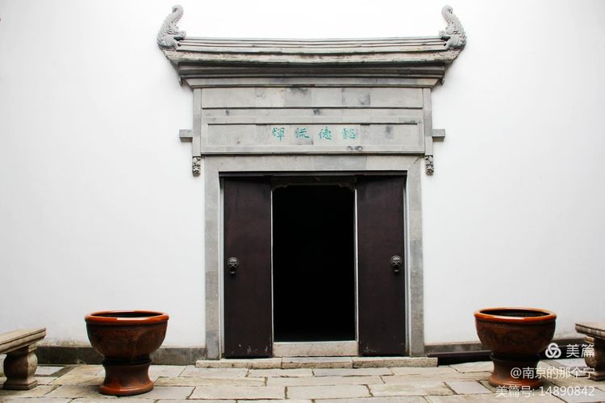
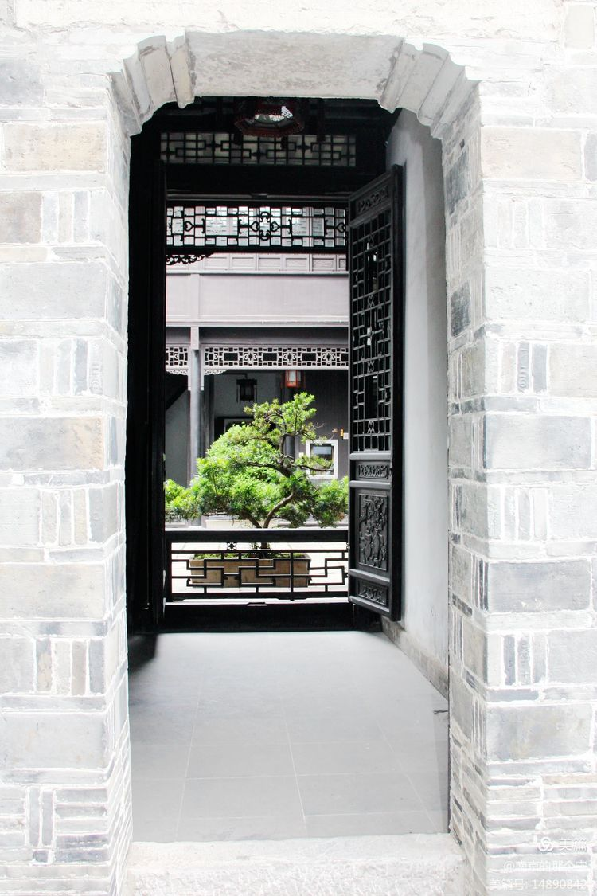
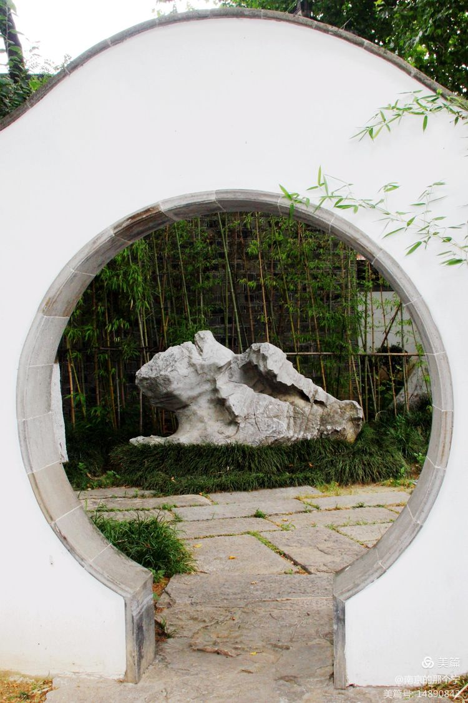
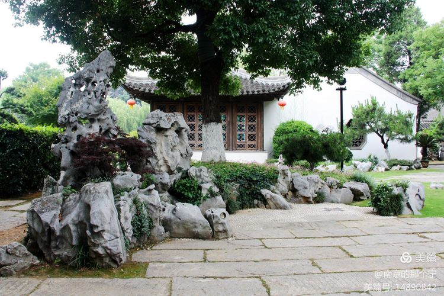
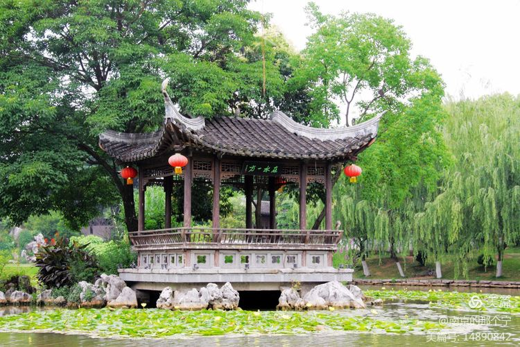
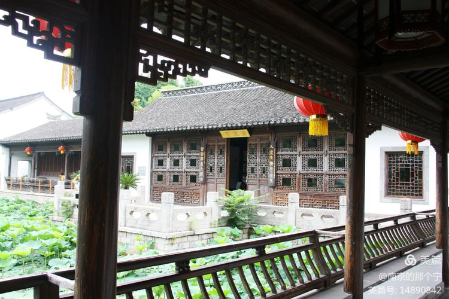
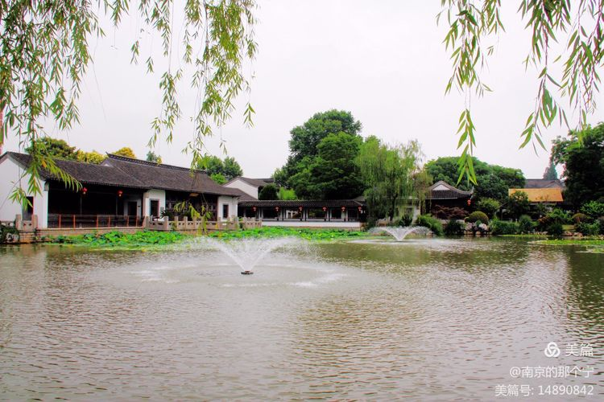

小籠包是著名的漢族傳統小吃，源自於北宋京城開封，清代道光年間出現了現代形式的小籠包，各地漸漸形成了自己的口味，但都具有皮薄鹵足、鮮香美味等共同特點。

<!--more-->

小吃源自市井平民，小吃的「小」相對與大館子的正餐菜餚，講白了就是小吃只需花「小」錢就能吃到的美味。小籠包應該算小吃的「天花板」了，且在每個地區都有很大的普及性和代表性，以至天南海北的人都會充滿自信的說：自已家鄉的小籠包是最好吃的。

小籠包的本身很簡單：包子餡、包子皮和包子滷。

小籠包的餡是純豬肉餡，大部分漢族人不會厭倦天天、甚至頓頓吃豬肉。現在城市裡已基本實現“豬肉自由”，一個三口之家一頓飯的豬肉消耗量，可能或超過計劃供應時期一家六口一個月的豬肉計劃供應量，有人兩三天吃不到豬肉就會抗議。因此，小籠包好吃不好吃的重要基礎一定是豬肉的量夠不夠足。

包子餡用肉一般選豬的腿肉，有的店家選前腿、有的店家選後腿、還有的店家認為前後腿皆可，只是處理肉時一定要將肉裡的碎骨和筋膜完全去除乾淨，否則會嚴重影響包子口感。肥瘦的比例一般為三七開，肥三瘦七，也有五五開，既肥瘦對半。在絞肉機沒有發明前，是手工斬肉，肉被切割成小塊後開始用刀斬，一邊斬一邊少量添水，在刀口長時間的切割和衝擊下，肉的顆粒逐漸變細，並逐漸變成膠粘狀，師傅判斷達到要求後，肉就斬成功了。

現在有了絞肉機，新的問題就出現了，第一肉不能絞的太細，肉太細的口感就沒有了。第二碎骨和筋膜如處理的不完全，就更加嚴重的暴露出來，因為絞肉機可以把肉絞碎，但絞不斷筋膜，而手工斬即使留存一部分筋膜也能在斬的過程中被再次斬成小段，影響沒有絞的肉明顯。第三，用絞肉機加工的肉糜比較鬆散，缺乏膠黏感，有的店家因此增加了加工環節，絞好的肉糜需再經過數十次的摔打，直至出現膠黏感後方可使用。

蒸熟的包子餡外表上有一層透明的膠狀物，包子餡軟嫩且緊實 Q 彈，用牙輕輕的一咬就迅速破裂，多次咀嚼後，仍能感到細細的肉餡顆粒保留著彈性，這樣的包子餡為廣大食客所推崇。

為了突顯小籠包皮薄餡多的特點，店家將小籠包的皮盡可能的趕得很薄，不過小籠包蒸熟以後，薄薄的包子皮必須能篼住肉餡和滿滿的滷汁，在把小籠包從蒸籠裡撿到小碟片的過程中，千萬百上，還沒來得及吃得令人汙染的包子就破滄。

南京小籠包的的包子皮不用髮面，用的是「死面」（不參酵母，直接用水和的面），為了提高包子皮的強度，有些店家還在包子皮里參入一定比列的「燙面」（用燙水和的面），這樣蒸出來的包子不易破損，還外表透亮。包好的小籠包收口朝上的擺入籠內，包子的收口處用手捏出二十多個褶，形成所謂的“魚嘴”，有的店家“魚嘴”封嚴口，有的店家“魚嘴”不完全封嚴，蒸熟後不完全封嚴的小籠包“魚嘴”處會積著一汪包子鹵，也很誘捕。因為是純手工製作，每隻小籠包的「魚嘴」或多或少都有點歪，有人戲稱是小籠包的「半推半就」的誘惑美，那種恰到好處的歪應該完全還在美學的可欣賞範疇之內。

由於注重外表漂亮捏出來的二十多個褶，造成「魚嘴」底部收口處的面可能分佈不均，必須控制厚厚的這團面在整個包子蒸製完成前熟透，不然也是個巴格。

剛包好的小籠包，包子皮裡只裝有滿滿的肉餡，而蒸熟的小籠包裡除了美味 Q 彈的肉餡，還多出一包滷汁，這是在蒸的過程從肉餡裡滲出的原汁原湯。

小籠包在中國經過幾百年的不斷改進，口感幾乎達到非常完美的程度，小籠包的肉餡除了控制肉的肥瘦比列，同時還需把握肉餡乾濕濃稠，現在去的薑蔥和增香各種香料都是粉碎後以混合的漿汁形式加入肉餡，為了使包子滷顯得更加厚重膠粘酒店比列肉餡，為了使包子滷顯得更加厚重膠粘店的肉餡。

南京是六朝古都，南北文化在此碰撞交融，飲食文化同樣相互融合發展，南方人在南京吃到了北方的寬厚和包容，北方人在南京吃到了南方精美和奇妙，南京的小籠包依然如此，既堅持了自己清而不淡的特色，鹹還兼顧了南北的甜口味。南京人特別愛吃小籠包，尤其是居住在城南舊城區的老南京，記得七八十年代，有些人在大年初一的早晨，會帶全家去劉長興吃小籠包，然後相互拜年的時候在親友面前炫耀。清明掃墓，供品中除了水果和魚肉，還偶見盒裝的小籠包。

三十多年前，我在三山街的劉長興吃小籠包，邂逅一“骨灰級的包粉”，兩人同桌等包子，於是就聊了起來，彼此濃濃的城南口音，公頃消除了戒心，談話十分輕鬆隨意。這位先生是附近一所中學的語文老師，今天買了二兩小籠包要去探望八十多歲的老母親。

閒聊間得知這位先生和他的母親一輩子就愛吃個小籠包，六七十年代先生的月工資也就三十多塊，每月發工資，他一定要帶老母親來這裡吃包子，一人一兩，那時的一兩小籠包需花兩角錢和一兩糧票。

先生比我年長十多歲，見我聽的十分誠懇，於是更加興致勃勃的給我講述他幾十年來吃小籠包子的經驗和體會。

包子端上桌，掀掉籠蓋讓包子自然冷卻，這時包子很燙，一來不能立即吃到嘴，二來皮很燙時包子的強度不好，撿時會破。我問，那冷到什麼時候可以吃？
先生答道，切記，吃第一隻小籠包，一定要冷到可以一口氣將包子內的滷汁全部吸入口腔的時候，此時不要用醋，咬開包子吸滷，讓口腔內充滿包子的滷汁，使舌頭和口腔內的每一部分都能充分感受包子滷豐盈的層次，記憶中熟悉而刺激的感覺就會突如其來的感覺

吃第二隻包子時，可以用小碟裝一點醋沾著吃。此時吃第一隻包子時那種神秘的衝擊力已經漸行漸遠，醋蘸能夠激發肉餡對人原始引誘力，最好用香醋，香醋不像陳醋那樣暴力，卻使你能感受到溫柔如水和意味深長，表面上醋會對你的味覺起一定的觸動，但真正有感覺的還是你自已。

此時此刻我才明白，江湖上流傳的吃小籠包的口訣「輕輕提、慢慢移、先開窗、再喝湯。」只講了過程，卻沒講出精髓。

在那個年代，請客吃小籠包是人們社交的一種方式，「搬家請同事」、「裝修房子請朋友」、「學徒轉正請師傅」、「年終先進請班組」等等老百姓之間的大大小小的事，最後要畫上一個圓滿的句號，就是請吃小籠包子。

91 年我拿到舊城改造的回遷房，因為是第一次住樓房，心裡特別高興，請了廠裡的兩個同事利用星期天來為我家裝燈排線，忙完後按照慣例，我請他們去三山街附近的劉長興麵館吃小籠包。

那時的劉長興一樓為大廳，二樓設有雅座，為了誠懇的表示一下謝意，我帶著一行人直接上了二樓。樓上有近十張方桌，收銀台也在二樓，服務員熱情的給我們介紹，雅座的小籠包是精品中的精品，開票後每人先泡上一杯茶，包子現包現蒸，上二樓的肉是優中選優，肉餡的肥瘦搭配和各種調味品的配製全由資控（雅技傳人：雖然深工傳承人）把萬藝師傅，但雖然深造藝術（雅技師傅雖然深造藝術（雅技座）還滿 40%。

坐定後每人一杯“明前雨花”，邊聊邊等。從環境聊到對今天雅座精品小籠包的期望，劉長興可是南京有據可查的幾家「百年老店」之一，民國時期就是南京最大的麵館，小籠包早已名揚天下。此時改革開放已經多年，豬肉也已放開計劃供應，人民生活得到極大的豐富，同時社會尊重技術和手藝，掌握技術的人通常也願意露一手，以贏得周圍人的尊敬。而當時的劉長興還是國營老字號，包子價格高，品質肯定是提高了一個檔次，何況就在一座樓裡賣不同的價格，樓上樓下的包子要是吃不出差別來，說不過去的。

店裡泡的「明前雨花」卻也貨真價實，幾口下肚，頓覺神清氣爽。一旁的服務生介紹到，先飲茶，再吃包子，是近百年來的傳統吃法，喝茶能清肺腑，老南京話叫“通通心兒”，接下來才能吃出包子的真味。

包子端上桌後，我一本正經的向兩位同事復述當年先生教我吃小籠包的秘笈，兩位同事先是將信將疑的笑笑，聽著聽著，有那麼一點信了，於是我們幾人忽然作聲，靜下來，認真真的按照秘笈去體會吃一個小籠包中的每一個小籠。旁邊的服務生看的一臉蒙蔽，於是熱情的走過來提醒，醋在桌上，是原廠瓶裝的鎮江香醋，絕對好。服務生一定不知道，會吃包子的，吃第二隻才沾醋，見眾人哈哈大笑，服務生更蒙了。

雅座裡我們那桌吃的最文雅，幾人慢條斯理的吃完包子，老王砸了砸嘴，又抿了一口茶，若有所思的說，今天的包子味厚料足，嘴唇都粘在一起了。老趙嘆了口氣接著說，我一直以為小籠包最好吃的是包子餡、其次是包子皮、最差的是包子鹵，不信你去大廳看看，顧客吃完走了，桌上剩下最多是半碟子包子鹵，偶爾能見半個包子皮，幾乎沒見過包子餡的。你說包子鹵最好吃，為什麼剩下還是包子鹵？

幾人面面相覷，好一會才回過神來，終於恍然大悟：“這就是現實社會。”
