南京中山植物園位於南京市玄武區鍾山風景名勝區內，又稱江蘇省中國科學院植物研究所，隸屬中國科學院，始建於1929年（民國十八年），原名為總理陵園紀念植物園，是中國第一座國立植物園，中國四大植物園之一。

<!--more-->

其中的紅楓崗景區佔地面積近30000平方米，遍植了20多種槭樹科的紅葉樹如雞爪槭、三角楓、建始槭、天目槭、羽毛楓，以及楓香、烏桕、鹽膚木、黃連木、杜英、紫薇、榆樹、櫸樹、山胡椒等各類色葉樹。

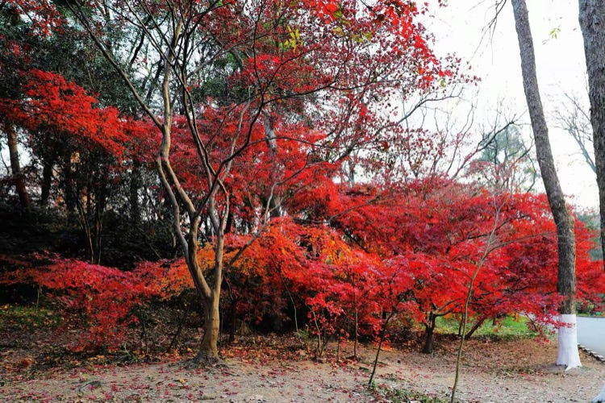

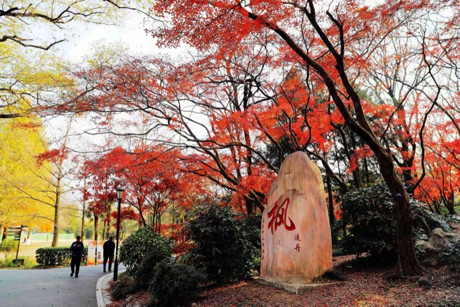

景區內小橋流水，亭台樓閣，紅葉緩坡，曲徑石凳。朱顏煥發，煙霞深鎖，不愧為頂尖高手的精妙佈局，從植物篩選到園林搭配，美得恰到好處，卻又自然隨意。

崗前的靈璧石上鐫刻著巨大的「楓」字，可能是作者意猶未盡，一旁還加註「流丹」兩字。流丹指流動的火，這種意境才是人們喜愛楓葉的正真原因。

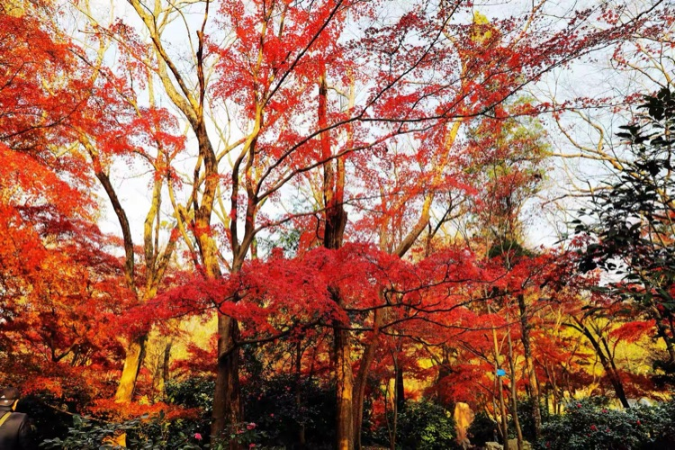

火紅色的楓葉，象徵著熱情，奔放。楓葉的形狀不同於其他植物的葉子，很獨特，儘管楓葉的觀賞性很強，然成片的紅，漫山遍野的紅那種對視覺的衝擊才是令人震撼的。這種感覺只能出現在毛主席的詩詞裡：「看萬山紅遍、層林盡染」，或再現於錢松癌、李可染等大師的水墨朱丹裡。

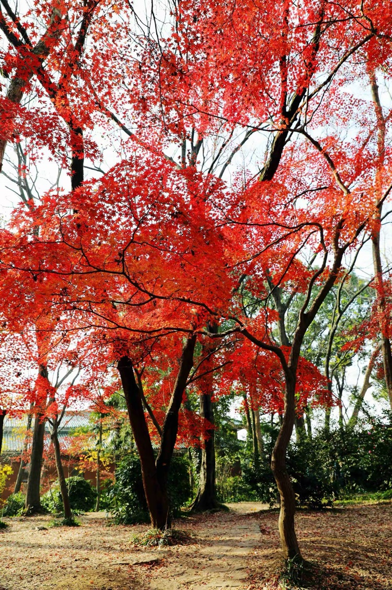

人們喜愛楓葉的剛毅堅韌，因為進入了秋末初冬季節，其他植物都逐漸開始休眠、凋零，但楓葉可以忍受秋冬的寒冷，依舊葉紅似火，讓人們在秋冬的寒冷中感到熊熊燃燒的希望。

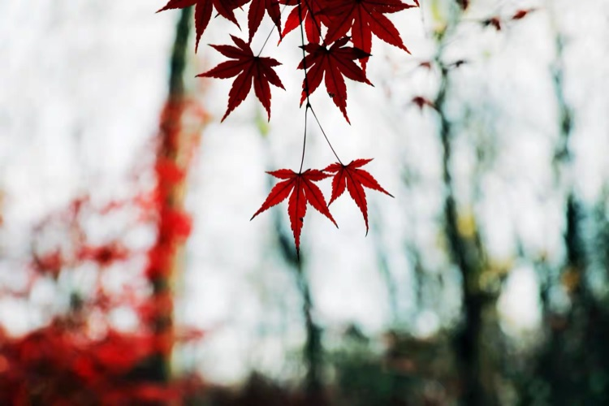

楓葉從春天開始生長，到秋末初冬季節才逐漸凋落，畢竟紅色的落葉不像枯黃的落葉那樣淒涼，那樣令人傷感，多多少少還有一點點溫暖。因此，看到掉落一地的楓葉，人們不禁會回憶曾經經歷過的往事，以及重溫對那些美好往事的依戀。

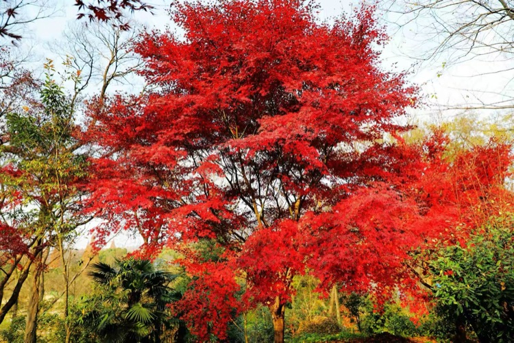

楓葉在秋末初冬季節會特別紅，古人就有「霜葉紅於二月花」的描寫，中國人喜歡鮮豔的紅色，又喜慶又能代表著鴻運，喜歡日子過的紅紅火火。

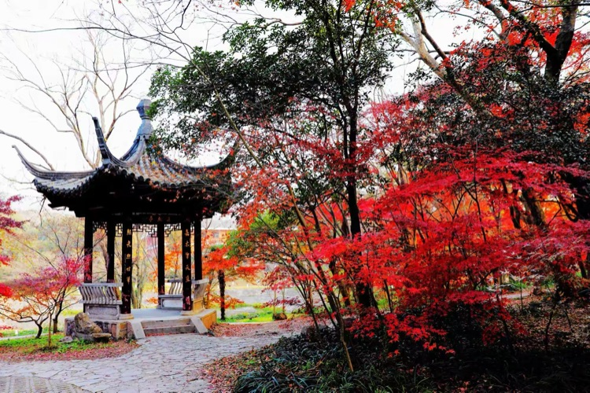

宋代詩人楊萬里在《紅葉》詩中寫道：「小楓一夜偷天酒，卻情孤松掩醉客。」在楊萬里的眼裡，楓葉竟是偷喝了「天酒」而被染紅的！想像力真的太美太豐富。於是，眼前入畫的這亭這楓不也是：「亭空佳釀盡，楓枝醉斜坡。」

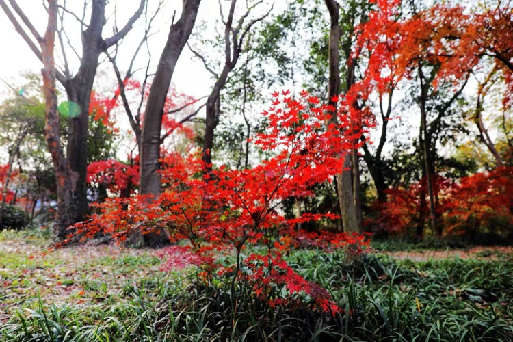

《山海經》上記載：「黃帝殺蚩尤於黎山，棄其械，化為楓樹。」意思是黃帝殺了蚩尤後，丟棄的兵器變成了楓樹，因兵器染了蚩尤的血，所以楓葉是紅色的。

站在楓樹的前面，忽想起石頭上的 「流丹」二字。楓葉如流動的火焰，初看有點亂，不知不覺，在風的鼓動下，火真的飄動起來。前後互動，上下呼應，穿透性極強的紅色不停的放大人們的想像力。

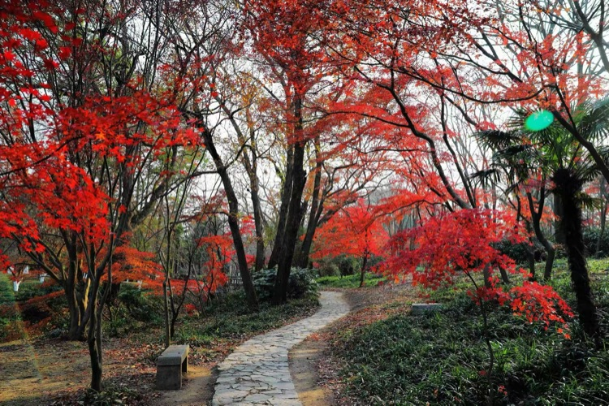

鳥鳴聲聲楓林早，曲徑石凳等人來

趕早去紅楓崗賞楓葉的人，不光是為了聽林中的鳥鳴，而是想看看早晨的陽光透過楓葉那一抹鮮紅。石凳彷彿對人說，停下來，靜一靜，好好發一會呆，品味一下週圍的美景，讓思緒充滿浪漫溫馨。曲徑也彷彿對人說，走吧，前面的風景更美，相信未來更加美好。

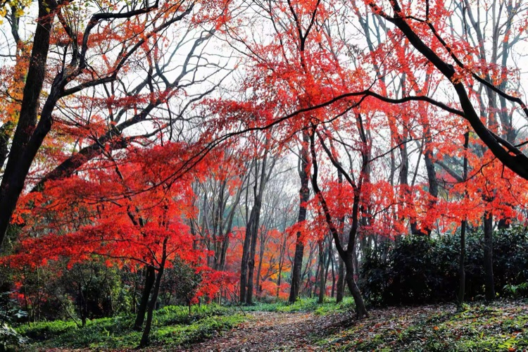

在樹木交織的楓樹林裡，儘管前程似錦，有些路看起來很近，可是走下去卻很遠的，缺少耐心的人永遠走不到頭。人生，一半是現實，一半是夢想。

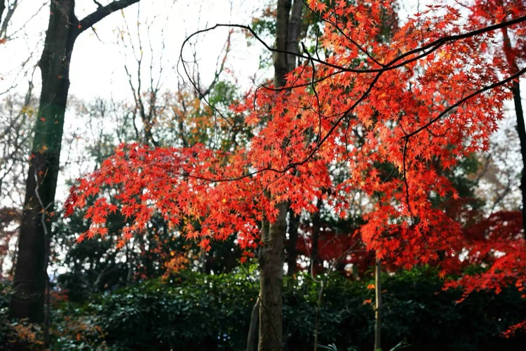

有的楓葉並不那麼鮮紅，卻更顯青春活力，自由自在，任性的向四周空間發展，過不多久，或許也會變的鮮紅，或許還是那樣，「我就是我」。

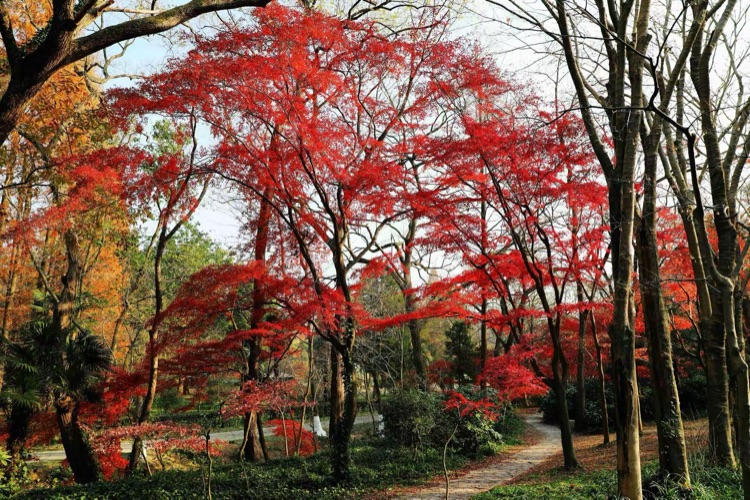

有的楓葉不僅鮮紅，長的高大、舒展，隨風擺動的身姿那麼清雅，與身俱來就是女神的氣質。有修養、有層次，看著養眼，呆在近處讓人覺得輕鬆愉快。弱弱的問一聲造物的主，連一棵樹都能造的這麼「完美」嗎？

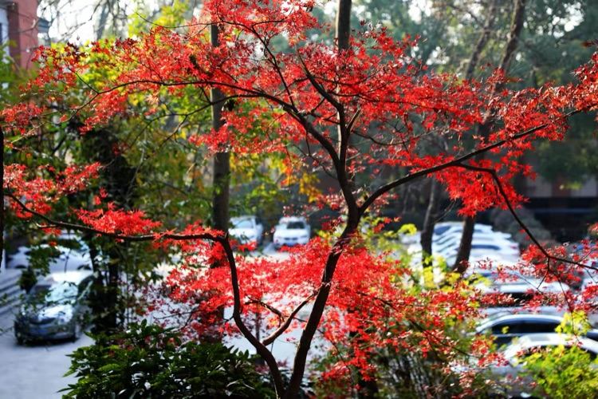

「停車坐愛楓林晚」這句古詩幾乎膾炙人口，車停了，楓紅了。

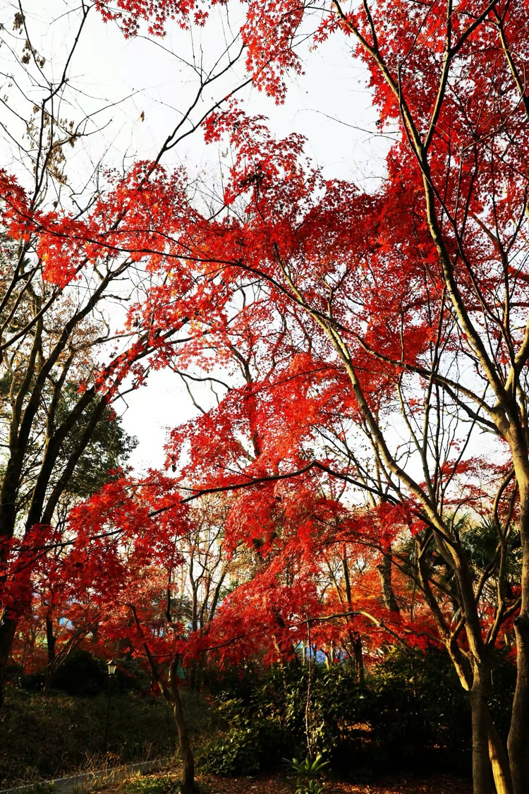

在楓林中行走，不經意間就能入畫，猜了一會也想不透眼前的楓樹是什麼漢字，又好像是一自我陶醉的舞者，「誰持彩練當空舞？」那聲音來自天空，卻更加陶醉了路人，醉了，一步一景，目不暇接。

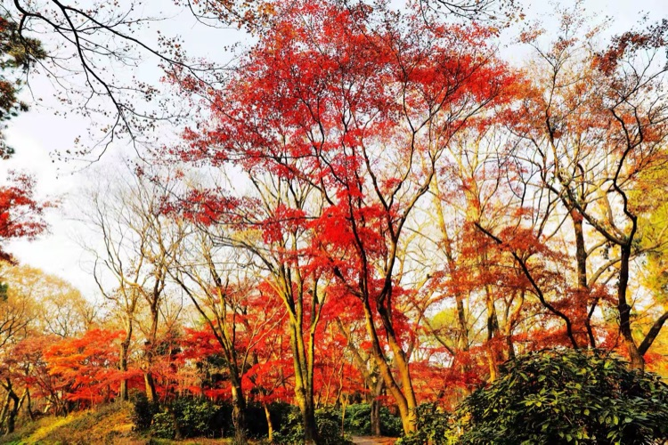

只因在朝陽下多看了你一眼，畫面有點虛幻，卻更趨神秘，更趨想像，雖然是「曝光有點過度」，但效果很好。

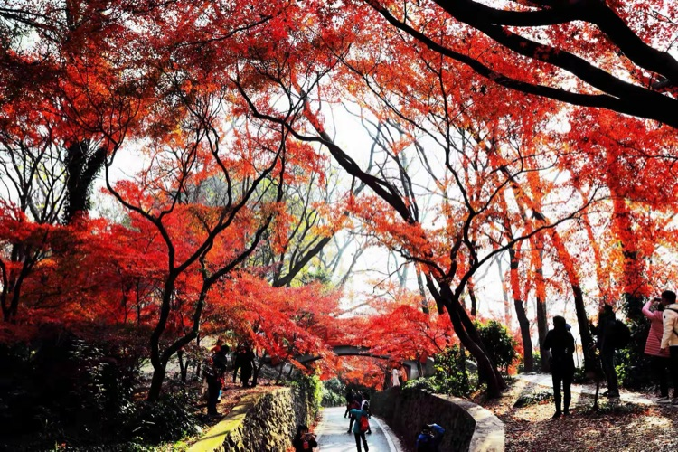

沒有陽光

楓葉不會如此豔麗

莫非楓的前世是女人

不管清晰還是模糊

只要那團火紅

就能沸騰漢子的熱血

彎曲黝黑的枝條

宛若經絡

流動著男人的堅強和忍耐

美，就是一種對溫度的感覺

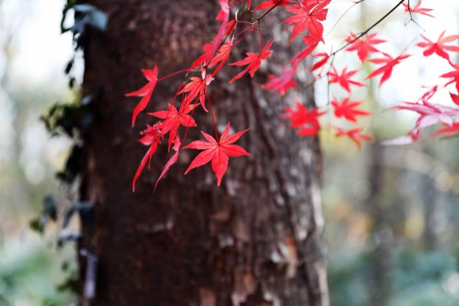

追看紅葉飄舞，卻見樹幹悠然。「看」是有心的，「見」是無心的；見就見了，見與不見，樹幹還在那裡；有心之看，是因為想看，一看之下，看到楓葉的華麗，也見到樹幹的淡泊，但在樹幹的襯映下，楓葉的紅更加質樸自然。

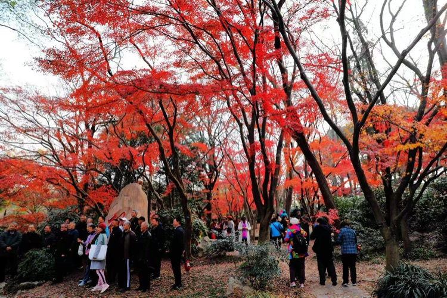

快要離開紅楓崗之前，看見一群老人，胸前佩戴著統一的徽章，好像是參加組織活動，一個個笑容滿面，洋溢著歡樂祥和的氣氛，周圍的人也被感染，都以羨慕的眼光看著他們，從畫面中你是否也被感染了，你羨慕嗎？如果是，請準備好，聽攝影師的口令，一起喊：「茄子。」
