好多年前，午朝門公園突然成了網紅的打卡聖地，不是因為明朝遺留的午門，而是公園內盛開的繡球花。早就想去看，每次快要去時又因為其他的事而耽擱。

<!--more-->

工作單位有一片宿舍區就建在午朝門公園的附近，多少年來，經常會聽到周圍的同事談論公園的事。

八十年代以前，午朝門公園沒有圍牆，公園裡矗立著六百年前遺留的城門，散落著許多從前支撐宮殿的石基。

傳說城門洞裡竄風，在南京悶熱的夏天裡，午朝門公園是納涼的好去處，暑假裡隨處可見家長們帶著孩子在公園裡玩耍，歇息、甚至還有寫作業的。

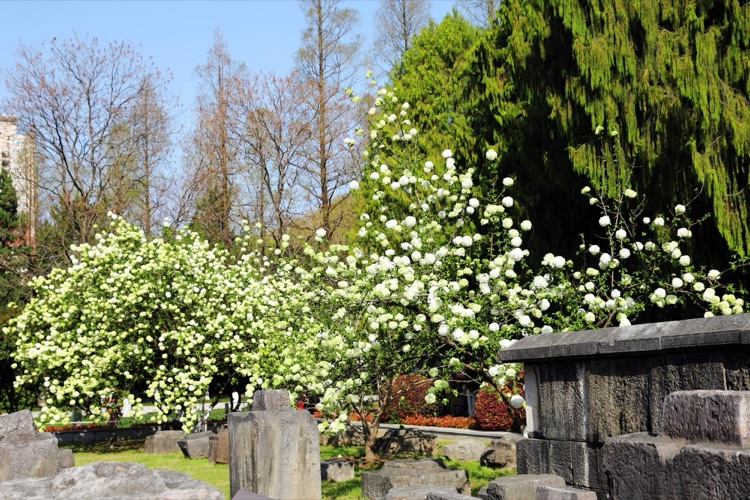

午朝門公園的繡球花是在規模上引人感嘆，還是在造型上獨樹一格？真的很想在她開花的時候去親眼看一看。雖然平時也有在公園的周圍路過，但錯過開花的季節，外面隨意看去，也看不出個所以然來。

此次，老同事聚會，定在午朝門公園集合，於是提前一小時趕了去，先睹為快。

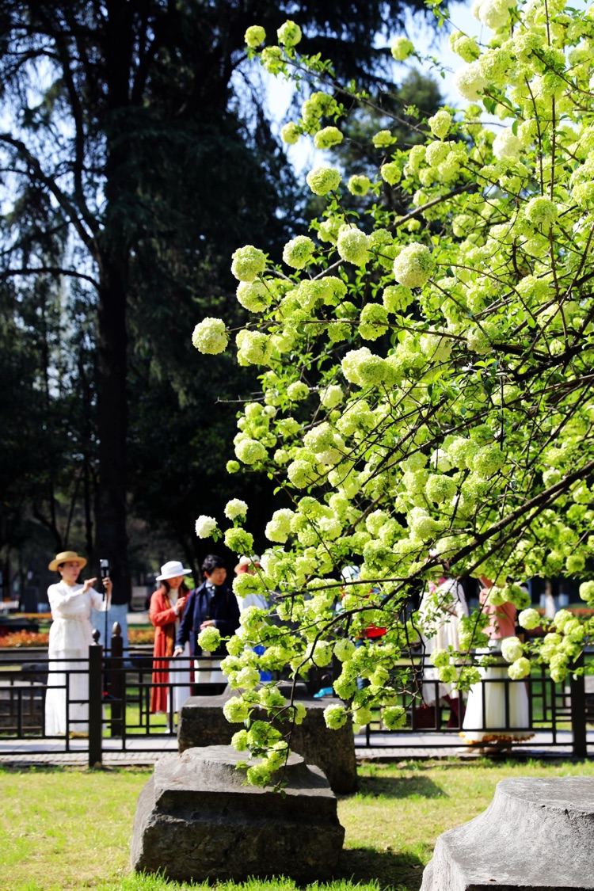

前來打卡的美女，服飾不是鮮紅就是雪白，與繡球花十分的搭配，人群中多了這些紅色和白色，彷佛熱鬧起來，花也不再單調，所謂「人氣」興旺。

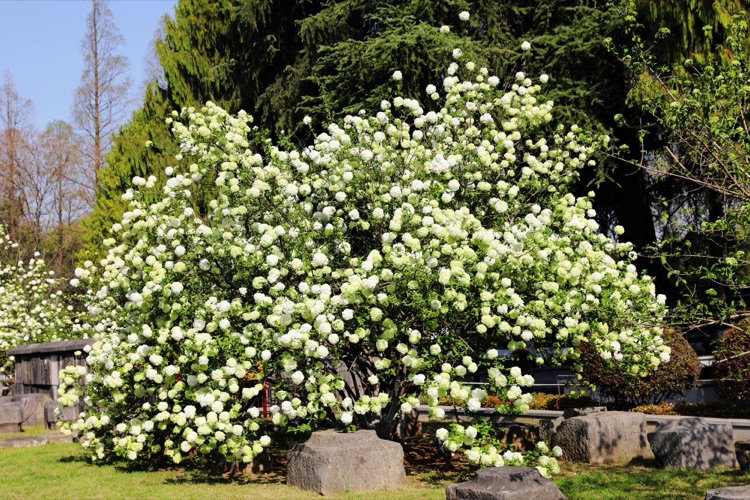

在早晨的陽光下，繡球樹亮處的發白、暗處的發綠，立體生動，一派生機勃勃。

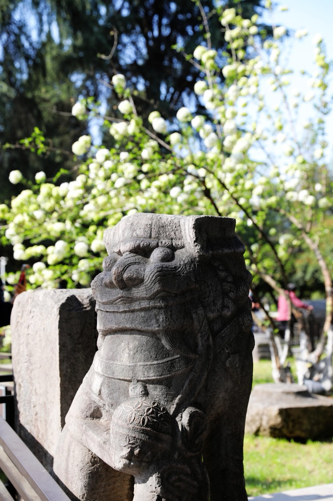

門口的石獸，五官清晰，隱約背後的繡球花朦朦朧朧。

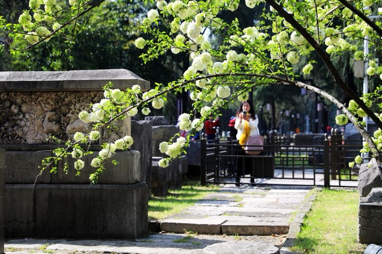

開滿繡球的枝條，彎搭在鏤空精美的石壁前，讓古老的主題融入新的生機。

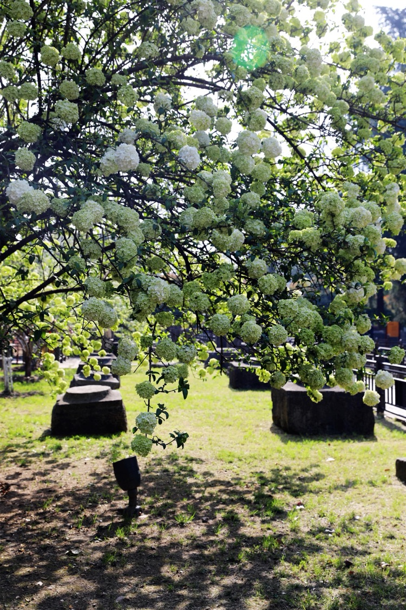

也說不清繡球花是青（綠）中泛白，還是白中顯青（綠），合著那句成語：「一清二白」。看著就讓人心裡踏實，特別舒暢。

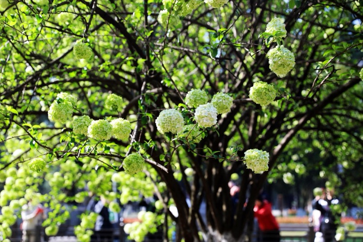

午朝門公園繡球花樹真的巨大，且由上至下，繡球花開的滿滿當當，從花的間隙看過去，裡面竟然還是繡球花。不注意去看，很難發現樹上的綠葉。

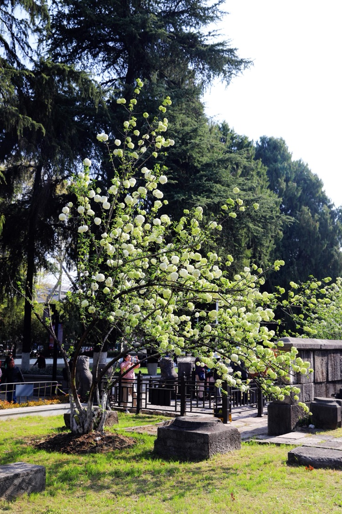

網紅的繡球花是一排繡球樹，從中山東路進公園南園，沿那塊刻著奇花異獸的石壁兩邊展開，巨大的樹冠滿樹開滿繡球花，精美的石壁和古老的石基，讓花開更深沉、更安寧、更有底蘊、更具歷史感。

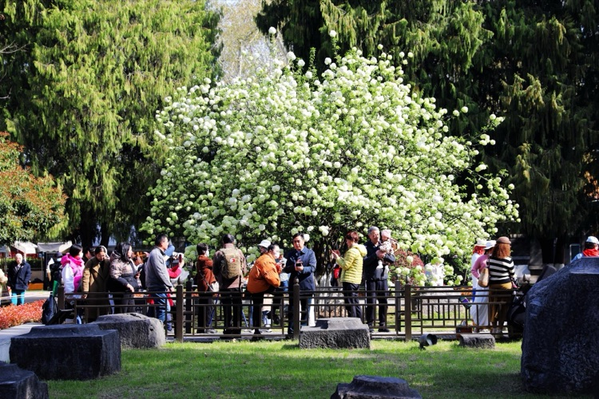

乾隆皇帝在《魯治百花捲即用卷中題句韻·繡花球》詩中專門讚美繡球花：「幾度江南見花朵，只疑枝上雪攢球。玲瓏簇就煙霞體，點綴真宜山水州。」

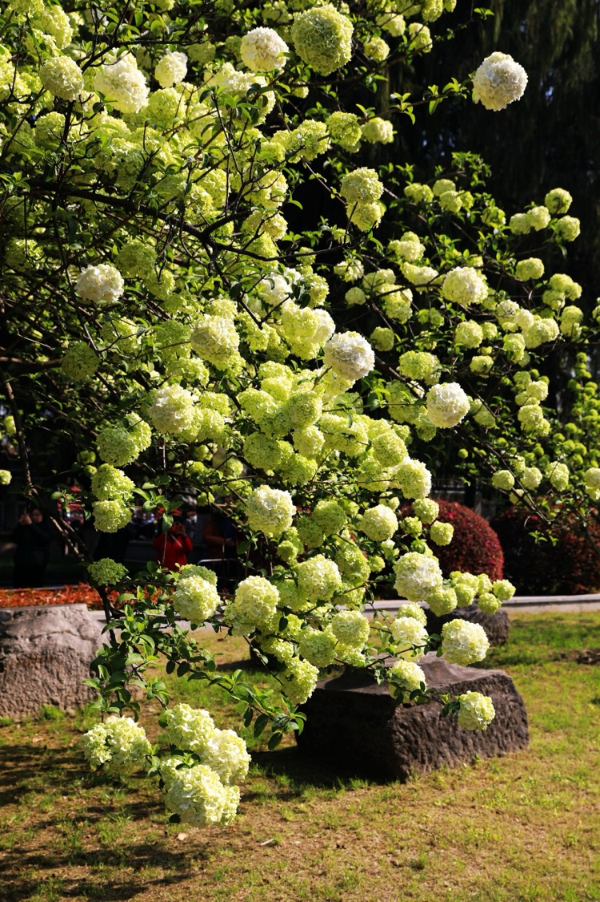

木本繡球，是忍冬科莢蒾屬植物，為落葉或半常綠灌木。木本繡球原產於中國長江流域、華北南部等地，木本繡球的樹姿舒展，開花時白花滿樹，猶如積雪壓枝，十分美觀。

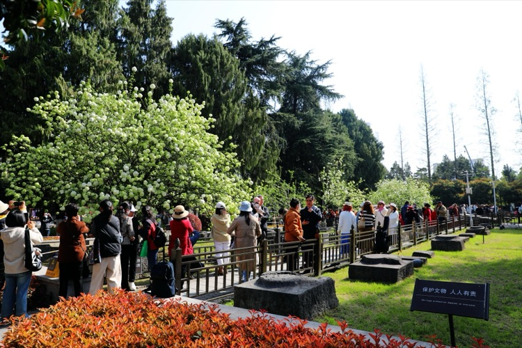

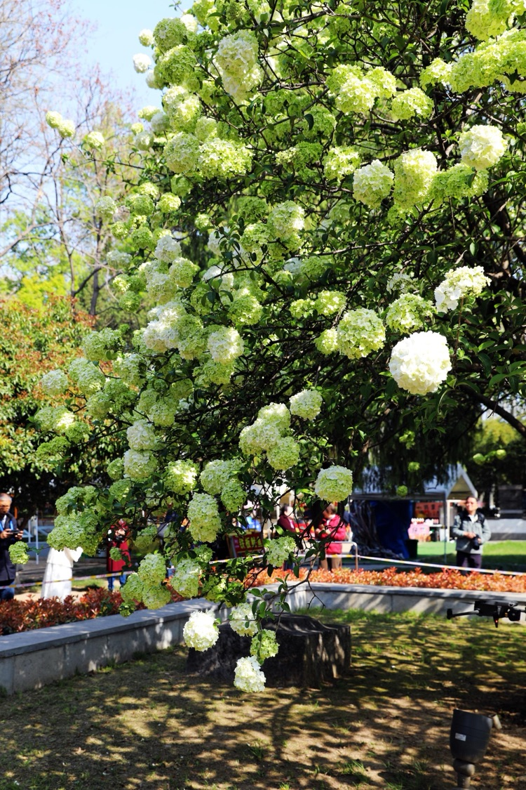

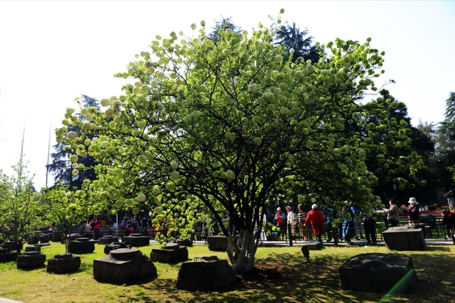

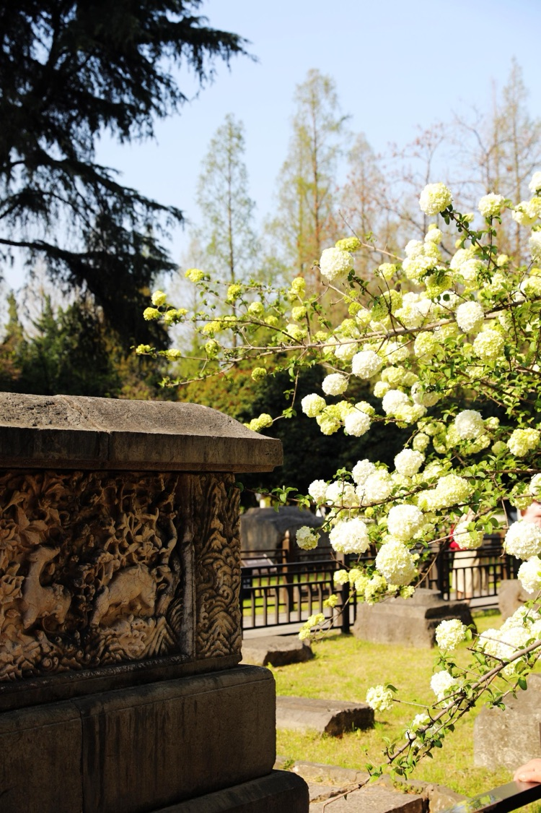

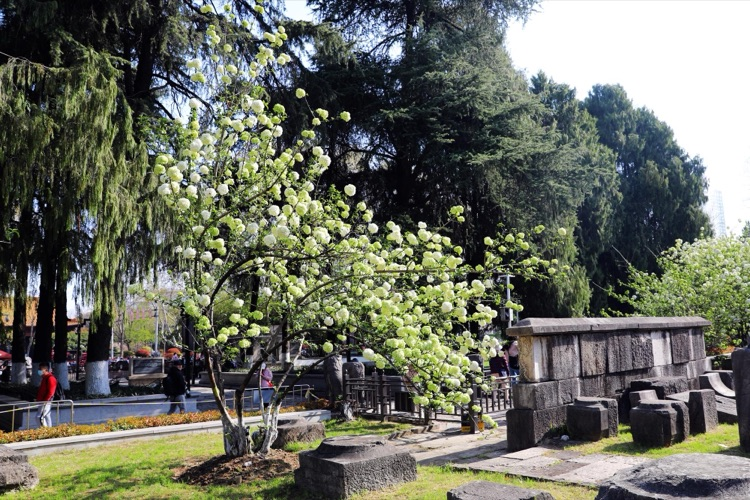

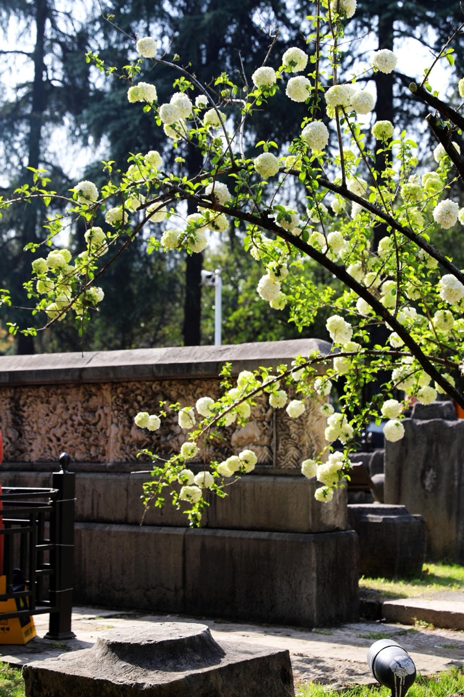

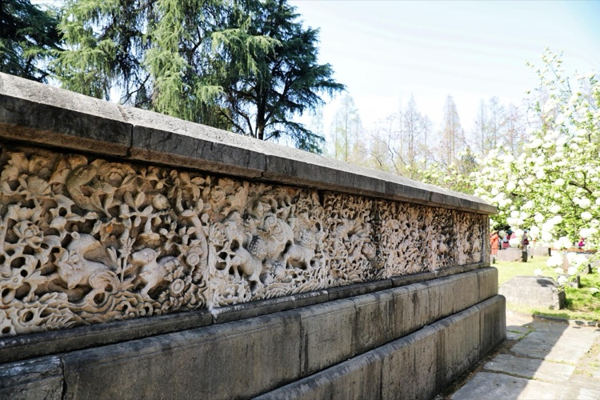

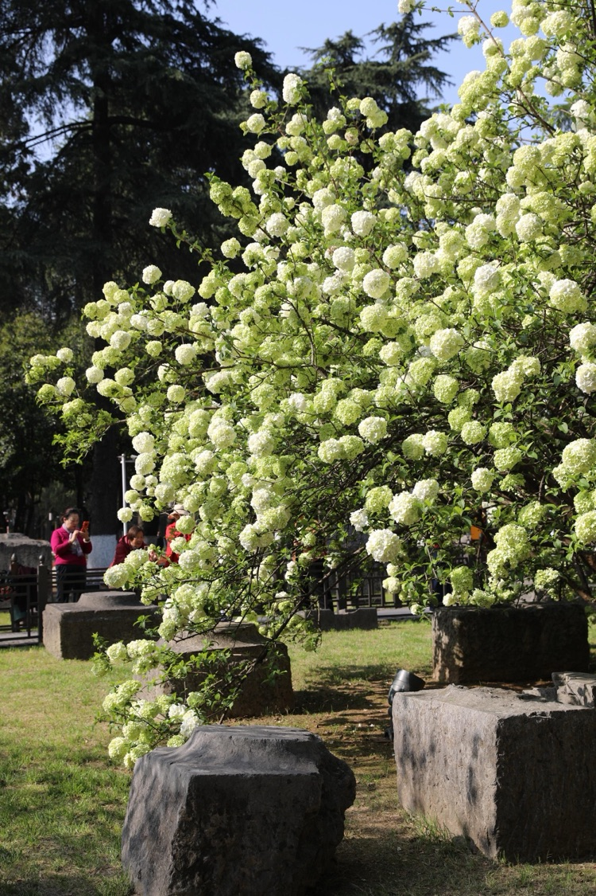

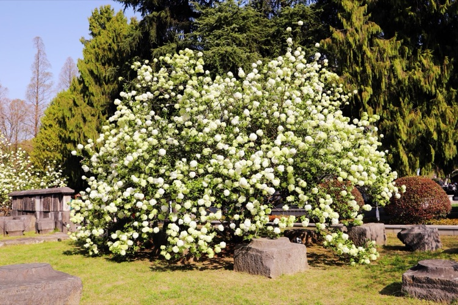
