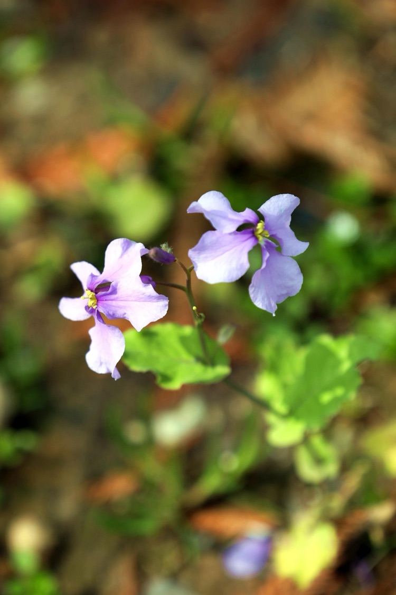
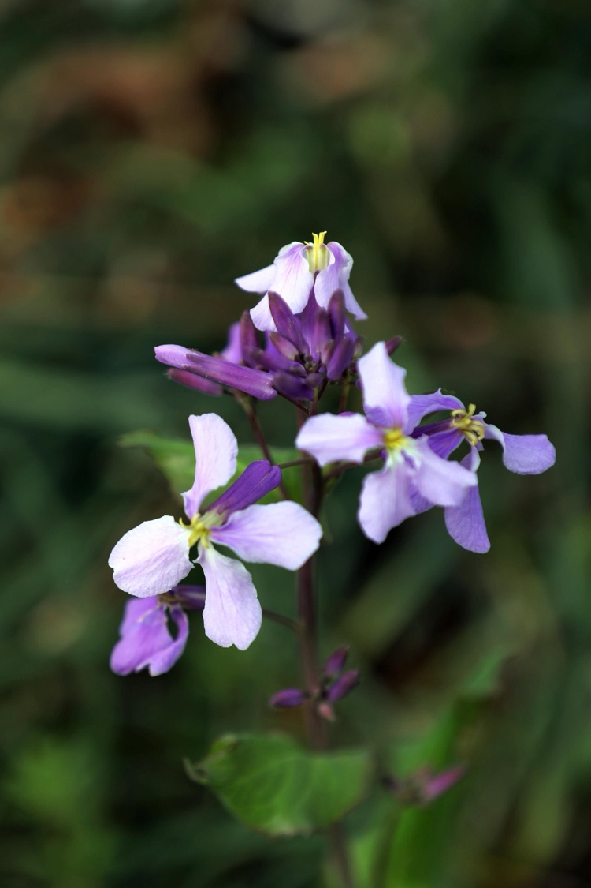
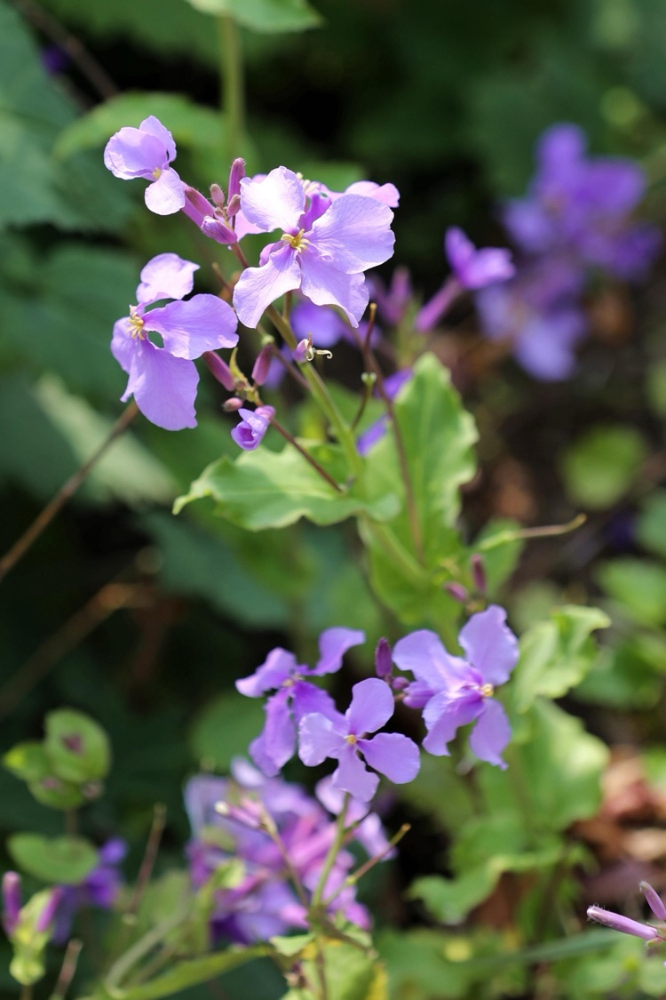
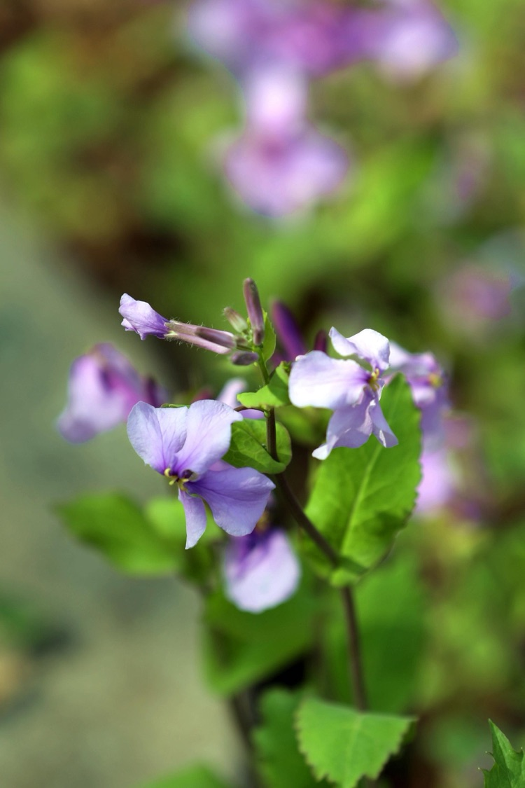

此花學名諸葛菜，一到二年生草本花卉，農曆二月前後開花，故稱二月蘭。

<!--more-->

據傳當年諸葛亮糧食不足，命眾將士去挖野菜，挖的較多的就是這種蔓菁，因此後世把當年諸葛亮發現和推廣的這種蔓菁，取名為「諸葛菜」。

國學大師季羨林1993年在一篇散文中寫到 :

二月蘭是一種常見的野花。

如果只有一兩顆，在百花叢中，決不會引起任何人的注意。

但是一轉眼。在一夜之間，就能變成百朵、幹朵、萬朵。大有凌駕百花之上的勢頭。

花們好像沒有什麼悲歡離合。應該開時，它們就開。該消失時，它們就消失。

……

二月蘭對土壤和陽光的要求不高，耐寒耐旱，生命力極強。草根血統，十足接地氣。哪份淡雅自若絕非是用金錢裝飾起來的外表，花開時樸實大方，由內到外散發的不卑不亢，又似乎你我身上本來就有，這就是大都數人喜愛二月蘭的原因。

年復一年，二月蘭任性的開、盡情的開，沒有言語，卻總是及時喚醒人們，季節又到了二月蘭開花的日子，撩撥出人們埋藏心底卻又想立馬跑去看花的衝動。

曾幾何時，由於網上的傳說，二月蘭成了南理工的一張名片，每年前去觀花的人絡繹不絕，疫情以後學校禁止外人入內，二月蘭終於正真成了南理工的傳說。

傳說裡有一片不大的林子，疏密有制長著入雲的水杉。人們在水杉林裡尋到二月蘭美妙的身姿，或白、或粉、或紫、或藍，遍地斑斕，氛圍如此浪漫迷人。在林間、在彎彎曲曲的小路上，有多少同學還在回味那刻骨銘心的戀情，和來不及問明白就錯過的偶遇。花開若蝶，空中隱約飄來《梁祝》的旋律，那種忽有忽無的幻覺。

好在善良的南京人總在默默的為你做成你心中想要的那件事，現在大規模種植二月蘭的公園有很多，中山植物園、莫愁湖公園都能找到大片的二月蘭，其實那裡原先就種有杉樹或是海棠樹，只是在原先種草的地上種了些二月蘭。

身臨其境才能感受到二月蘭幹朵萬朵同時怒放的壯觀，白的純、粉的羞、紫的妖、藍的濃，隨風、隨意、隨心情，好一幅自然界的大寫意。

本美篇中的二月蘭均拍攝於昨天的莫愁湖公園。
