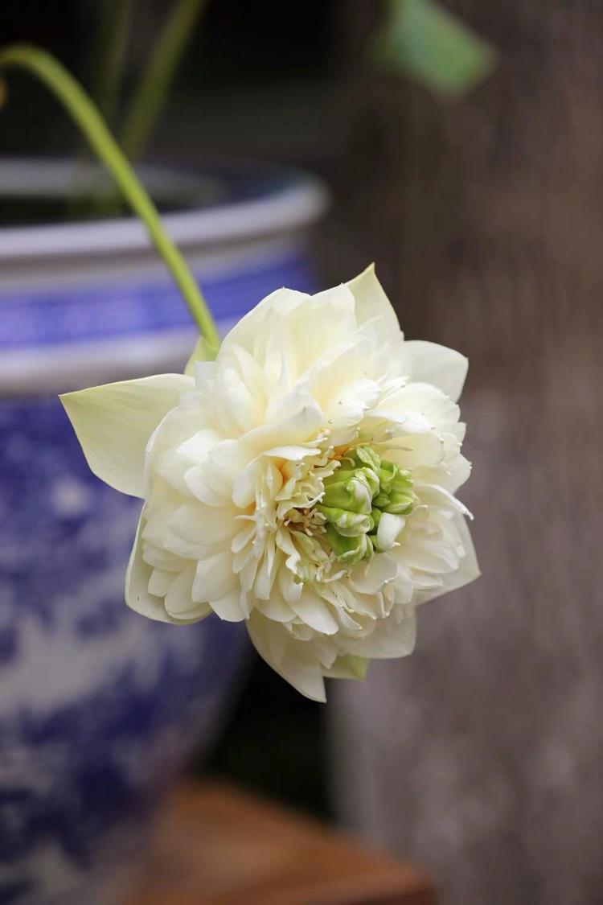
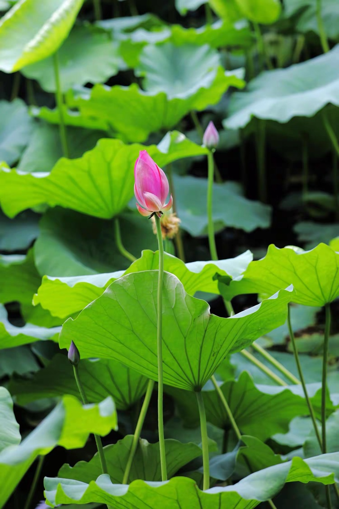

南京地區這兩天就快進入梅雨季節了，俗稱「入梅」。早晨起來發現天有點陰，不那麼曬，於是乘公交前往莫愁湖，公園裡臨水的地方會不時的有陣陣清風襲來，一邊欣賞荷花，一邊納涼聽戲。

<!--more-->

進了公園的大門沿路就擺放著多盆「旱荷」，種在花盆裡的荷花，比較種在水裡的荷花更為精緻，花和葉一摸一樣，只是種在盆裡的要小許多，但觀賞性卻好更多。

在我們讀的古詩詞裡，以前人們賞荷，或乘小船，遊蕩於田田荷葉之間，近距離的感受「接天蓮葉無窮碧，映日荷花別樣紅。」而今，人們手拿相機或手機，拍著荷花荷葉的各種造型，紅綠色彩的隨意搭配。再不，遊人自已擺一個泡士，感受被荷花荷葉簇擁的那種唯我獨尊。公園的管理者不斷引進又大又美的荷花新品種，要不在花枝招展的遊客中，在各色漢服旗袍的掩映下荷花荷葉就顯得陳舊遜色了。

荷花在人們的記憶中，儘管花瓣不像多肉植物那麼厚潤，但開放的過程中一定先是極大的豐滿，然後再進一步綻開，花瓣的底色一定是潔淨的乳白，上面均勻的分佈著宛若少女含羞的絲絲紅暈，最終濃濃的收斂於花瓣的尖尖，那種溫潤的紅、那種精巧的尖，使人即刻陷入那難以自持的沉湎之中。

多少年前的傍晚，大人收工回家，順手在水邊摘了幾個蓮蓬，家裡的孩童接到後就靜靜的坐在小凳上，認真的剝著吃。孩童撕開蓮蓬，小心翼翼的取出蓮子，再一點一點的用指甲扣除表面的那層青皮，露出裡面青白的肉，滿意的放入口中。蓮子口感清脆，但不甜，如果連著蓮心一起吃下，味道還有一點苦。一般情況下，等的及，就慢慢的取出蓮心後吃，等不及的，就連著蓮心一塊吃，好歹蓮子是一種食物。多少年後我才明白，蓮心是去內火的，可以晾乾用來泡茶喝。

幾十年前，熟食店的包裝不用塑料袋，夏天用的是一張新摘的荷葉。孩子們看見父母回家時，拿出的是透著香氣的荷葉包，口水就會流出來，今天有好吃的了，不知是豬頭肉還是蘭花幹？那種對美食的渴望和好感，至今難忘。早兩天，家裡買了荷葉蒸雞，又開了瓶洋河，滿屋飄香，我一下又穿越到幾十年以前，那麼熟悉的味道，只不過那時覺得酒是辣的，小孩不能喝。但後來有點微醺了，我忽然明白了，喝酒是為了體會酒後的那種意境，而不是酒本身的味道，荷葉的清香才是應該保留的記憶。

好像有位老師對我說過：「回味來源於生活，又高於生活，而我們還要不間斷的生活。」

