白鷺洲公園位於南京城區東南隅，南臨長樂路，北接小石壩街與東花園街，東靠明城牆，西止西石壩街，總面積15.2公頃，其中水面3.8公頃，綠地率71.5%。

<!--more-->

白鷺洲公園原是明中山王徐達的東花園，園中景物毀於太平天國時期。民國13年(1924)有金巴父子在東園故址設立義興善堂，當地士紳又集資開設了一個茶社，因此時東園故址湖中有洲，洲邊也多植蘆葦，秋日時白鷺翔集，景觀與長江邊的白鷺洲極為相似。取李白《登金陵鳳凰台》中「三山半落青天外，二水中分白鷺洲」之意境，茶社名為「白鷺洲」。當年在藕香居中有一副對聯，上聯是「此地為東園故址」，下聯為「其名出太白遺詩」。1929年，整修後的東園故址取名「白鷺洲公園」。其後，在東園故址上又進行了拓建，構築有煙雨軒、藕香居、沽酒軒、話雨亭、綠雲齋、吟風閣等，形成了初具規模的小型園林。

水面約佔全園總面積四分之一，水面亦聚亦分，迂迴曲折，形成外圍陸地四面含水，水中各洲又四面臨水，外圍陸地與洲之間、洲與洲之間由橋相連，共建橋13座。

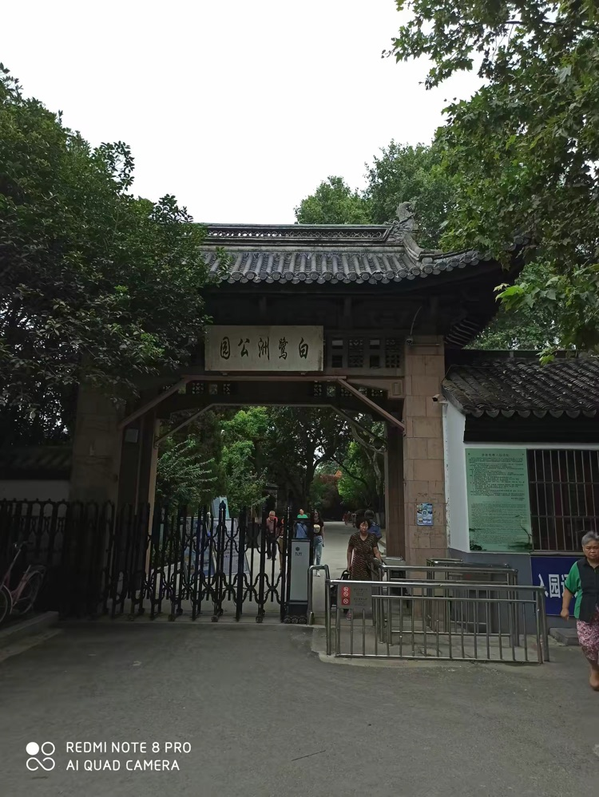

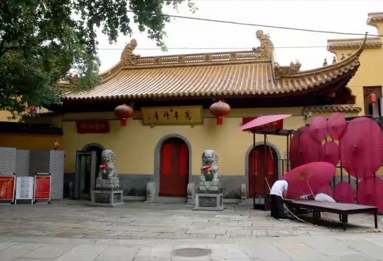

明天順年間(1457~1464)宦官進保(又名祖定)擇其地創建寺廟，英宗朱祁鎮書賜其額「鷲峰寺」，以紀念唐名僧鷲峰大師。民國時，火災焚燬殿堂大半，而至本世紀30年代修建市內小火車，鐵路由此穿過，鷲峰寺僅剩兩進三楹破屋，斷首石趺一隻。現為1993年重建的鷲峰寺。

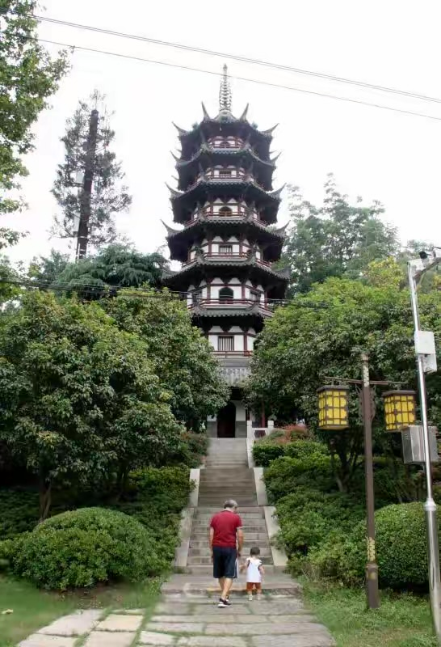

白鷺塔位於鷲峰寺西側，原名「白塔」，明宣德六年（1431），南京工部利用建大報恩寺的相同材料在此地建回光寺，並置有一塔，名「白塔」，後晚清被毀。現為2006年重建的白鷺塔。

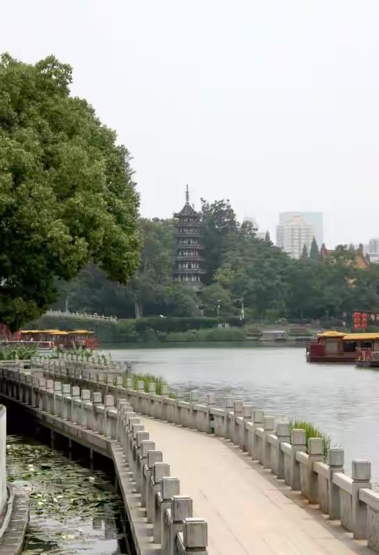

在心遠樓邊遠眺白鷺塔，沿湖的曲橋可達煙雨軒，浣花橋和鷲峰寺隱約可見。

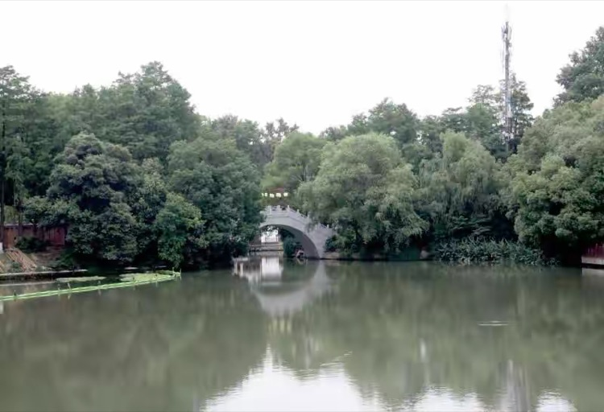

現在的秋波橋1975年建，橫跨公園東岸與白鷺島之間的水街北出口，不時有環湖的遊船駛出。

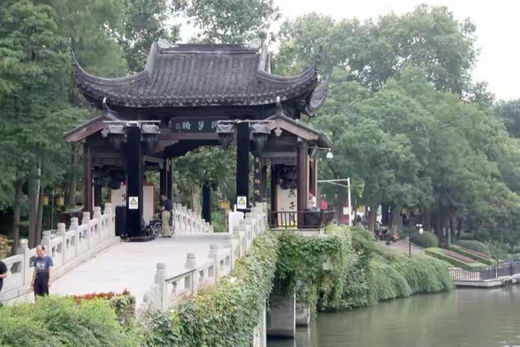

浣花橋是清代的一座古橋，據說此橋落成的時候有彩虹出現，又稱「飛虹橋」。古時候，秦淮湖畔美女如雲，白鷺洲花團錦簇，白鷺齊飛。美女們都喜歡來這裡踏青賞景，摘花佩戴。文人墨客都覺得這裡的景緻與成都杜甫筆下的《浣花溪》相媲美，將此橋名為「浣花橋」。

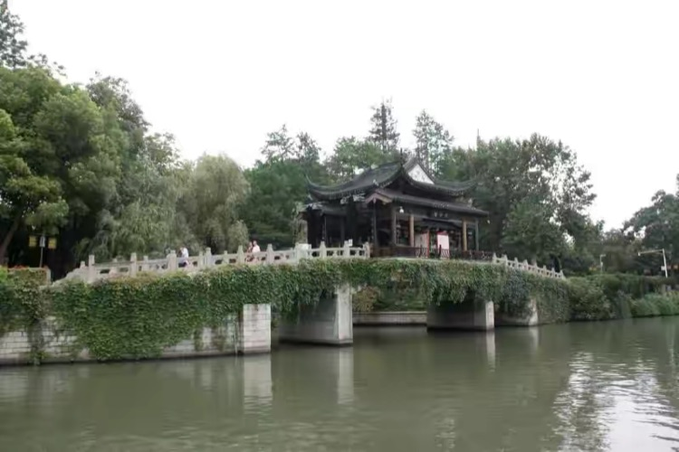

2006年重新翻建，進出白鷺洲的河面拓寬，由不到5米擴到10米，秦淮河上的大型遊覽船可以直接進入白鷺洲，更加豐富了十里秦淮風光帶的內容。

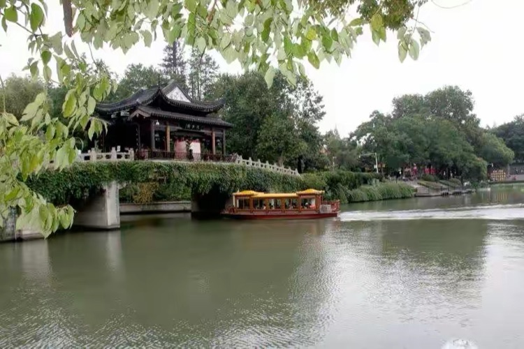

一艘遊覽船正從浣花橋下通過，離開白鷺洲進入秦淮河風光帶。

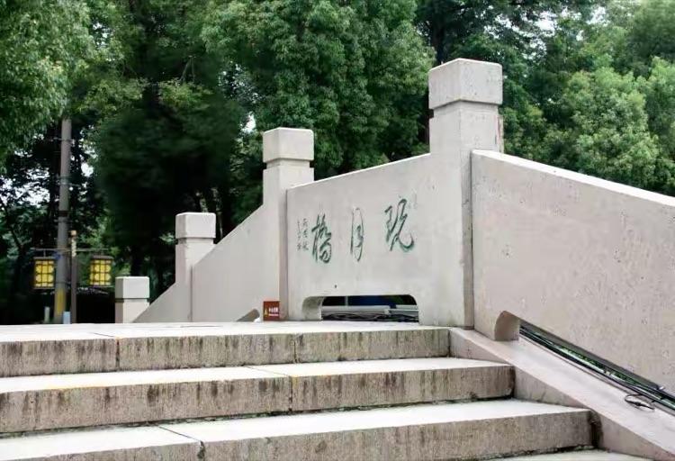

玩月橋始建於明中期，為馬湘蘭故宅前的一座木板橋，是時岸上櫛比，水上碧波盪漾，橋上流如織，為清代金陵四十景之一，是秦淮河畔中秋賞月的勝地。

據傳，當時每逢中秋之夜，南京城內甚至外地的書生士子們慕馬湘蘭之名前來，紛紛聚集在玩月橋頭，或賞月賦詩，或笙簫彈唱。玩月橋成為南京城中秋賞月最具人氣的地方。秦初大詩人周在浚「秦淮古蹟詩」「風流南曲已煙銷，剩得西風長板橋，卻憶玉人橋上坐，月明相對教吹簫」即指此橋。明朝滅亡後，玩月橋逐漸衰落冷清，風雅秦淮成為舊事。

現為1975年翻建的石橋。

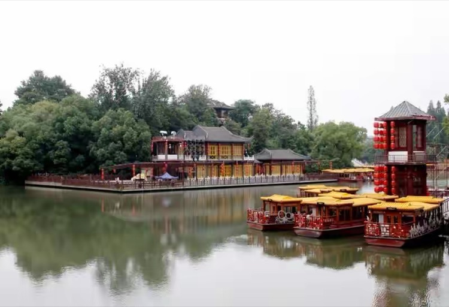

白鷺島位於白鷺湖中，系1963年用小鐵路基土石方與浚湖泥堆砌而成。島上樹木蔥鬱，石徑曲折，山頂為全園制高點，1982年彼處建覽勝亭，是眺望全園景色最佳處。島西側建臨水畫舫春在閣。

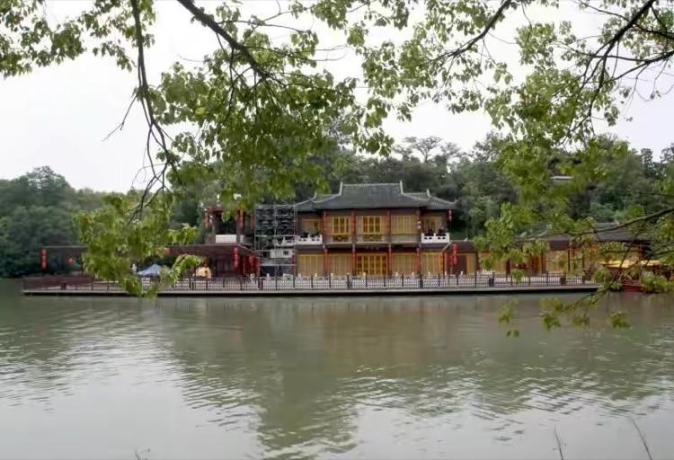

春在閣的位置 原來有一群白鷺塑像，神態各異，栩栩如生，人們都喜愛在煙雨軒的臨水平台上以對面的白鷺為背景拍照留念。

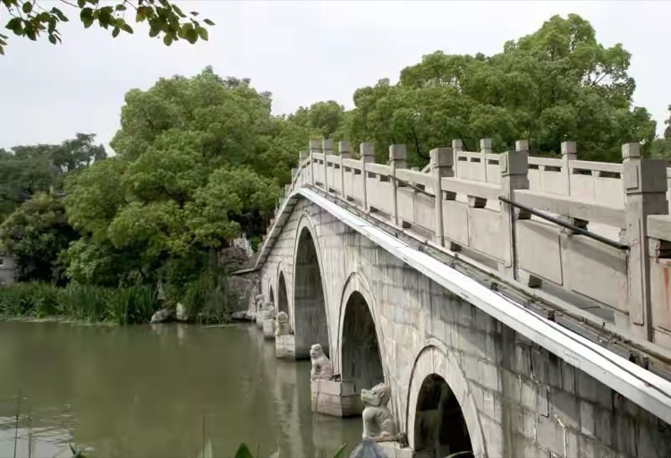

印月橋為五孔石橋，每當皓月當空之時，橋上游人如織、情侶間深情款款，橋下水光瀲灩月印其中，構成了一幅湖光山色的精美圖畫。此時置身橋上，空中月、水中月與賞月人的心中月相交輝映，不禁令人神馳心往，怡然忘歸。

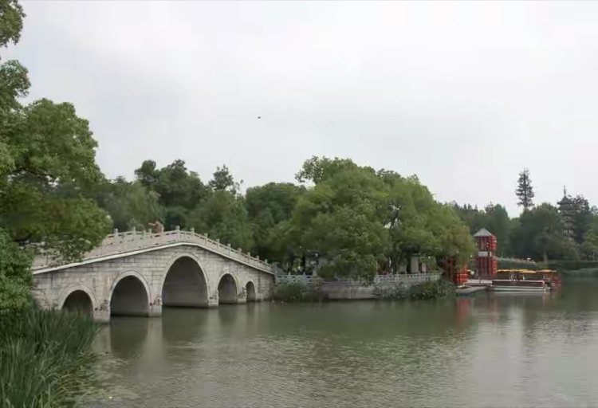

現為1970年翻建的石橋。

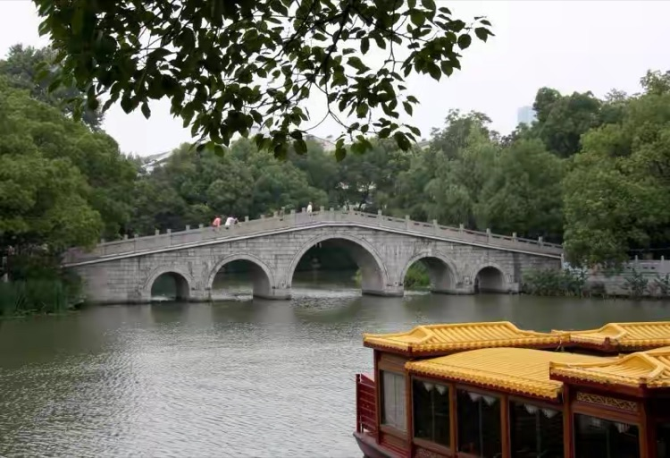

白鷺島上遠觀印月撟。

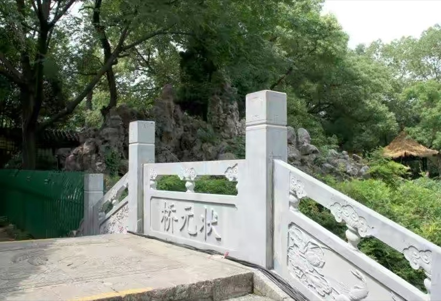

狀元橋，始建於明中期，為東園裡的一座佚名橋。在明萬曆年間和乾隆年間，有兩位狀元都是默默無聞的時候在這裡讀書學習，之後考取功名。橋面最上面的一塊石板刻著「獨佔鰲頭」的圖案，古人稱之為「狀元橋」。

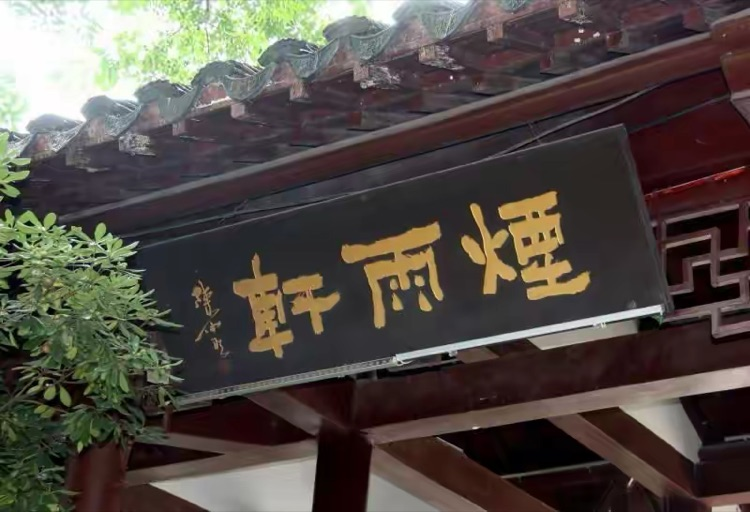

煙雨軒建於民國13年的白鷺洲茶社，解放後數次整修，並於1962年增建水上平台。現為1988年重建的煙雨軒。

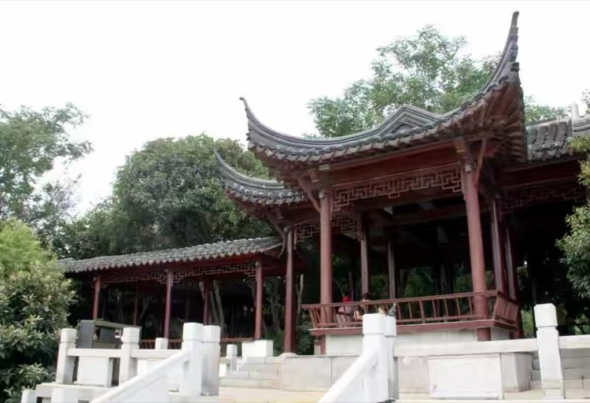

煙雨軒絕對是最紅的打卡聖地，豪不誇張的講，家住南京城南地區的50後、60後、甚至70後差不多每人都有在煙雨軒臨水平台上以白鷺島為背景，或以五孔印月橋為背景的照片。

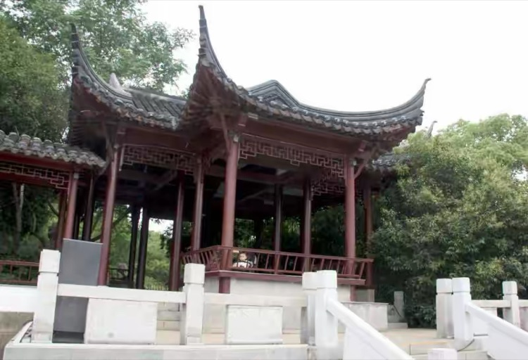

重建的煙雨軒與記憶中的模糊影像似乎有點不同，但確實講不出來，漂亮了，又象缺了點陳舊感、歷史感，那種似曾相識，那種原來的真身本像。

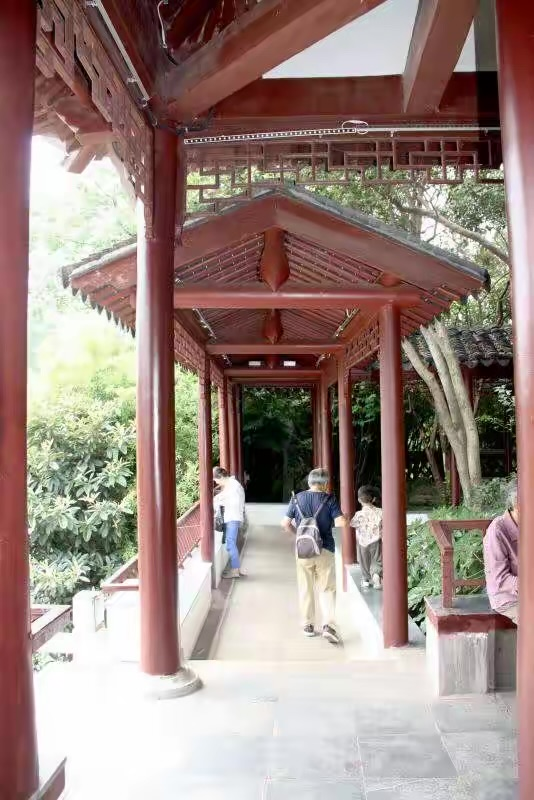

緊鄰煙雨軒的曲廊是1965年修建，現為1988年重建。

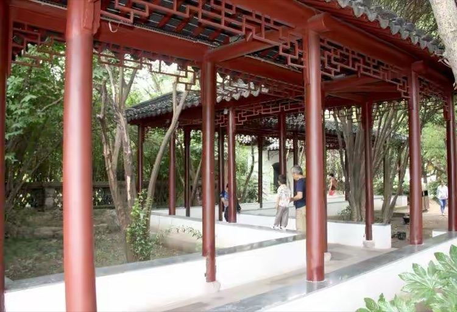

帶著孫兒在曲廊中玩耍的爺爺，告訴孫兒，當年爺爺在這裡和一群小孩，爬上爬下，開心的很哦！

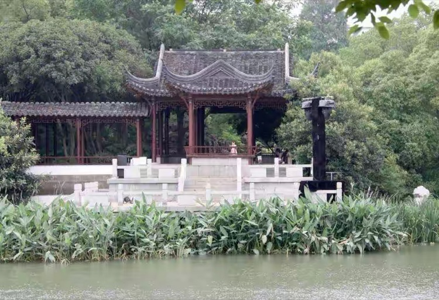

在白鷺島遠眺煙雨軒，感嘆軒中無憂無慮的小姑娘，幾十年轉眼即逝，當年我們也都是少年。

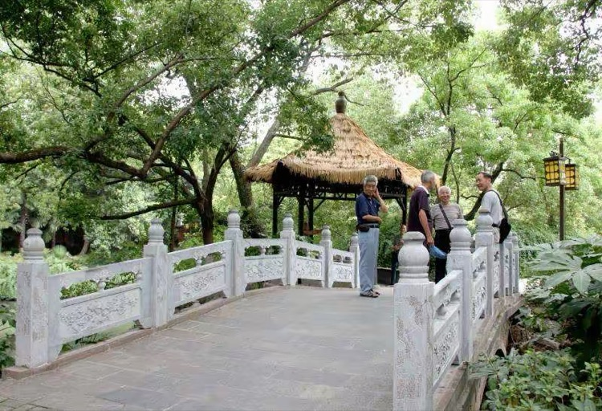

碧波橋和話雨亭。碧波橋和狀元橋都連接相同的洲，只是分別座落小蓬山的東西兩邊。

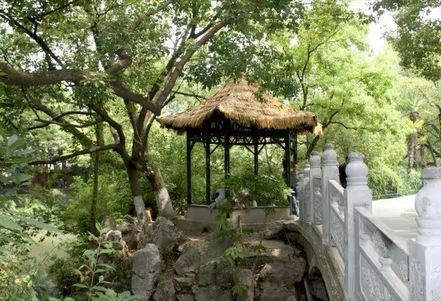

話雨亭也是白鷺洲茶社的建築，原是草亭，現在亭頂上裝飾的仿草塑料，沒有草亭的厚重飽滿，那麼古色古香。

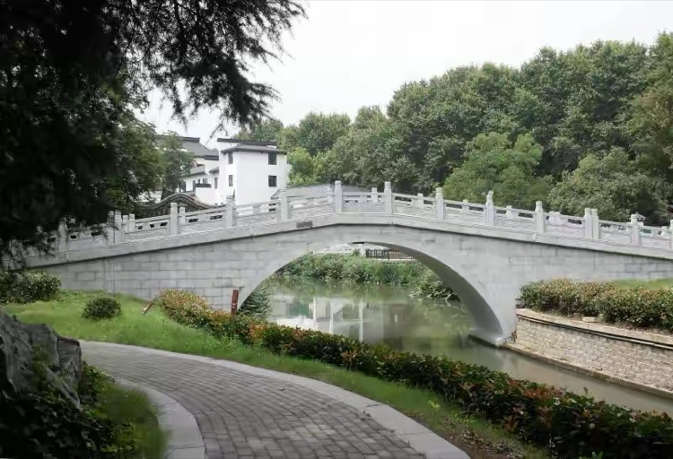

掬翠橋，公園西南角架在環湖水道上的橋，此處僻靜人稀。

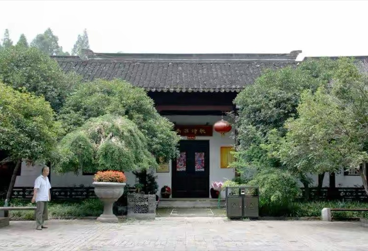

傳說東園時也有一鑑堂，解放後重建為少年之家。我們那時放學後直奔少年之家，憑學生證借一副康樂棋，四人圍一桌，一直打到五點鐘閉館。

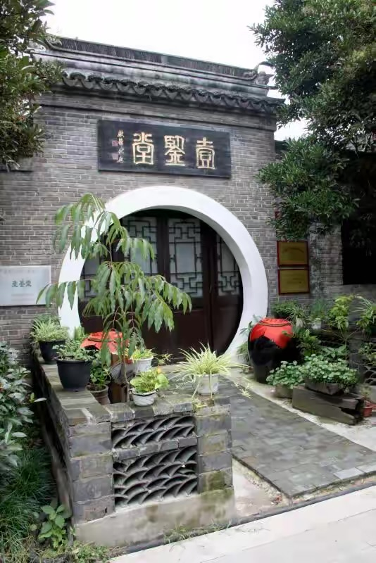

一鑑堂的正門口放兩隻大酒缸，後門上寫著「秦淮詩歌」，馬上就明白這裡以前是飲酒作詩的地方。

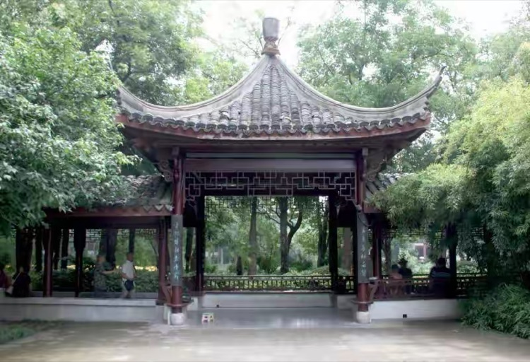

一鑑堂的東面有曲廊，

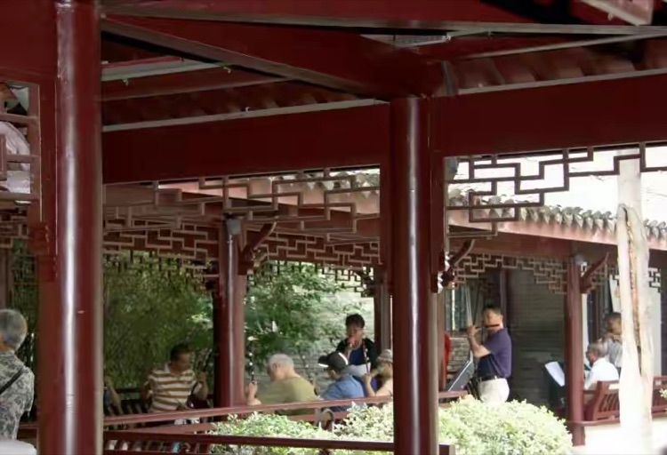

廊內有一群老人自帶音響，有人吹笛子、有人拉二胡、當然只為一人（歌者）伴奏，一曲《山丹丹開花紅豔豔》響徹白鷺洲東南角。

泊在湖邊的遊覽船。

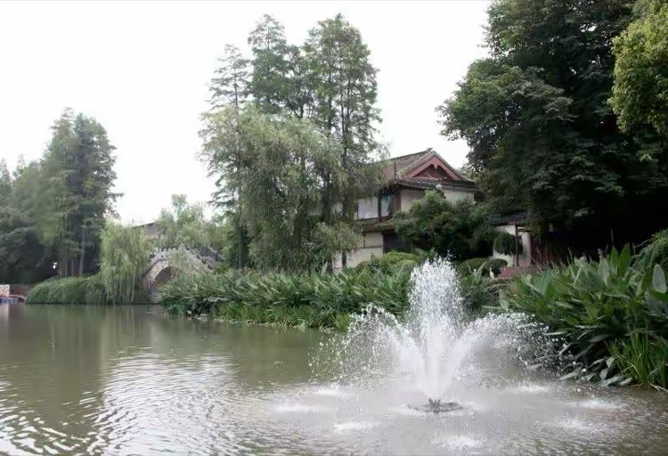

清朝入關後，徐氏家族敗落，所屬園林絕大多數都已圮廢或易主，東園尚有守園園丁苑姓，居橋旁，故橋以苑姓，稱苑家橋。現在的苑家橋1981年新建，橫跨水街的南出口。

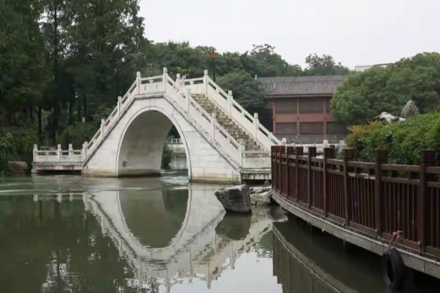

李白《登金陵鳳凰台》中「二水中分白鷺洲」的意思是，秦淮河流入長江的水因遇到白鷺洲，而分流為二股水道沿洲兩邊向前。

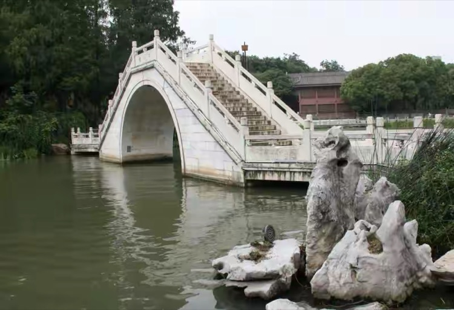

此處的白鷺洲在湖中建一座橋，名為「二水」，硬生生的將「白鷺洲」的湖面從中分開，好象也達到詩的意境：一座名為「二水」的橋，將「白鷺洲」從水中分開。忽悠，絕對是大忽悠。

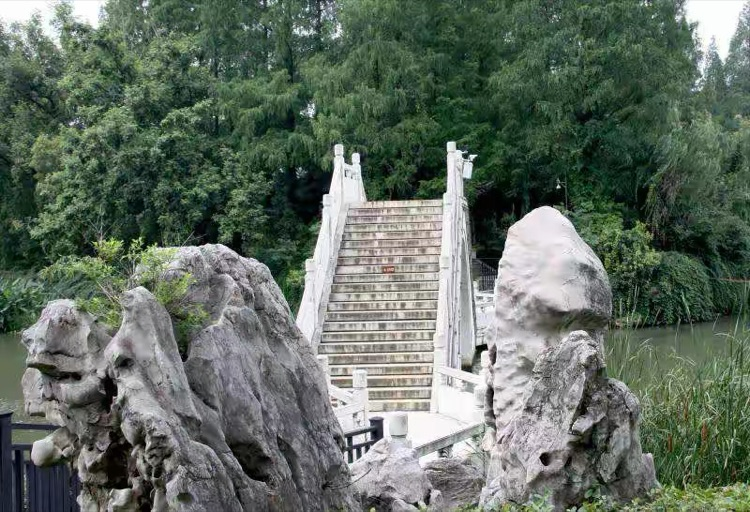

不過「二水」橋的造型很美，很精緻，無論從那個角度看都很秀麗，觀賞性很強。

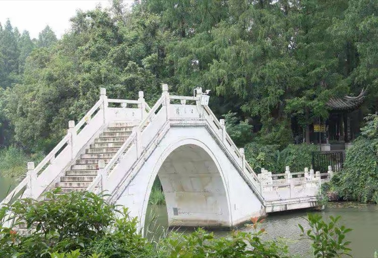

橋的那頭是觀瀾亭，橋的這頭是假山，和周圍景色也十分協調搭配。

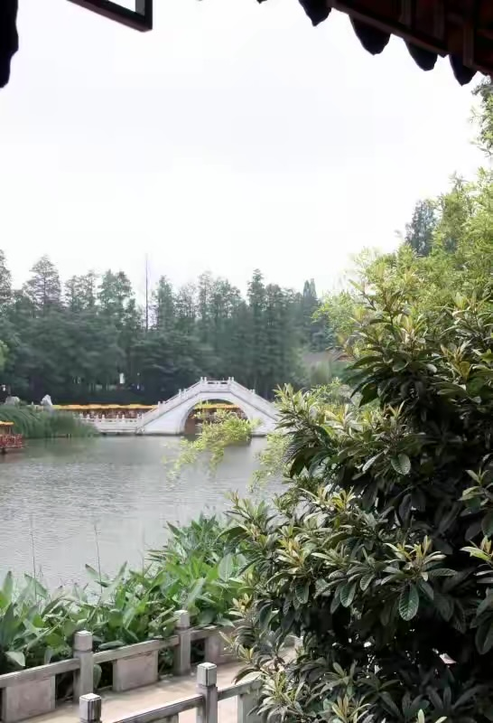

從煙雨軒的曲廊回望二水橋，白鷺島也隨之靈動起來。

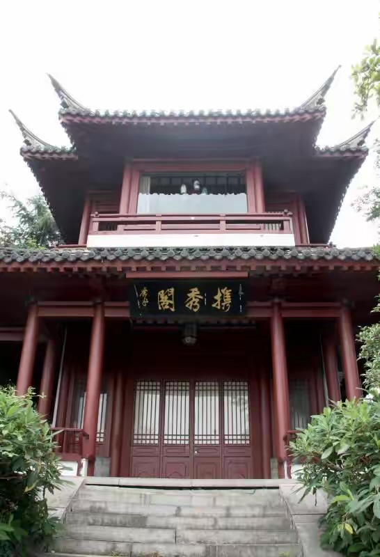

1982年在最高處建了覽勝亭，後來改建為攜秀閣。攜秀閣，四面雙層，朱柱四圍，落地門窗，登上二樓，眺望四周，園內景觀盡收眼底。

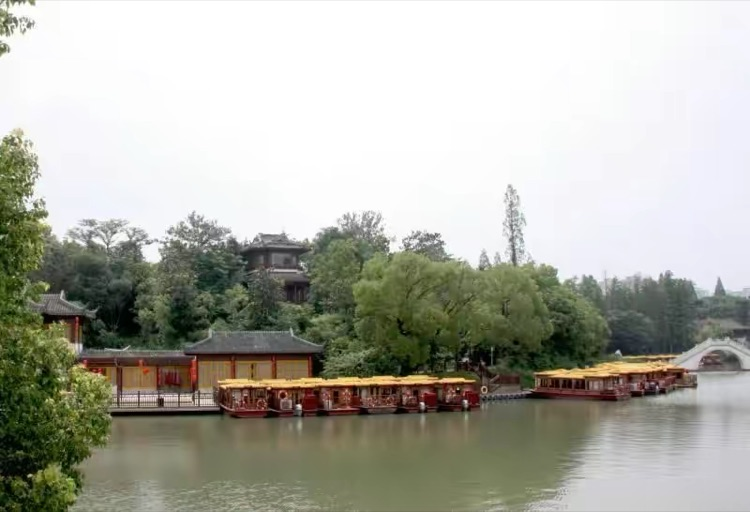

順著春在閣向白鷺島的南面看，山上可見攜秀閣，湖中可望二水橋。

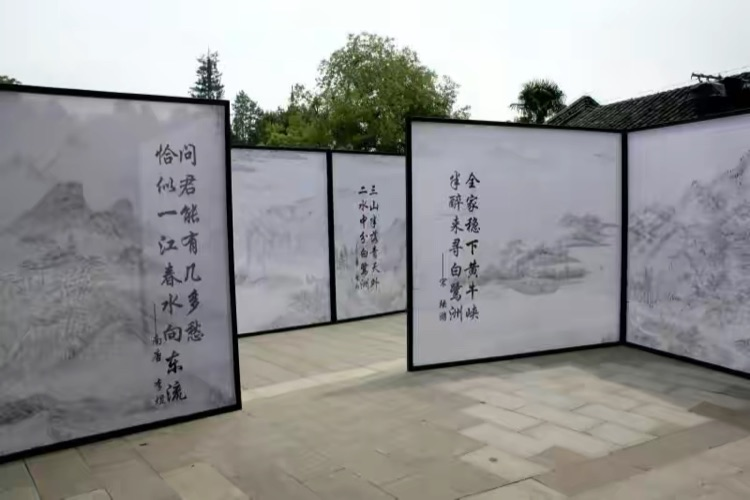

人工佈景，畫和詩的走廊。

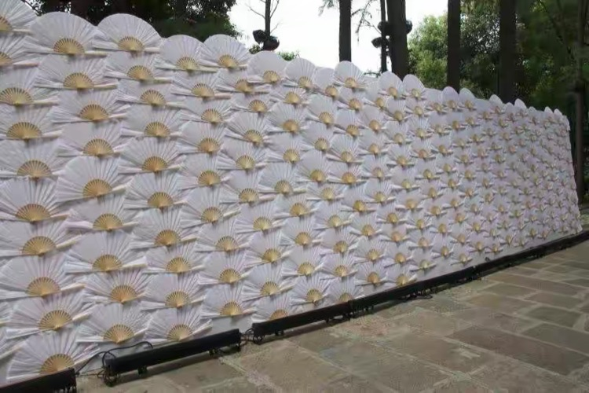

貼滿扇子的牆。

一鑑堂前有塊刻著「緣」字的大石，石後面有許多高大的芭蕉葉象指引牌一樣指著各個方向，如同人生的各個路口，有人與你同行，是因為彼此相互招呼。

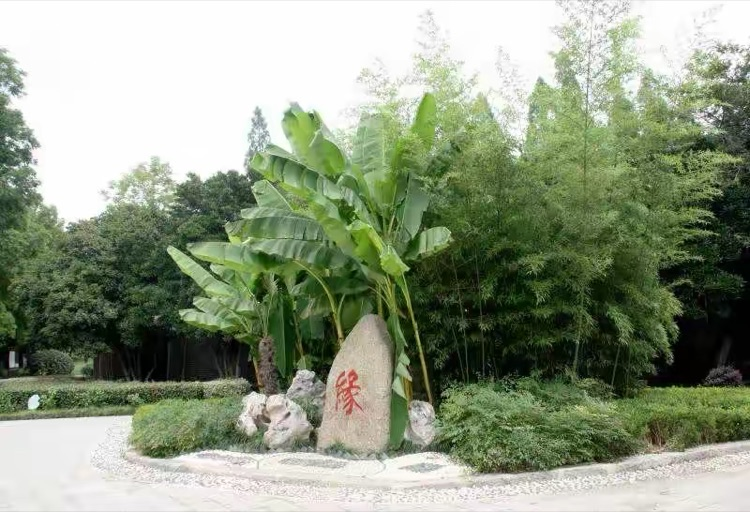

「緣」字石前的路是圓形的，可以朝任何方向走，錯過了也就是無緣。

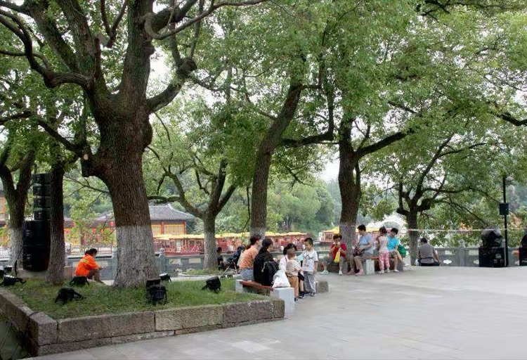

白鷺洲是我們這一代人童年的記憶，六十年代末七十年代初，我在承恩寺小學讀書，那時的小學生是快樂的，沒有家庭作業，下午三點鐘放學，沒有家長會在學校門口接，同學們你們自由自在的跑吧，想到哪裡玩就去哪裡玩。

學校地處熱鬧的三山街地區，承恩寺小學緊靠著健康路的北邊，夫子廟就在健康路的南邊，夫子廟裡商店一家連一家，吃的穿的玩的應有盡有，不說別的，當時5分錢可買二兩油餅，3分錢可以買一隻油炸蘿蔔絲餅，可是小學生口袋裡有1分錢的人幾乎為零。

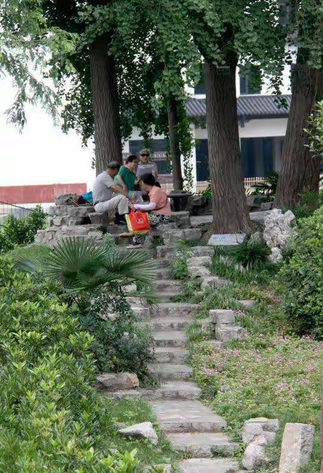

萌動的童年，快速的奔跑、大聲的叫喊就是快樂，白鷺洲為不收票的公園，有寬闊的空地，有不高的土山，有不深的湖水，湖邊有美麗的亭子、湖中有湖心島。放學的時間，在公園裡隨時可以看到一大群快速奔跑的小學生，夾雜著只有他們自已聽得懂的叫喊，快速從人們眼前通過。像一群麻雀，嘰嘰喳喳突然出現，又一陣風似的突然消失，走過了，叫喊聲也隨之漸漸消失在遠方。
