白鷺洲公園內部有條水街，屬於比較小眾的園林景區。水街的東邊偎依著明城牆的城牆根，水街的西邊與白鷺洲公園內的白鷺島隔水相望。

<!--more-->

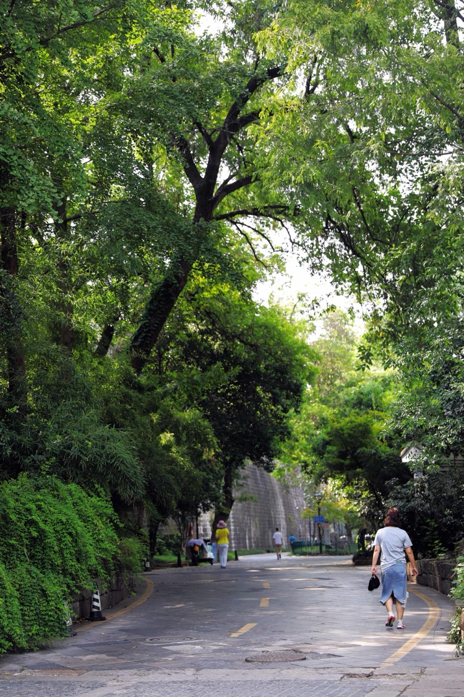

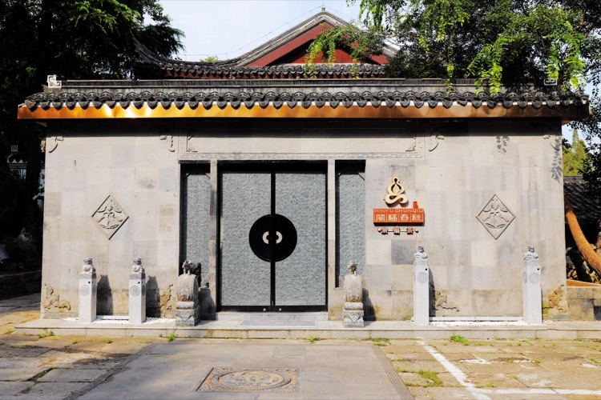

水街南北走向，從南向北建有閩福春秋景福薈、白鷺書畫院、南京夫子廟隱逸水街酒店、萬國春中菜館、德國山頂牛排啤酒花園、夜泊秦淮太傅樓酒店。分南街和北街，南街很多是由兩層簷口建築組成的中國古典四合院，北街是明清兩層建築。活脫脫的一條歷史斑駁的「老街」，水街的「街」由此而得，由此而旺。

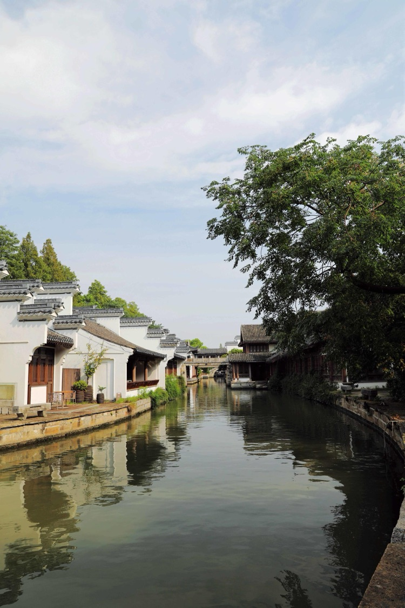

那條公園岸基和白鷺島之間長達200米的河道，沿途可見青磚、黛瓦、馬頭牆、格子窗，不定時有秦淮畫舫在水道中出沒。水街的「水」也因此而得，因此而活。

水街與白鷺島相因相生，水街本屬於民國時市內小鐵路的一段路面，白鷺島為六十年代初拆除小鐵路的基土石方與浚湖泥堆砌而成；而水街的水恰恰是白鷺島在公園湖中硬擠出來的一條河道。

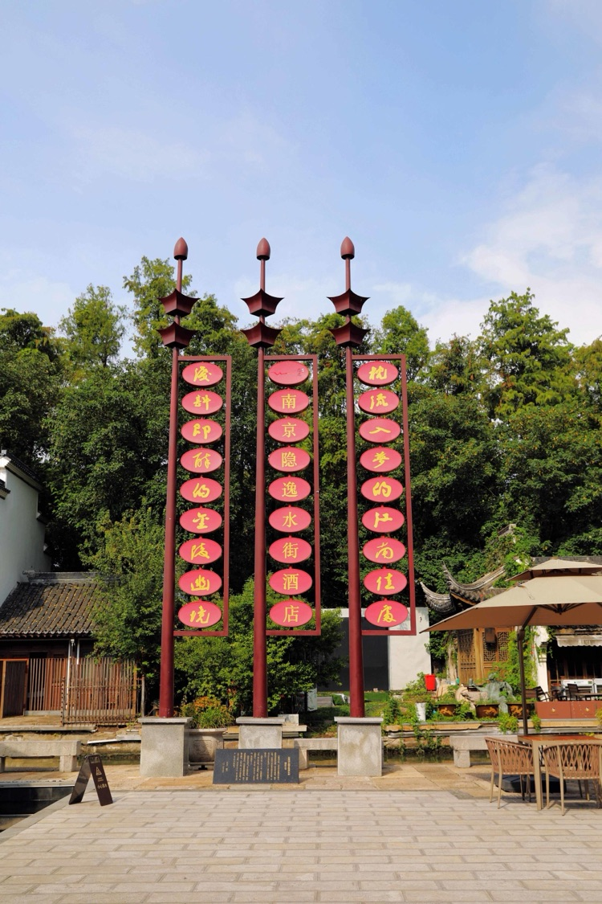

隱逸水街酒店的院裡豎著這樣的楹聯：「枕流入夢的江南佳處，淺酌即醺的金陵幽境。」水街就是南京人心中「江南水鄉」的樣子，無論是聽雨聽泉，若枕流入夢，盡情自由自在；無論是飲酒飲茶，能淺酌即醺，隨意放任天性。

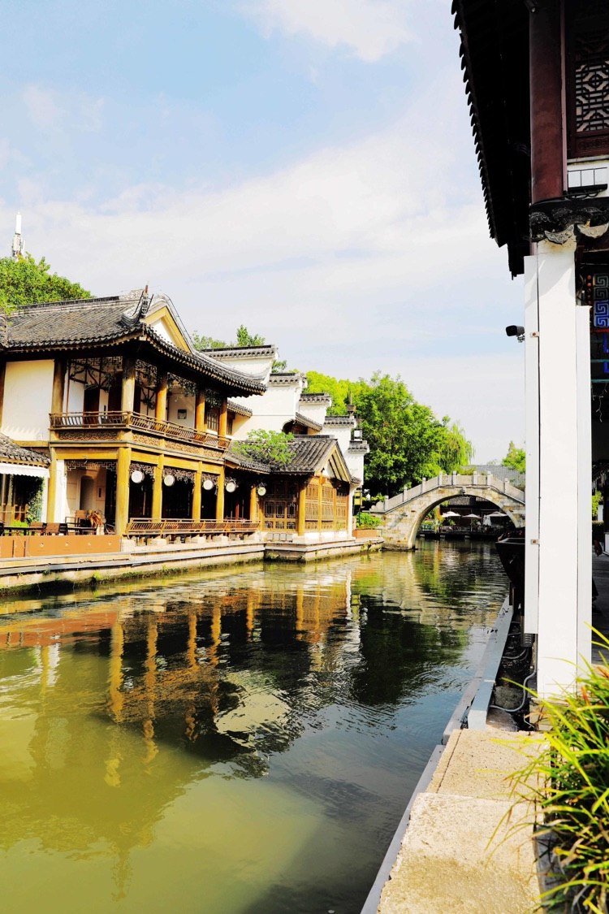

坐在街邊臨水的地方，似乎能聽見白居易的《憶江南》和那濃濃的唐韻：「江南好，風景舊曾諳：日出江花紅勝火，春來江水綠如藍。能不憶江南？」朝陽冉冉升起時，細品河水如綠如藍是春是秋？想自己還在不在江南？

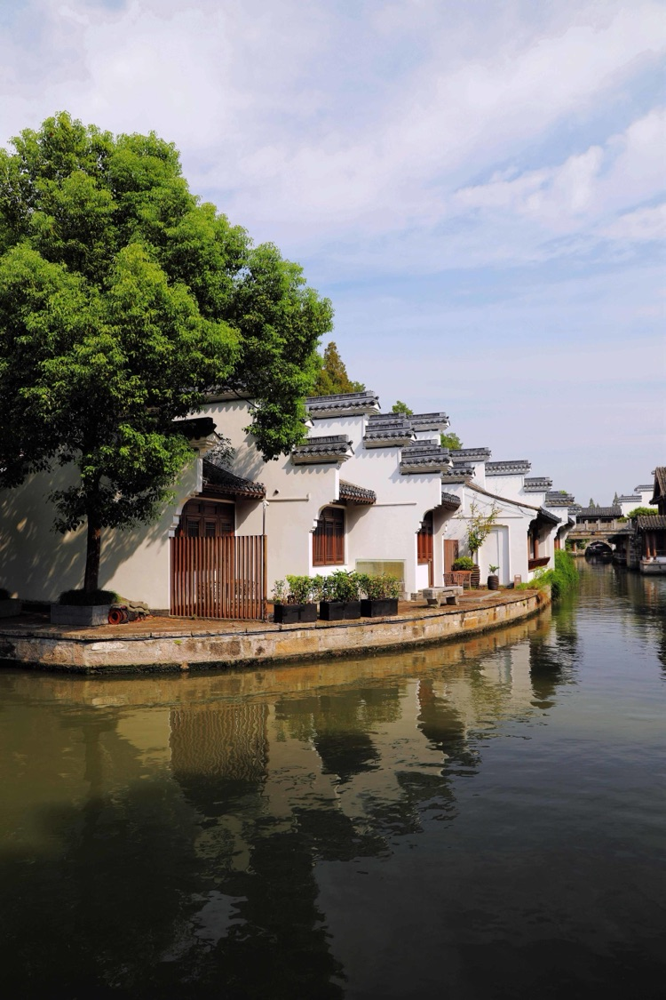

悶了打開手機，讀一讀現代的《網絡杜甫詩》：「你我暮年，閒坐庭院。雲捲雲舒聽雨聲，星密星稀賞月影，花開花落憶江南。你話往時，我話（畫）往事。願有歲月可回首，且以深情共白頭。」心平氣和的等著一陣的輕風，包含水汽且溫和粘人的微風，盡情的享受江南溫婉的柔情，然後刻骨銘心的記著。

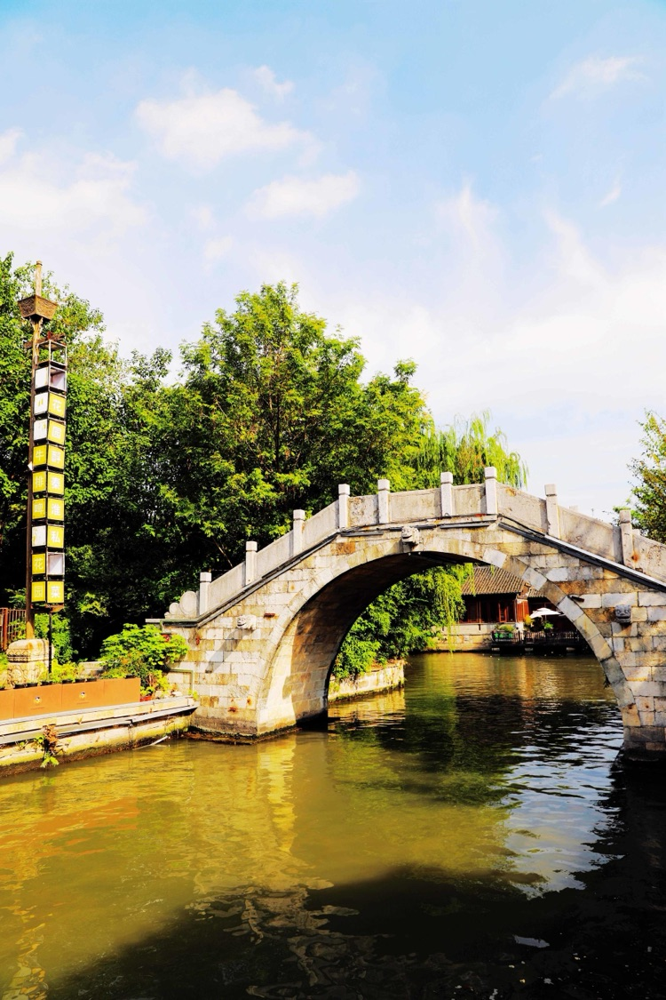

明城牆下的水街，畫中的江南水鄉，隨處是小橋流水，露水浸濕的青石板路上，留下行人淺淺的腳印，讀了一會，慢慢的懂了，那是許多年代的詩人留下的詩意。

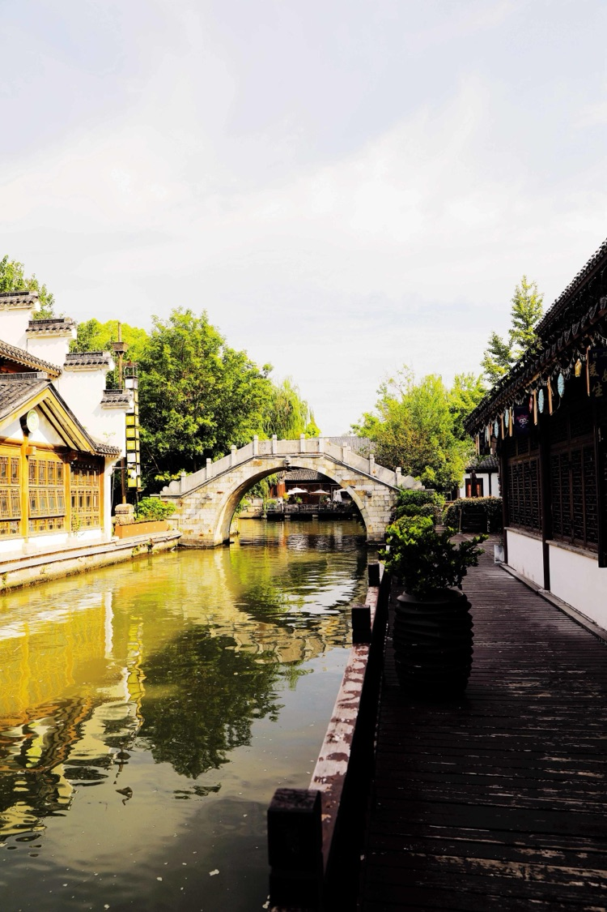

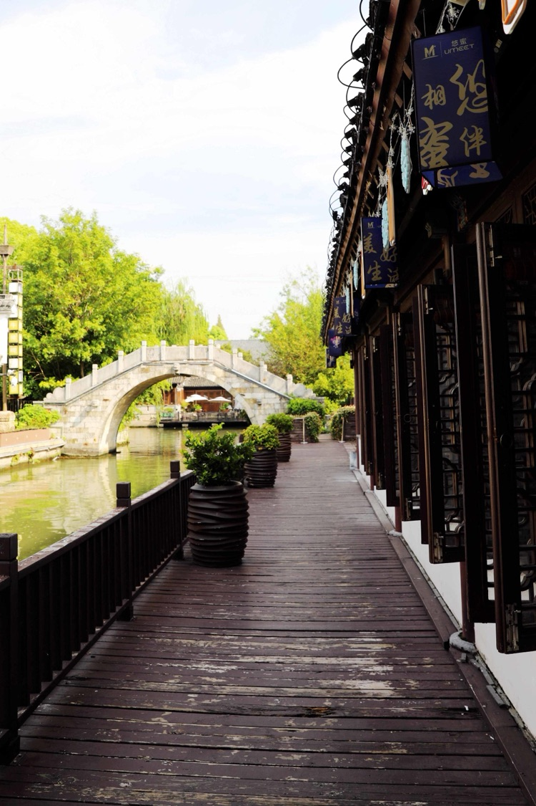

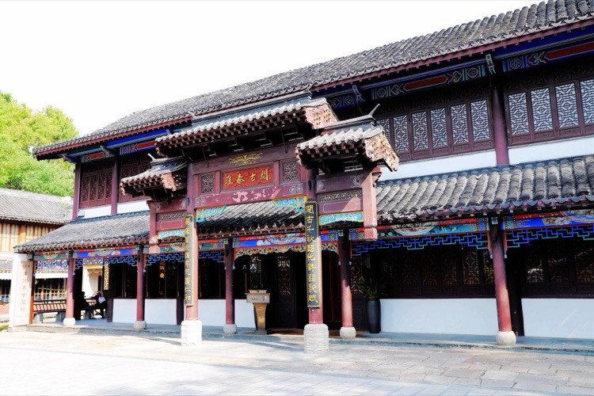

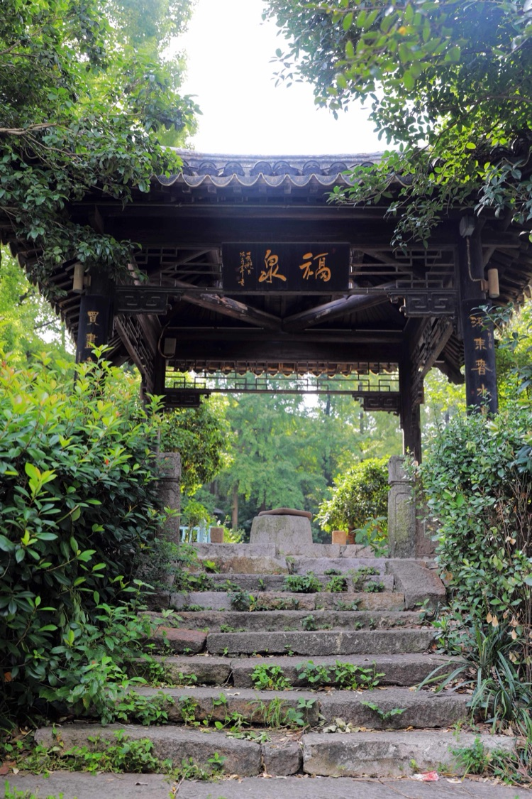

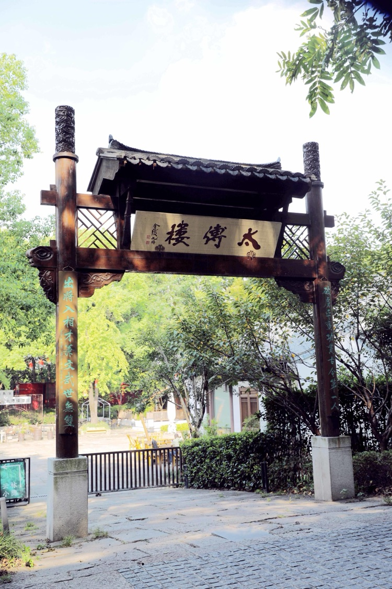

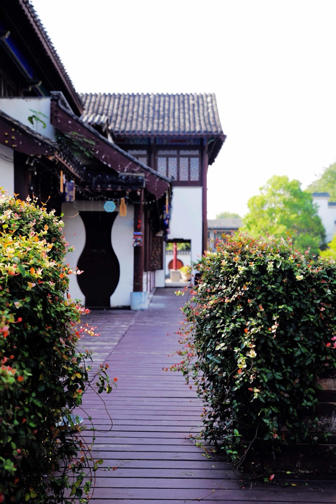

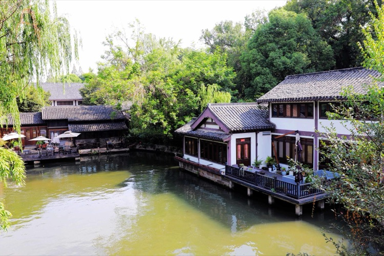

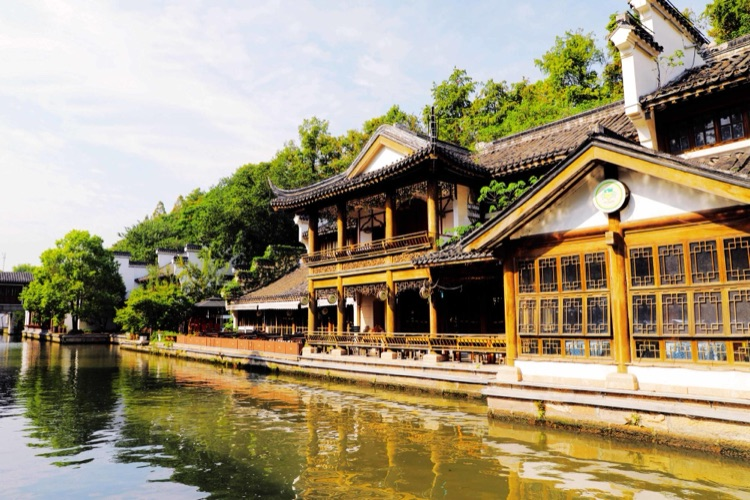
