在南京人面前以「老南京」自居的人一定是城南人，在城南人面前以「老南京」自居的人一定是「門東」或「門西」的人，那裡保留著「原汁原味」的老南京話、明清特色的「前後多進的宅院」、年代久遠的「風俗和規矩」。

<!--more-->

當年明太祖朱元璋建都南京，建立了世界最大的城牆，並劃分皇宮在城東，百姓住城南，軍隊駐城北。南京聚寶門（民國後改名為中華門）內外及城內秦淮河沿線成為重要的商貿和手工業的集散地。清末以後，門東、門西等城南地區逐漸成為以居住功能為主的區域。

「老南京人」俗稱中華門為「南門」， 城牆以內中華門以東稱「門東」、中華門以西稱「門西」，「門東」和「門西」是區域概念，現在重新修建的「老門東」原則上並沒有完全涵蓋「門東」地區。2013年國慶首次對公眾開放，後續工程仍在不斷完工。

明晚時期的南京城究竟是什麼樣子？當時的人們又過著什麼樣的生活？「老門東」的重新修建，主要借鑑明仇英所繪享有「南京本土的《清明上河圖》」之盛譽的《南都繁會景物圖卷》。成都有「寬窄巷子」、北京有 「衚衕四合院」，那南京呢，當然是「老門東」和「老門西」，明清的民居店鋪，還有「芥子園」、還有「愚園」。

「老門東」的牌坊（沿剪子巷走向）攔腰立在箍桶巷的中間， 「老門東」街區以箍桶巷為南北中軸線，兩邊輔以三條營、中營和邊營等東西向側巷。

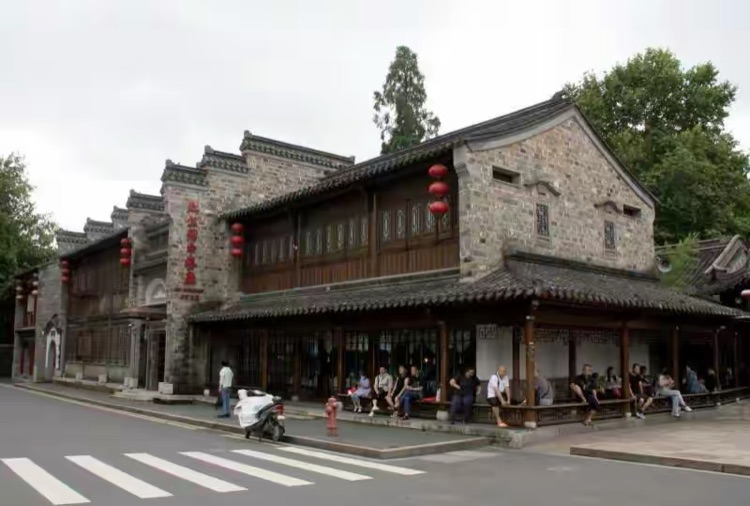

牌坊的東邊是紅公館中餐廳，沿街建有長廊，內有長凳，可供趕路和遊玩的人歇息避雨。聽老人們說，以前南京好多的街頭巷口，都建有亭、廊，也都有這樣的功能，可見南京人淳樸善良的民風由來已久。

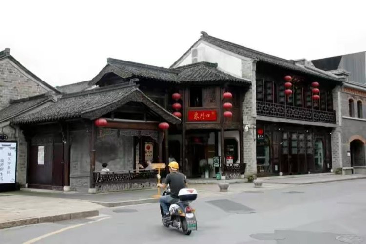

牌坊的西邊是「東門口」餐廳，房前也有廊有凳，就是名字有點怪，他的地理位置應該是「老門東」街區的北門口，或「老門東」牌坊的西邊，估計是寫招牌時字多牌子小，臨時省了幾個字，猜可能先準備寫「老門東大門口」的。

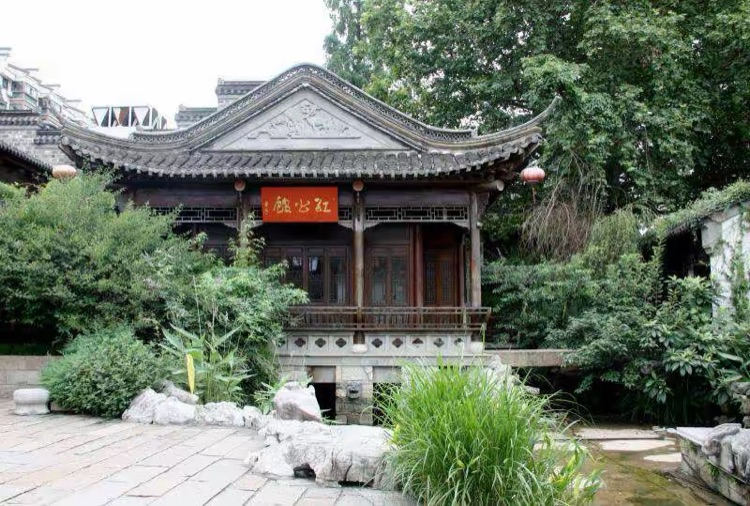

進入街區，東邊第二間依然是紅公館中餐廳，門前的水池己改為造霧池，用時池中不斷有云霧蒸出，飄渺如仙境。

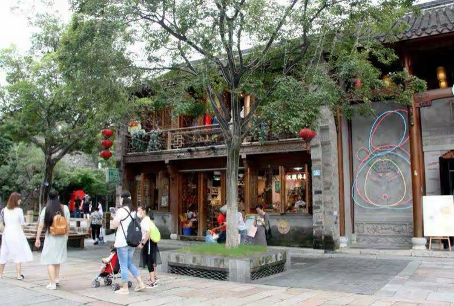

「行走南京」是一家經營旅遊商品的店，和「老門東」街區所有商鋪一樣，外牆輪廓都裝飾了各種顏色的軟管燈；整條街的大大小小的的樹也裝飾了各種顏色的軟管燈。白天看並不顯眼，只是勾畫了一道邊，晚上五顏六色的燈一起亮起來，那就是另一番景象。

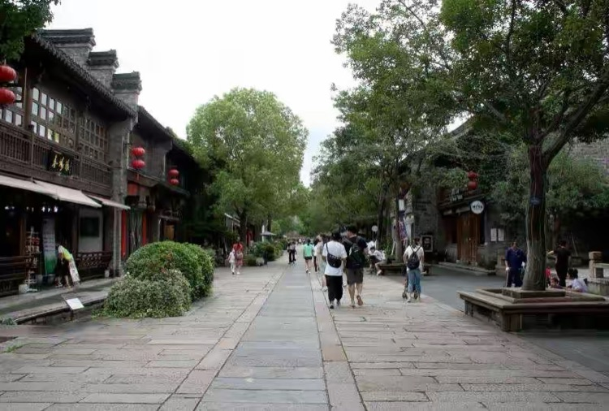

箍桶巷南北長近300米，據傳當年沈萬山看準商機，把家鄉的箍桶匠都召集到南京，由於這些匠人工藝精湛，不幾年，連他們帶的徒弟，很快把箍桶巷住滿了，慢慢的南京人就把這條巷子叫「箍桶巷」。

你可能會問：箍桶能有這麼大的市場嗎？是的，按當時生活水平，不論窮人富人，水桶、澡盆、腳盆、馬桶都是每家都必備之物，這些物品的製造維修都屬「箍桶」的業務範圍，雖然百姓人家的這些盆桶不需要刻花雕龍，但都是盛水的物品，擺在那裡不能裂，用的時候不能漏，肯定有一定的技巧和竅門。

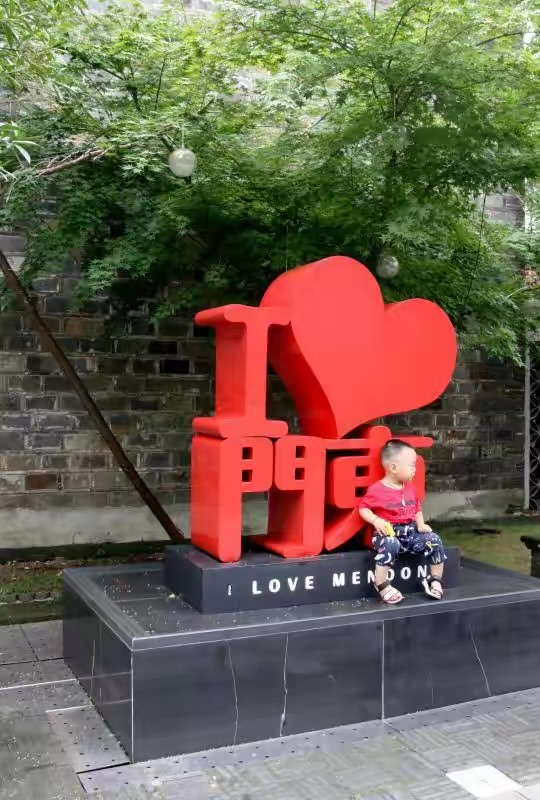

「我愛門東」是現代文字形的彩塑，巧遇一名孩童坐在字尾，使人立即想起 「童言無忌」的成語，是喜是嗔，反正孩童不會說假話，所以這話是真的。

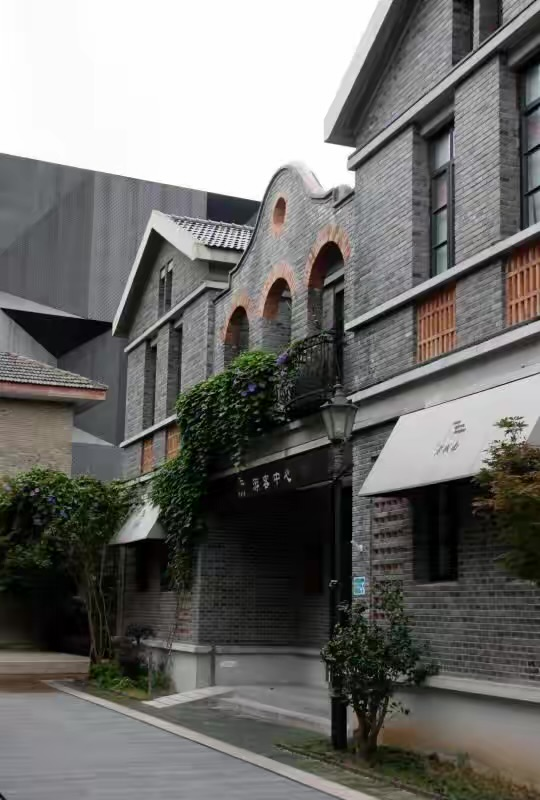

記住了，這裡是遊客中心，在老門東景區內無論發生什麼事情，都可以找遊客中心仲裁，但你一定要記住了它在景區裡的確切位置。

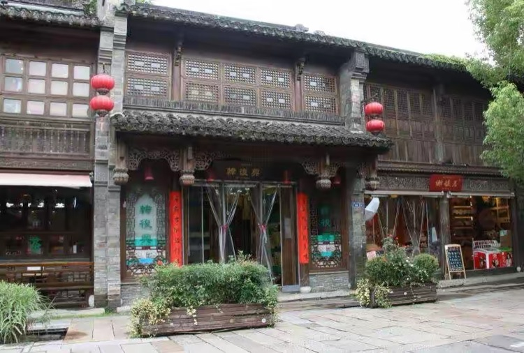

「老門東」街區內的箍桶巷是步行街，街道兩邊開著各種商店、餐廳和茶樓，順眼望去就有百年老店：經營板鴨的「韓復興」，還有經營脂粉的「謝馥春」。

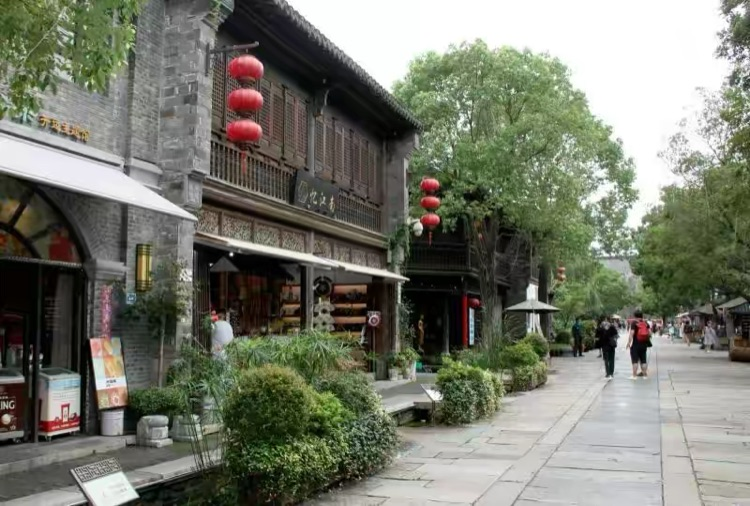

「憶江南」是一家禮品店，店名充滿詩意。唐白居易的詞：「江南好，風景舊曾諳。日出江花紅勝火，春來江水綠如藍。能不憶江南？」

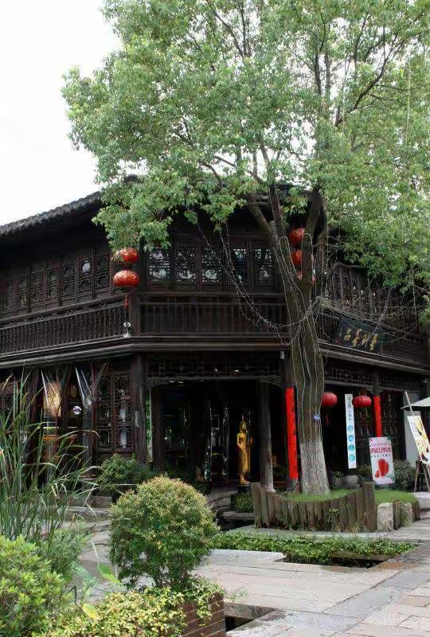

善利善品是一家水果店，店裡供一尊佛像，老闆應該心地善良。

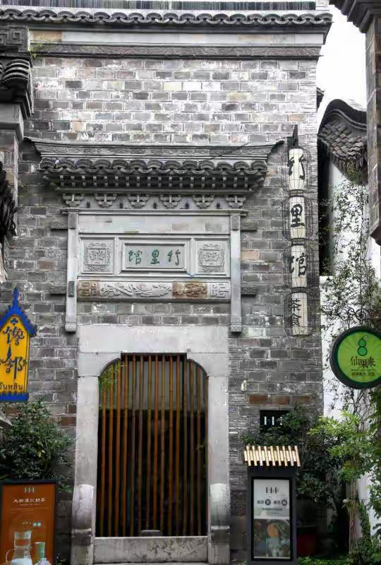

「竹裡館」既是一家茶館，也是一家餐廳，以竹子為主題，裝修的很別緻。

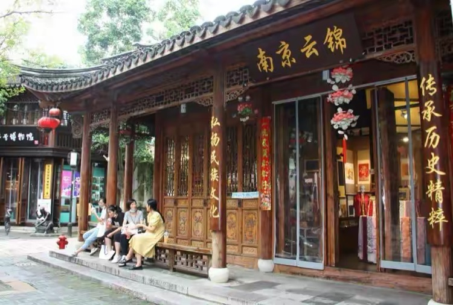

「南京雲錦」是南京的一張名片，南京雲錦是中國傳統的絲制工藝品，有「寸錦寸金」之稱，其歷史可追溯至417年(東晉義熙十三年)在國都建康(今南京)設立專門管理織錦的官署--錦署，至今已有一千六百年曆史。如今只有雲錦還保持著傳統的特色和獨特的技藝，一直保留著傳統的提花木機織造，這種靠人記憶編織的傳統手工織造技藝仍無法用現代機器來替代。南京雲錦被專家稱作是中國古代織錦工藝史上最後一座里程碑，公認為「東方瑰寶」、「中華一絕」，也是中華民族和全世界珍貴的歷史文化遺產。

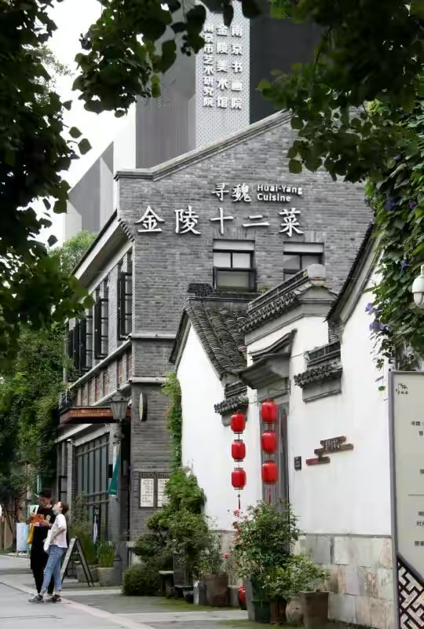

「南京老門東/尋魏 金陵十二菜」， 網紅店打卡， 春有百花秋有月 ，夏有涼風冬有雪。 「金陵十二菜」取諧音「紅樓夢 金陵十二釵」，果真如此的話，色香味應該是絕對上品。

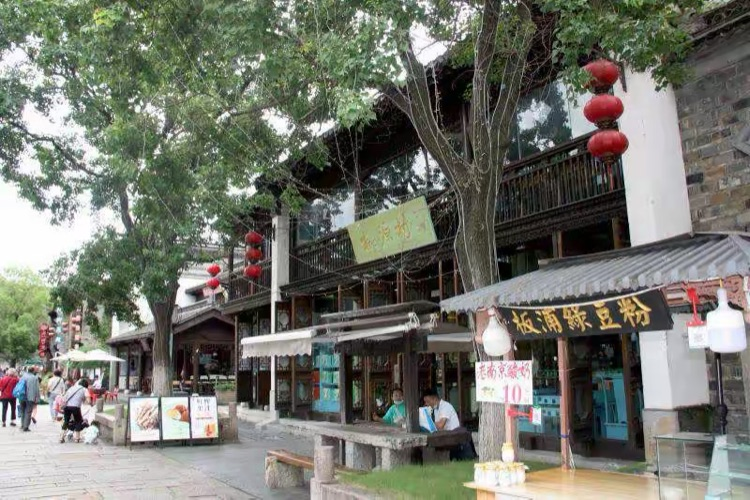

桃源村是南京老牌清真糕點店，端午的綠豆糕、中秋的月餅，以前單位發月餅，不是桃源村的，就是小蘇州的或南京食品廠的，後來還有冠生園、大三元。南京的糕點記憶中還有馬蹄糕、油球、雞蛋糕、桃酥、京果，現在品種更多了，更好吃了。

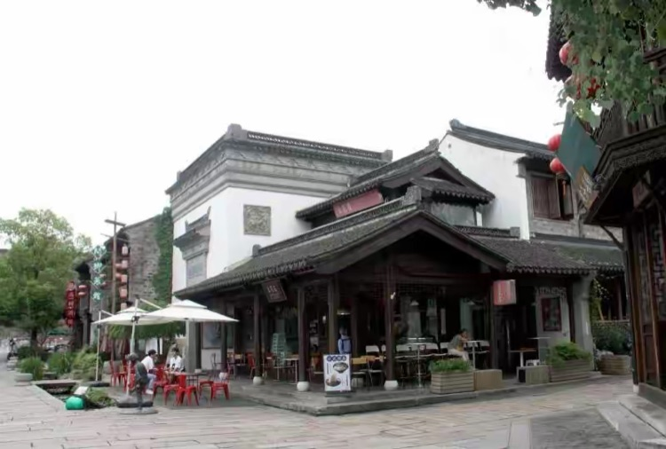

豆花莊來自台北的甜品。四九年一大批人從南京去了台灣，改革開放後另一大批人又從台灣來到南京，上次走的人匆匆忙忙，只帶貴重物品走；這次來的人輕輕鬆鬆，只為南京人休閒時添一杯美味。

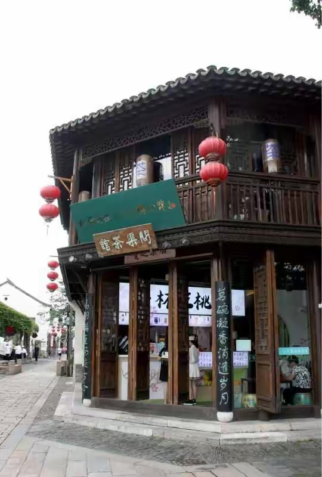

明末清初，夫子廟同時開了三家茶館，取名問渠、問津、問柳，合稱「三問茶館」。「問渠茶館」可以喝茶聽戲，「問渠」源自朱熹詩詞《半畝方塘一鑑開》的「問渠那得清如許？為有源頭活水來。」

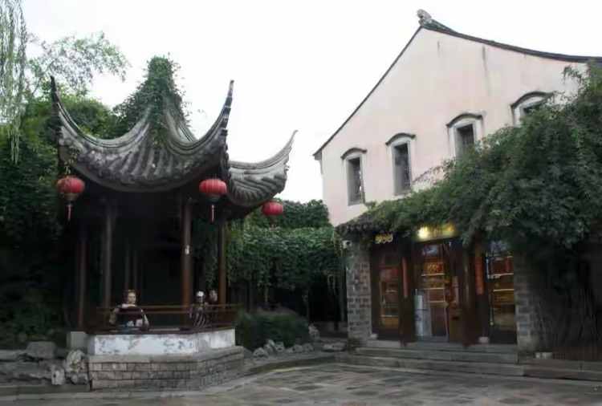

「櫻桃鴨」是英國林肯郡櫻桃谷公司經多年培育而得的優良品種，是世界著名的瘦肉型鴨。原先以醬鴨聞名南京，後由湖熟春華樓申氏家族第9代制鴨傳承人申新軍採用百年祖傳秘方，經18道獨特工藝，純手工精心秘製而成新潤生態鹽水鴨。

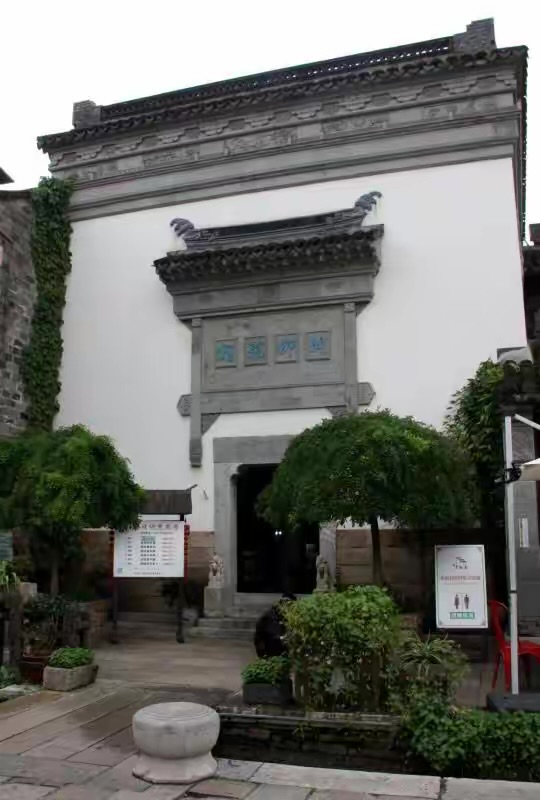

「問柳茶館」可以喝茶吃飯，「問柳」出自杜甫的「問柳尋花到野亭」。現「問柳尋花」多含貶義，此處「問柳」尊重原意應為賞春之意。歷史名菜有問柳魚片、問柳煮豆腐、問柳鐵獅子頭。

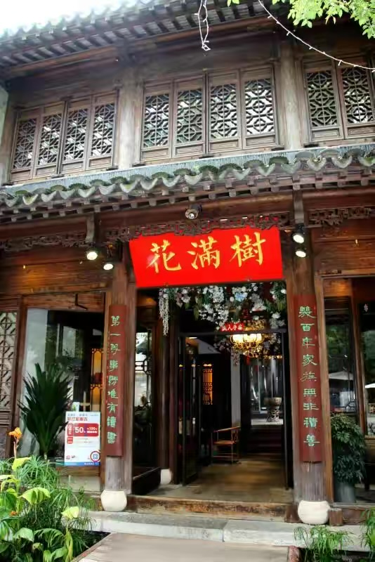

花滿樹是一家粵菜館，這裡集早茶、粵菜、夜宵於一體。店如其名，這裡就是一個花的世界，唯美又浪漫。

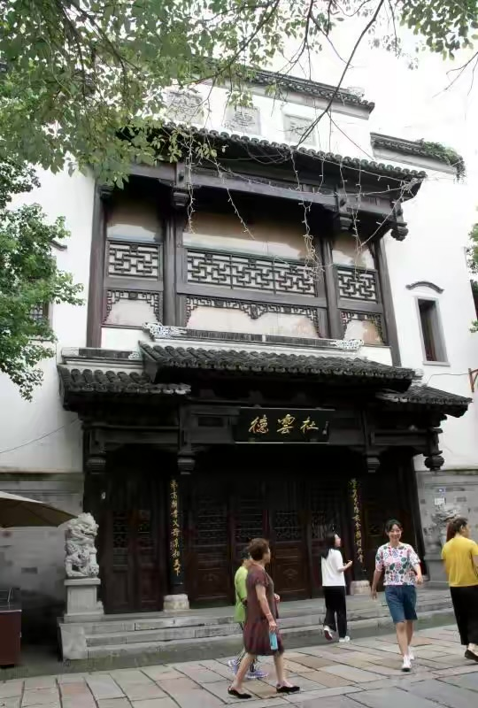

南京德雲社劇場隸屬於南京德雲社文化傳播有限公司，是由郭德綱先生創立的北京德雲社在南京建立的分社。最貴的包廂一場1500元。

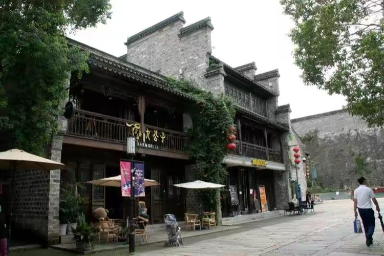

九公子音樂餐吧，大眾點評對他家的 「迷鹿雞尾酒」、「摩天漢堡」、「碳烤羊排」和「意大利肉醬麵」都有推薦。

My Town麥田啤酒吧適合年輕人聚會的地方。

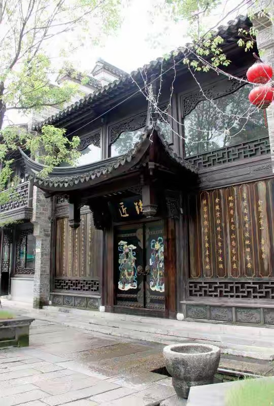

「匠鑄」，我第一次讀成「鑄匠」，舊式中文的書寫不是從右向左嗎？「匠鑄」——工匠所鑄，好，名字大氣，是一家銀器店，裝潢的很霸道，有門神、有意境。

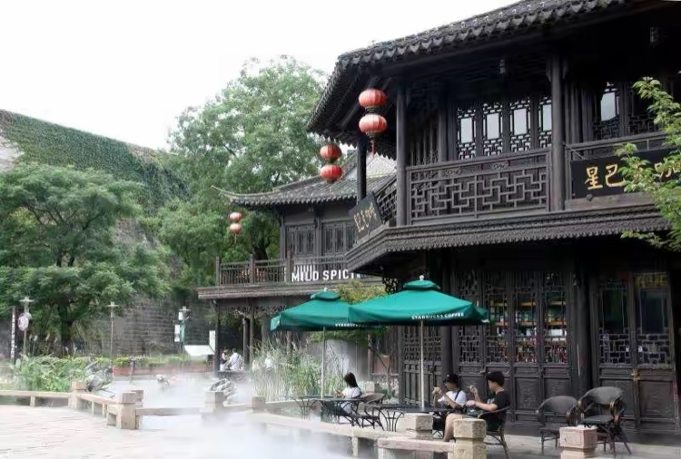

星巴克為餐館類型咖啡廳，老門東的星巴克是看著城牆發呆的好地方。門前的水池已改成造霧池，不時有一團團白霧從池中飄出，配合著那種真真假假的幻覺，呆呆的笑吧！網上有人講：「人們不過是從自己呆膩了的地方，來到別人呆膩了的地方，喝著同一杯星巴克，看著同樣生活狀態的人。」

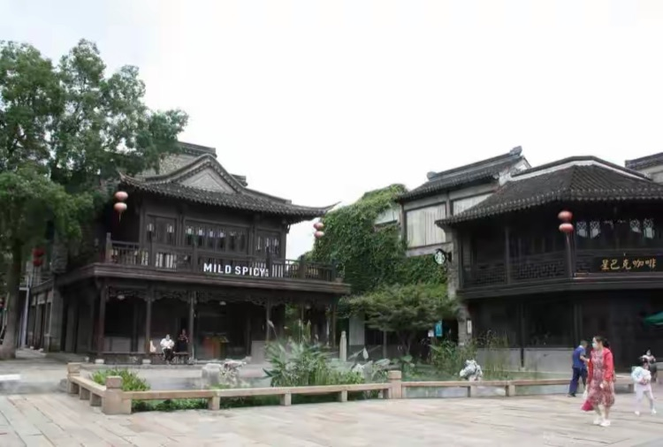

Mildspicy 米辣泰廚 為一家泰國餐廳。

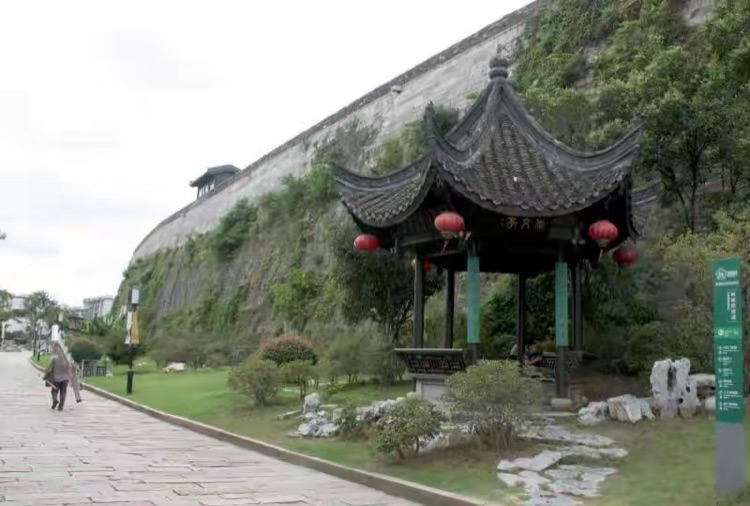

城牆根下的崇文亭，崇文講白了就是「讀書做官」，隱約亭內有人讀書，一扛梯工人走過，口中唸唸有詞，不讀書就要做活，不做活就沒得飯吃。

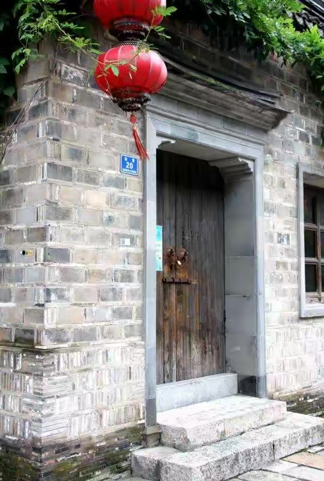

邊營20號，舊木門和鐵門環上的漆剝落了，門前的石台階和石門檻做的非常正規，門檻有防水、防盜的作用。兩人姻緣不門當戶對時，通常會說一方家的門檻高。

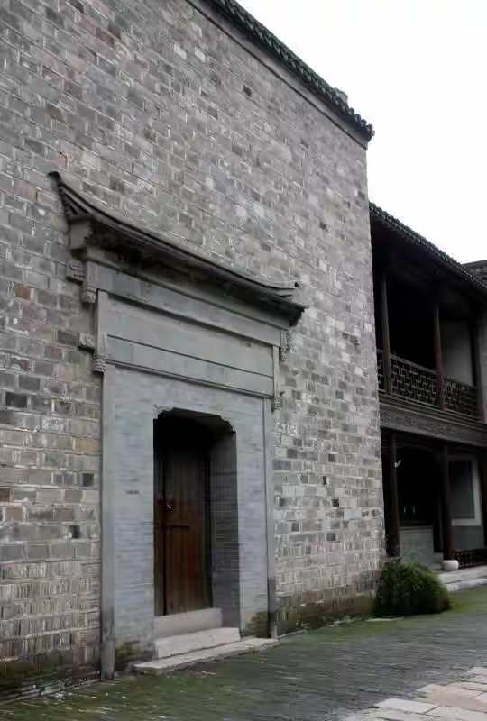

沿街的外牆，哪怕是二層樓，也不開窗，注重隱私權絕對高於陽光權。也有人解釋為防盜，這樣安全性好，只要保護好大門，外面人衝不進來。

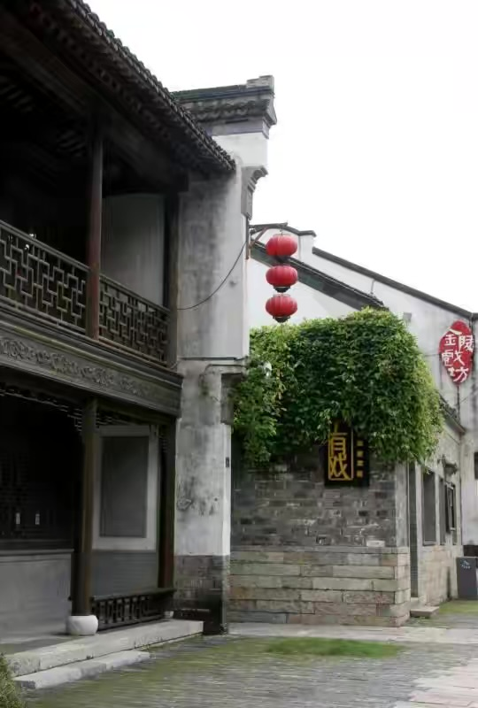

金陵戲坊今晚有好戲，廣告做的好，一語雙關。

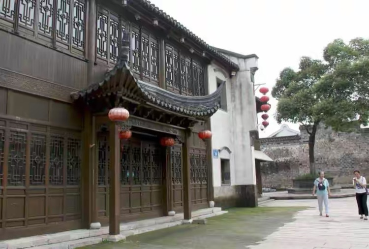

一溜格子門，帶飛簷的是大門。

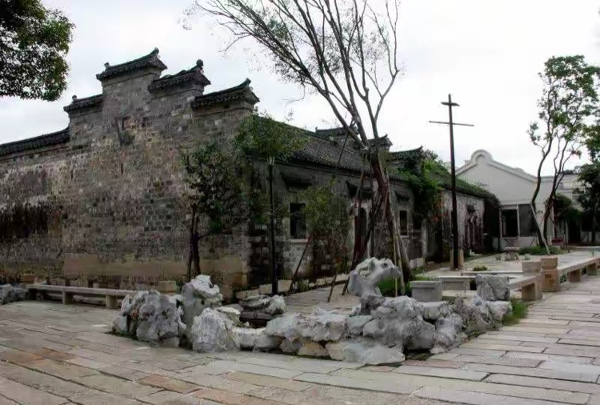

標準的南派「四合院」，城南的民居大都是這格局，前進兩房夾一堂屋，後進也是兩房夾一堂屋，天井兩邊有廂房，後進因隔出一間後廂房，堂屋比前進的堂屋小，但後進佈置有中堂，條案和方桌，可以祭祖。我家以前也有這樣一套四合院，是我媽的外祖父花了很長時間請人一點一點組裝起來，前進和後進的梁柱不一樣，四個大房間的門、窗和地板式樣各不相同，但確實是一套「四合院」。

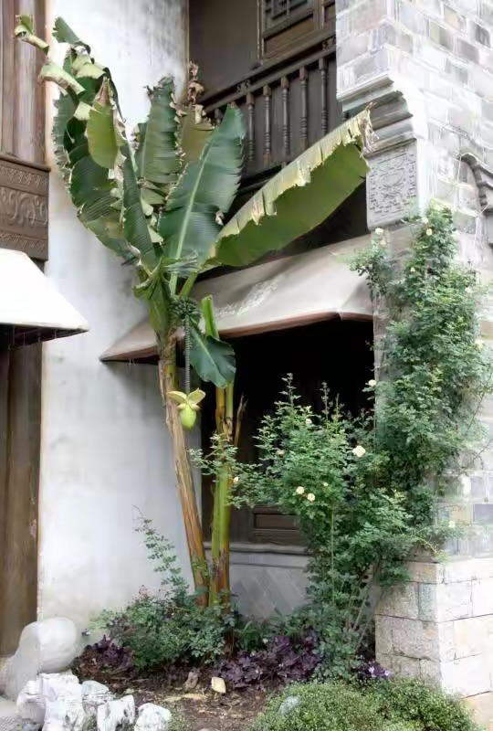

房屋拐角種的芭蕉，結果了，所謂「紅了櫻桃、綠了芭蕉。」

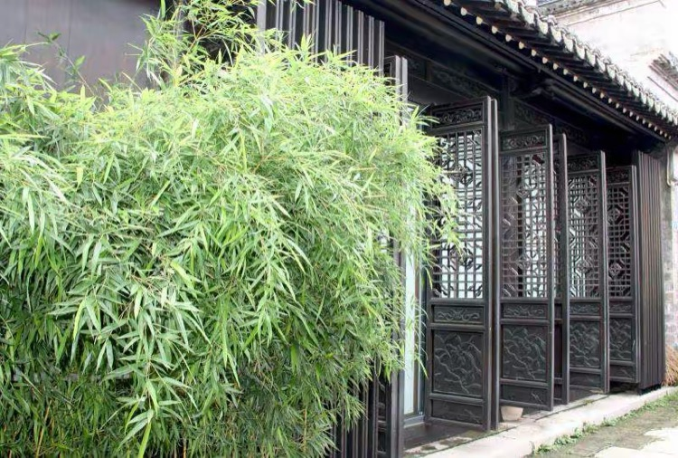

格子門一般出現在內院，出現在巷子邊因該是家店鋪。「可以食無肉、不可居無竹。」

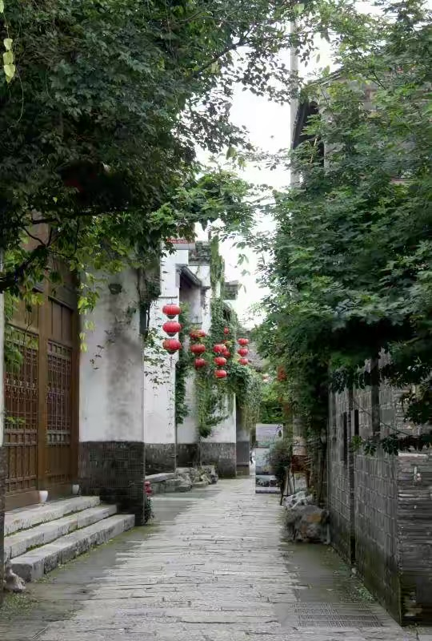

好酒不怕巷子深，如果雨天來，冷風夾著細雨，裹著酒香在巷子穿竄來竄去，誰又能抵得住那種誘惑。

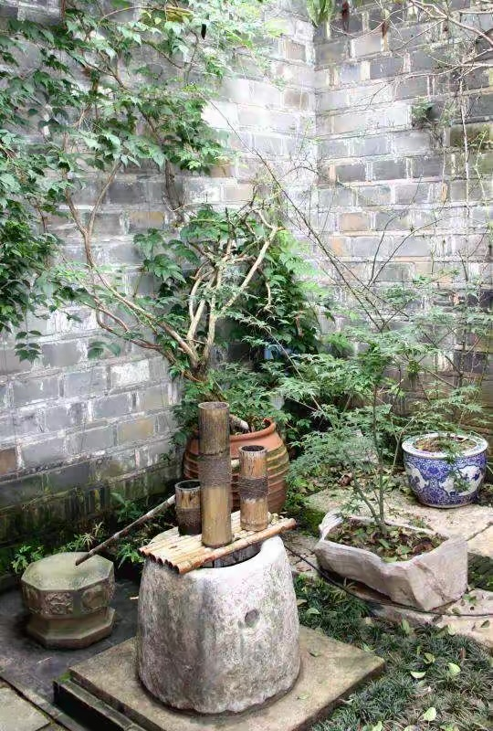

院子裡有一口自家獨用的井，牆角種著盆栽綠植，瓷的、陶的、石頭的、竹子的。看似平常，卻隱藏美韻。井的意義非凡，有了井，「背井離鄉」只是一種越來越淡的哀愁。

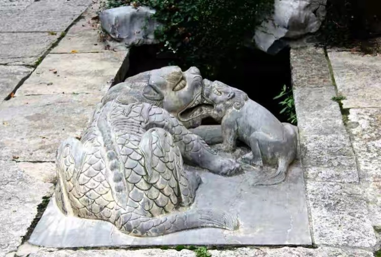

貔貅相傳是龍子，還是最小的龍子，所以生性比較懶惰平時也是挺嗜睡的，它還有一個特點，那就是吃的食物是金銀珠寶，並且只進不出，有招財辟邪之用。

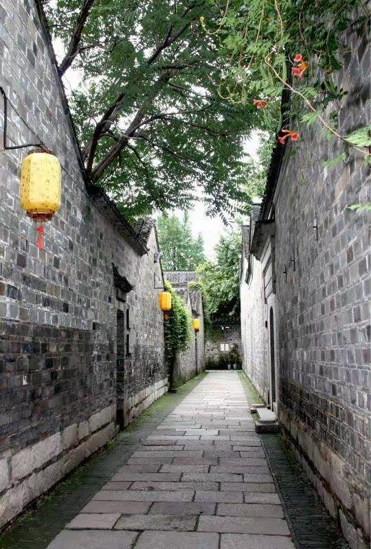

小巷兩邊的房子看似平常，其實不一般，山牆靠地，鋪了兩層石條，房子之間的建這麼寬的巷子很少，再鋪上石板，經濟條件應屬「中產」以上。從側面看，房子有四進，院子開了邊門，而巷子兩邊房子的邊門正好相對，一般情況是親戚，周圍應該是一大家族。

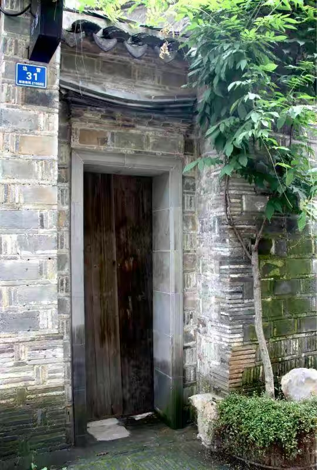

小邊門開在路邊，可能是傭人走的。

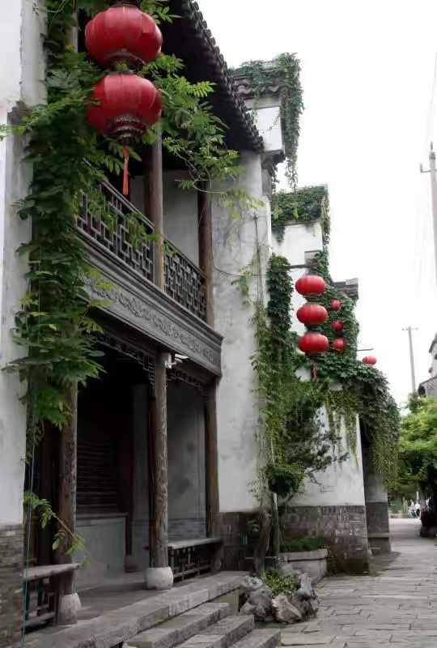

應該是茶館酒樓的門面，門口站一跑堂的，肩上搭一塊毛巾，一邊招呼這路人，「裡面請」。

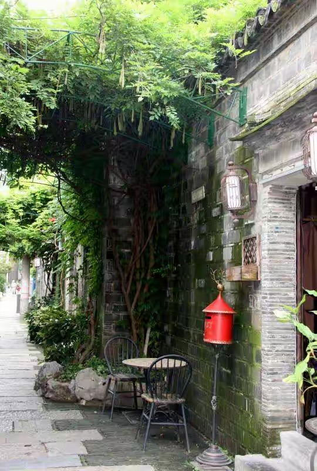

綠植覆蓋的過街涼棚，門口擺放桌椅，有點近代的氣息，擺個造型，喝點咖啡。

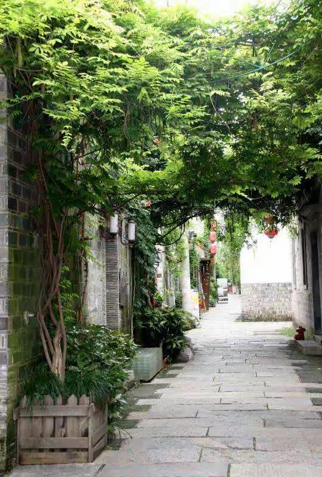

門前的簡易花台，小巷內比比皆是。

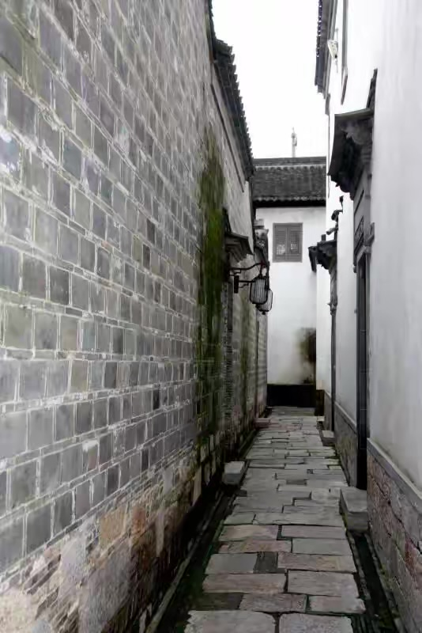

巷內相互錯開的邊門，路邊牆角的排水溝。

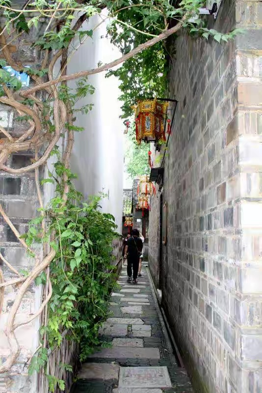

真正的一人巷，拍個行人，比比好像也就只能走一人哎。

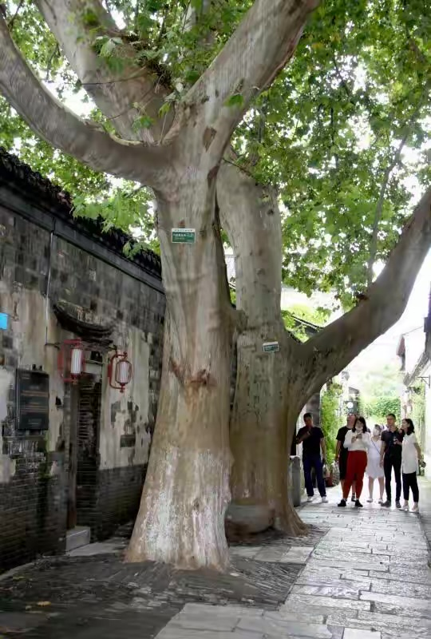

樹前有一標識牌寫明：樹齡95年，南京園林局，2015年立牌。算算今年正好100年了！

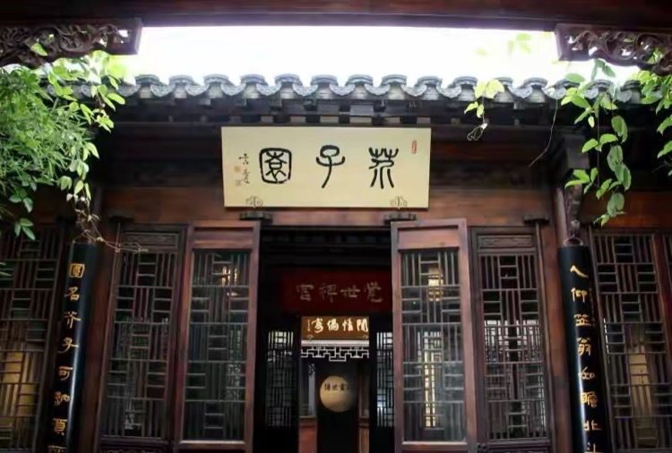

六十年代末期，我還是個小學生，一次在同學家裡偶然發現了一本毛邊紙裝訂的《芥子園畫譜》，當時想借閱回家臨摹，同學家長不同意，一生想當畫家的夢想就此破滅。

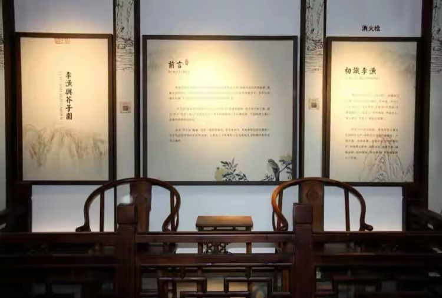

《芥子園畫譜》刻骨銘心，魂繞夢牽五十多年。真的假的，在三條營偶遇了。芥子園在南京老門東？以前怎麼不知道？

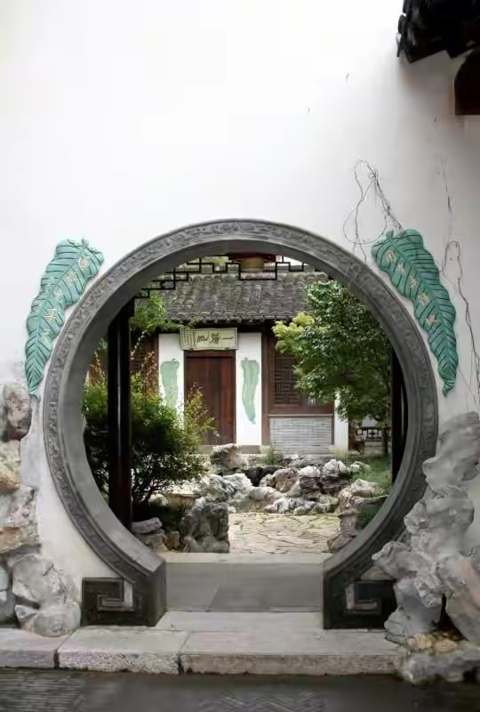

芥子園是清初名士李漁的居宅別墅。李漁從杭州移家金陵，先居住於金陵閘附近，後來於康熙七年營造了芥子園。

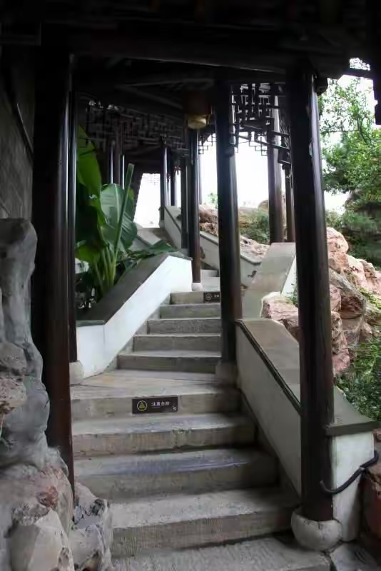

芥子園雖不及三畝，但經李漁苦心經營，達到「壺中天地」的意境。據考證，芥子園的原址，在江寧路西側老虎頭與晉時周處的子隱堂相鄰（現存「周處讀書檯」石門樓）。

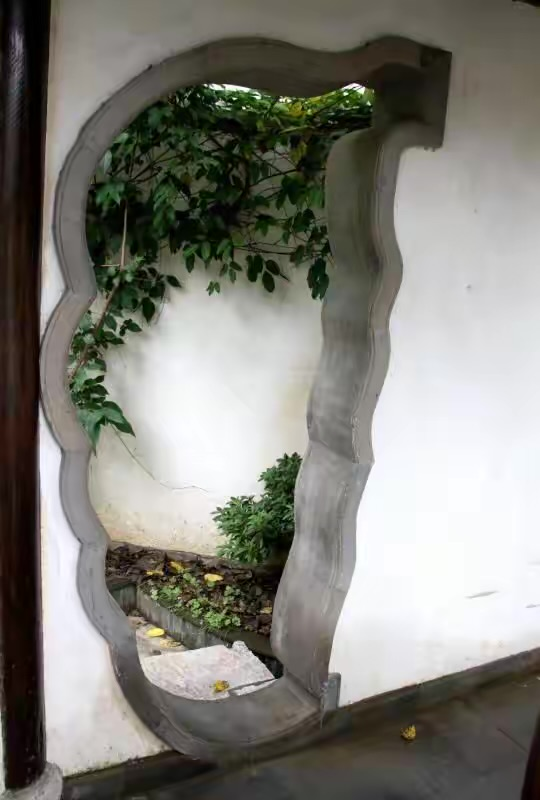

現復建的芥子園位於老門東三條營，園林佔地約2400平米。

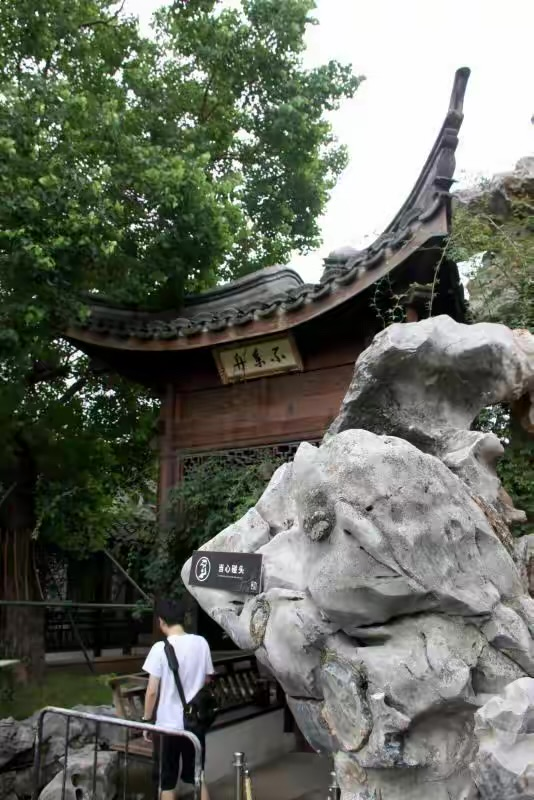

由東南大學園林專家設計重建，憑李漁《閒情偶寄》及其它相關文字記載還原當年風貌，於2016年5月動工，2017年底建成。

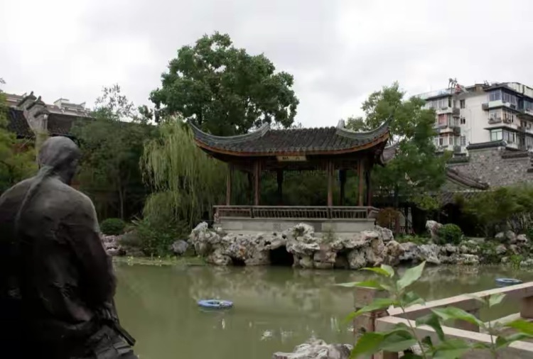

李漁這樣解釋自己的園林美學：「有石不可無水，有水不可無山，有山有水，不可無笠翁息釣歸休之地，遂營此窟以居之，是此山原為像設。」在園林中出現人物（園主）雕塑，是我國園林史上的一次標新立異的重大突破。

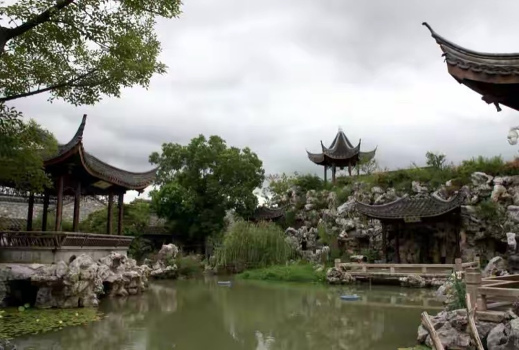

內園為芥子園核心部分。按江南園林明清名居風格，參照李漁造園美學觀點荷塘，假山，亭榭，長廊，瀑布疏密錯落有放，情景交融。建有浮白軒，耒山閣，月榭，歌台諸景及李漁釣魚像，及「丹崖碧水，茂林修竹，鳴禽響瀑，茅屋板橋，凡山居所有之物，無一不備」的假山一座。

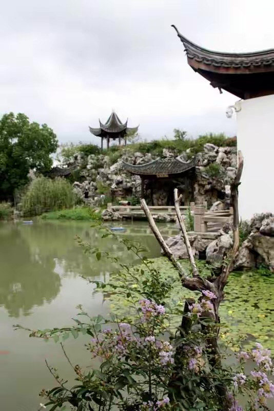

園內有六十多種花木，有李漁的四季命花：春蘭、夏荷、秋海棠、冬臘梅。

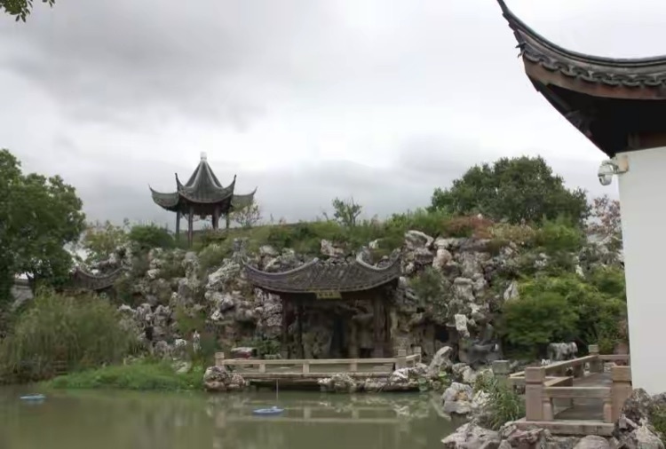

李漁一生沒有做官，也沒有固定職業和收入，生活來源主要是靠別人的饋贈和宴請，以及為別人題聯寫詩的酬勞。

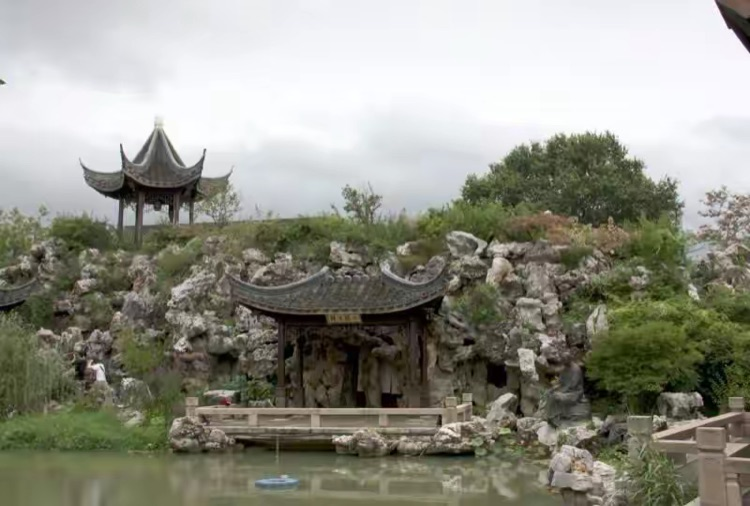

芥子園建好後，李漁組了個家庭戲班四處演出，又開了書鋪印賣圖書，芥子園裡的生活是李漁一生最愜意的日子。

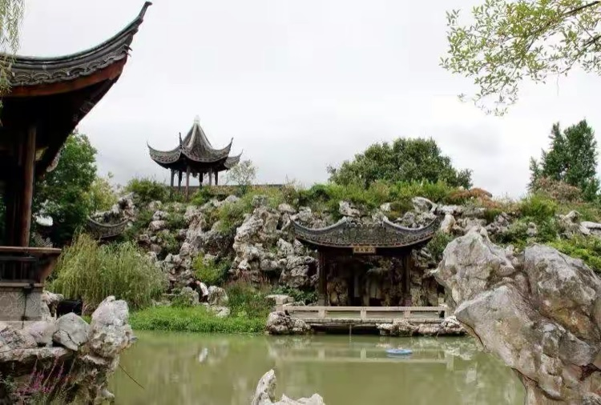

李漁在芥子園完成了《無聲戲》《一家言》《閒情偶寄》等著作，度過了一生中最輝煌的時期。

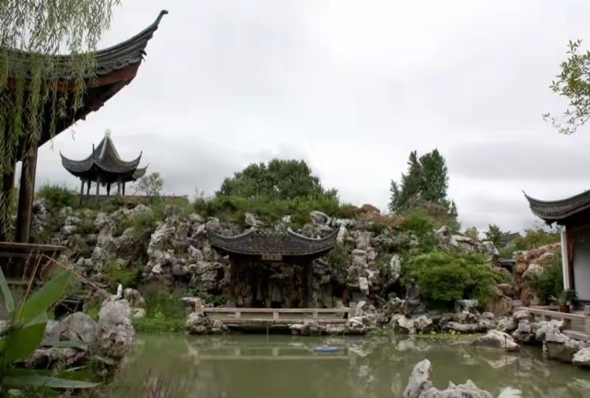

作為一代文化巨匠，李漁畢生從事文化創作、戲曲研究、戲劇活動、繪畫藝術、編輯出版、園林營構、養生休閒、烹調美食等方面的研究。

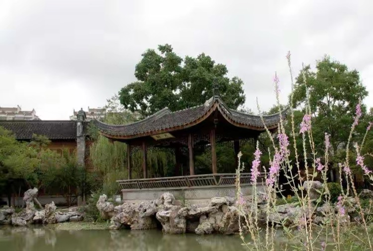

月榭建於荷池之上。登榭觀月，水月渾然相映，清風微拂，心曠神怡，李漁題聯日：「有台即登台，無論春夏秋冬；是風皆入座，不分南北東西。」

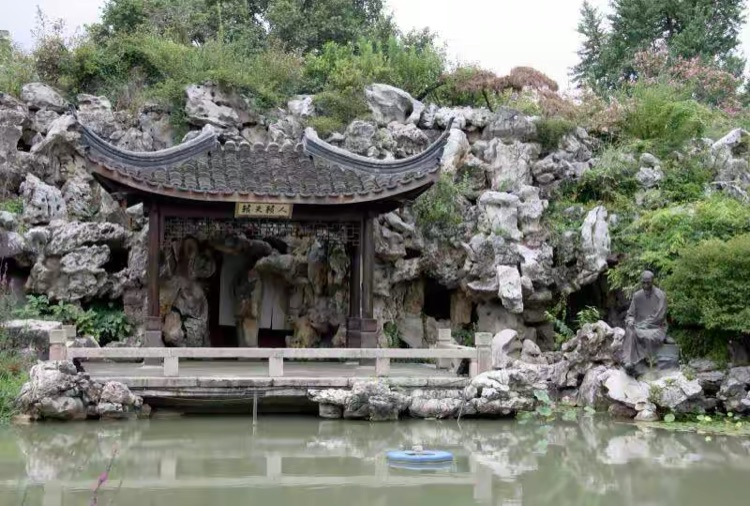

籟：孔穴裡發出的聲音，泛指聲響。現在講天籟之音，形容很美很美的聲音。人籟天籟應該指人唱出自然中最美的聲音。

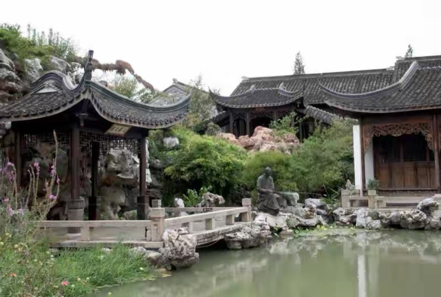

建在小山上的耒山閣，兩邊有爬山廊相連。因芥子園舊址在赤城磯，據記載當時園內景緻多為紅色石頭堆砌，有「丹崖碧水」之美景，耒山閣前的一片紅色山石，就是為了保留原有風貌。

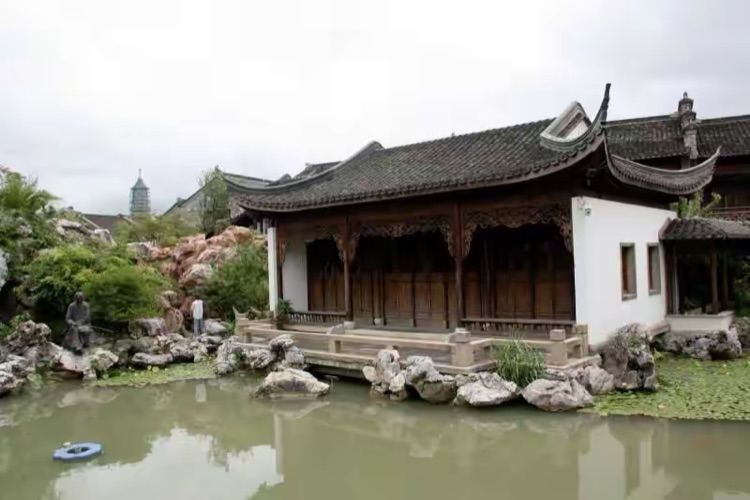

浮白軒，現亦稱滿飲或暢飲酒為浮白。在隔水的歌台對面建一個可以大口喝酒的地方，一邊飲酒、一邊聽戲，這種感覺不說也能體會到非常爽。

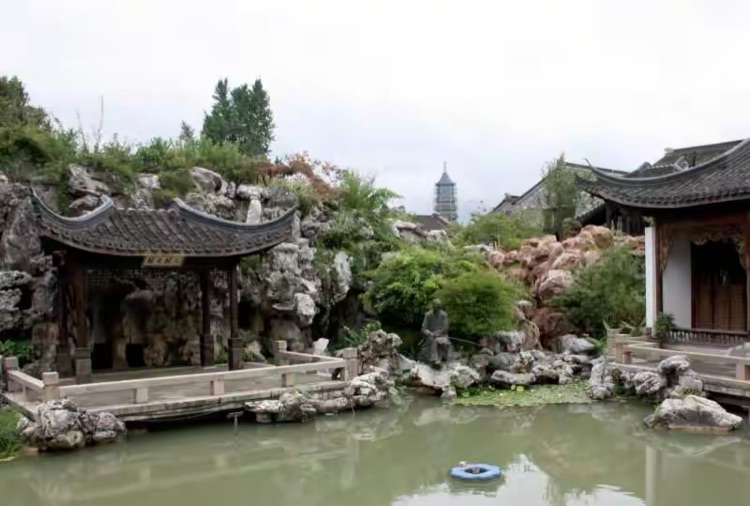

芥子園的西南角可以遠望大報恩寺的寶塔，現在可以看到的是現代（玻璃）的大報恩寺寶塔，當年可以看到的是當年（琉璃）的大報恩寺寶塔。

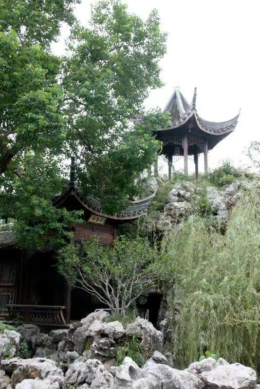

船舫建於岸邊，船首有匾名「不繫舟」，周圍假山環繞，草木掩映。有巧、有妙、有閒、有靜。

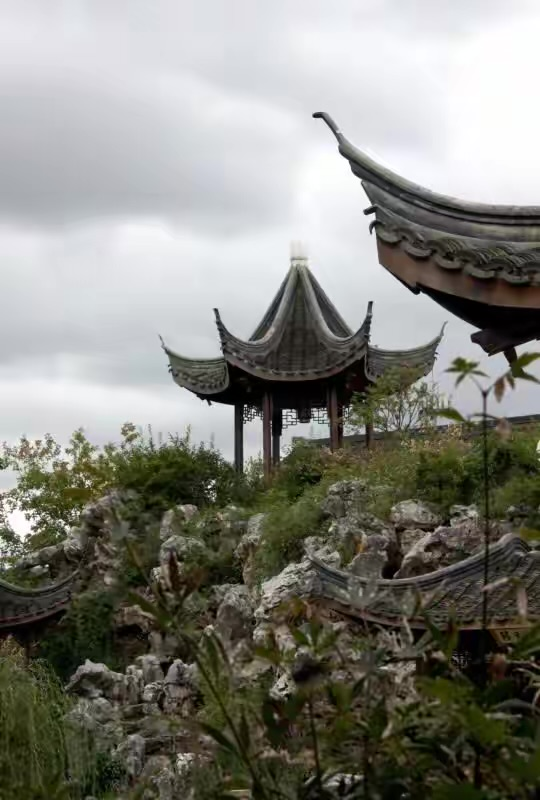

船舫旁的假山，佩蘭亭在頭頂處，「棲雲谷」就在此假山中。李漁題一聯雲：「雨觀瀑布晴觀月，朝聽鳴禽夜聽歌。」

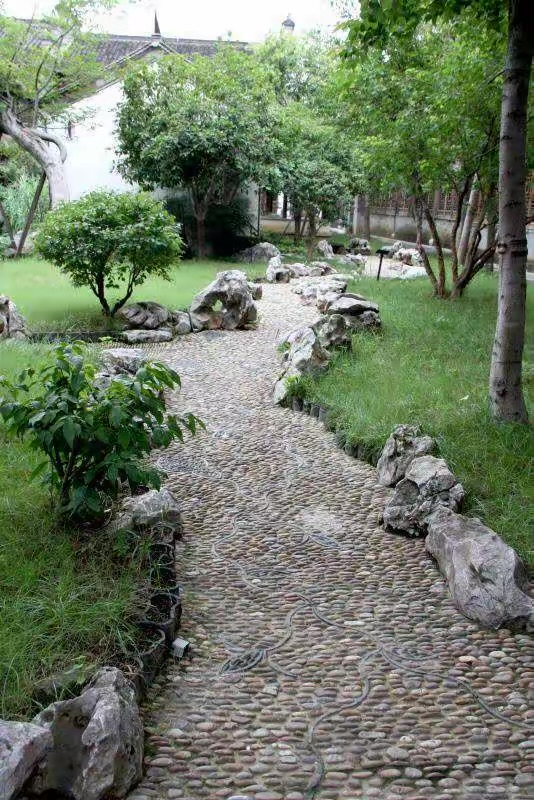

園子裡鵝卵石鋪的小路，瓦片在其中隔出花草圖形，太湖石做的路沿，格外顯得尊貴自然。

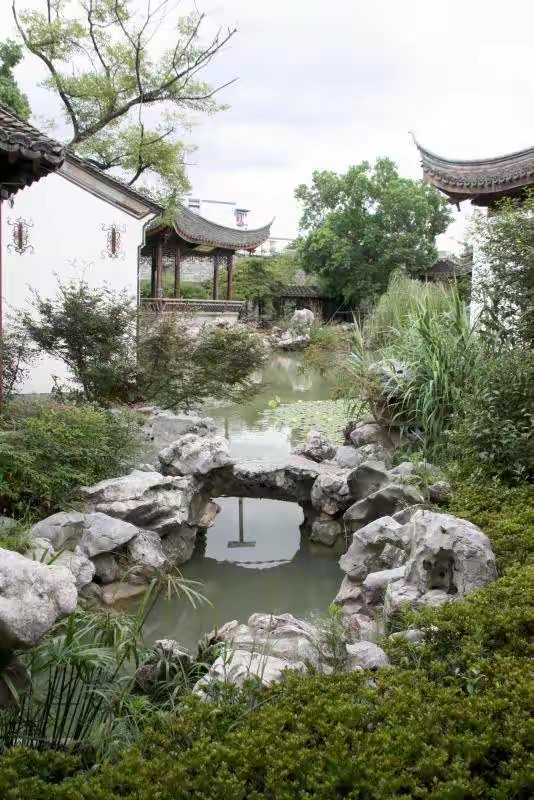

從園內的一角向裡看也是那麼處處精緻，可謂設計者用心良苦。

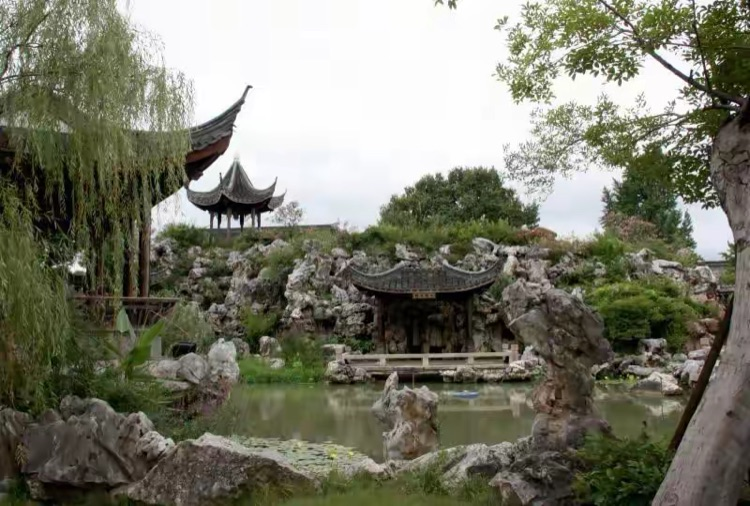

園名芥子，言其極小。佛教有言，須彌藏芥子，芥子納須彌。須彌，為佛教理念中的諸山之王，其高無比。園名芥子，就含有園子雖小、有容乃大的哲理。

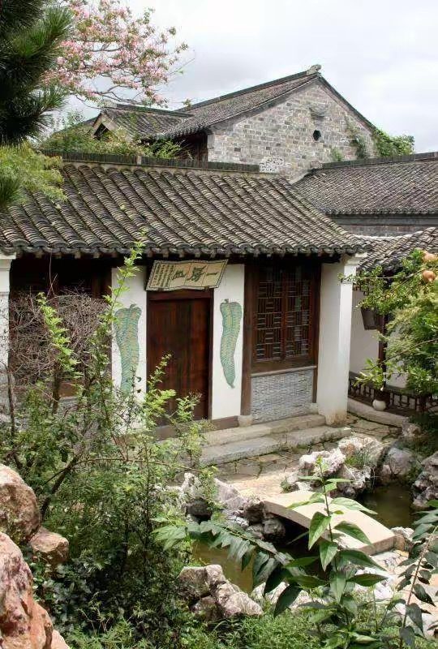

李漁創建了芥子園，芥子園同時成就了李漁的夢想。
