流徽，琴的別稱，也可指流傳的好名聲。

<!--more-->

流徽榭位於南京鍾山風景名勝區內，在中山陵至靈谷寺公路的南邊。三面臨水，碧水如鏡，水榭倒映，意境幽然，是中山陵紀念性建築之一。

水榭是南京本地人的叫法，如果只提水榭二字一定是指中山陵的流徽榭，流徽榭因流徽湖而得此雅名，流徽湖卻因流徽榭而聞名金陵。流徽湖是中山陵整體建築的一部分，修建中山陵時，一位高人講中山陵缺水，於是在中山陵東南方的山下，築壩修了兩個湖，南邊大的叫流徽湖。

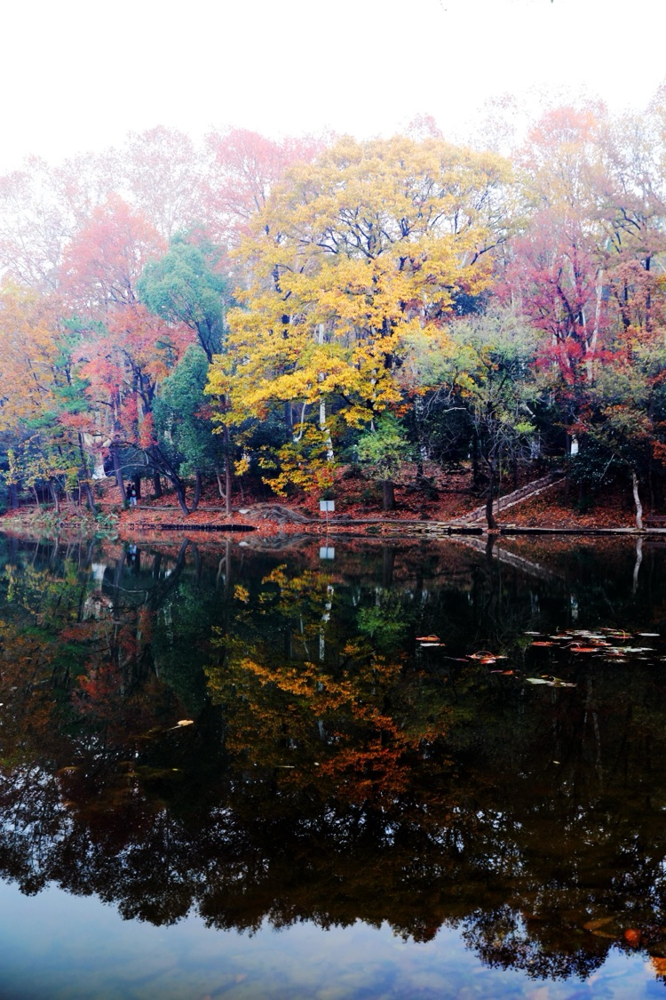

樹木環抱的流徽湖，秋冬時節更顯五彩繽紛。

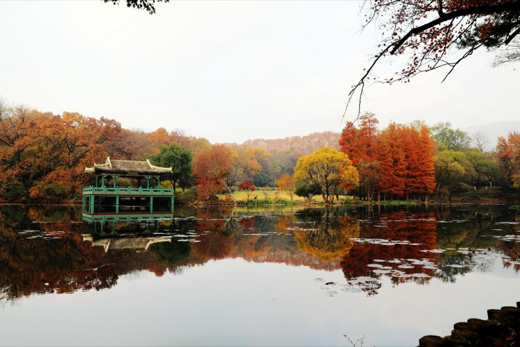

1932年，為籌建一座中山陵園內的紀念性建築，中央陸軍軍官學校（前身為黃埔軍校）捐款2萬元在流徽湖邊建了流徽榭，從此流徽榭成了流徽湖的點睛之作，終是熠熠閃光。1985年，黃埔軍校一期的徐向前元帥親自為流徽榭題寫了匾額。

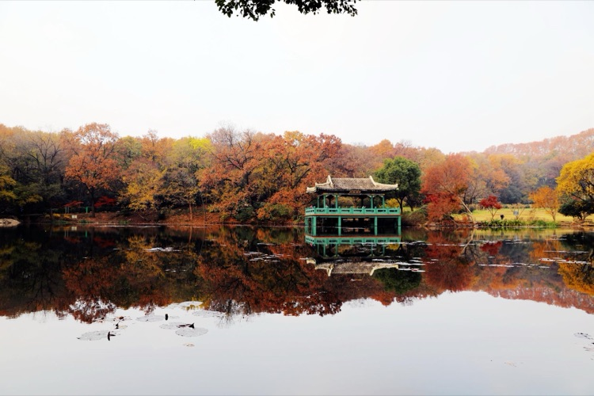

流徽榭景區的面積不大，水域面積僅二十餘畝，西面的草坪約二十畝。北面，鍾山如屏；四周，樹木環抱。俯瞰，好似一枚銅鏡落在鍾山南麓，又如一塊翡翠鑲嵌在林海間。偶遇陰雨，嵐氣低鎖、山景朦朧、水面如綢；天若放晴，藍天作幕、白雲浮玉、池水清碧。每每至此，必緩緩繞水一週、然後於水榭內小憩，賞一賞景、發一發呆、靜一靜心。

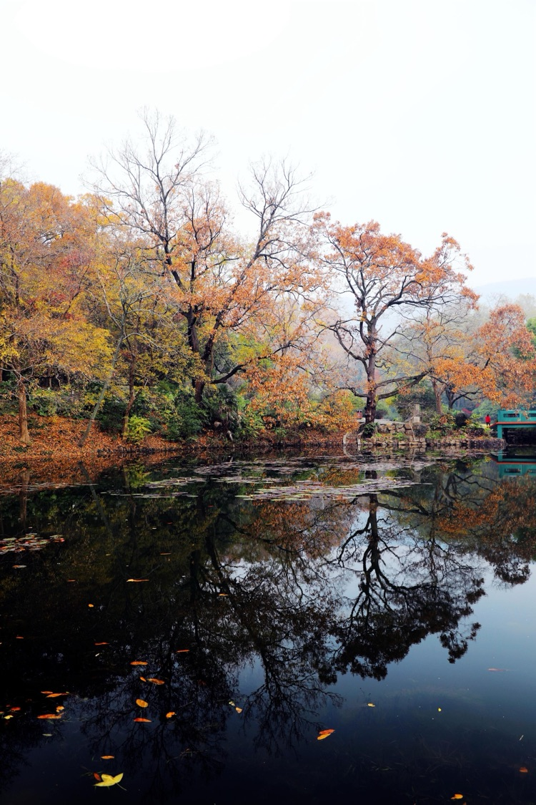

落葉後，樹的風骨歷歷在目。

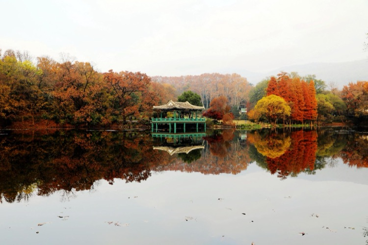

秋末冬初，當你穿過長長的石板小徑，踏著被風翻動過的落葉，姍姍來到流徽榭，就一定會被這裡的景色所驚豔，這無疑是最美的、觸及靈魂的一次邂逅。此季節也是流徽榭景色最美的日子，背後的山和山邊的樹，眼前的湖水和湖水中的雲，流徽榭和她的倒影彷彿已融化在山水之間。乳白色的琉璃瓦頂，藍綠的立柱和圍欄，在樹木五彩繽紛簇擁中，流徽榭透露出一種超自然的神秘，悄悄的舒緩著每一個到訪者的心境，讓天地人靜靜的合一。

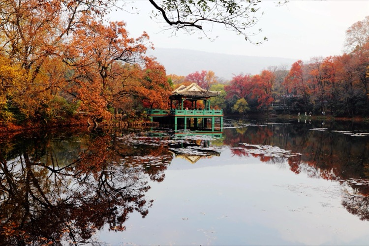

在秋冬以前的季節，大多的樹葉都是「一色」的青，嚴嚴實實幾乎不見樹枝，而秋風開始一片一片吹落樹葉後，彎彎曲曲的樹枝就漸漸顯露出來，儘管樹上還有許多葉沒有被吹落，樹枝本來也沒有色彩，半遮半掩中，卻能見樹枝的造型也很妖嬈。空中的樹枝和水裡的倒影扭著同樣曲線，有開有合，畫面動感十足。在紅葉和黃葉的襯托下，散發出更深層次的成熟和熱情。

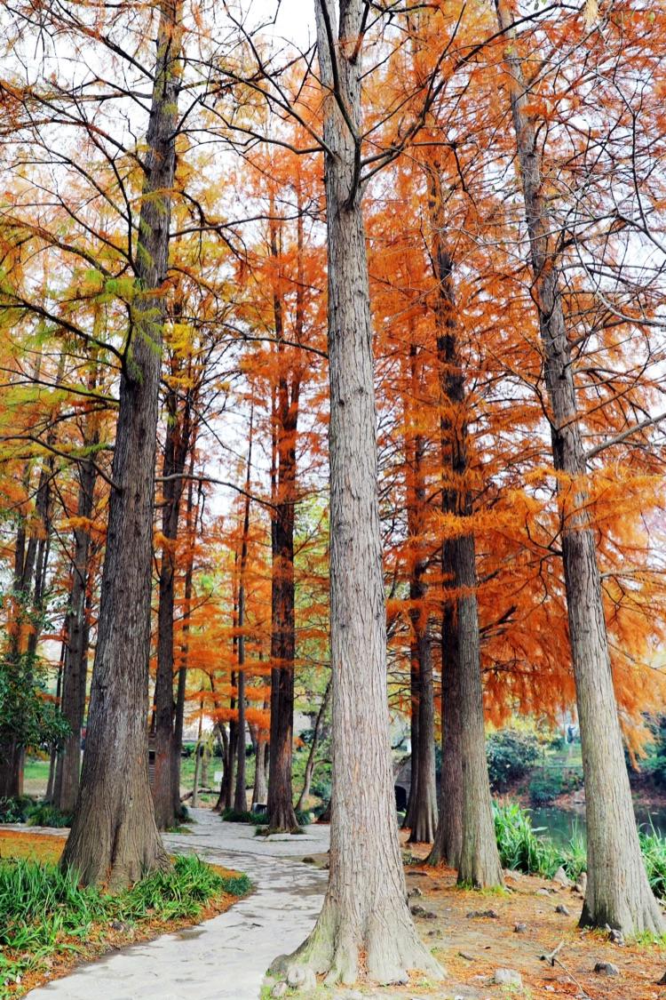

林中彎彎的小路，直接與筆直高大的落羽杉形成強烈的視覺衝擊，往往使人不假思索的步入其間。

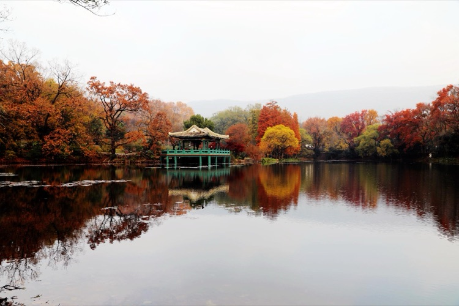

每種樹的葉子都有自已特有的顏色，到了秋天它們就開始變化，環顧四周，有青色、黃色和紅色，它們自然搭配、相互融和，組合各種美妙圖案。側面看去，似層層疊疊，正面端詳，又姿態各異。重疊時，好像你中有我，分開時，又各顯其妙。入冬以後葉開始大量的落下，但它們始終還保持著秋天的色彩，無論是散在地上，還是又被風吹聚在一起，在沒有被泥土埋沒前依然優雅靚麗。

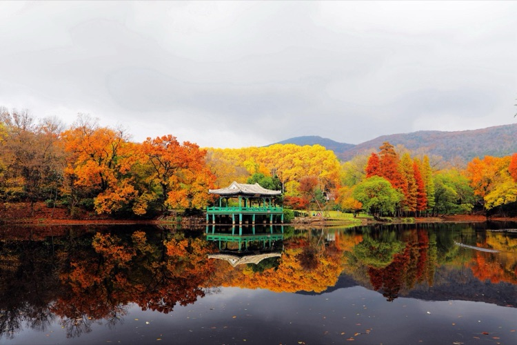

我們能看見物體，是因為物體上有光，我們感覺到具象是物體的影。這張流徽榭拍攝於兩年前的一箇中午，說來有點偶然，下了一夜的雨，到上午九十點鐘才停，天上烏雲依舊翻滾，臨近中午，空中好不容易才出現一條縫隙，一束陽光從天上斜照下來，正好落在流徽榭背後的梧桐樹林上，一般情況下，梧桐樹林由於離流徽榭較遠，不是發灰就是模糊，而那天的陽光恰恰補足了光，對梧桐樹林做了一次特別的強調，拍出的色彩和清晰度都與以往大相逕庭，極其驚豔。應了那句老話，陽光落在誰的頭上，誰就走運。

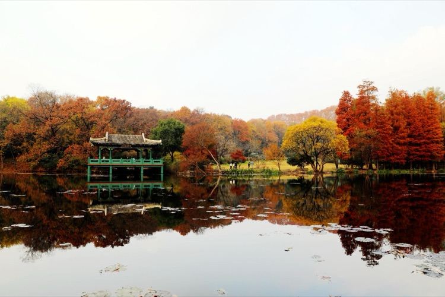

沒有風的時候，水面恰如平鏡，在流徽榭的倒影中，甚至連水榭頂上琉璃瓦的紋路都看得清清楚楚，流徽榭背後及周圍的樹，簇擁著流徽榭更加立體，彷佛要將流徽榭直接推送到你眼前，而流徽榭身後的樹極有分寸的跟隨在左右，主僕嚴明。水面還產生一種對稱的美，雖然一個是實，而另一個是虛。

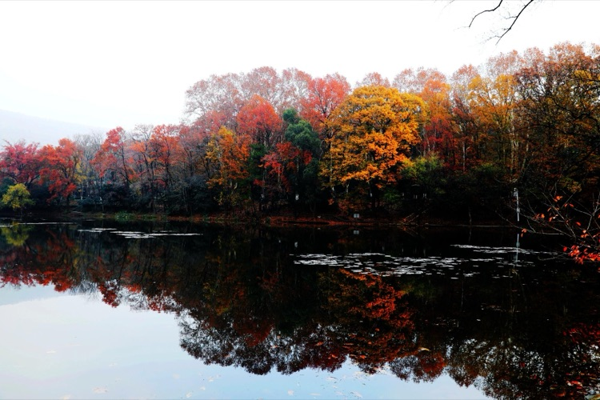

岸邊的樹經過多年的風雨，明白瞭如何讓自已最美的一面呈現在世人的面前，天空中的光恰如其分的照過來，該亮的地方亮，該暗的地方暗，突出想讓你必須看見的美，隱藏了一些不想讓你知道瑕疵。

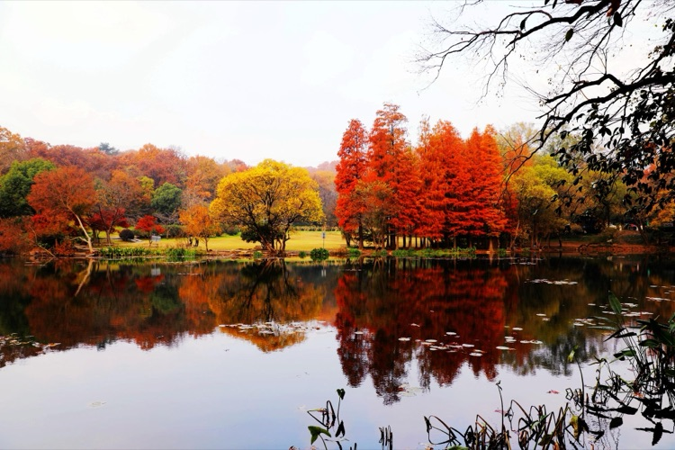

對岸那片金色就是流徽榭景區最最低調的草坪，只能在樹的間隙中看見它，岸邊的樹也確實太奪人眼球，紅紅筆直的落羽杉、黃黃彎曲的烏桕、還有綠綠的常青樹，誰都不會在意那平淡無奇的草坪。其實走到近前你就會發現，這塊草坪才是最舒適愜意的地方，在陽光充沛的時候，草坪無處不見那種低調的奢華。有人用小車拖來帳篷，隨後漫不經心的支起摺疊桌椅喝茶聊天；有成群結隊幼兒園的孩子，在老師的帶領下興奮的做遊戲；有人乾脆躺平在草地上，閉眼享受陽光；還有人放飛了無人機，用上帝之眼在欣賞流徽湖和流徽榭。

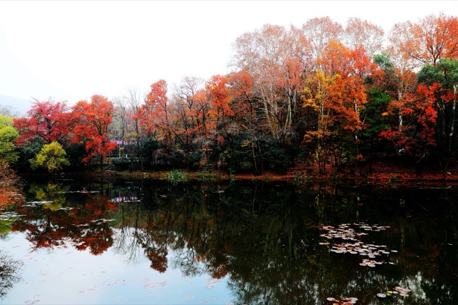

流徽榭名字裡就寓意著「流傳的好名聲」，這裡的山山水水、草草木木都充滿綿綿的詩情畫意，沉澱著許許多多浪漫的愛情故事，多少人因故奔走他鄉，回來後還是要再去流徽榭走走，尋覓那完全沒有開始，卻終身難忘的青澀愛戀。
