明朝的時候，莫愁湖是中山王徐達私家花園。小區因為門口就有一路公交車直達莫愁湖，鄰居們戲稱莫愁湖差不多成了小區的後花園。只要天不下雨下雪，說走就去了莫愁湖。對於莫愁湖內許多著名的景點，通常也能如數家珍，於是眾人又去一些邊邊角角的地方，尋一些不太引人注意的場景，似乎要找出一些耐人尋味的東西，這也許是一種無奈的有趣。

<!--more-->

這是莫愁湖的地標建築，水院迴廊的外牆和江天小閣。去過的人都知道這是莫愁湖，多少年來，去莫愁湖遊玩的人都會以此為背景留下照片。莫愁湖公園也在此角度設下了「最佳攝影點」的標記，只是背影中的樓盤和前景中的遊船，透露的商業氣氛過濃，不如以前那種原始的自然清秀。

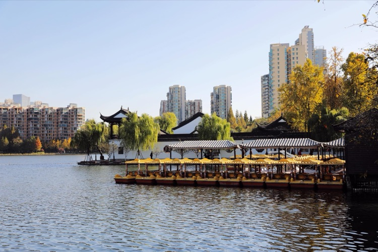

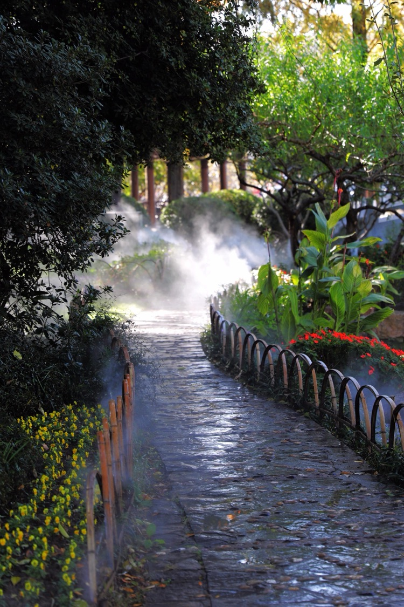

從楹聯長廊通往二水亭的一條小徑，不知什麼時候裝了噴霧裝置，間隙的噴出水霧，宛如仙境，路邊的草叢中還有音響，播放著愉快的輕音樂，竹製的護欄裡面開著不知名的小花，有一種即像在公園、又像在自家小區稀鬆平常的感覺。

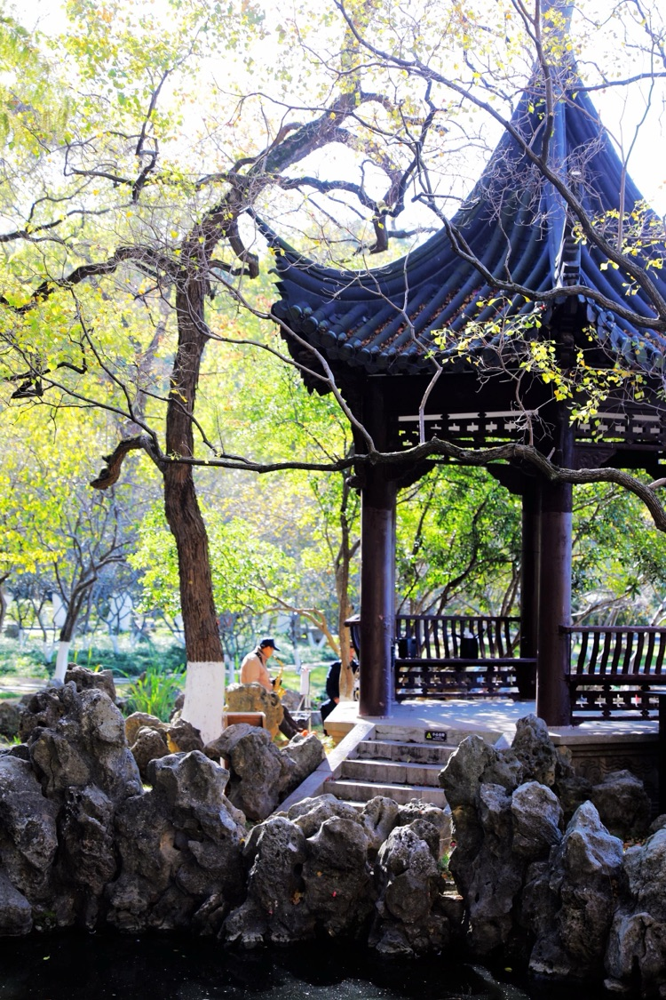

二水亭內星星點點撒滿陽光，一老者坐在亭邊自信的吹著沙克斯，悠揚的音樂傳的很遠很遠，那是一種態度，自我享受著過往的人生，儘管在別人眼裡非常的普通。

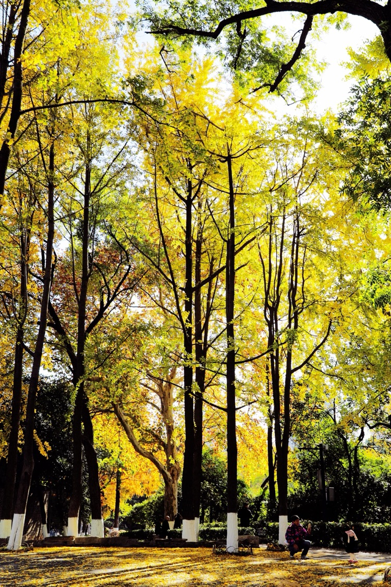

莫愁湖的又一最佳景點——銀杏林，以前每次路過這裡也沒看出什麼特別的，一般匆匆而過，這次終於明白了，要在秋末冬初的時候來，銀杏黃了，在早晨的陽光中，一切顯得那麼透明，彷佛陽光都能照進人心，周圍的一切都讓人感到輕鬆愉快。老人撿起一片銀杏葉，告訴孩子，什麼叫「落葉歸根」。地上的黃葉層層疊疊，先堆成一堆，再拋向天空，孩子興奮的任由樹葉飄到他臉上，一次又一次充滿愛意的碰撞。

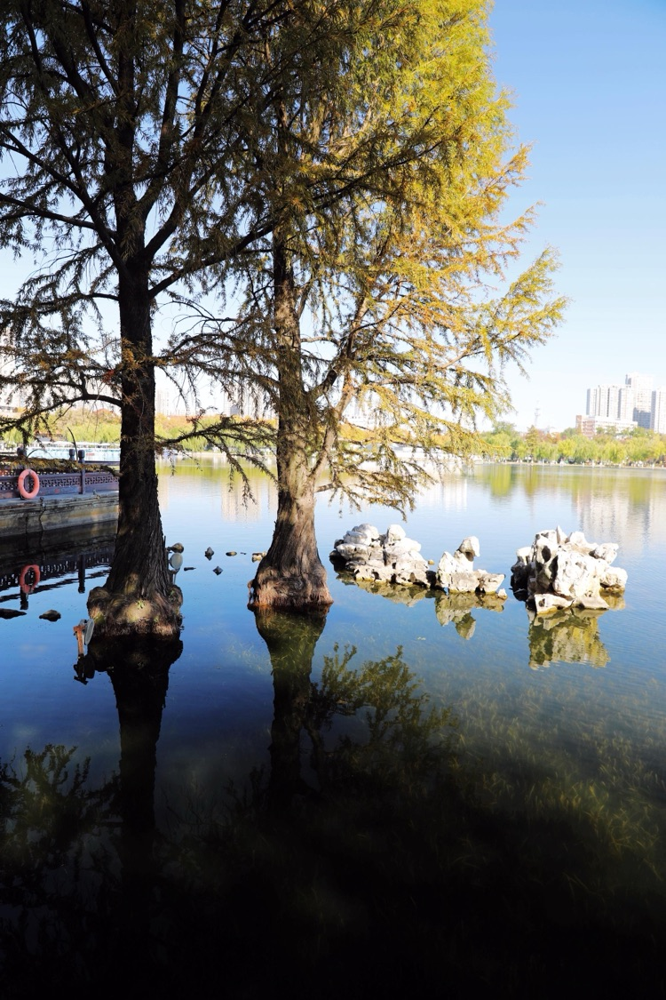

抱月樓旁邊的落羽杉，從小就生長在水裡，和水裡的水草一道生長。只不過水草長到水面就不長了，而落羽杉還在不停的長，一旁的石頭默默作證。水上的一半是樹身，水裡的一半是倒影，最粗的地方恰恰是水平面。陽光照過來，落羽杉一半金黃，一半暗綠。

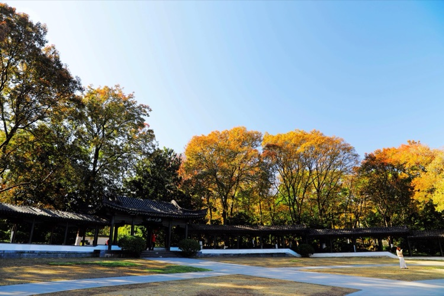

抱月樓前的廣場建有半圓形的長廊，正中書有「抱月吟風」。意在有風經過時，嘯聲如吟，幻化出的一首首詩。氣魄之大，極浪漫誇張，恰似古代的詩聖詩仙，絕非是喝了幾碗女兒紅就隨口賦出來的那種意境。

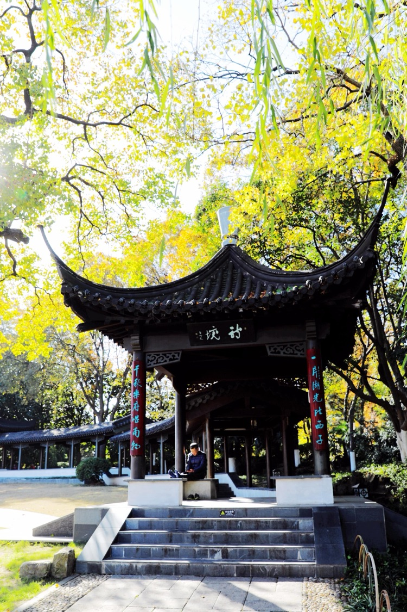

長廊的盡頭掛著「詩境」，恰有一人在晨讀，陽光照在頭頂，安靜又溫馨。想必在此「詩境」中，無論是讀詩還是寫詩，都會有事半功倍的效果。南京門西的胡家花園有一條迴廊，門頭寫有「覓句」的字樣，寫不出詩文的時候來此走走，或許就能尋到想要的句子，所謂「山窮水復疑無路，柳暗花明又一村」。

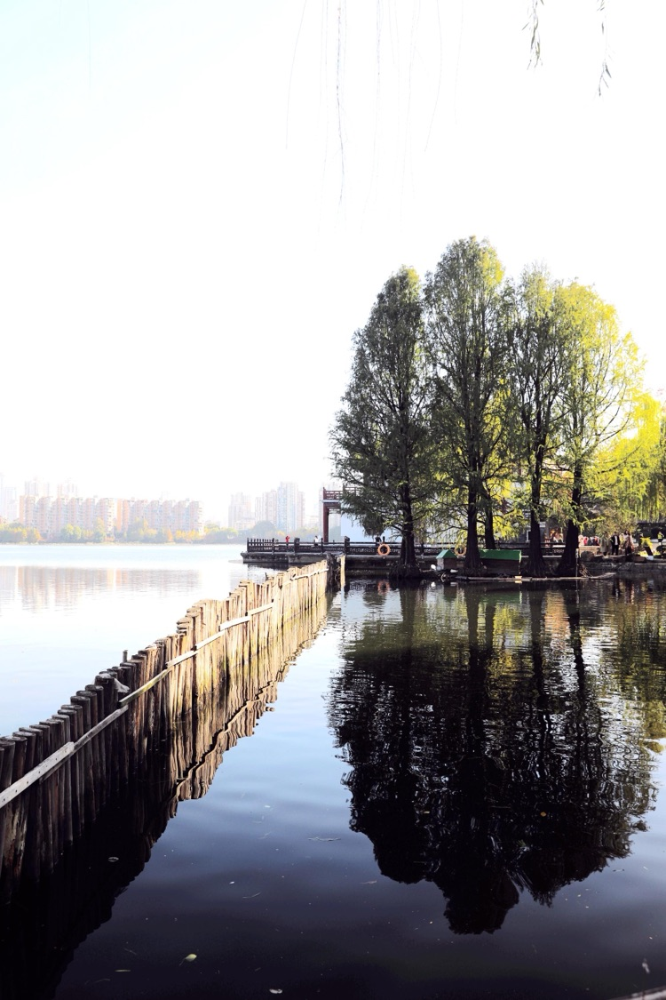

抱月樓的西側木欄柵圍著一片水面，在這風雅之地突然冒出一塊鄉野氣息的世外桃源，僅僅是要防止水禽逃逸？其實不然，從這個角度看去，桃源也只在一念之間，想像中就應該是這樣。

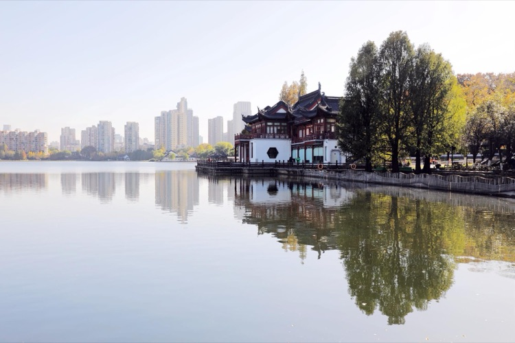

鏡頭稍偏一點，落羽杉又依附了抱月樓，樓影和樹影幾乎淡化了木欄柵的存在，景色依舊回到尋古訪幽的氛圍。

隔湖再望抱月樓，氣勢之大確有依湖擁光的姿態，白天抱日，晚上抱月。

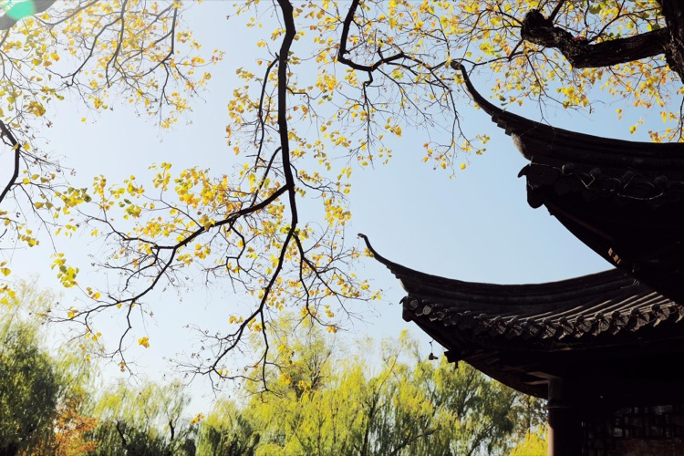

鳶尾園烏桕樹開始落葉，水榭的飛簷迎著枝上的黃葉。只是不想去拍落在水裡和地上的黃葉，那場景有點讓人不忍。

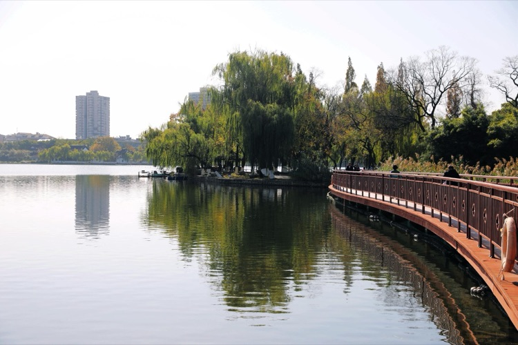

出了鳶尾園，要經過一座鋼管做護欄的橋，橋身塗著暗紅色的油漆，以前來來回回不知走過多少次，總覺得它不好看，不值得看。這次在橋的東邊，猛然一回頭，發現那「S」形的橋身和水中的倒影與周圍的景色竟自然的融合在一起，好像也那麼恰如其分。

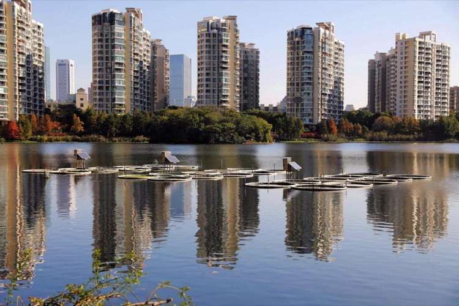

湖中整齊的排列著一些網箱，還配了太陽能電源，不知道是做什麼用的。與樓盤的倒影相輔相成，也算一種看不明白的風景。

沒見過莫愁湖的划艇訓練，感覺這划艇在水裡一定能劃得飛快，嗤的一聲就可能劃到了對岸，可惜今天怎麼沒人划艇。

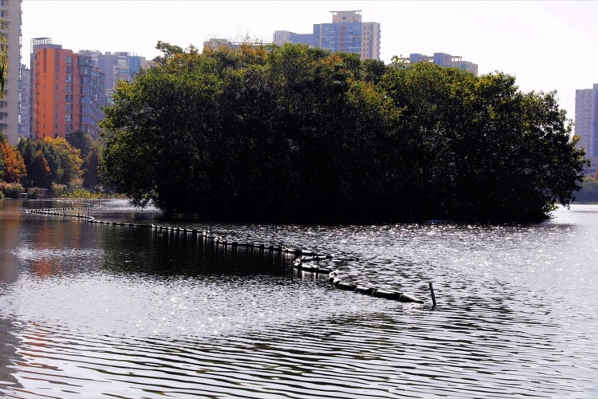

湖裡的阻攔網被水衝的彎彎曲曲，浮標在陽光的照射下發出耀眼的光芒，宛如巨大的不明生物。同一湖面有的地方是星星點點閃著光，有的地方晃動的是水波紋。真的是「同天不同命」，在同一陽光下，耀眼的程度卻各有所異。

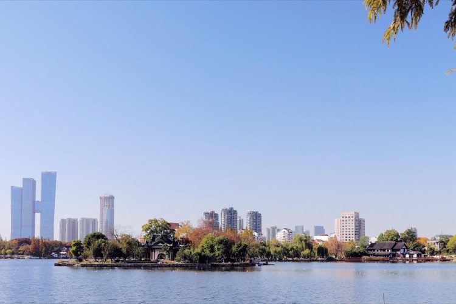

湖心亭也有秀麗的一面，只不過不輕易示人罷了。獨立湖中，在四周背景的襯映下，即表達了季節，也表達了時代。

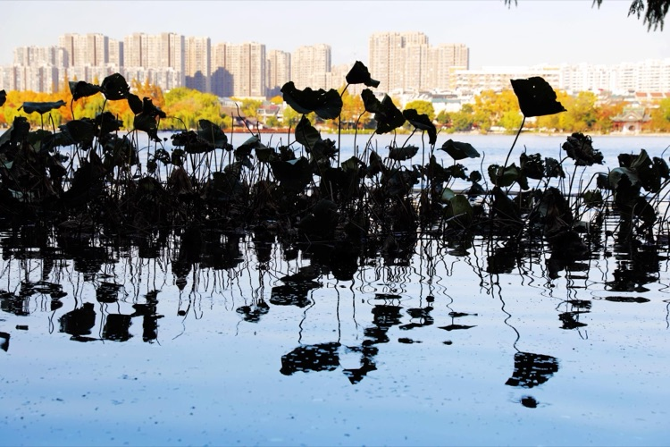

岸邊的荷葉，在水中妖嬈了大半年的時間，這次以剪影示人，據說還是受遊客的影響。

詩曰：   即以背影傾天下

何必轉身亂芳華
