南京人都會講一句話：「不要煩了」。我考證了一下，這是老南京話，流傳了好幾百年羅，譯成文言文就是「莫愁」。

<!--more-->

提到莫愁你馬上會想到莫愁湖、莫愁女。當然要看莫愁女肯定要去莫愁湖，莫愁湖公園裡有莫愁女故居，還有南京人認為最美的莫愁女石像。

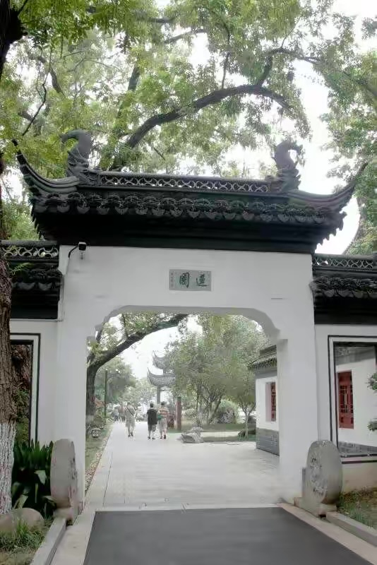

繞過假山，就見蓮園的門。

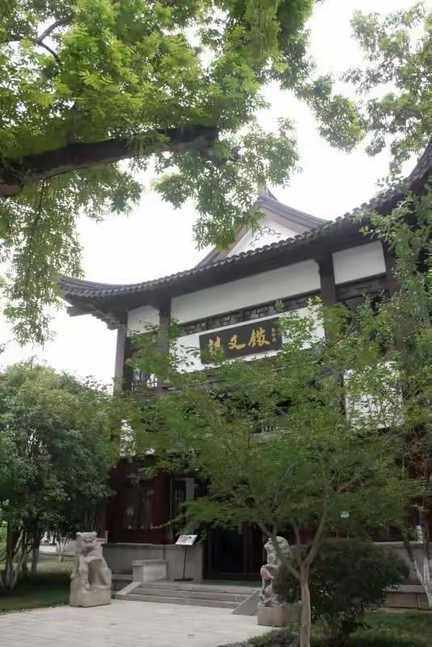

進門右手原來是食堂，現在重建了叫「棋文館」，這間館子不能吃飯，僅作文化事。

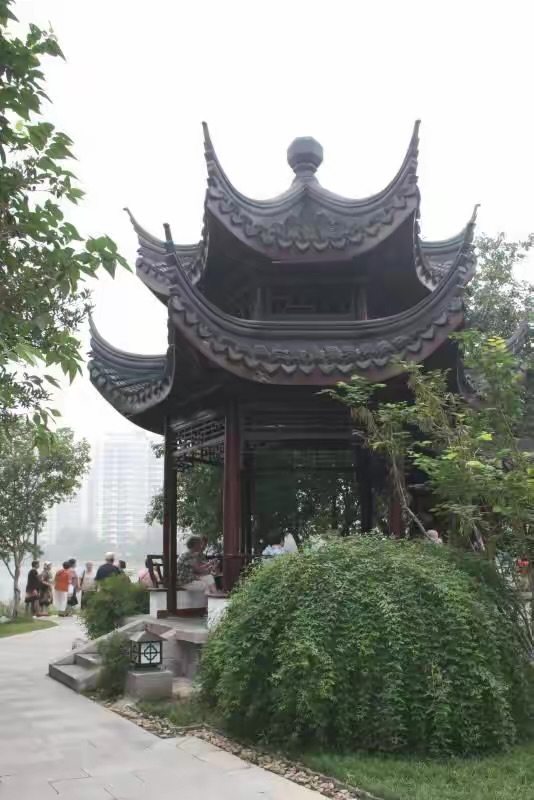

臨湖有一座白鷺亭，因靠公園大門近，人特別多。

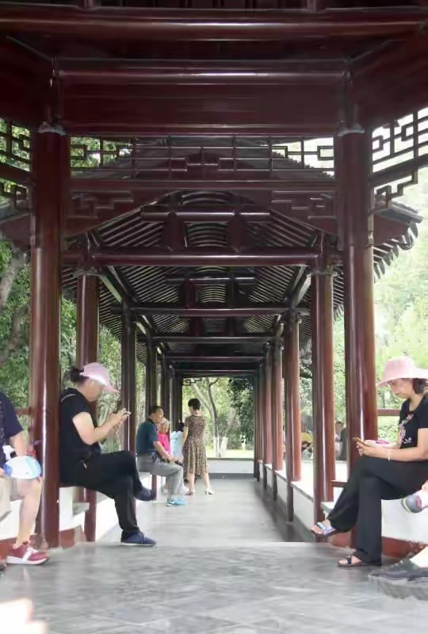

亭的後面連著長廊，幾經曲折，裡面藏有大乾坤。

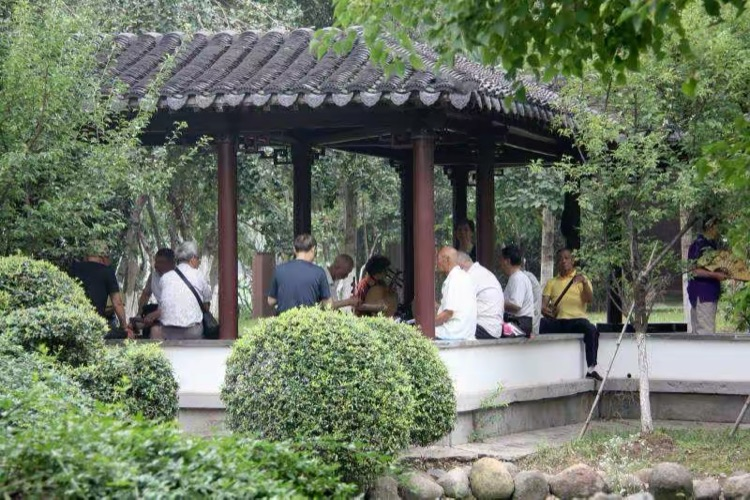

一些傳統京戲的票友長年聚集在此，有拉胡琴的，彈月琴的，有打板的，有敲鼓的，當然，唱戲的角兒是必不可少的，而且一招一勢有板有眼，一開腔那一哥一姐立馬見分曉，坐次鐵定。

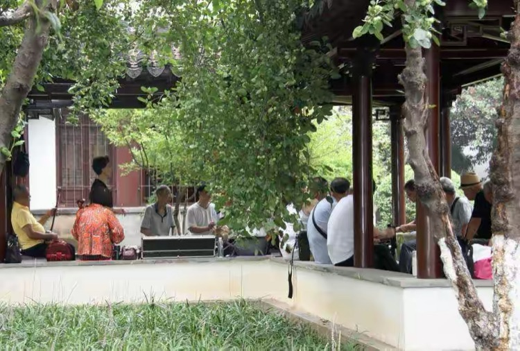

除了8個樣榜戲，傳統京劇能聽出戲名的為數甚微，不過琴聲的高低，鼓點的緩急，到是能聽出一二來，琴師鼓手如抬人幫襯，那唱的角才叫舒坦。那一嗓子喊出去中間換了口氣，沒人聽出，上不去的地方，琴聲響著呢。

沿湖有環湖綠道，且綠樹成蔭，走不多遠就有一處景點可以歇腳，湖面涼風陣陣，約一二朋友同遊，豈不快哉。

門頭上寫著「遠香」，進去就是著名的勝棋樓。

勝棋樓前有一非亭非廊的建築，暫且稱之為棚，虛心向桌前酣戰的年長者求教，長者亮聲答到：這桌是摜蛋，旁邊那桌是鬥地主。

南京城排不上名次，都是退休職工。

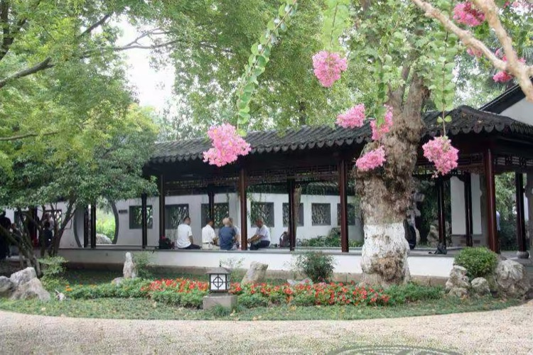

樹上垂下的花是紫薇，其實我也不認識，樹上掛著標牌，這點公園做的很好。內有長廊，老人三五成群，聊天敘舊，每人茶水自備，包裡可能還有點心水果，這就是退下後的休閒生活。

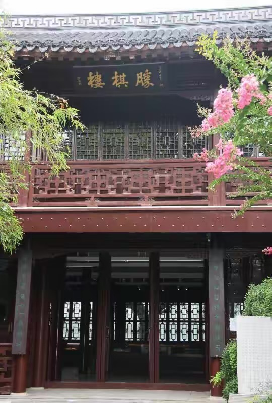

明太祖朱元璋賞賜給徐達的樓，據說樓內還擺著當時的棋譜，徐達用棋子擺出萬歲兩字，太祖一高興，連樓一起送了，現在想想其實是留給南京人民一處好玩有說道的地方。

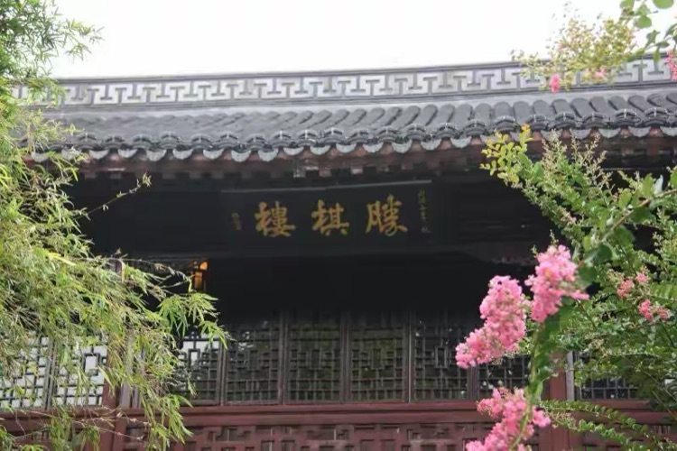

勝棋樓匾額為清代狀元梅啟照書寫。

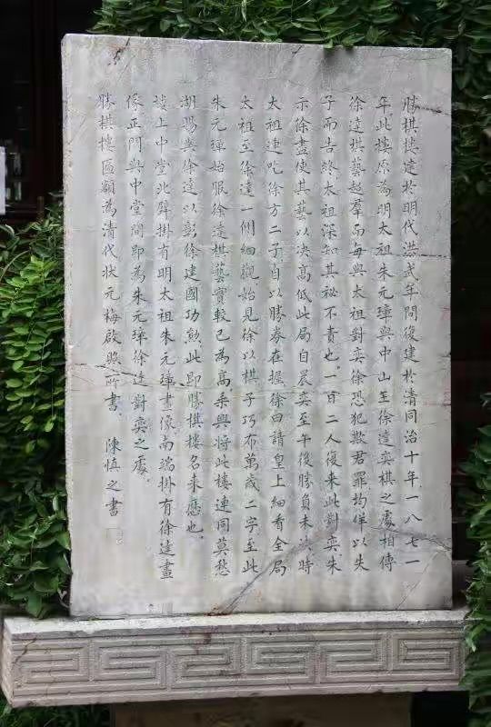

立碑記載賞樓之事。

詩曰

退休鬥地主，無聊來摜蛋。

輸了是皇帝，贏了窮開心。

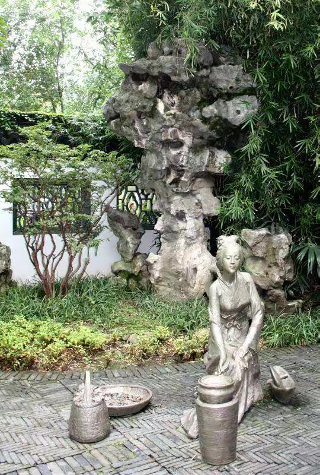

按照傳說中莫愁女採藥、製藥、熬藥的故事製作的塑像。

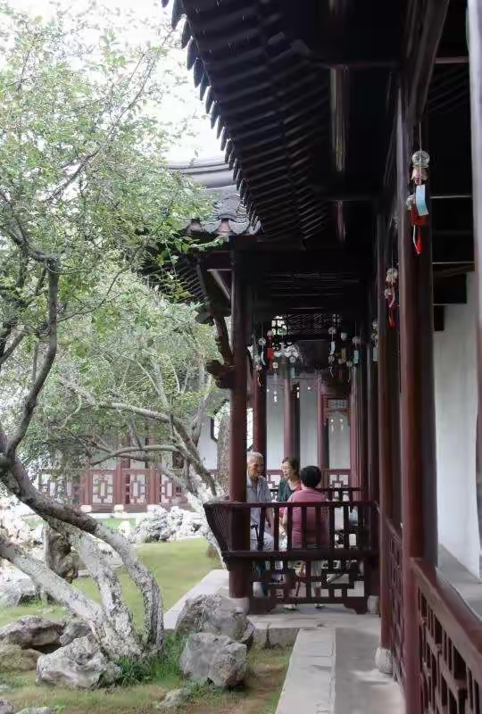

迴廊中聊天休閒的老人，公園裡空氣清新，心情舒暢。

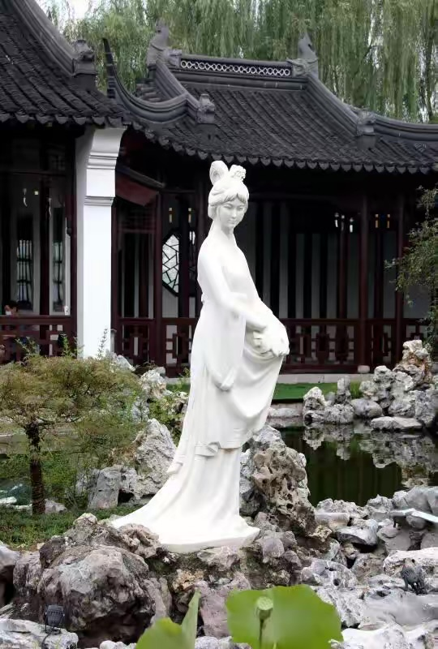

1979年秋在石磯上置漢白玉莫愁女雕像，像高2.1米，重2噸，作採桑歸來狀。莫愁女的故事有多種版本，但她是大美女絕對沒人否定。

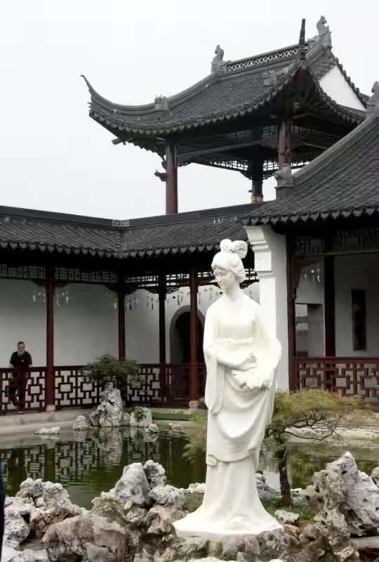

攝影老師講過，每個人都有最美的拍攝角度，都可以拍成俊男靚女，攝影師都要善於去發現最佳角度。

還有神態，那是生命賦予個體的精氣神，雕像的神態己被大師定格在這塊漢白玉本身，全方位，多角度拍攝，一定能發現和理解大師及那個時代對美麗善良的註釋和表達。

池中錦鯉戲嘻撒歡，在水中造出一個個旋渦，廊上的透窗映射在水面上泛著神秘的黑白條紋。

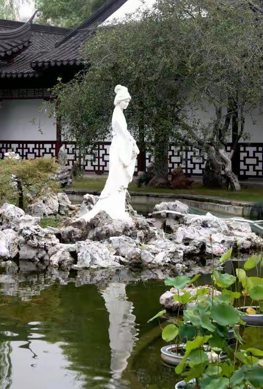

魚兒製造的水波紋使莫愁女的倒影變得模糊不清，象舤，象迪拜的七星酒店。這種彎若新月之美，為古人所推宗。

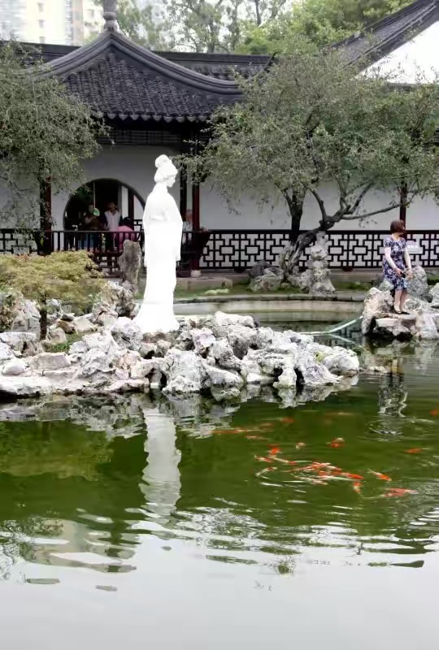

你看著我，我看著鏡頭。背景是自己選的，選擇肯定有自身的道理。

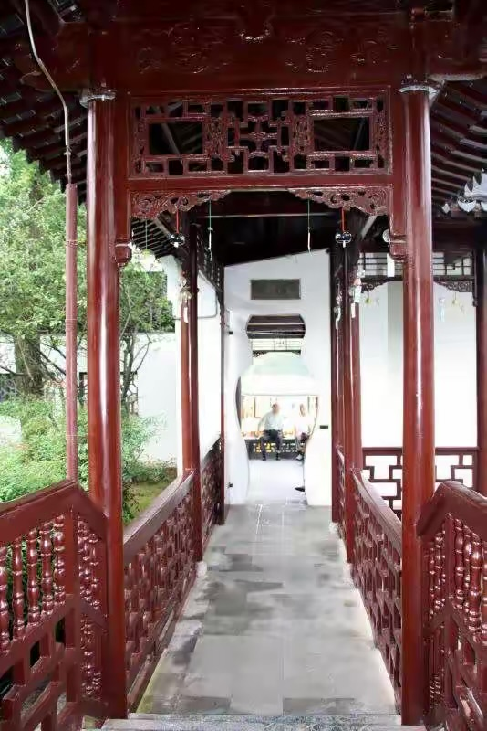

長廊盡頭的花瓶門外坐著兩老人，遠處是泊在碼頭的遊船。

光華亭內我看是公園裡最精緻的風景，人物多、情景多。

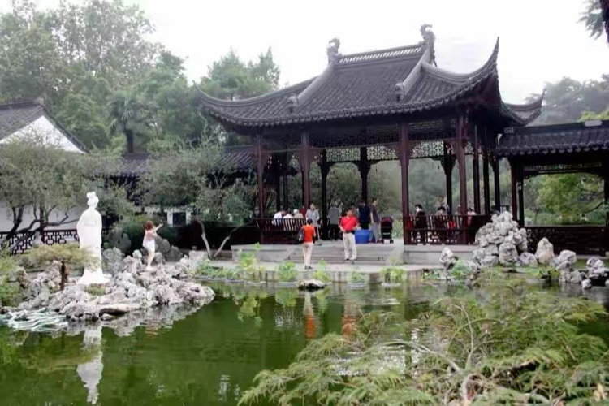

手機發明後正對莫愁女是拍照，背對莫愁女還是拍照，弄得善良的莫愁女只能保持著優雅的姿勢，一動不動，任君拍照。

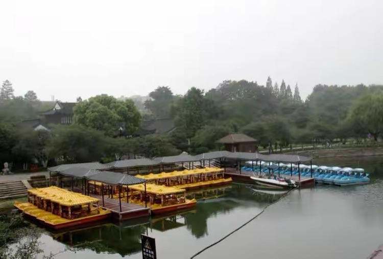

遊船出租暫未開始，停泊在碼頭煞是好看。出於環保都改用電驅，但我覺得不能親手劃的船真的還有樂趣嗎？

水中映著倒影，白牆上開著數扇透窗，頂頭二樓上立著四方亭，再加上跟前飄著幾絲柳枝，這才是莫愁湖公園的標誌性風景，這就是莫愁湖。

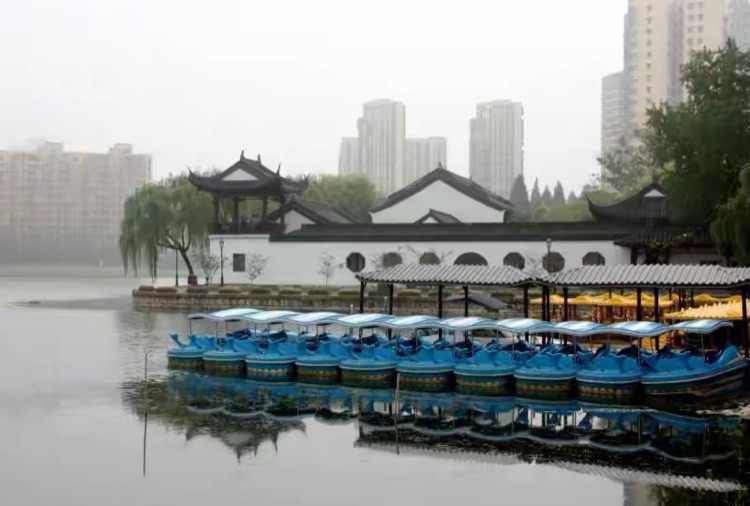

要不是天陰遠處有點虛，背景中的高樓真有點喧賓奪主，好好一幅園林秀色，被房地產商當樓盤景觀給增值賣了。

碑亭，紀念北閥戰爭。

沿湖的長廊，亭接廊，廊連亭。湖邊時時涼風透過，隨處停，隨處歇，走走歇歇，邊走邊看，只為自我創造一個慢，象詩人說的，讓天黑的慢一點。

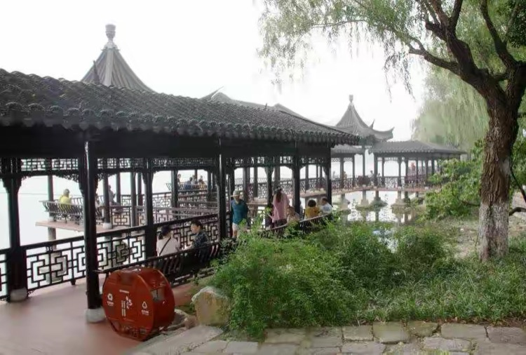

真真感到漫步就應該是漫無目的散步，讓思緒隨《莫愁啊莫愁》的歌聲發呆。

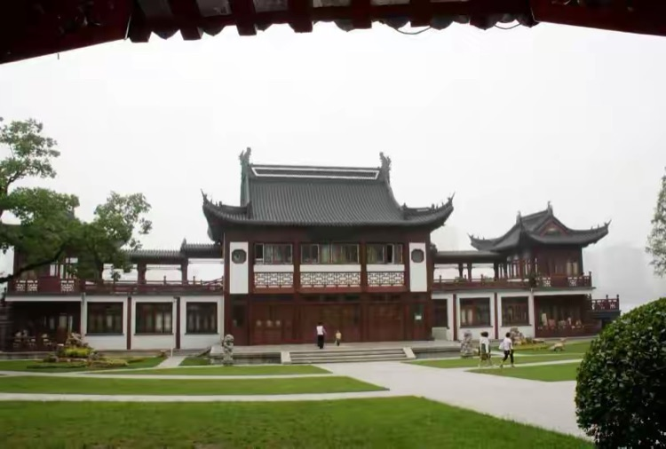

抱月樓，也是莫愁湖的標誌性建築，一樓的大平台以前常有文藝演出，或放露天電影，二樓開過茶樓，可以喝茶。人就這麼怪，當年羨慕別人在樓上喝茶時身上沒錢，現在有錢了，又問自己為什麼非要在這裡喝茶。

除非發生了什麼事？遇到了什麼人？如果今天在莫愁湖真的遇到了多年不見的老朋友，肯定找個最近的茶樓喝茶了。

抱月樓正面的圓弧形坡地上建起了抱月長廊，與抱月樓遙相呼應，遠看近觀都近乎天人合一。

望著滿坡的綠蔭，忽然想起二十多年前，莫愁湖公園辦自貢燈展，每天晚有十多萬人湧入公園觀燈，幾天下來，凡能站三四個人的空地，幾乎寸草不生，平地一寸土，每晚還是那麼多人，散場時出來的人都是灰頭土臉，但仍然興高彩烈。

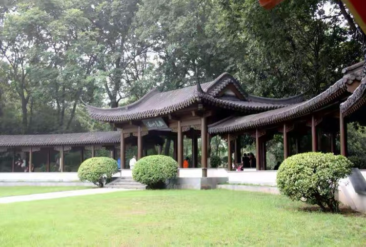

抱月吟風亭下一群打扇舞的南京大媽，化著妝，穿著古代服裝，看我拿相機過去，異樣的看著我，心虛，一直沒敢拍。

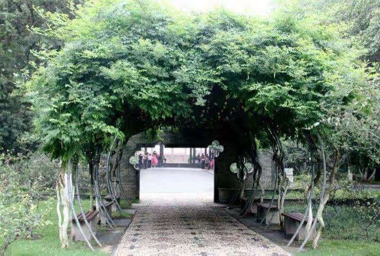

再往南邊過去，好象是紫藤園，進園回身再望抱月吟風亭，卻發現紫藤的造型也很美。

湖邊的美人蕉。

湖邊的荷花與蜻蜓。

觀荷池內的荷花。

小荷才露尖尖角，早有蜻蜓在上頭。古人詩意

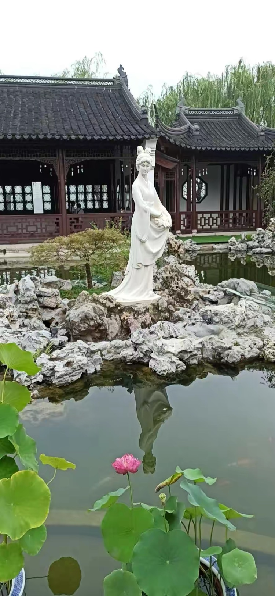

最後一張是手機拍的，魚還在水裡，卻水面如鏡，無波無痕，莫愁女的倒影清晰。思來想去不得解，最終肚子餓了要回家吃飯，突然又想起那句南京老話：「不要煩了」。
