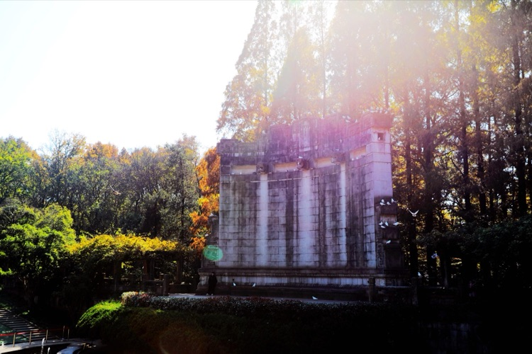
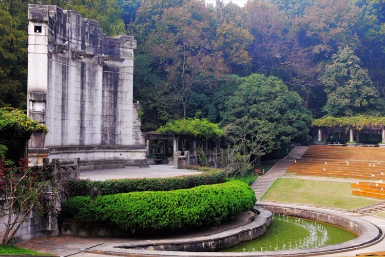
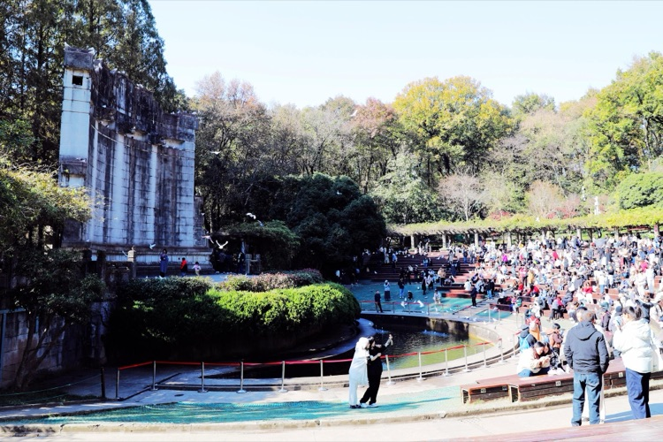
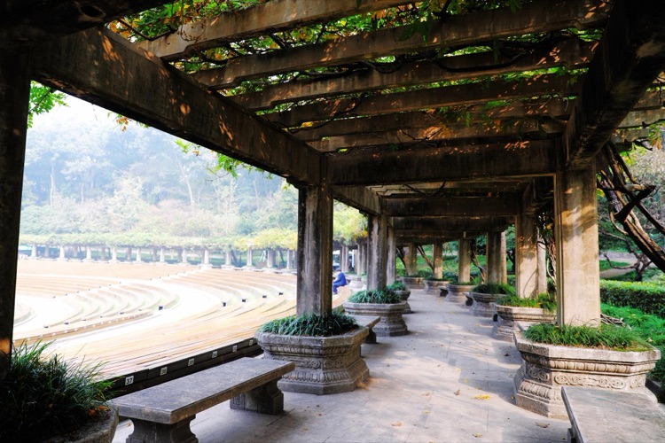
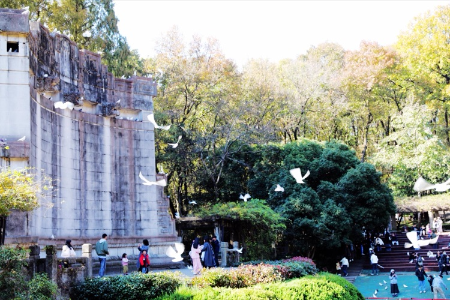
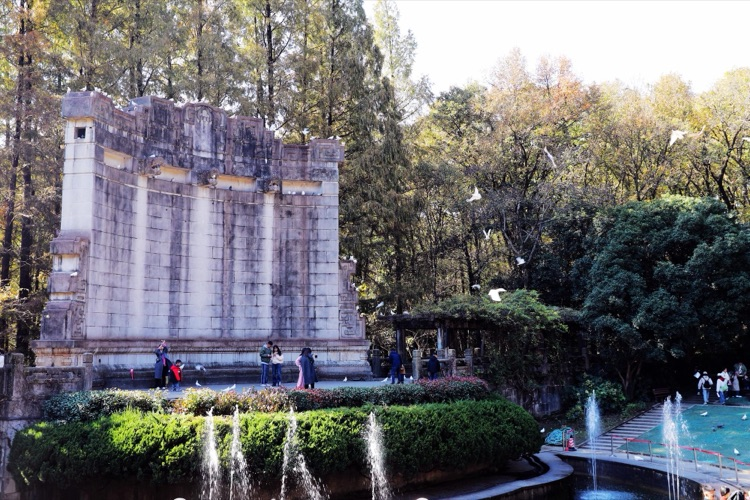
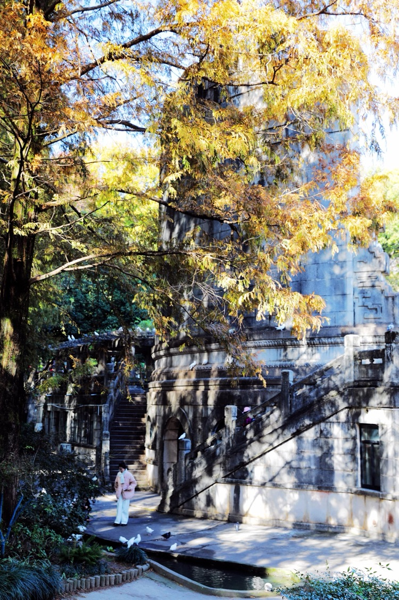
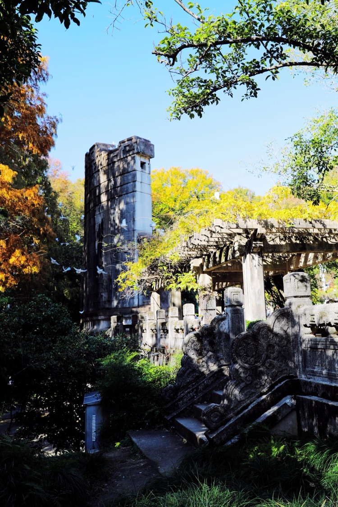
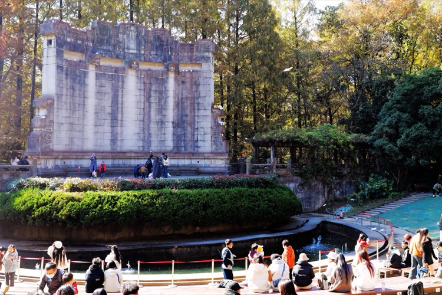

看過巨幅噴繪，下了392級石階，終於來到博愛坊廣場，心情也慢慢平復下來。廣場的東南角有木頭門首，寫著醒目的大字「音樂台」，走到跟前才發現，這也是景區的一個出口，單向的，只能出，不能進。猶豫了一下，想想也沒什麼，於是就出門去了「音樂台」。

<!--more-->

在兒時的記憶裡，音樂台是建在天然窪地的露天劇場。舞台建在最低處，背後有巨大的弧形照壁反射音響。觀眾席建在斜坡上，由舞台中心往半圓形坡地建有放射狀的水泥小道，以前觀眾可以隨意坐其中在劃分好的草地上。坡地的上面是一圈圍廊，水泥廊架上爬滿春天開花的紫藤。

從入口沿石階小路進入音樂台，即熟悉又陌生的景象依然震撼著我。

音樂台那座巨大的照壁立即躍入眼簾，多年的雨水將照壁上的雲紋、假石鑲面之間結合縫沖刷的更加清晰立體，水的痕跡將照壁抹出白黑相間的陳舊斑塊。照壁上有許多精美的細節設計，上部和兩側都雕刻有云紋圖案，上面還有三個龍頭，實際上是突出到牆體之外的，非常炫酷！而照壁的表面是由水泥製成的假石鑲面，既是舞台背景，又能反射聲波，宛如一堵巨大的迴音壁，讓音樂在這裡得到了最佳的傳播效果。

照壁一樣重要的就是那月牙形的池子了，池子底部有一個伏泉，所以池水終年不涸。因為水面可以增強音響效果，這個池子除了可以彙集露天場地的天然積水，在音樂表演時，音樂的聲音會更加清晰悠揚，讓人有意外的驚喜。

觀眾席是個獨特的半圓形設計，設計師們非常巧妙地利用了草坪的內凹地形，打造出由高向低的觀眾席，從而讓每個人都能有一個更好的視野，現在的觀眾席還增添了木質的椅子，使人更加舒適。而且這個草坪還被小徑和走道台階分割成了12塊，可以容納3000餘名觀眾。

音樂台的觀眾席可不僅僅是草地，它最頂端還有圍廊，一條寬約6米的紫藤花架。這條花架長達150米，兩側還有花盆、石凳等，讓人們可以在欣賞音樂的同時，還能欣賞到美麗的紫藤。而且，在花架的邊緣，還有一條弧形水溝和五座小橋，給音樂台增添了許多浪漫的氛圍。

音樂台不僅是重要的紀念性建築，還經常舉辦各種音樂會和演出，如這幾年的南京森林音樂會曾在此舉辦。

早些時間我看過一篇描寫世界風光的視頻，講的是土耳其的阿斯潘多思劇場，始建於公元155年，雖歷經2000多年，遭遇過地震、戰爭等災害，卻依然近乎完整地被保留了下來。劇場迄今仍在被使用，每年夏季的安塔利亞歌劇節和藝術節在那裡舉辦，始終沒有使用任何擴音設備，坐在兩千年前的石階上卻能夠完美的欣賞到音響的真實效果。

中山陵的音樂台和阿斯潘多思劇場的基本格局相近，只是音樂台的照壁是弧形的，且沒有完全和觀眾席銜接封閉，既然現在去不了土耳其，那麼就認認真真，安安靜靜在中山陵的音樂台好好的聽一會音樂。

幾乎走遍了觀眾席內的水泥小道，最終選了一處既能曬到陽光，又不會打擾別人的角落，靜坐在木椅上，看著遠處發黃的樹木和藍天中偶然飄過來白雲，仔細的聽著那些不一定能說出名字的音樂。今天沒有現場演出，只是用音響播放著一段一段的音樂，但無論站在觀眾席的任何地方，聽到的效果都是一樣，看不見音箱，甚至連音響傳來的方向都不能確定，直到我離開音樂台，心裡的疑惑始終沒有解開，這就是所謂的「環繞立體聲」嗎？

我喜愛純音樂遠大於歌曲，因為音樂本身就自帶「喜怒哀樂」的情愫，如果恰恰和你內心深處的那點脆弱或從不告人的那種私密相契合，從而發生共鳴，你就會感到心情如天上的雲，自由的捲起展開，那種信馬由韁的放縱很難用文字描述。而你聽到立刻能明白大意的那些歌曲，情緒就會受倒限制或牽引，感受被綁架一樣，不能完全體會從內心深處產生的、那種自然而然的衝動。

甚至我並不在意去記憶音樂本身的名字，作者及創作背景，僅憑直覺用心來理解音樂中自已的真實感受，真的很享受這種朦朦朧朧的感覺，這種感覺確實是我始終追求，並一直想要得到那種的效果。

所以在那天的中午，聽了那些作品讓我神魂顛倒難以自拔，一時還真的說不出來。讓我斷片的原因是，那些停留在照壁頂端和觀眾席內的鴿群，在我陶醉音樂的其間，突然向上躍起再向下俯衝，或是圍著照壁盤旋，耳邊就是呼啦啦扇動翅膀的聲音；在我抬頭觀望空中飛舞的鴿群，想看清鴿群翅膀上的羽毛的瞬間，鴿群又各自回到原地，一下安靜下來，好像什麼都沒發生。在那夢幻般的音樂台裡，我恍恍惚惚聽了一場夢幻般的音樂。

音樂可以宣洩一種情感，卻不怕有人偷窺。創作音樂的人這樣想，聽音樂的人也一樣。
