樹黃了，水靜了，秋深了。

<!--more-->

最美的濾鏡，從來都是季節本身。

重陽後連續幾日天高雲淡，找個臨水的地方坐下，仰面享受午後的陽光。

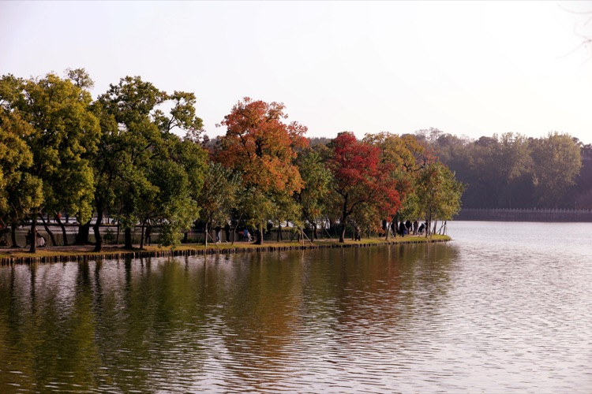

月牙堤建在南京植物園南園內，是前湖北岸修建的一道深入湖中的圓弧形人造堤。沿堤錯落有致的種著許多烏桕樹，堤上和水中交相輝映，色彩彷彿是從堤上流淌進水中。烏桕樹用綠的、黃的、紅的葉，一筆一筆添加南京的秋意。

「南京的秋天是從月牙堤開始的。」

有人感嘆、有人驚訝、有人心服口服。

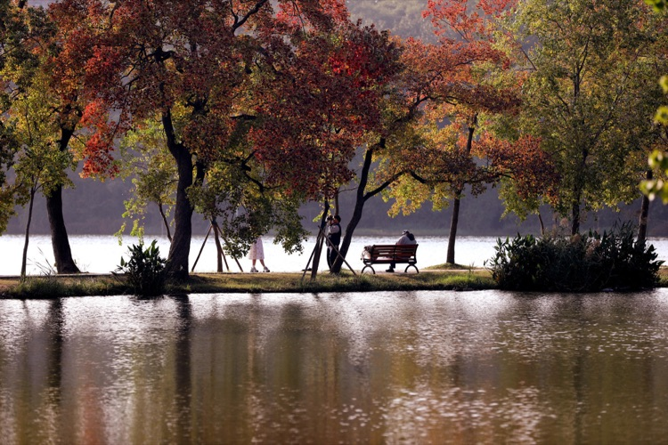

烏桕樹葉太濃的時候，樹的枝幹不明顯，少了曲折。逆光中的葉依然透明，重重疊疊，多了些暈影，但同時也多了點亮點。靠前的明亮，靠後的厚重。攝影的攝影，讀書的讀書。一切顯得自然，安寧。

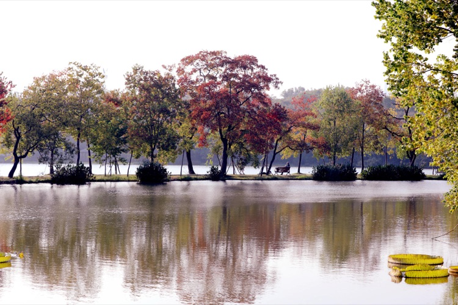

婀娜的烏桕樹用葉的紅黃綠描述秋天的深淺，最重要的是她那天然內斂的「骨相美」，當風吹去部分樹葉，葉影中的悄然露出的黑色枝幹，恰到好處的有直有彎，以嫵媚的造型表達秋天的柔情。逆光中，月牙堤顯得格外靜謐。這長堤最不能缺的是那張帶靠背的長椅，而長椅上最不能少的是一位靜坐著的美人，而這美人可以是在陶醉中讀一本書，也可以是閉著眼、仰著臉在享受午後陽光。

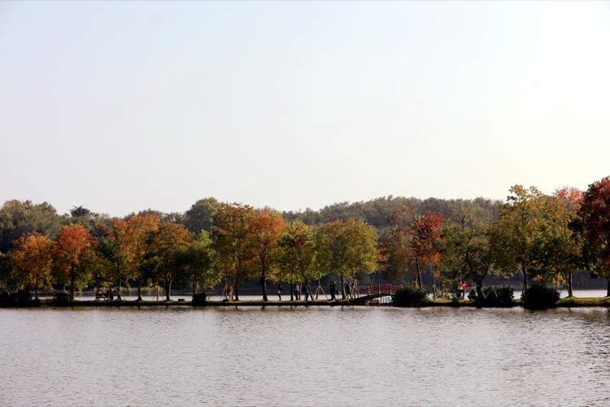

天上的太陽已偏向西南，堤上的樹在偏逆光中略顯發紅，延申至堤的中段，連接著一座極普通的小紅橋，簡單的木頭橋、簡單的紅色，卻使每個經過的遊人都忍不住停下留影。人影擋住陽光，更顯明亮。就像太陽照得地球一片燦爛，而在陽光來的途中，宇宙深處卻是一片黑暗。

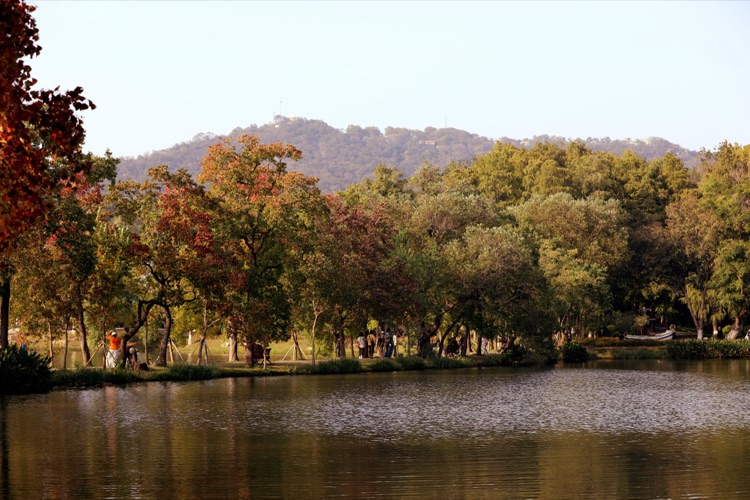

月牙堤建在前湖的北岸，遠處更北的地方是紫金山天文台，人群從堤上穿過，就彷彿是從山中走來。烏桕樹的葉還那麼濃密，紅衣白裙的美女竟然如此奪目，她靜靜的站著，沒有說話，一切就那麼美好。

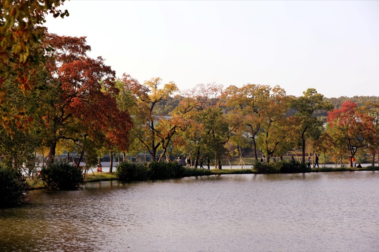

這或許是月牙堤的最佳觀景點，這裡望去堤上的烏桕樹基本熟透，樹葉的濃密適當，此時午後的陽光，極易穿透葉影，畫面生動豔麗。

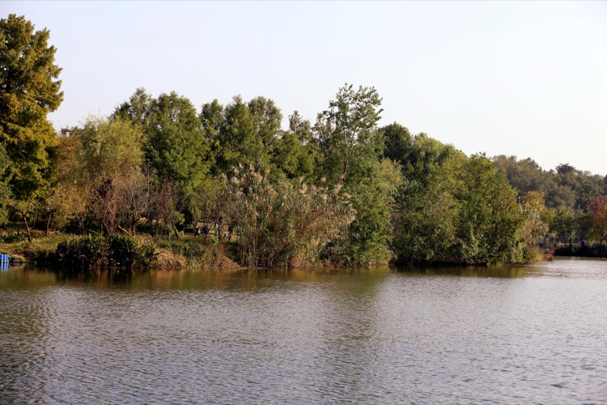

隨著秋的深入，月牙堤環抱的湖心島上和島邊的植物漸漸由綠轉黃，依舊濃密，在午後的陽光中絲毫沒有淒涼的感覺，卻顯得雜亂富有而不拘小節，任性的讓人嫉妒。羨慕的人，恨不得在上面打個滾，好宣洩一下情感。

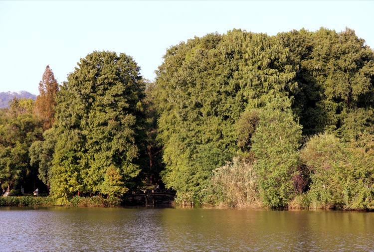

北岸兩片陸地的之間有一條河，河上有座古老的石橋，橋旁架著一架水車。岸上長著高大的落羽杉，差不多是水車高度的十倍。以前我們是站在石橋上看堤上的小紅橋，這次卻是站在小紅橋上看石橋。湖水流經那幽靜的石橋，在水車上留下的吟唱，是否還是那古老的歌謠。

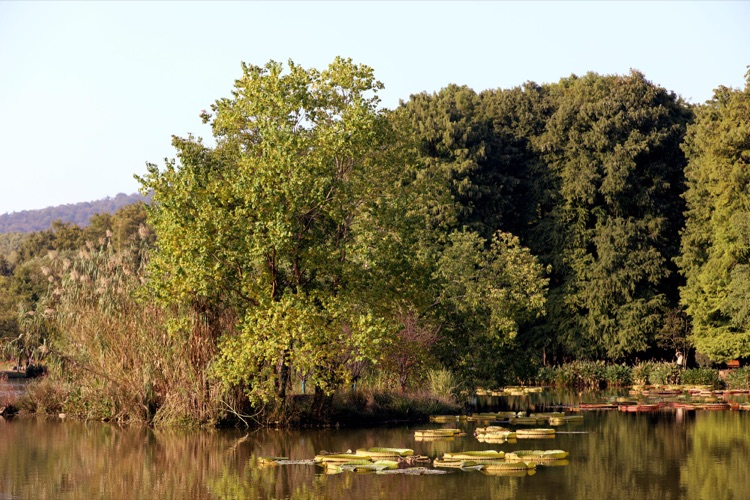

寬廣湖面上的睡蓮在午後陽光的照射下，顯得有點慵懶，但絕不是臃腫，甚至有點單薄。睡蓮的圓葉圍繞著花蕾，綠中透著黃。水裡還有半截影子，增加了睡蓮的立體感。平鋪水面，宛如書法，收放適當，卻處處頂著力道。岸上的蘆葦、黃楊和落羽杉，枝條不亂，層層遞進。

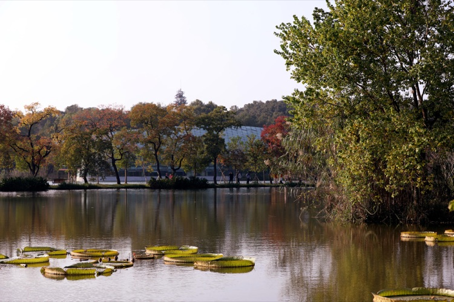

午後的陽光，讓堤上的烏桕、島邊的蘆葦和水中的睡蓮變得越發透明，如同在玉石上壓燈，裡面的色會泛映出來。因為午後的陽光自帶一種悠閒，一種短暫的放鬆，使堤上的烏桕、島邊的蘆葦和水中的睡蓮看起來都那麼隨意灑脫。假如你身臨其境，是否願意立即放下身邊的一切，找個草窩坐下，或是找個樹根靠靠，然後閉上眼，揚起下巴，輕鬆愜意的曬一會太陽。

睡蓮花褪去厚厚的殼，露出的花瓣更水靈鮮活。睡蓮的花蕾生長是並列的，開花卻有前後的順序。同時開可能有爭豔鬥麗之嫌，分開於前後，卻互不相干，各自發揮。晚開幾天，花蕾吸住更多的養分，或是能開的更美？

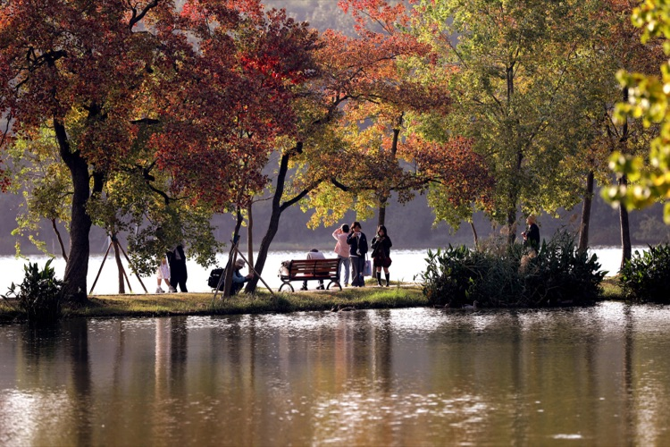

溫暖的陽光，普照大地。善良的人民，享受著和平。
