南京又稱金陵，名字中自帶著秋天色彩的城市，看到的同時就會立馬使人腦海裡浮現那種濃濃的深紅和鵝黃。出了中山門，沿著湖邊，順著山路，大自然一筆紅、一筆黃、在原本青綠的山丘上隨心所欲的描繪著秋天。

<!--more-->

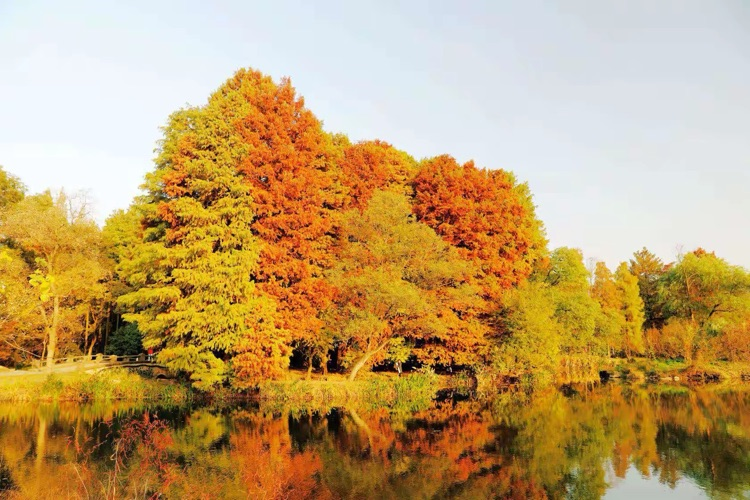

黃昏時分，落日餘暉再次給所見之物鍍上金光，讓紅的更紅、黃的更黃，陰影隱去多餘的部分，使那造型獨特的樹木、色彩豔麗的枝葉越發透明鮮亮。

難怪網上有人傳：南京的秋天是從前湖畔月牙堤的烏桕樹開始的。

秋天是一個季節，是酷熱的夏季到嚴寒的冬季之間的過渡季節，我國農曆的二十四節氣中規定了「立春」、「立夏」、「立秋」、「立冬」的確切的日期，也就是季節開始轉變的時刻，而我們感覺到的季節的變化卻要推遲一段時間。

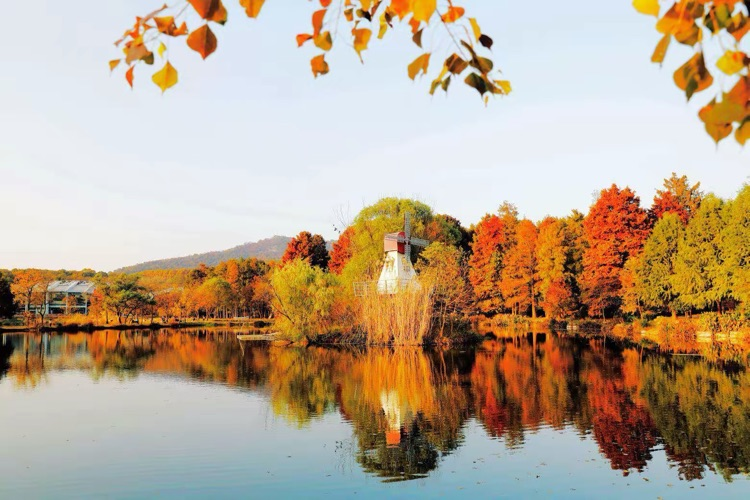

「立秋」已過去三個多月，「立冬」也過去好幾天了，我們仍然說現在是秋天，那種文人表達的「晚秋」意猶未盡。進入秋天以後，樹葉開始退青、枯黃、然後脫落，但直到樹葉完全落盡，你會突然發現春天早已悄悄來到你身邊，不經意間早已立過春了。

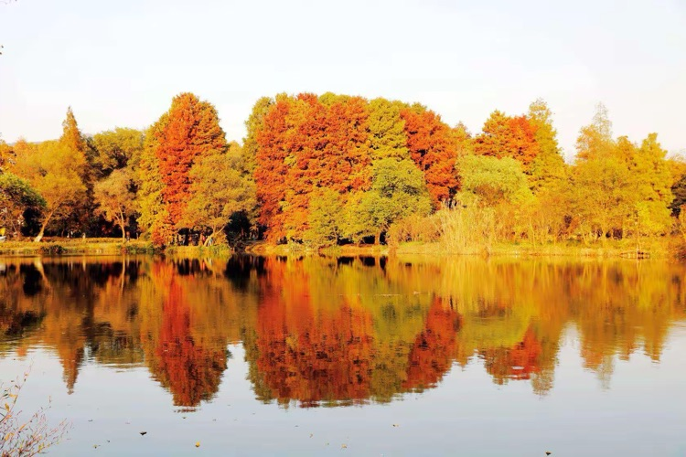

人們推崇春天和秋天，因為「春天」表達著「生命」和「希望」，「秋天」表達著「經歷」和「收穫」，雖然一年有四季，但人們總是臆想「春天」和「秋天」的無限延長，讓「生命」始終充滿「希望」，讓「經歷」有更多 「收穫」，以至多少人只用幾度「春秋」就把曾經的「歲月」一筆帶過。

南京自古就有帝王之氣，合「虎踞龍盤」之勢。其中的龍指的是由鎮江方向過來的寧鎮山脈，也是南京的龍脈——紫金山。紫金山是南京最大的地標，立秋之後，逐漸涼爽的秋風慢慢的吹過山脊，日復一日，綠色的植被開始出現彩色的斑點，再漸漸擴大，像一個老者在有條不紊的講述秋天的故事。

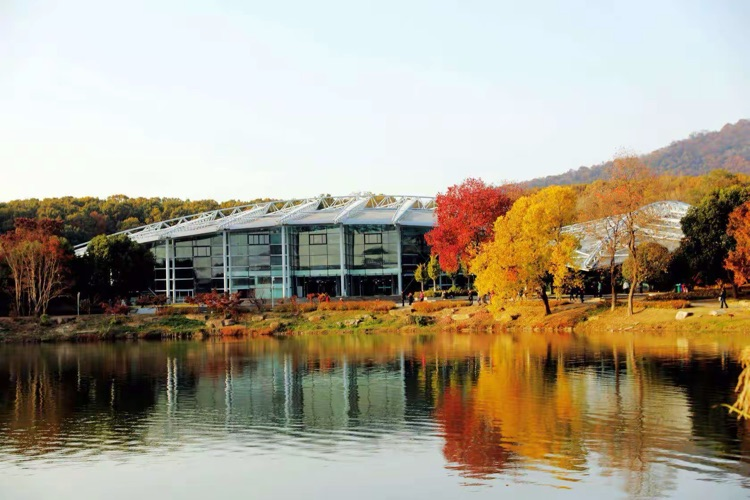

遠遠望去，明媚的陽光下，林濤起伏，你彷彿能聽到樹葉和風之間的真情對話。秋高雲淡，神清氣爽，只有遠方的山才有這樣的格局，即可盡情的表達秋天的富足，也能充分的描述秋天的豪爽。

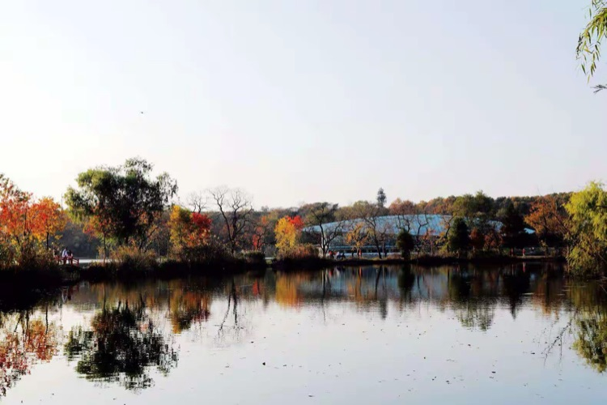

入秋後的湖水漸涼，顏色也由青轉藍，漸濃漸深，水裡彷彿融化了什麼、又彷彿沉澱了什麼，更顯得深沉憂慮。古往今來人們把一直充滿期盼的眼神比作秋天之水，任何人讀到都會感到悲傷淒涼的那種「望斷秋水」。

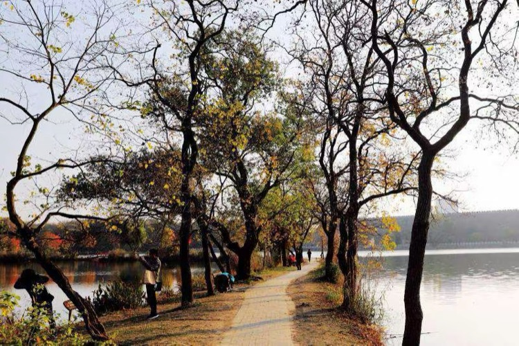

是不是不用秋天的水來做比喻，就無法準確的表達這種幾近絕望的傷感呢？有山有水的秋天真的會使人悲喜交加嗎？

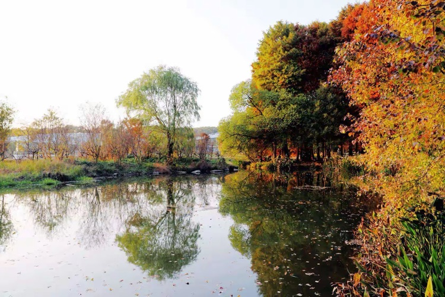

當然，秋天的厚重必須有悠久的歷史來鋪墊，秋天的神秘更須由離奇的故事來詮釋。不遠處就葬有東吳大帝孫權、明太祖朱元璋、民國的孫中山總理。

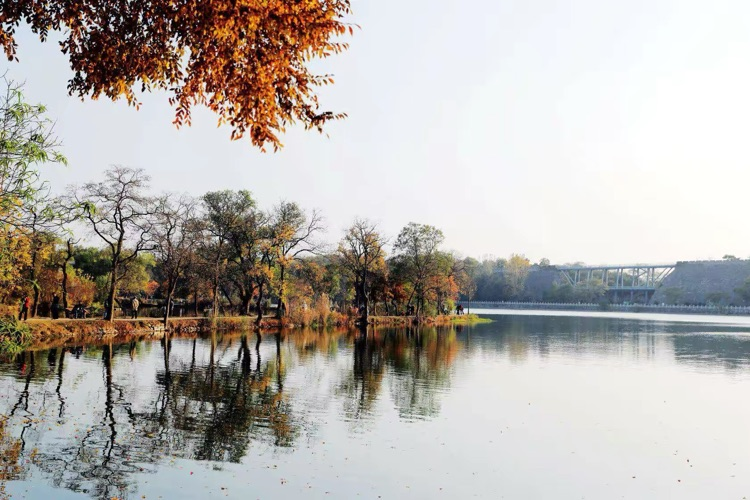

前湖的西邊是六百年前的明城牆，由中山門一直向北延申。根據官方記載，1991年的一場大暴雨，使這段明城牆坍塌後出現了一段長50多米長的豁口，經文物部門清理，竟在坍塌城牆的磚土中又發現了一段完整「矮城牆」。據文物部門專家考證，這段「矮城牆」為明城牆剛建時的初樣，也稱「放樣」，明太祖看了不滿意，下旨在此基礎上，城牆的厚度增加七倍、高度增加一倍，所以，今天我們看到的明城牆格外的高大強固，充分體現了明朝一統天下的宏圖大略：「高築牆、廣積糧、緩稱王。」

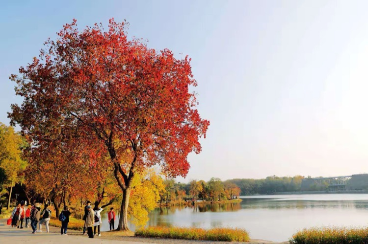

這是非常重大的歷史發現，專家認為一定要讓現在的後人看到這些實物「矮城牆」，認識這段歷史，記住這段歷史。城牆中這樣的 「矮城牆」，不僅僅只有前湖段城牆有，在獅子山東側、解放門西側、月牙湖南側、太平門東側、神策門附近、中央門西側都曾發現過，不過有的在拆的時候沒有妥善保護，或是有的現在外城牆依然完好，自然坍塌而讓牆中「矮城牆」暴露出來僅此一處。

經相關專家全面論證提出如下方案，採用鋼結構保持城牆上面行人的流通順暢，鋼結構的承載不直接作用在明城牆上，架空後從外部可直接觀察到「矮城牆」的歷史原貌，後報南京市政府批准，於2014年實施完工，實現現存明城牆頂面及內外側全面貫通開放。

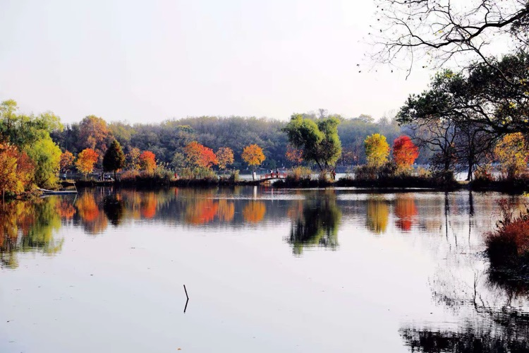

從植物園南園進門，穿過一片杉樹林就可以看見美麗的前湖，這裡有山、有水、有故事，還有長著烏桕樹的月牙堤，來了就知道，秋天確實是從這裡開始。

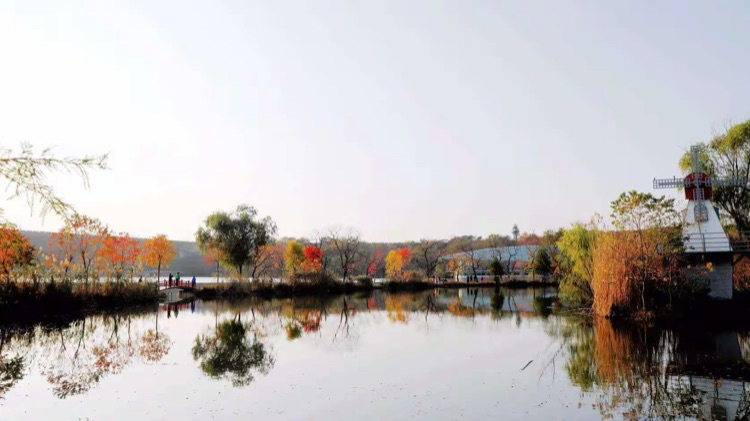

月牙堤在前湖的岸邊划著一道圓弧，沿堤錯落有致的種著烏桕樹，紅葉和黃葉交相輝映，水中同樣色彩、同樣高低的影子，顯得堤的曲線越發神奇美妙。堤中紅色的小木橋，正可謂神來之筆，恰到好處，簡單的木頭橋、簡單的紅色，卻使每個經過的遊人都忍不住停下留影。湖對岸六百年前的明城牆，憨厚的當著背景，心甘情願的襯映著堤上烏桕樹的豔麗多姿。玻璃結構的植物館在樹叢中發出誘人的藍色，風車沒有轉動，前面只用蘆葦自然的裝飾了一下，布蓬上面停著幾隻喜鵲，對著湖面落日不時發出幾聲鳴叫，喔，好個秋字了得。
