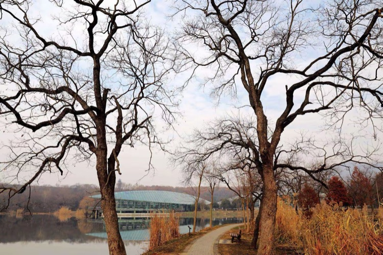
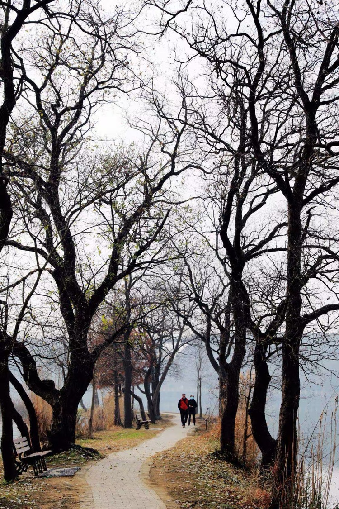
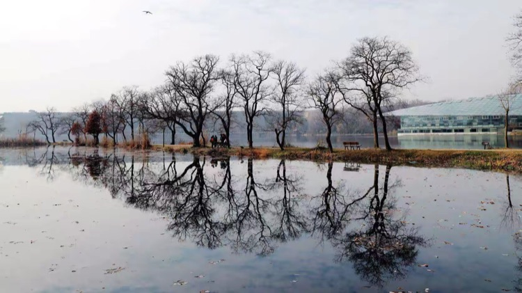
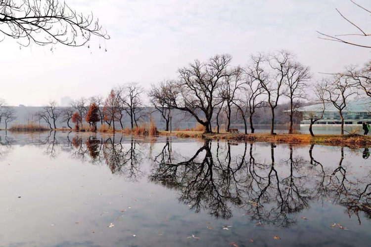
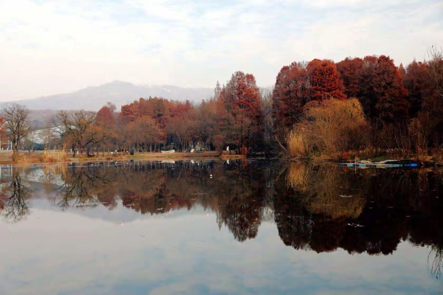
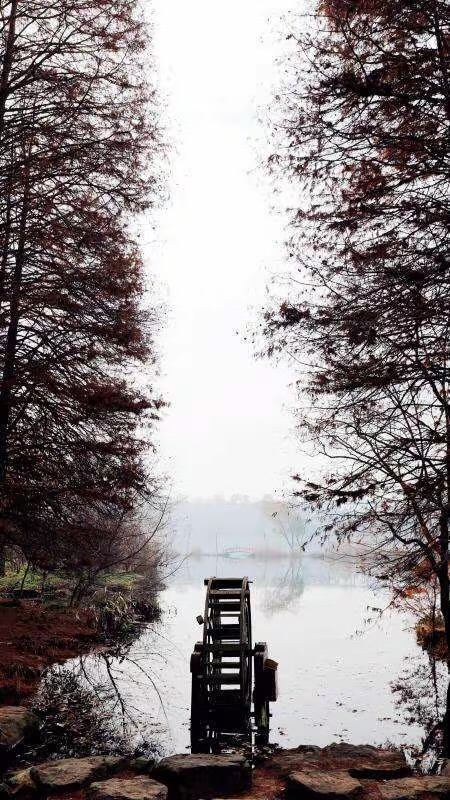

早兩天看到了朋友的朋友拍的一段視頻《冬日暖陽下的前湖月牙堤別樣美》，心有觸動，其中的手風琴伴奏，那種歡快的異國音樂，使「冬日暖陽下的前湖月牙堤」頓時靈動起來。再者也為解開一個迷，上次我寫《秋天從「前湖」的烏桕樹開始》，有朋友留言，他因為錯過了時間，今年看不到秋天的前湖，準備冬天去。真是「好奇害死貓」，我冬天也沒去過前湖，前湖的冬天只剩「冷水枯草」嗎？淒涼也有淒涼美，念天地之悠悠，在冬日的陽光下，坐在月牙堤的靠椅上，發一回呆也未嘗不是件自我陶醉的美事。於是立馬前往，觸景生情、放飛想像，整理照片後記錄下這段感受。

<!--more-->

植物園的南園建在前湖的北岸，臨湖的多肉多漿植物區和熱帶植物宮為葉形的鋼架玻璃結構，玻璃頂的穹形曲面即準確表達了葉子的自然形態，又巧妙的解決了屋頂採光和排水問題，且相互錯開一定的角度，隔湖望過去既能看到這一片葉的尖，同時也能看到另一片葉的側面。兩座建築的葉形頂結構上也各有千秋，體現了設計者的良苦用心。

冬天來了，秋天繽紛的樹葉褪盡，葉形的玻璃頂發著寶石般的色彩，在水面的襯映下宛若幾隻千年老蚌。「老蚌含珠」暗合了多少中國人心中的吉祥富貴，珍珠天成，風水寶地啊，南京有好幾處建築形若蚌殼，取得就是這個意思。

月牙堤上的烏桕樹豔麗的葉子終於褪盡，枝幹相對於其他樹多了些彎曲，自下而上逐漸由粗變細，雜亂中卻顯得十分均衡、自然、舒展。如果樹幹過於稠密，層層疊疊，就不免讓人想起童話中住著巫婆的大森林。好在月牙堤上的烏桕樹並沒有遮天蔽日，放眼望去更多的還是藍天白雲，雖然堤上沒人，可那種安寧靜謐世上又有幾人能獨享？

月牙堤在前湖邊劃了一道圓弧，從幾何學上講劃的並不工整，局部有曲折。堤上的小路彎彎曲曲，但很多人用很多理由解釋，這種彎曲可以加深記憶、且表達委婉，總之是一種可以感覺，卻無法準確描述的美。小路的兩邊彎曲的樹幹在自以為是的傲著造型，彼此一副不相往來的樣子，可是到了樹頂，枝條縱橫交錯，大風過處，難免耳鬢廝磨，彷彿秀起了恩愛。人在堤上漫步，心情愉悅，移步一景，不知不覺中生活中的尷尬苦惱也隨風飄散。樹旁的靠椅空無人坐，也許發呆的人坐的太久，腳不疼腰疼，也去堤的那頭遛彎了，千真萬確，冬天曬太陽時也會著涼的。

不知在什麼書上看到，樹長在地面的形狀和埋在土裡的形狀基本一樣，瞭解挖人參的人都知道，挖根是非常辛苦的事，如果挖大樹根更是一件相當艱鉅的大工程，因此很少有人看到樹埋在土裡的形狀是個什麼樣子。但是，一般人都知道，長在水邊的樹和它映在水裡的樣子肯定是一模一樣，那粗細不一、彎曲多變的烏桕樹枝，連同映在水中的倒影，其優美的幾何圖形給人以無窮的想像，如人形、如獸影、如書法字、如山水畫。一群人各執一詞、爭來爭去，跑到跟前卻發現又都不一樣了，哄得古人在天上笑到：「不識廬山真面目，只緣身在此山中。」

當最後一名遊客離開月牙堤，周圍又是一片靜謐，堤上得烏桕樹按照透視原理漸漸變小，再默默的伸向遠方，空氣中彷彿瀰漫著「且行且珍惜」那種想分又難捨的味道。

由於強逆光，高大的明城牆和豁子口的鋼結構橋都成了「水印」，在畫面上隱隱約約，堤上的烏桕樹依舊風姿卓越，害的堤上那些沒有曲線的樹，羞羞答答的找來 「楚王好瘦腰」的詞句進行裝飾。堤邊的草高高低低，宛若一串音頻信號，只在有故事的人心中引起不同的樂章。簡單的木頭橋、簡單的紅色，人多也好、沒人也罷，小紅橋低調依然。幾隻野鴨悠然的在水中拖著白色的水線，靜靜的告訴別人，它正在遊過。

這片湖面分外清潔，不知是風向還是其他別的原因，水面幾乎看不到漂浮的落葉，藍天白雲在湖水的襯映下顯得更加湛藍清晰。歐式古老的風車力圖用簡單的白色基座突顯那鮮紅鮮紅的頂部，布蓬一動不動，整體靜靜的溶入周圍的景色之中，就連水中倒影的那團紅色都神秘的隱入陰影之中。四周的草木以各自的形態和色彩裝扮著湖邊的風景，只有那烏桕樹還想用所剩無幾的枝條遮擋身後閃射寶石光芒的葉形玻璃建築，就象幼童用伸開五指的手捂著自已的眼睛，一邊大喊：「我沒看，我真的沒看！」其實，誰都知道，真的看了一眼就不想馬上離開。

從植物園南園進來，穿過一片杉樹林徑直可抵湖邊，這種杉樹因葉如羽毛，故稱落羽杉。原產北美，耐寒耐水，是一種古老的「孑遺植物」。樹幹高大筆直，樹葉細膩柔軟，樹形豐厚，到了秋冬季樹的顏色漸漸轉為棗紅色，就像慈祥而威嚴的長者，在他的庇廕下，你會感到十分的安全且並不孤單。湖邊蘆葦科的植物，被陽光的描繪成一根根的金色細線，如同現實主義風格的油畫，格外傳神。流向杉樹林裡的小河上有一座不起眼的低矮的石橋，「敦厚善良」，默默地承載著過往行人。吸引人們眼球的是岸上停在樹下的小白船，有人說它表示「安全」，就像郵輪上的救生艇；還有人說它表示「可靠」，「友誼的小船」在陸地上肯定不會「說翻就翻」。

我坐在石橋低矮的欄杆上，透過河道兩旁落羽杉形成的空隙，思緒穿越到六百年前的明城牆，再回到現代月牙堤上的小紅橋，久久的發呆，耳邊至始至終迴響著不知什麼年代的水車在低聲吟誦那古老的歌謠。
