石頭城始建於楚威王七年（前333年），原為楚威王的金陵邑。東漢建安十六年（211年），吳國孫權遷至秣陵（今南京），在石頭山金陵邑原址依山築城，取名石頭城。並據此扼守長江險要。

<!--more-->

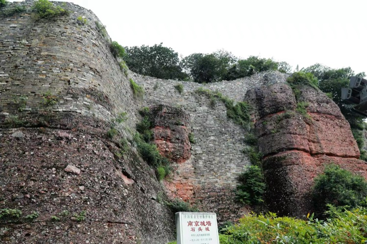

當時的長江水就在石頭城牆下，清涼山西部崖壁被江水衝涮得如刀削斧砍一般，紫紅色的礫石裸露在外，形成「峭立江中」的天生石壁。其中一段石壁因風化作用，出現坑坑窪窪、凹凸不平的怪狀，酷似一張面目猙獰的「鬼臉」。

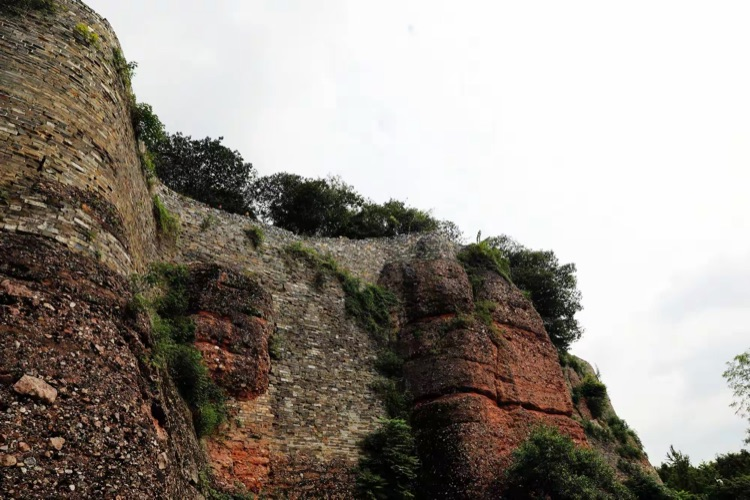

這段石壁以及沿石壁建造的石頭城，由此被稱為「鬼臉城」。

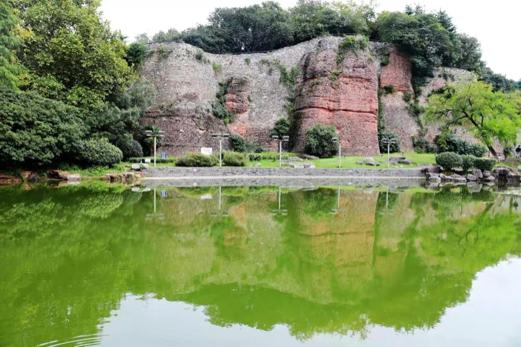

後長江西移，鬼臉城外留下一水塘，可見鬼臉倒影，人稱「鏡子湖」，歷史上聞名的景點「鬼臉照鏡子」即指此處。

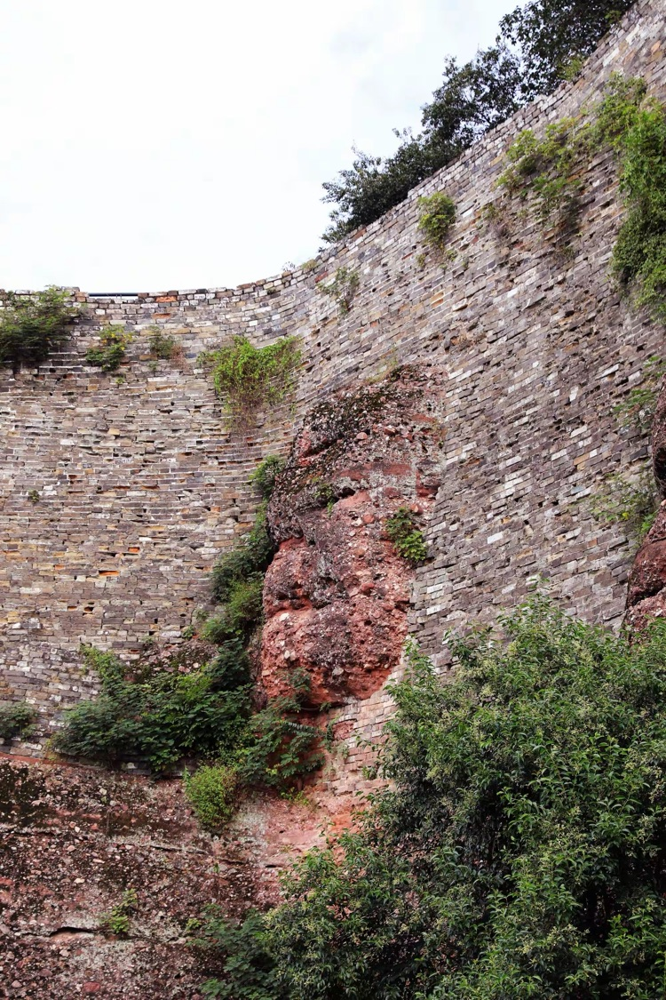

民間傳聞，很久很久以前，南京城裡有一戶官宦人家，其公子生得貌若潘安，風流倜儻，只可惜少年早逝。下到地府忽見周圍之鬼都面目可猙，兇惡之極，公子極度恐慌，也極度厭惡，於是伺機逃脫。由於喝了孟婆湯，也認不得回家的路，撞破了石頭城的城牆，就要出來。哪知剛露出臉，就在面前的「鏡子湖」看到自已的面目，也是一張「鬼臉」，當即羞愧難當，進也不是，退也不是，身體沒有出來，只把個臉留在城牆上。一開始，確實把周圍的老百姓嚇壞了，不敢靠近，只敢遠遠的看兩眼。直到三國時期，曹操親率大軍準備趁月黑風高之時偷襲東吳，當大軍戰船殺奔途中，遙遠的江面上突現一高大而面露猙獰的惡鬼在據守城門，魏國大軍頓時嚇的慌忙撤退，從此不敢貿然進犯。

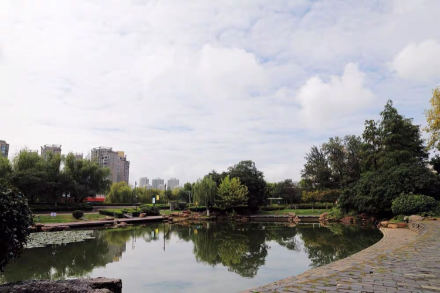

也不知從什麼時候起，南京的老百姓中流傳出在「鏡子湖」邊祭拜「鬼臉城」可以祈福消災的說法。

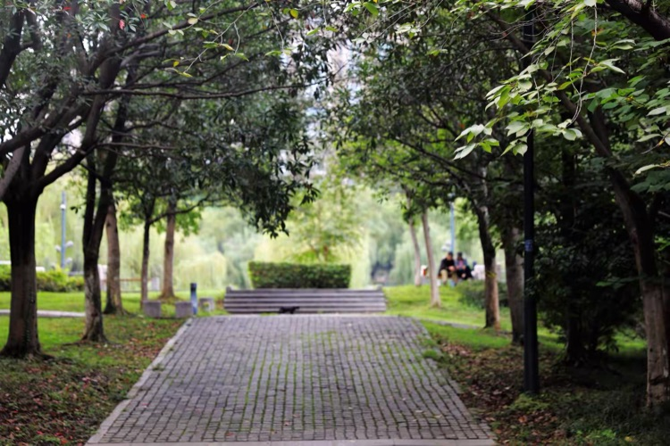

按照高德地圖的導航，我來到石頭城遺址公園，由南門進入。問了工作人員，要去「鬼臉照鏡子」的景點，需步行15分鐘，道路兩邊草木茂盛，雅靜悠閒，一邊是石頭城的城牆，另一邊是秦淮河，時值秋高氣爽，慢慢尋去，倒也興趣煥然。

迎面是清涼門大橋，橋上還洋溢著國慶節的喜慶氣氛，五星紅旗印著藍天白雲。

大橋下面也十分壯觀，有樓梯可直接上橋面。

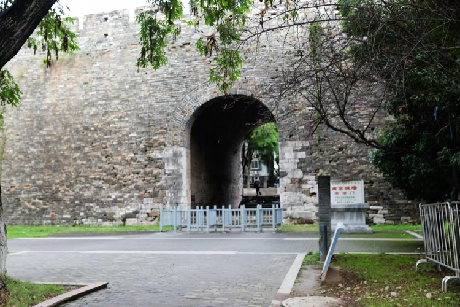

清涼門的城門似乎有點小。

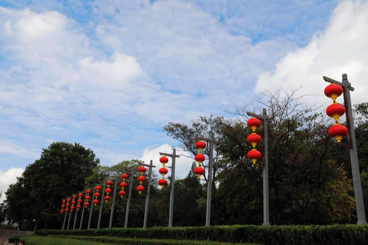

秦淮河邊石頭城的遊船碼頭，岸邊高高聳立著一排大紅燈籠，為什麼一串吊三隻，想了一會也沒明白。

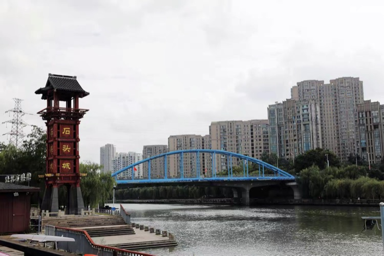

清涼門大橋給人的感覺是粗壯結實。

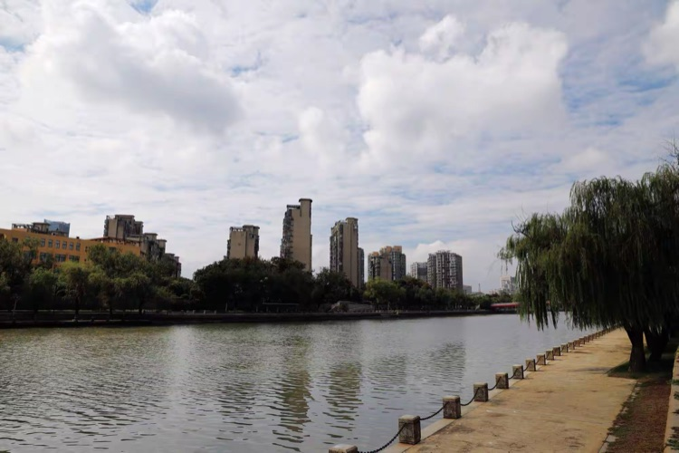

秦淮河的西岸高樓林立，以前那裡是棚戶區。

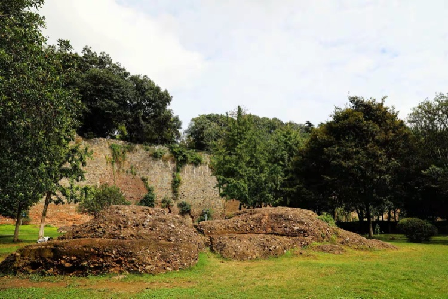

唐代以後，江水西移，龜石經長年累月的沖刷，表面形成凹凸不平的風化層，磕之層層剝落，如龜殼，因而得名。

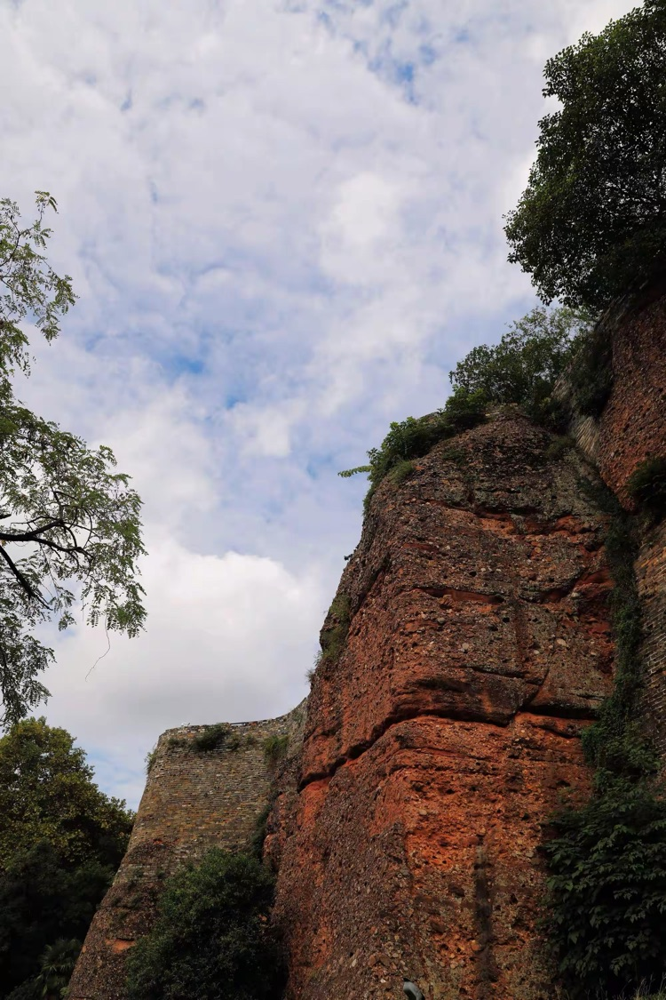

站在城牆下，仰望天空，看雲捲雲舒，祈福餘生，不管能得到多少，心情一定舒暢許多！

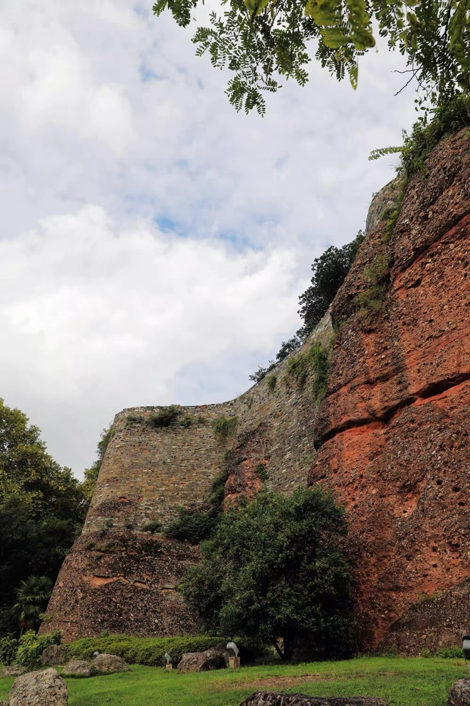

歲月留給我們的不止是滄桑和淒涼，還有美好的祝福和希望！

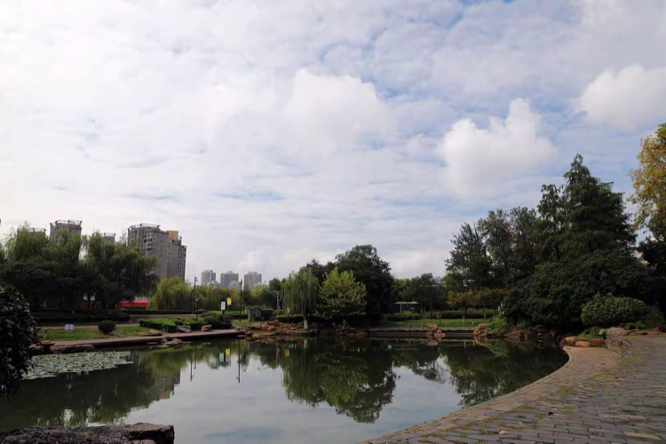

鏡子湖裡一切顯得那麼美好、那麼安寧、那麼祥和。
