長期在南京生活的人，一般都記不清自已去過玄武湖的次數。孩提時，父母牽著去；上學時，同學們追打著去；戀愛時，和情人偎依著去；工作時，單位組織著去；退休後，自已回憶著去。

<!--more-->

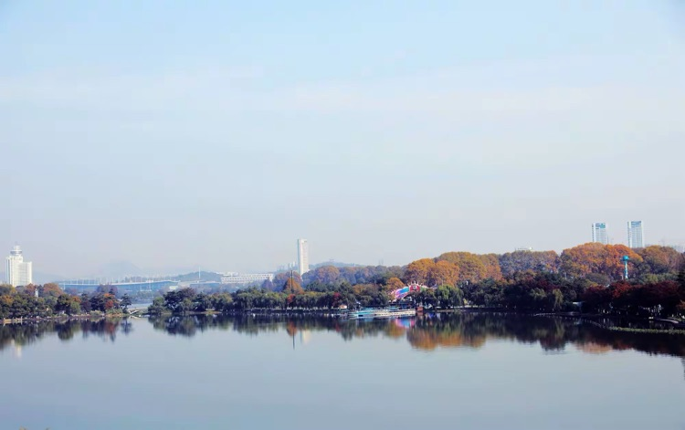

在講南京話的人群中，玄武湖通常被簡稱為「玄湖」，講的明明白白，聽的清清楚楚，卻無故中間少了一個字，講時還那麼情真意切，原來啊，「玄湖」這只是屬於南京人的「愛稱」。

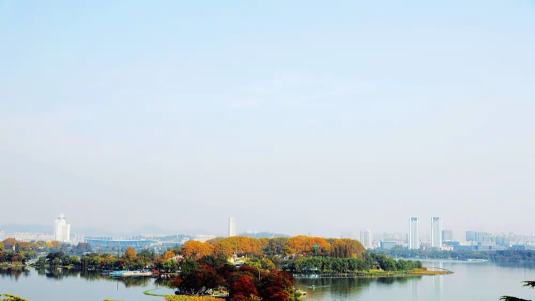

在南京人目心中玄武湖就是一個大字，水面開闊，雖然被放在城牆的外圍，但無論從玄武門去還是從解放門去，好像都離市中心不遠。情感上南京人都認為玄武湖在市中心，因為太大，所以延申到城外。

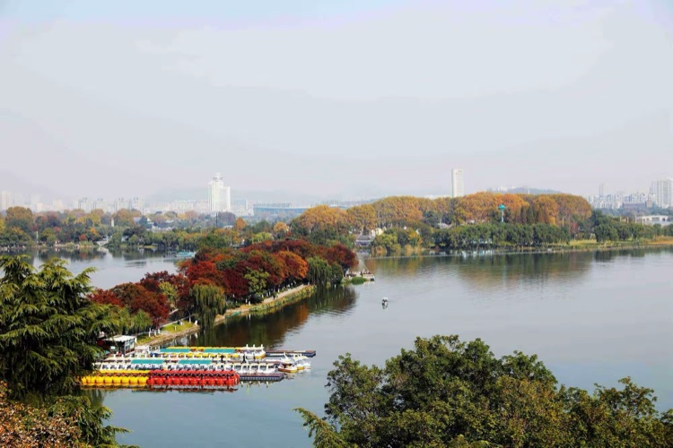

玄武湖確實大，史書上記載，玄武湖在六朝時面積比如今大的多，而且大大小小相連的水面與長江直接相通。玄武湖中可以見到長江裡的揚子鱷，於是有了黑龍的傳說，玄武湖也一度被稱之為「黑龍湖」。

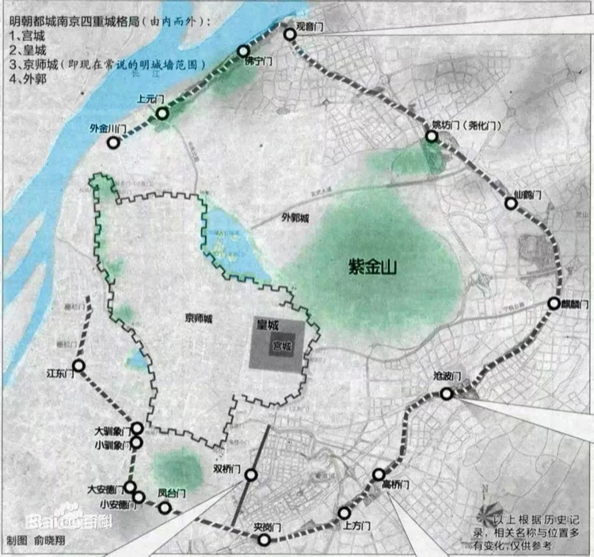

南京明城牆（京師城）的外廓其實就是按照明太祖朱元璋側面頭像建造而成的，皇城和宮城建在明太祖的口中，玄武湖在眼睛的位置（或眼前的位置），那麼明太祖所示的要像愛護自已眼睛一樣愛護的那件東西是玄武湖，或要時時刻刻放在眼前，以防被別人拿走的那件東西也還是玄武湖。明太祖信風水、認天命，紫金山是南京的「龍脈」，玄武湖正可「聚氣」，湖內的洲呈「北斗七星」佈局，以固秦始皇所洩「金陵之王氣。」

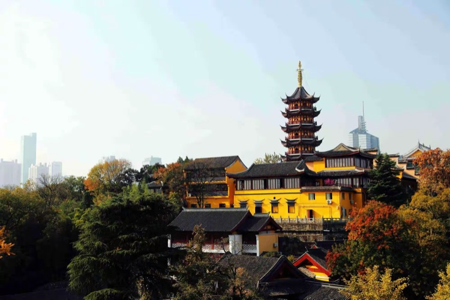

玄武湖的西南岸有一座古雞鳴寺，始建於西晉永康元年（300年），已有一千七百多年的歷史，是南京最古老的梵剎和皇家寺廟之一，自古有「南朝第一寺」，「南朝四百八十寺」之首的美譽，南朝時期與棲霞寺、定山寺齊名，是南朝時期中國的佛教中心。

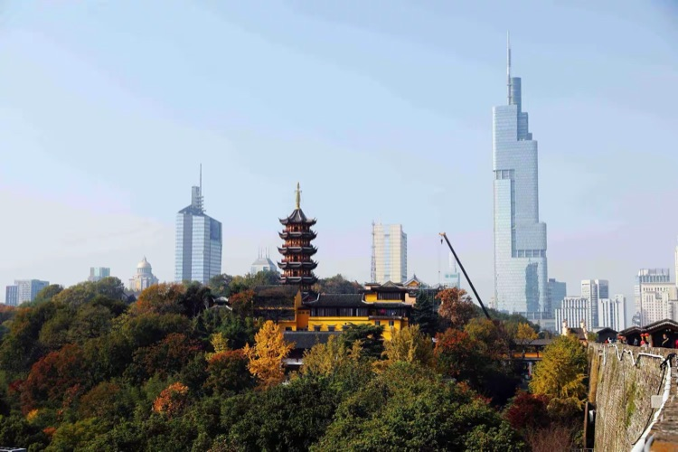

雞鳴寺歷史可追溯至東吳的棲玄寺，寺址所在為三國時屬吳國後苑之地；西晉永康元年（300年）在此倚山造室，始創道場；東晉以後此處被闢為廷尉署；南梁大通元年（527年）梁武帝在雞鳴埭興建同泰寺，曾四次「捨身」於此，並在寺院內頒佈《斷酒肉文》，為佛教素食肇始，使這裡從此真正成為佛教勝地，天竺高僧菩提達摩從印度來建康（今南京）時就居於此；南唐時易名淨居寺，後改圓寂寺；宋朝時改為法寶寺。

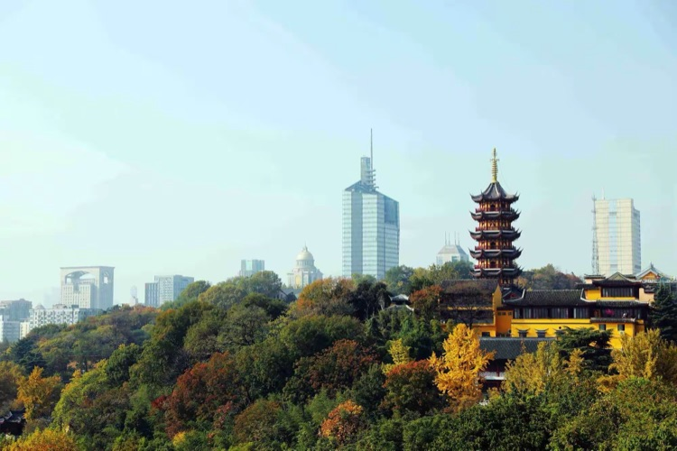

明朝洪武二十年（1387年）明太祖朱元璋下令重建寺院，擴大規模，並御題「雞鳴寺」，後經不斷擴建，院落規模宏大，佔地達千餘畝，殿堂樓閣、台舍房宇達三十餘座；清朝咸豐年間毀於戰火，同治年間重修；1958年改為尼眾道場；1983年起依明清時規模形制復建，並逐步對外開放。

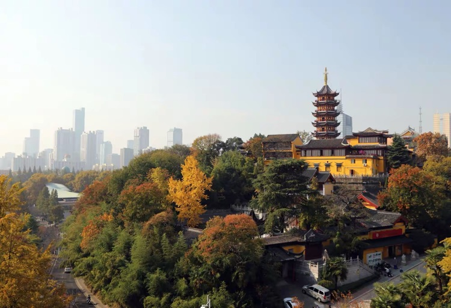

一座雞鳴寺，悠悠古人心。自朱元璋重建寺院，提名雞鳴寺後，雞鳴寺就活在胡適的詩裡，郭沫若的墨寶裡，朱自清的散文裡，張愛玲的命格裡，徐悲鴻的畫裡……

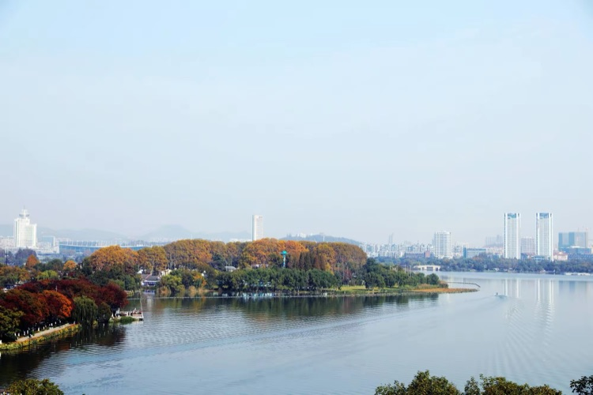

駕駛快艇在湖中飛馳一定令人非常的享受，唯我獨尊的一往無前，放鬆的心情隨水波一齊發散，酷斃了，引得湖邊的樹和建築物忘掉了矜持，倒影也隨波抖動起來。

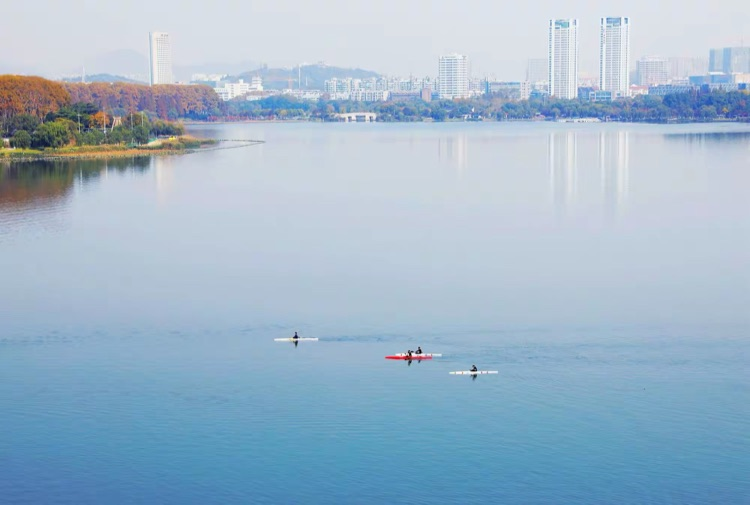

湖上游弋著幾艘皮划艇，白艇和紅艇生動的點綴著藍色的水面，運動員左一漿、右一漿，得心應手，人艇合一，皮划艇在靜靜的湖面上飛快的滑過，速度對寧靜的強烈衝擊，使畫面充滿青春的活力和浪漫的想像。

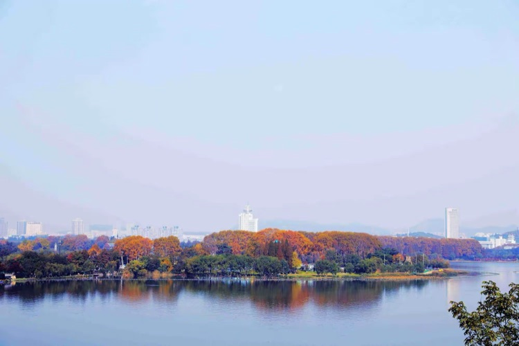

四面環水的花園，稱之為洲，玄武湖共有五個洲，環洲、櫻洲、菱洲、梁洲、翠洲。洲與洲之間由湖堤、橋梁和道路連通。因此，整個湖面又被分為為三大塊，北湖（東北湖、西北湖）、東南湖及西南湖。

洲上的樹木隨四季的風，變換造型和色彩，對比水中晃動的倒影，讓人說不清喜歡真實的景物還是湖面的虛幻；感受水中的誇張變形，讓人不知道更愛自然還是去猜隱藏的深沉。

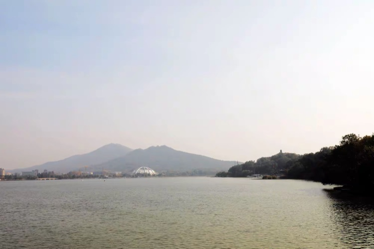

湖的東邊是紫金山，南京的龍脈。主峰北高峰居中偏北，海拔448.9米，為寧鎮山脈之最高峰。畫面中稍低一點的天堡山為第三峰，現為紫金山天文台的所在。湖的東南邊是九華山，因山南有小九華寺而得名，山頂建有五級四面的三藏塔，塔內蓮花座下藏玄奘法師頂骨舍利。

傳說當年秦始皇為斷南京的帝王之氣，放風在紫金山埋了金，卻默許百姓去挖，藉此挖斷南京的龍脈。於是南京就得到一個豪氣但有點尷尬的名字「金陵」，埋金的地方叫「紫金山」。

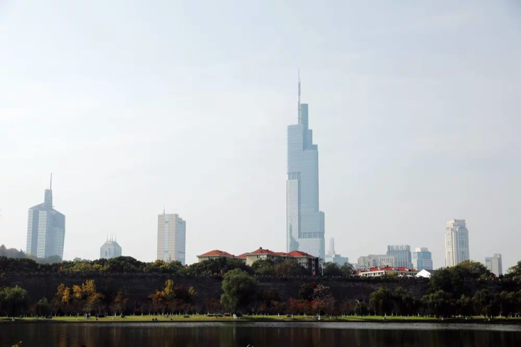

湖的西面是明城牆，城牆內許多高樓拔地而起，450米的紫峰大廈2008年剛建成時為世界第七高樓。民間傳說紫峰大廈是喻玄武湖黑龍所建，且紫峰大廈外牆玻璃為層層凸起狀，視為龍鱗；整體猶如龍身，遒勁有力，從遠處看確實很像一條巨龍欲騰空而起。

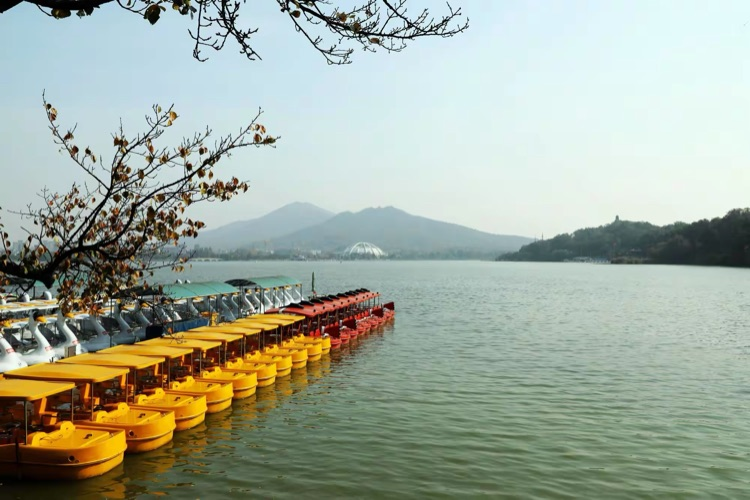

多少年以來，從雞鳴寺求得姻緣的男女，都會入湖盪舟，妹妹在船頭坐，哥哥在船尾劃。過去的人比較靦腆，妹妹不知道應該面對哥哥坐，還是背對哥哥坐。湖裡兩種坐法都能看見，湖邊的人也無法判斷那種的關係更加親密。船是按時間租的，哥哥負責劃，妹妹負責看時間，就怕超時要多付錢。最多的對話是：「還有多少時間？」「還有XX分鐘」，「趕快往回劃吧」。

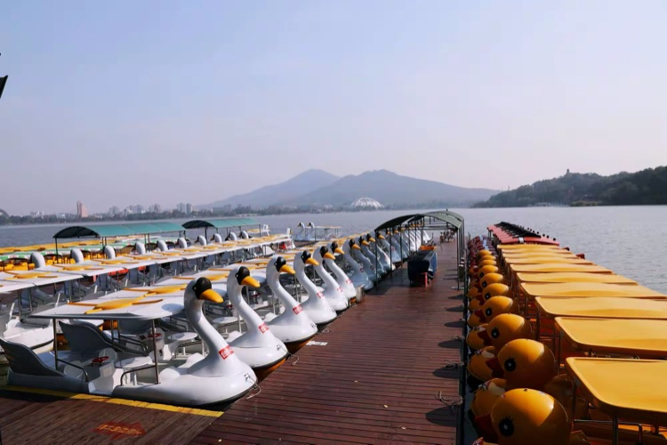

「鵝鵝鵝，曲項向天歌，白毛浮綠水，紅掌撥清波。」

看見此情此景，很多人都會詩性大發，脫口吟誦。

一溜的鵝形、鴨形遊船停靠在碼頭，都是電動的，開關一按，船就自動前行，拐彎靠方向盤，船身寬大，運行起來既平穩又安全。

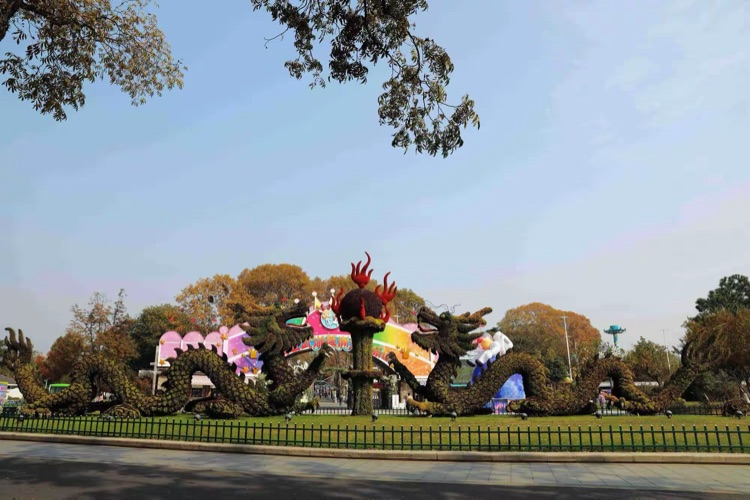

菱洲花壇內的「二龍戲珠」立在那裡起碼有三十多年了，因為龍身上的綠植都是活的，所以人們講這兩條是活龍。菱洲原來是動物園，不但是小朋友，就連大人都喜歡去看一看老虎、獅子、熊貓、猴子等各種動物。動物園搬到小紅山後，這裡現在是遊樂場，仍然是小朋友們的最愛。

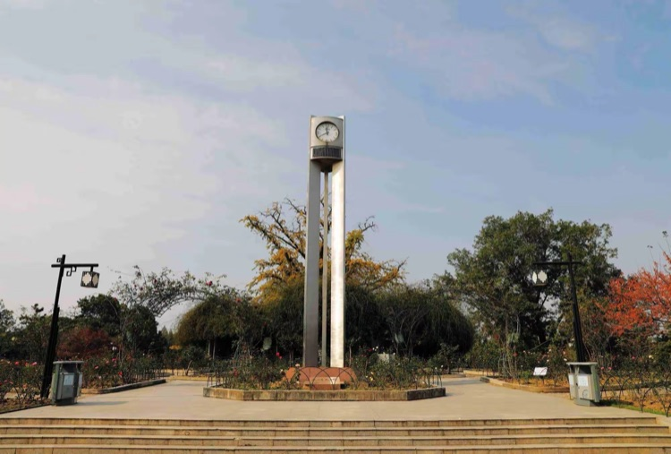

環洲上的月季園四季開滿了各種月季花，裡面的花圃和長廊，是情侶們拍照的經典場景。迎面的鐘塔依舊，幾十年來它要表達的什麼？指針一圈一圈的旋轉，時間一年一年的流逝，你若來就一定能見到我，還有那謝了又開的花。

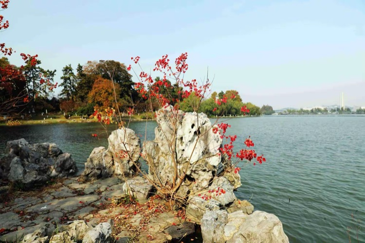

要是放到現在，幾塊伸向湖中的太湖石一定是「網紅打卡勝地」，背景中可見寬廣的湖面和諾那塔。當年可是玄武湖內一處較著名的攝影點，附近掛著「國營玄武湖攝影」，人多時還用繩子攔著，遊客可以花一塊錢左右攝影留念，一底兩片，全國包郵。現在前來攝影的人少多了，不知什麼時候長出了一顆小樹，這幾天樹上還留著少量的葉子，石頭上、湖水中還有幾點零星的碎紅。

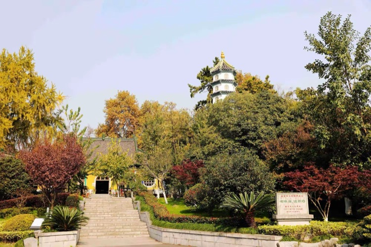

這就是南京人常說的喇嘛廟。殿前的東南方向有一座九級六面仿唐宋風格的寶塔正是諾那塔。嚴格說，這不是廟宇，沒有喇嘛，只是一座諾那紀念館。大殿裡陳列著釋迦牟尼、文殊菩薩等佛像，佛像前放著一些水培的花草植物以及供品。

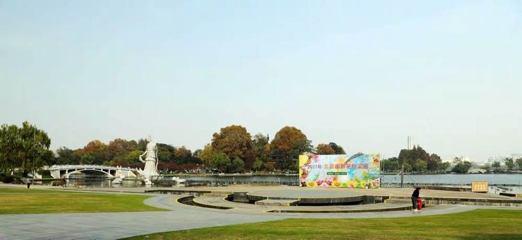

蓮花廣場在環洲的北角，臨水舞台的位置原是放露天電影搭銀幕的地方，岸邊有鋼管焊接的圍欄，50歲以上的南京人應該記得，他們或許還有依靠在圍欄上，拍過以芳橋為背景的照片。

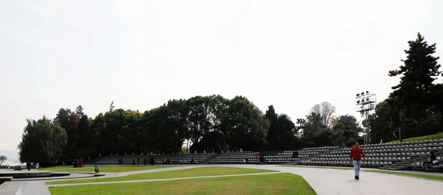

以前夏天的週末，你可以在當天《新華日報》的夾縫中看到玄武湖放露天電影的名字和放映時間。選擇這裡放電影，是因為對著湖面正好是一斜坡，看電影的人在斜坡上選好位置，墊上一張報紙或塑料布，一邊乘涼，一邊看電影。現在斜坡修成看台，觀眾席整整齊齊擺著凳子，如果玄武湖還放露天電影的話，看的人好像真的不那麼隨意自在了。

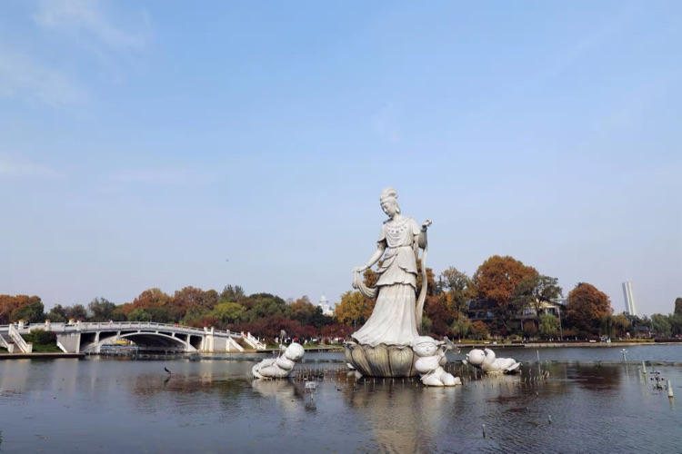

蓮花仙子的塑像是近幾年新建的，周圍還有四個憨態可掬的蓮花童子，和散落湖中的大型噴泉，塑像充分表達了金陵女子的美麗溫柔、多情善良，還有厚重的責任和慈祥的母愛。

蓮花仙子好像在嘻說著幾個放任天性的童子：「呆樣！」這句話是地地道道的南京話，有點欣賞、有點鼓勵、有點批評、有點希望。反正只有說過這句話和聽過這句話的南京人才能細細的品味出這句話的完整的含義。

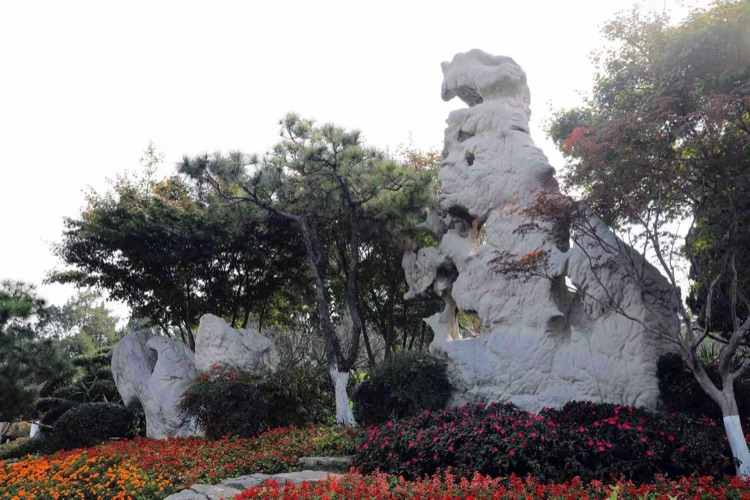

「米芾拜石」由三塊天然巨石組成，2001年分別從山東、安徽移來，其中一塊形似辟邪，一塊形似奔跑的「麒麟」，還有一塊形如「石癲米芾」。組合後，恰好形成「米芾拜石」意境。三塊巨石材質接近，一切渾然天成。

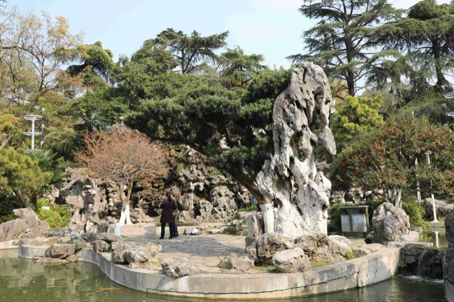

迎著玄武門是童子拜觀音石，此石為北宋時期的花石綱遺物，屬太湖石中罕見的珍品。明初被收入中山王徐達府中，1954年由全福巷遷至現址，其中觀音石頂如披帽，身形玉立，童子石形態虔誠恭敬。

同年，玄武湖園林工人以這兩塊奇石為中心，根據疊山造景的手法，採取以水池為中心的造園方式，建造了玄武湖建國後的第一個著名景點——假山瀑布。

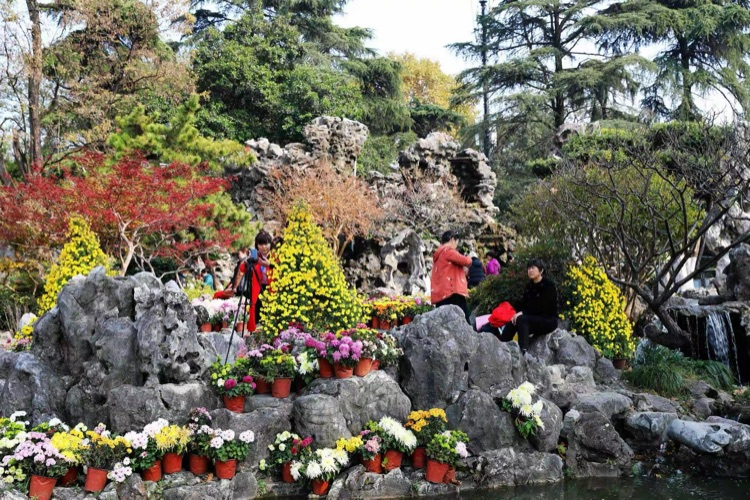

文章結尾的時候，怎麼寫也不理想，忽然聽到李健的歌，於是非常崇拜的借用了一下歌詞：

多少年以後 如雲般遊走

那變換的腳步 讓我們難牽手

這一生一世 有多少你我

被吞沒在月光如水的夜裡

多想某一天 往日又重現

我們流連忘返 在玄武湖畔

多少年以後 往事隨雲走

那紛飛的冰雪容不下那溫柔

這一生一世 這時間太少

不夠證明融化冰雪的深情
