銀杏樹的葉子黃了，黃的那麼高貴、那麼富有詩意。

<!--more-->

銀杏是非常古老的樹種，出現在地球上大約有二億多年，是中國的特有樹種。銀杏樹長得高大筆直，通常種在道路的兩旁，進了秋冬季節，扇形的樹葉由綠轉黃後，再慢慢的被風吹落下來，美的讓人不願去打掃，任憑它在地上一層一層的鋪疊。

中國人在寺廟裡非常虔誠，銀杏樹黃了以後，寺廟的色彩顯得更有禪意，相關銀杏的視頻在網上看見的也越來越多。在南京，先看見毗盧寺銀杏黃了，後來是靈谷寺銀杏黃了，再後來是玄奘寺銀杏也黃了。

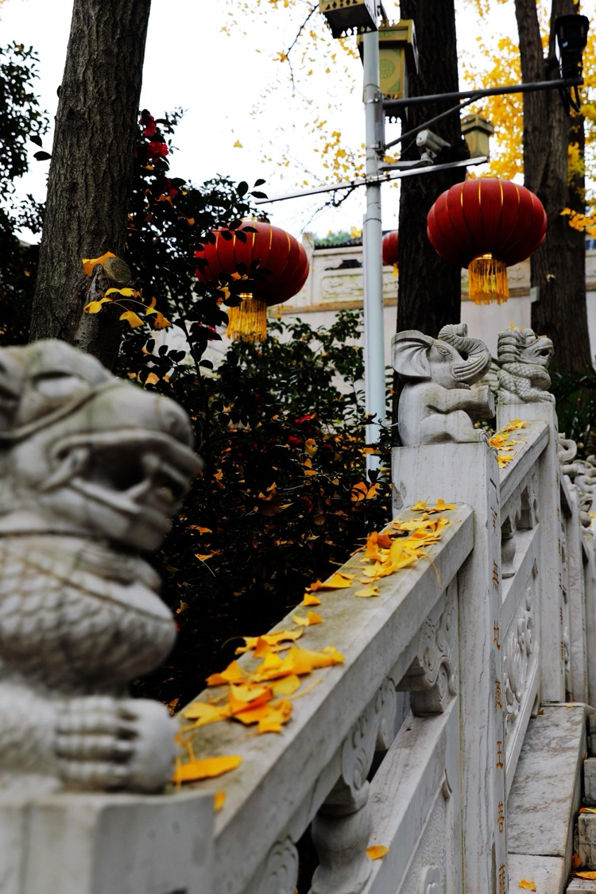

玄奘寺建在九華山的半山腰，香客進寺需通過數十級的石階，石階的兩邊有石雕的護欄，護欄的外邊間隔的種著銀杏。玄奘寺的銀杏黃的最晚，且黃且落，不過要是再遲幾天來，恐怕樹上的葉也要落盡了。

前一天下了雨，工作人員怕濕的落葉會滑倒香客，故將石階上的落葉掃淨。此時，只能見到欄杆扶手上存留的黃葉，自由自在的散落在雕像之間。

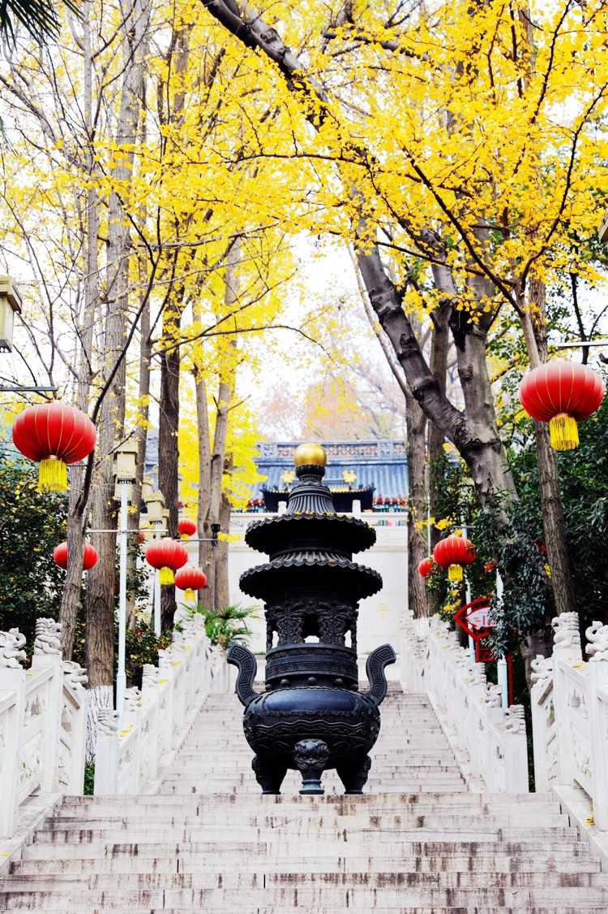

石階的中間立著一個紫銅的香爐，漢白玉的石階和護欄肅穆莊嚴，銀杏的黃葉佈滿天空，大紅燈籠點綴其間，周圍一片祥和安寧。

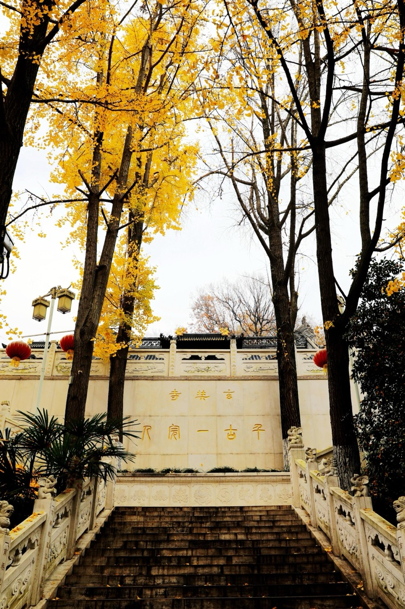

石階的盡頭是一高台，上面寫著「千古一完人」。中國有一成語叫「人無完人」，讀過《西遊記》的人都知道，玄奘法師拒絕了世間所有的誘惑，只有他才可稱之為「完人」。

玄奘寺因玄奘法師而建，在山頂的三藏塔內埋藏著玄奘法師頂骨舍利。

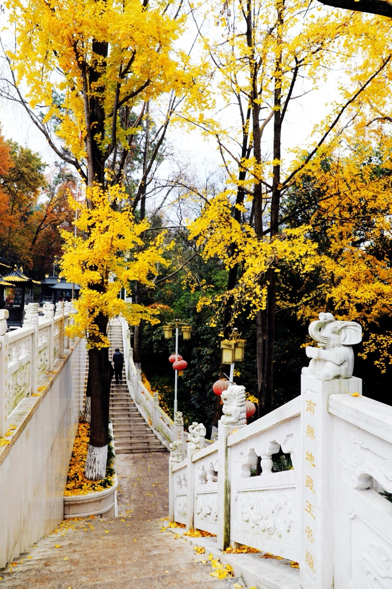

高台的兩側，當然還有石階可以轉上玄奘寺。峰迴路轉，就為讓你走走、停停、再想想，讓你記住，你來的路和你要去的地方。

如果早兩天來，樹上葉幾乎是滿滿當當，且足夠的黃；紫金山的風吹過來，就會飄起漫天的黃葉；地上層層疊疊，無論是石階上還是矮小的灌木上盡是黃葉。

而到了這幾天，落葉似乎少了好許，宛若中國的山水畫，多了些留白、多出了些可以想像的空間。

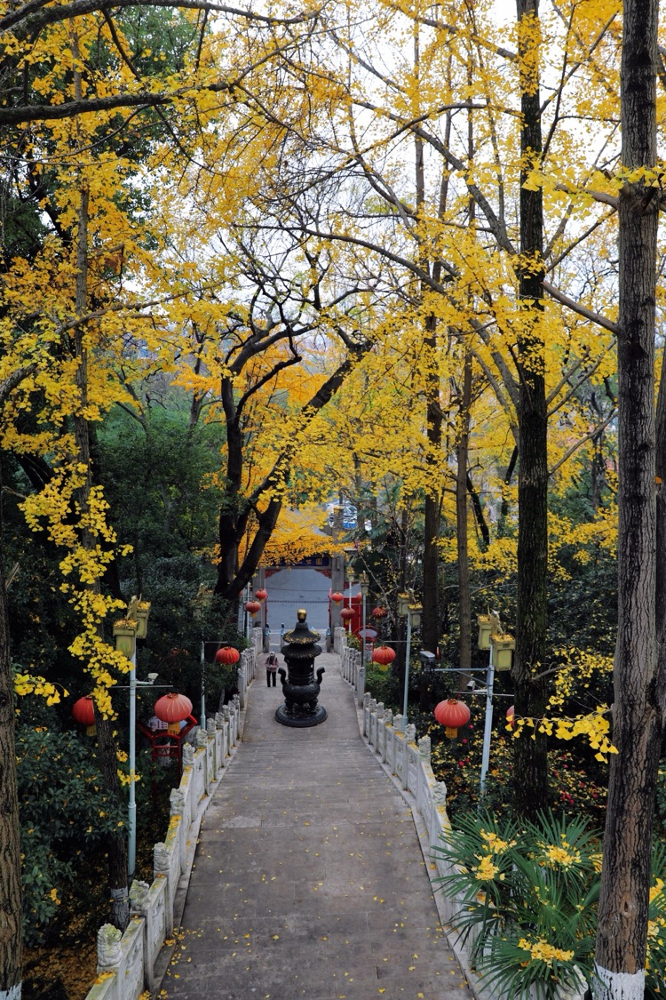

上了高台，憑欄回頭俯看來路，更是一幅靜謐的畫卷。石階路上的階梯和平台，讓護欄形成了彎曲起伏，質樸豁達。銀杏的黃葉在樹枝間分佈的自然隨意，隱約流淌著讓人平靜的旋律，依稀有鐘聲和梵音渺渺傳來。

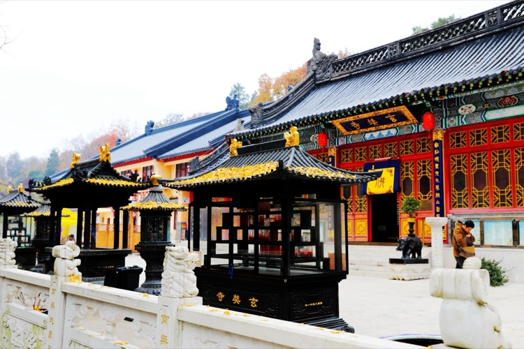

玄奘寺大殿的門窗紅間有黃，門前的簾子上有大大的一個佛字，周圍的禪房一抹黃色的牆，露著紅色的窗。廣場上的香爐裡燃著蠟燭和香，側面還裝有防風的玻璃，頂上堆積的是樹上隨風飄落下的黃葉。

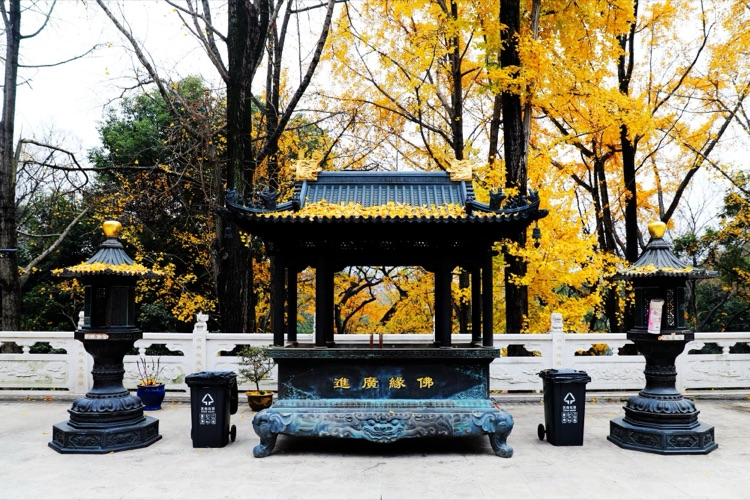

大殿前的香爐做工精良，用來點香的燈台裡面有燃著火苗的油燈。香爐和燈台好像都是紫銅鑄造的，仿瓦的頂上沒有灰塵，只在頂的邊緣積留了一些銀杏葉，一切看起來都顯得那麼隨緣又寧靜，多少年來一直就是這樣祈禱平安，廟裡的僧人和來的香客都認為一切就應該是這樣。人們的願望都是善良的，愛恨總有因果。

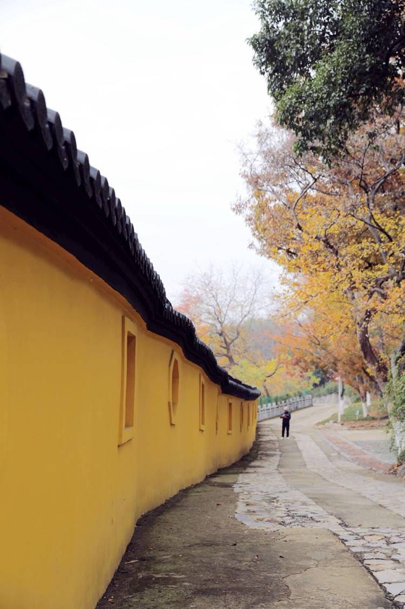

寺後的院牆彎彎曲曲，沿著石板小道通向遠方。是不是這恰好也融入了「曲徑通幽處」的詩情。

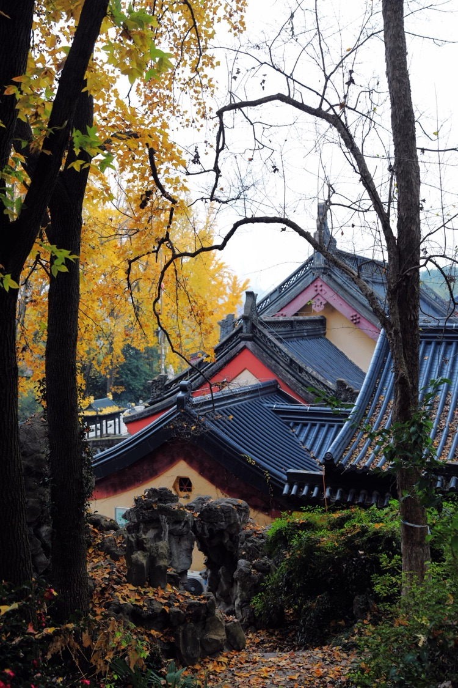

尋來尋去，終於在寺廟的最東頭，一幅「禪房花木深」畫意驀然出現在眼前。

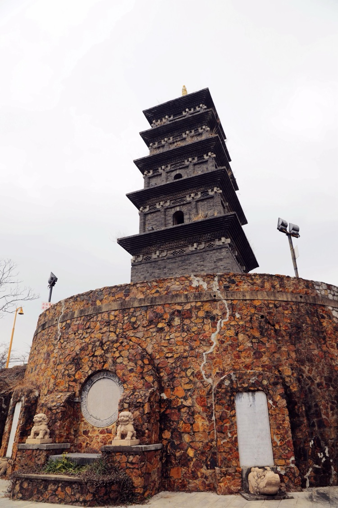

三藏塔系磚建仿木結構，下築圓形台基，塔身為四面五層，高20餘米，採用的是近代工藝。但三藏塔的風格還是類似於唐代風格。塔底層各開四個半圓壺門，南門上面的青磚上刻著「三藏塔」三字。門券內嵌石邊，石邊雕刻花紋。底層下部四周裝飾石質裙圍。塔門有木質柵欄圍擋。塔心室正中是一座蓮花石座，石座上有一四方石匣，就是玄奘頂骨存放之地。

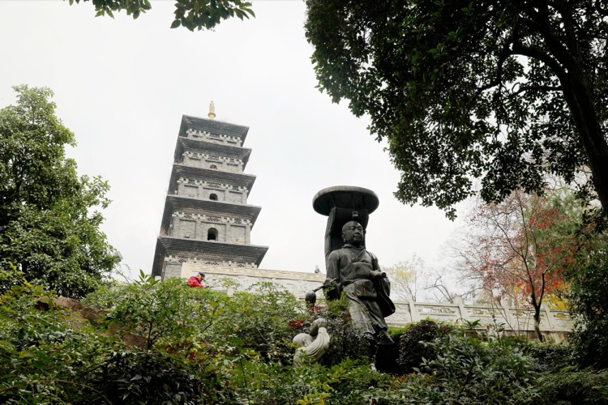

塔前的「玄奘銅像」高4.5米，重3.5噸，仿其天竺取經長途跋涉的苦行僧形象‌。銅像於2001年在三藏塔下落成，是九華山公園內的重要佛教文化標誌之一‌。

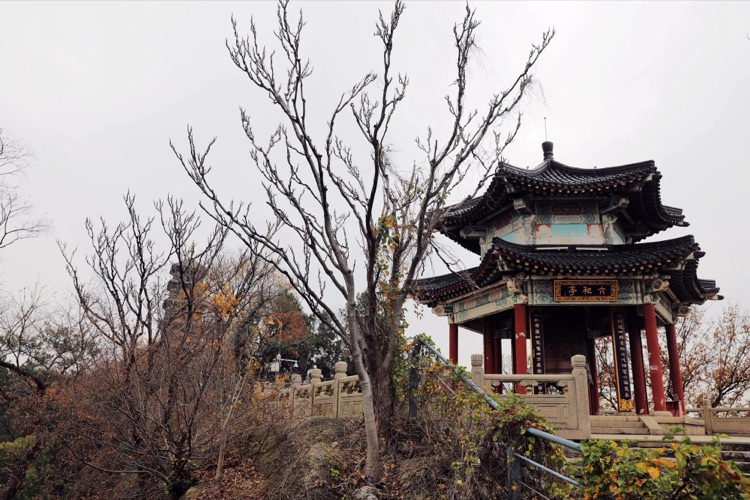

六和亭位於九華山頂，三藏塔西側，六角重簷錐尖頂。六和亭與三藏塔遙相呼應，是九華山的觀景平台。向北遠眺，鍾山林海茫茫，玄武湖水碧波盪漾，明城牆古樸厚重，山水城林盡收眼底，頓感「九華丹青」之妙。

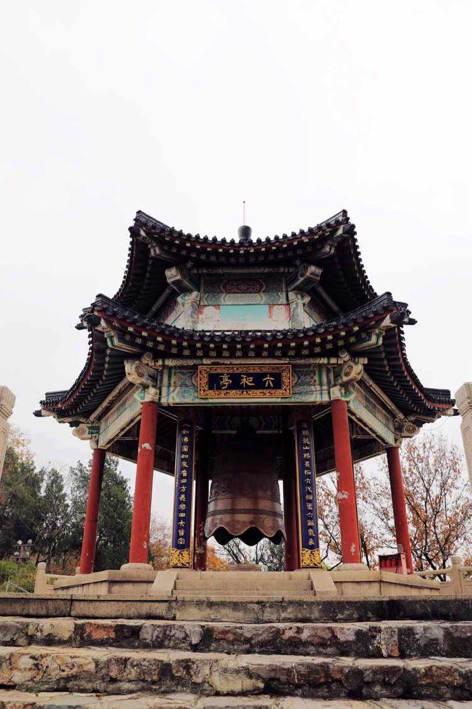

亭內正中置六和鍾，名為「六和」。

取自佛教思想：

戒和同修（在法制上，人人平等）

身和同住（在行為上，不侵犯人）

口和無諍（在言語上，和諧無諍）

意和同悅（在精神上，志同道合）

見和同解（在思想上，建立共識）

利和同均（在經濟上，均衡分配）

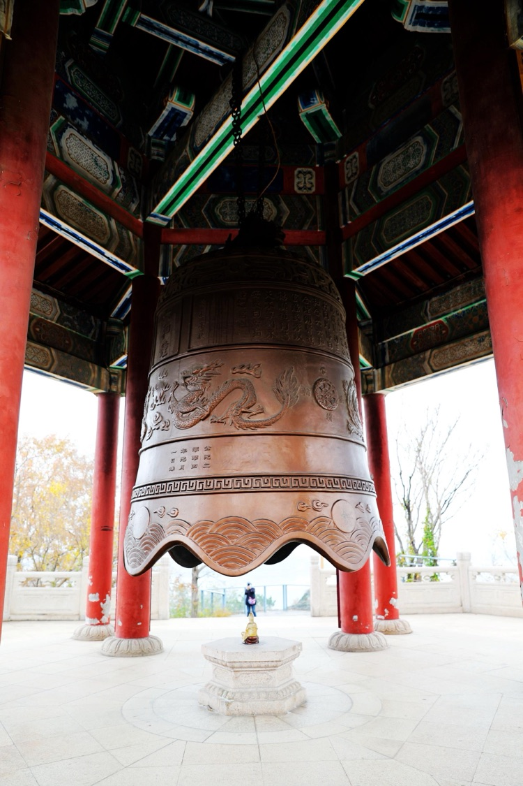

悟之：乃一鍾、一人、一佛也。

（上述照片均拍於2024年12月12日上午）
