「燕子磯」是南京的地標性景點，很多住在南京的人雖然沒去過燕子磯，但他一定知道燕子磯在南京的那個方向。

<!--more-->

燕子磯位於幕府山東北角，作為長江三大名磯之首，燕子磯有著「萬里長江第一磯」的稱號。燕子磯海拔36米，山石直立江上，三面臨水，形似燕子展翅欲飛，因此得名。

古往今來，因人群聚集而形成城市，來的人多了，就形成大城市。景點也一樣，來的人多了，故事多了，景點的名氣就更大。在歷史景點尋古訪幽，品味前人的感受，感受不同時空帶給自已的暢想，可以能增添愉悅、淡化煩惱、開闊胸襟、充滿希望，又何樂而不為之。

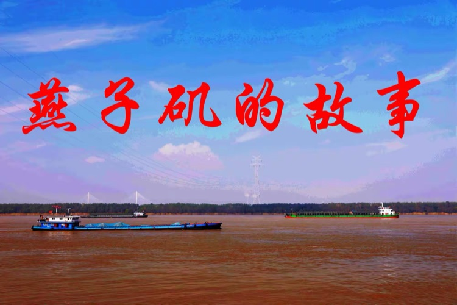

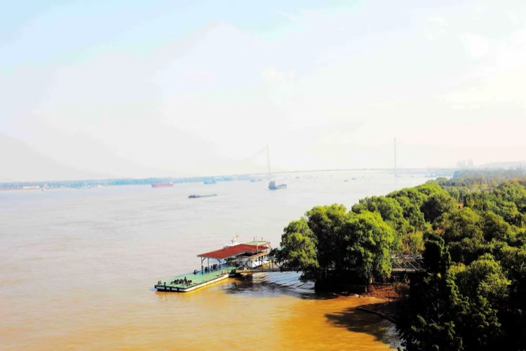

燕子磯自古是渡口，現在還是。不知道古時是因來來往往過江的人多了，看見這塊臨江石頭像燕子而將它取名燕子磯；還是因這塊像燕子的石頭方便記憶，在磯旁建了燕子磯渡口。

登臨磯頭，看滾滾長江，浩浩蕩蕩，一瀉千里，蔚為壯觀。向東望去，燕子磯渡口碼頭近在咫尺，綠植環繞，卻鮮見水石難分難離的江灘。遠處的長江二橋跨江而立，南北兩座近200米的索塔巍然挺立，160根斜拉索平衡著長長的橋面，簡潔明快的線條既張顯了大橋的力度，又表達南方那種輕描淡抹卻難以掩飾的秀麗美。

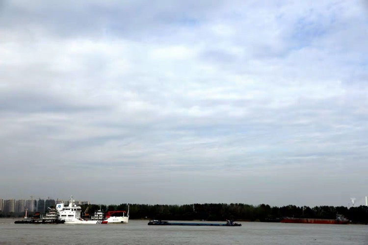

各種輪船千姿百態，客輪富麗華貴造型別致，貨輪巨大的甲板上堆滿集裝箱。水線上高大船身而不見貨物的是油輪，水線上船身低淺的是散裝貨輪。色彩斑斕的船體本身就是江面上的流動風景，我卻獨獨喜歡船身低淺散裝貨輪，因為只有它才能達到古詩畫中那「一葉扁舟」的意境，在寬闊的江面上散發著一點點孤傲。

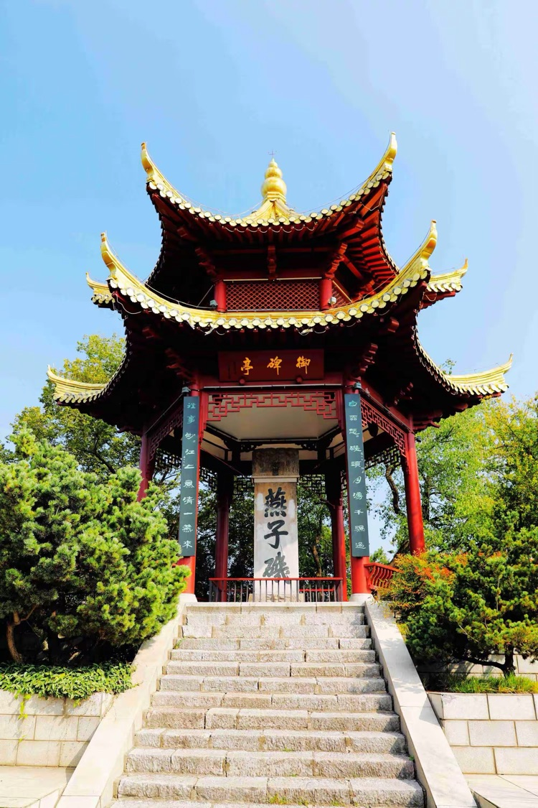

乾隆曾六下江南，五登燕子磯，御碑亭上「燕子磯」乃是乾隆皇帝御題。燕子磯景觀有：燕磯臨流、燕磯夕照、吞江醉石、勸戒碑、御碑亭、俯江亭、觀瀾亭、摩崖石刻、夕照樓等。

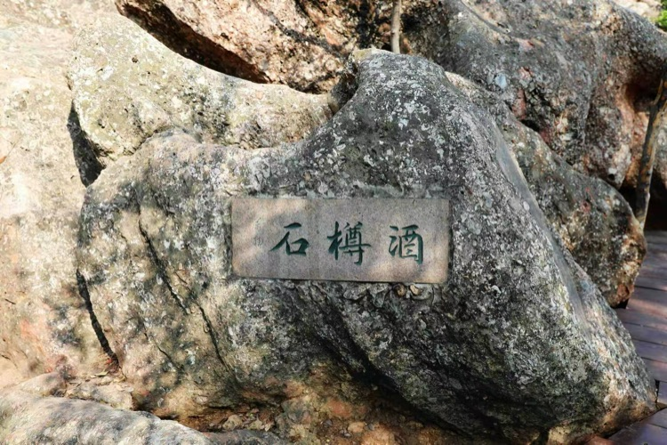

歷代文人騷客，英雄名流慕名遊覽，紛紛賦詩作詞。1300年前，官場失意的李白順江而下，被燕子磯的山色吸引後登臨磯頂，以石為樽，江水為酒，把酒問天，結果為燕子磯留下了一個「酒樽石」和「吞江醉石」的傳說。

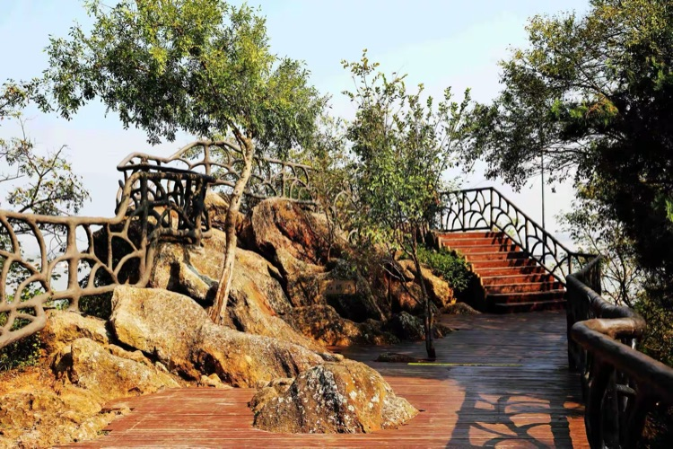

「燕子磯一仰一個」是南京的一個民謠，具體流傳了多少年，雖無從考證，但現在50歲的以上人一定還記憶猶新。南京話「仰」發「兩（liang）」音，「一仰（兩）一個」不是指一種食品，而是特指跳崖自殺的行為。據資料記載，過去數百年間，燕子磯常常有失意之人在此輕生，曾經是個著名的「自殺聖地」。

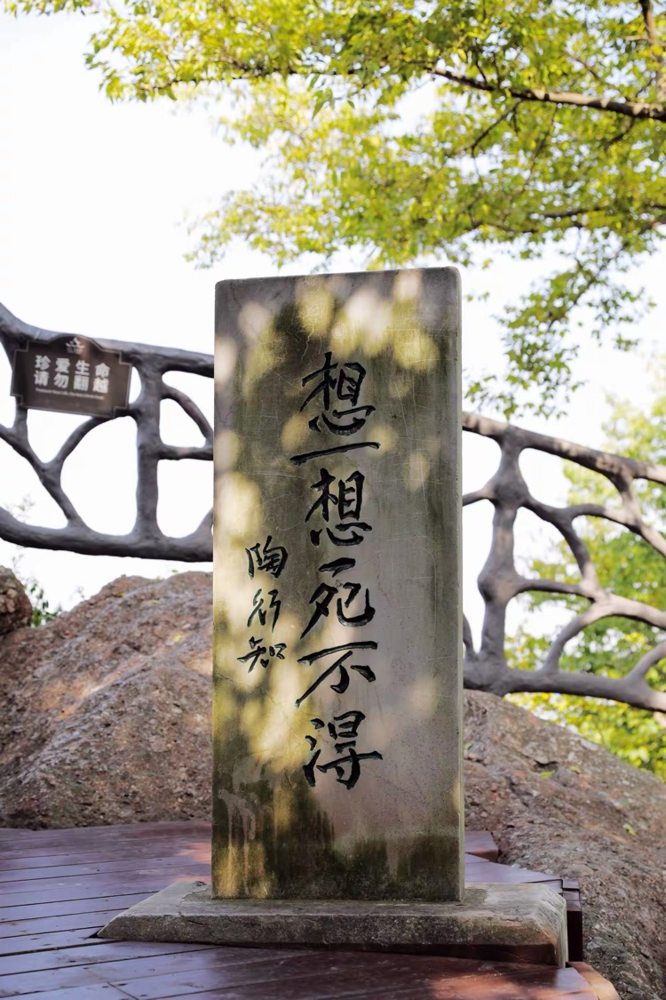

近代大教育家陶行知先生在曉莊師範任教時，得知此事，非常痛心，逐在磯頂立一木碑，並親筆題寫「想一想，死不得」六個大字，碑後面還寫著兩行春風化雨般的勸誡語，此碑當年確實令很多人幡然醒悟，挽救了不少生命。近年重修燕子磯公園時，南京市政府又立了塊石質的勸誡碑，磯頂增加了護欄和警示牌。

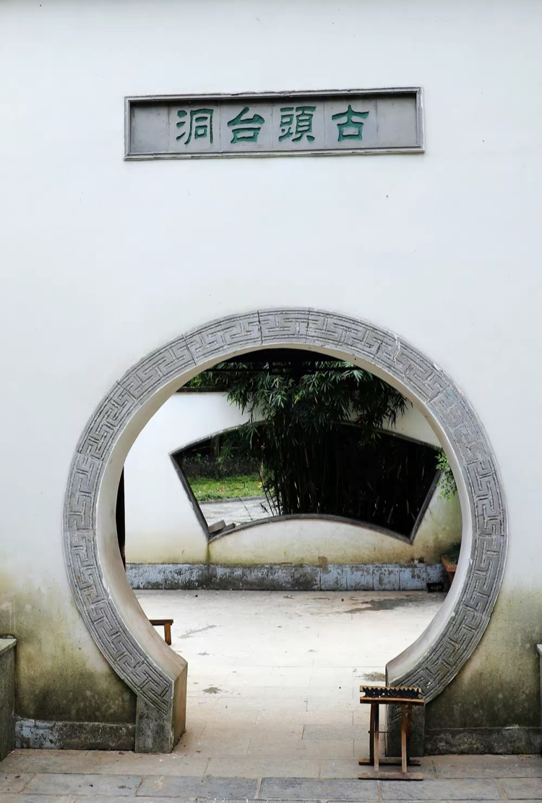

在燕子磯西南方沿江的懸崖上有若干個石灰岩溶洞，古時遊記中稱為巖山12洞，其中主要的有頭台洞、觀音洞、二台洞和三台洞。

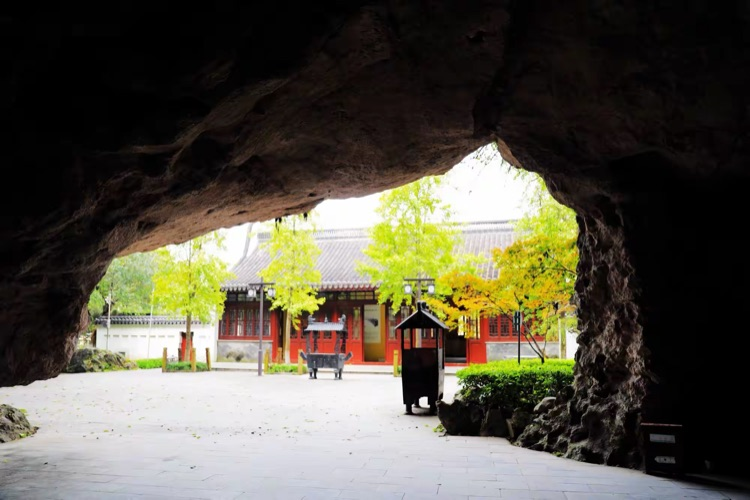

頭台洞深約12米，寬約10米。是以大地為平台的洞，入口山腳，出口山腰，洞中蜿蜒曲折，洞中有洞，洞中套洞，通往山上的路現已封閉，有點遺憾。

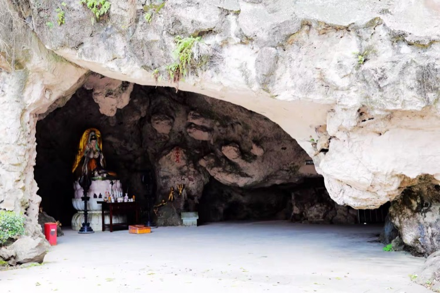

洞中供奉的是「施藥觀音」，施藥觀音是三十二觀音相之一，右手撐頰，倚於膝上。手持藥草，把藥施予病人，消除痛苦，除苦施樂，故得此名施藥觀音，也稱施樂觀音。山洞中，離施藥觀音不遠的岩石上刻有：犀牛望月。下面光突的岩石上正趴著一隻生動有趣抬頭的犀牛，因而得名。

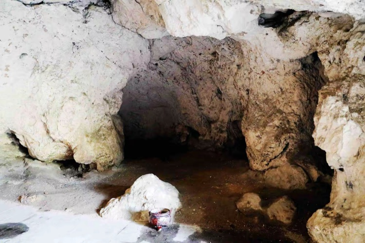

傍邊的小洞內的鐘乳石既為「龍牙滴水」，相傳明太祖朱元璋到頭台洞巡遊，看見一個老和尚捧著缽子翹首望滴，太祖覺得奇怪遂問老和尚在做什麼，老和尚說這是龍牙滴水煮茶清醇爽口亦可延年益壽。老和尚隨即煮茶獻給太祖，太祖品完後覺得確實清醇爽口，隨興寫下別具一格的一筆「壽」字。

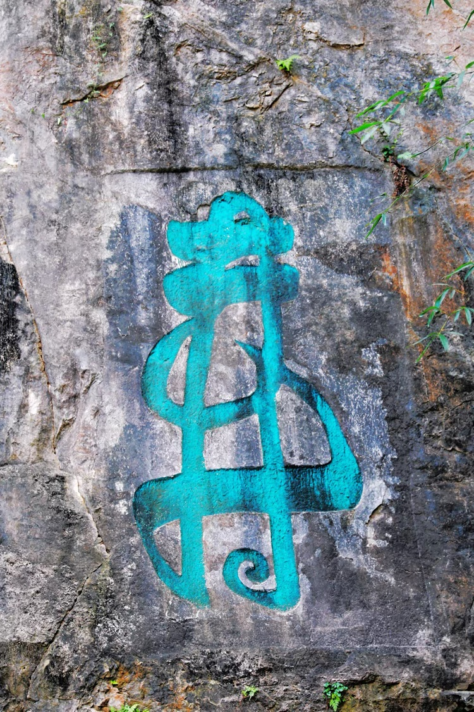

後人將「壽」字刻在頭台洞西側崖壁上，巨大的「壽」字有3米高、1米寬。

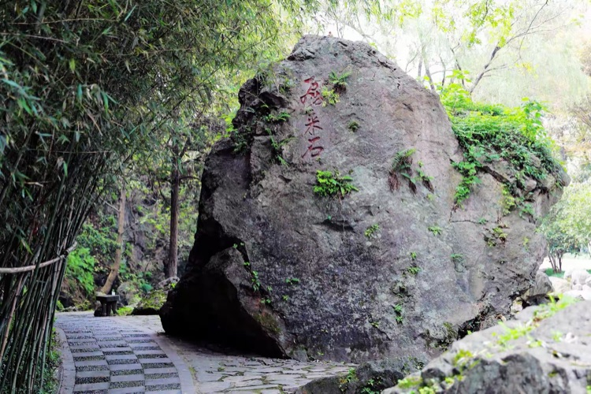

壽字剛刻好，就從天上降下一塊大石頭，變成一位大將守護在壽字旁，後人稱之為「飛來石」。

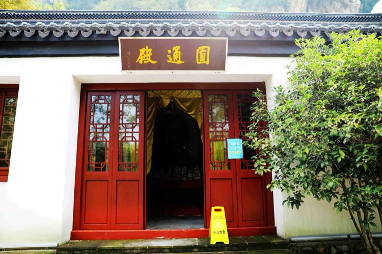

在頭台洞前面有一座佛殿，叫做圓通殿，始建於明代。

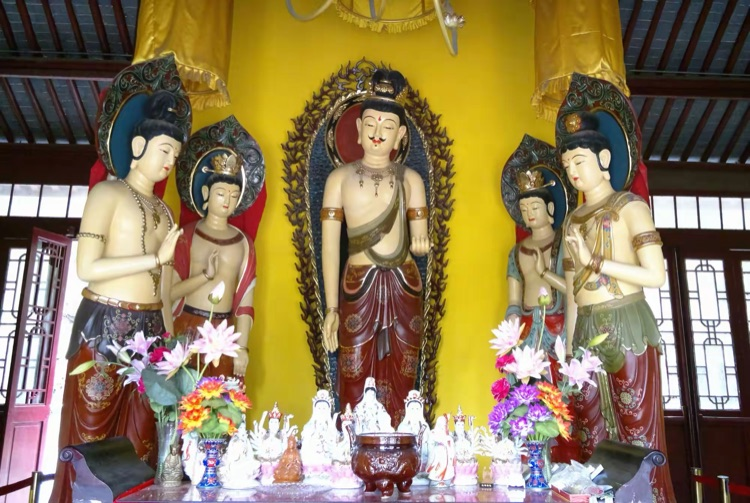

一進殿門，就見到「圓通殿」裡供奉的是長鬍子的觀音菩薩，旁邊站著4個童女。佛教的《楞嚴經》上說觀音菩薩能現32應身，至於是男是女，則是根據需要而顯示出不同的應身。

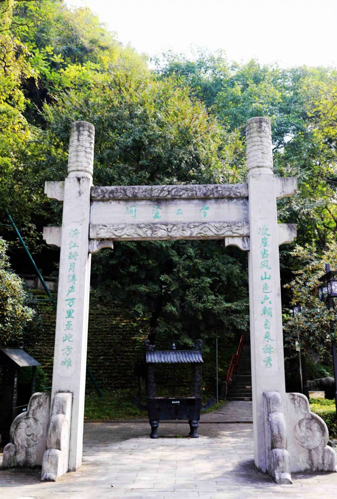

不知道什麼原因，二台洞前立有石坊，上書「古二台洞」。

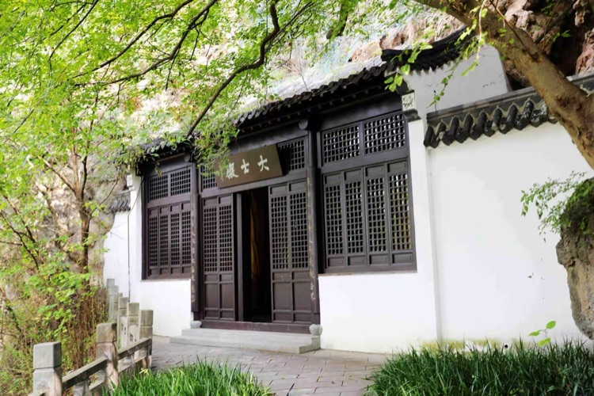

再往上登幾十級石階，就見半山腰中建有「大士殿」，原來大士殿和二台洞已融為一體。

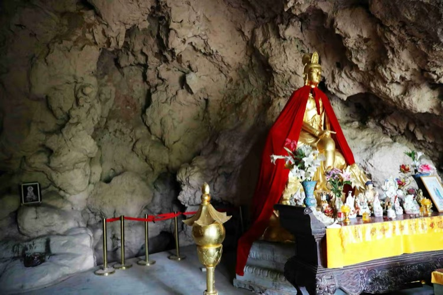

二台洞裡供奉著龍頭觀音，龍頭觀音也是觀音菩薩32應身之一，喻平步青雲、步步高昇。

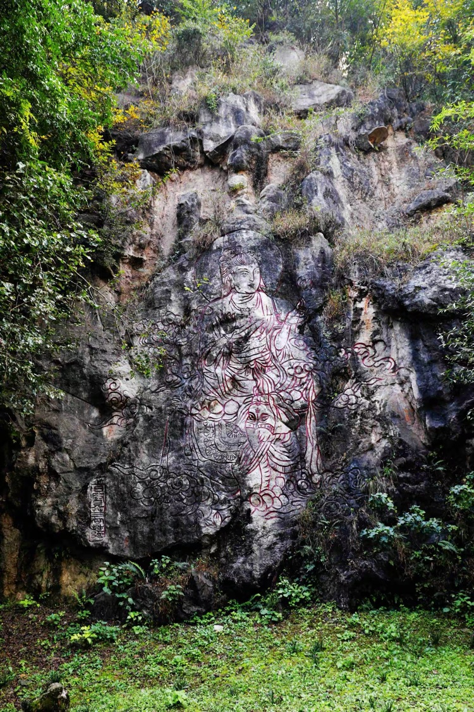

二台洞周圍還有普賢菩薩石刻。

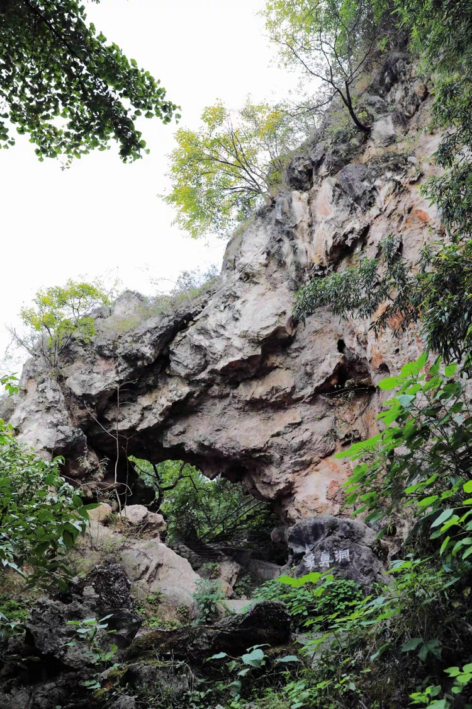

天然形成的象鼻洞。

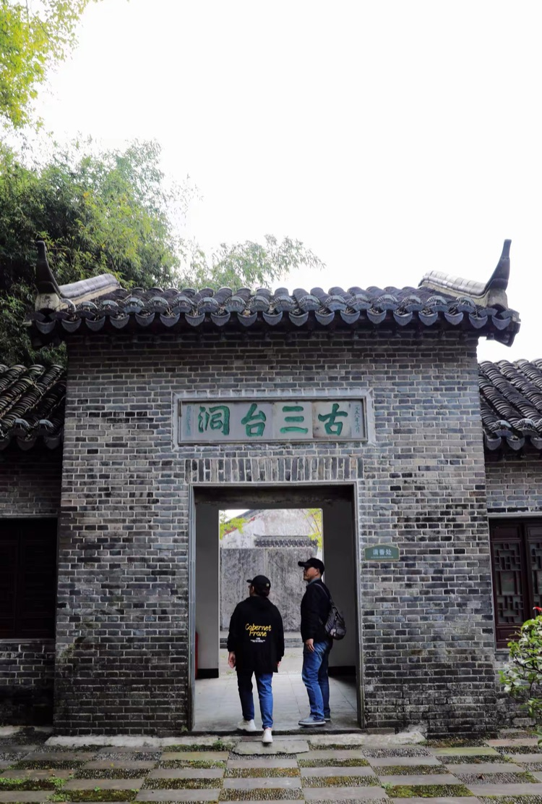

三台洞最為曲折深廣，三台洞分上洞、中洞、下洞。

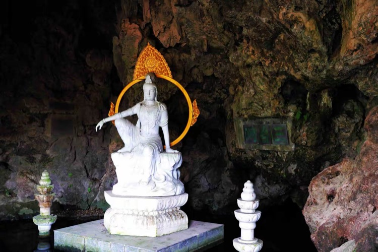

下洞有一汪清泉名觀音泉，洞內供奉的是水月觀音，寓意千里姻緣一線牽，保佑愛情甜蜜。

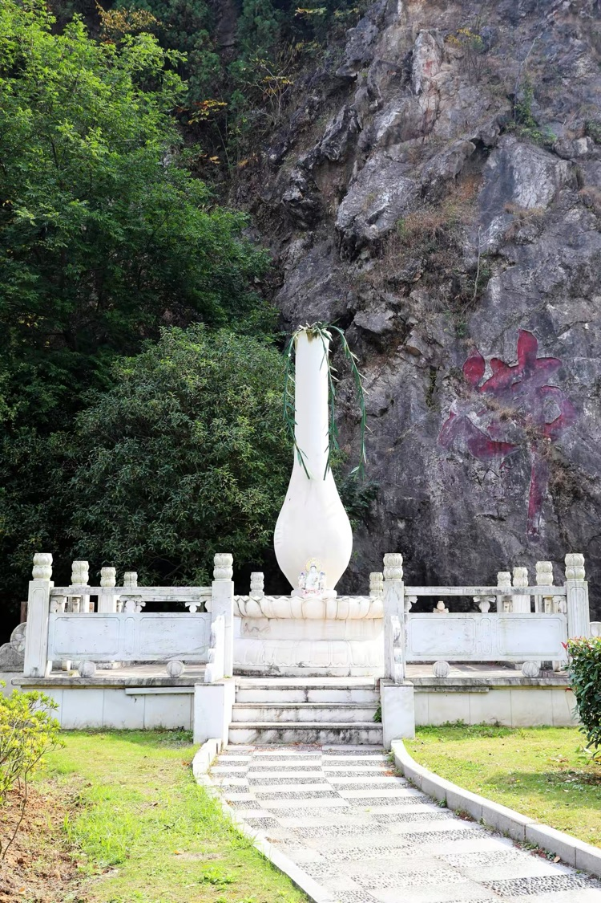

觀音的淨瓶。

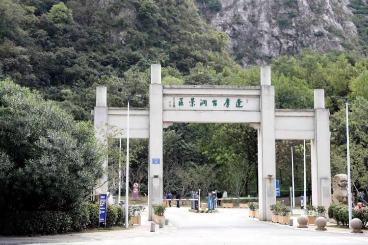

出了三台洞沿著長江再向西的幕府山上有個達摩洞，相傳達摩渡江前在此洞停留過，因此「一葦渡江」的故事一定發生在附近江岸。

這個景點原先是南京白雲石礦作業場，開山採礦形成的一個陡峭的宕口。通過對宕口進行了地質災害治理，清掃掉破面的碎石，對破面噴錨，現行進行格構梁加固，把山體坡面固定住，並在框架梁外面掛網，再封閉保護。山體前面的廣場建造了鋼筋混凝土框架，框架的表面用GRC材料包裹起來的。而洞窟能模擬出原生態來，是GRC材料起到類似與天然石材，顏色與周圍山體融為一體。百態達摩景點共用近3萬平方米的GRC仿石材。

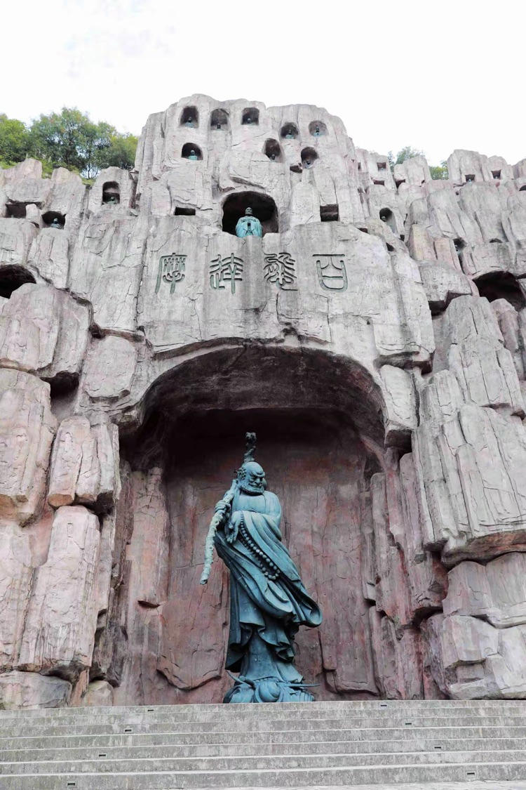

百態達摩雕塑一層7尊，二層9尊，三層以上85尊，其中一層為主雕塑「一葦渡江」更是再現了達摩自幕府山江邊渡江北上的神話傳說。

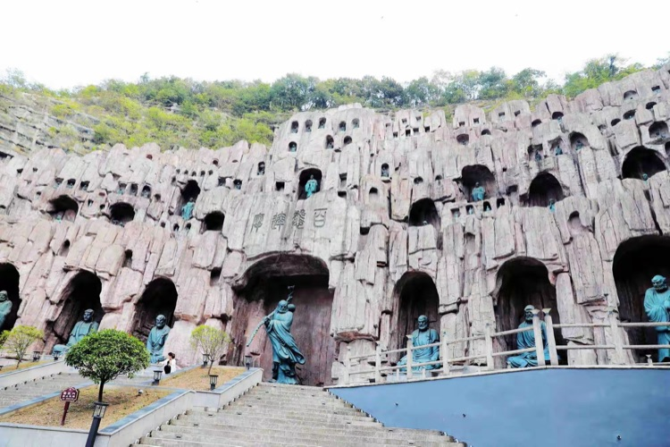

達摩是南天竺人，全稱叫菩提達摩，是古印度十分有名望的婆羅門神姓，為南天竺香玉王的第三子。達摩是佛教中西天二十八祖，也是中國禪宗的初祖。 梁普通年間（公元520~527年），達摩從印度航海來到中國廣州，弘揚佛法，以禪法教人。

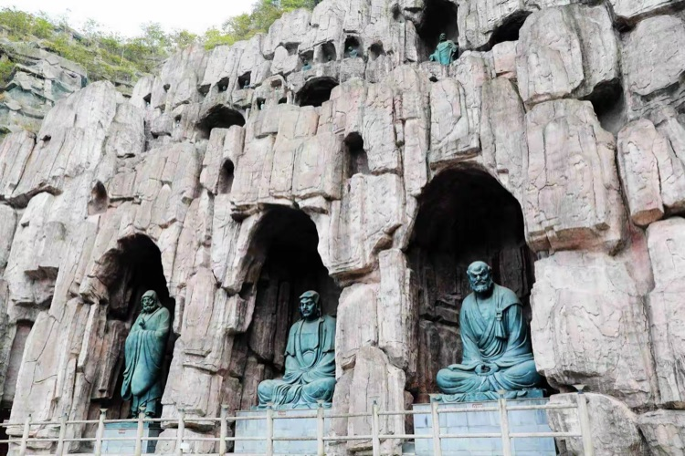

遺憾的是，梁武帝信奉小乘派，主張自我解脫。達摩是禪宗大乘派，主張面壁靜坐，普渡眾生。每次談論佛法，兩人總是話不投機，於是達摩便有了渡江北上傳法的想法。達摩北渡之前，還見到了當時在南京雨花台上講經說法的高僧神光，兩人對佛法的見解也有分歧，這下更堅定了達摩渡江北上的信心。

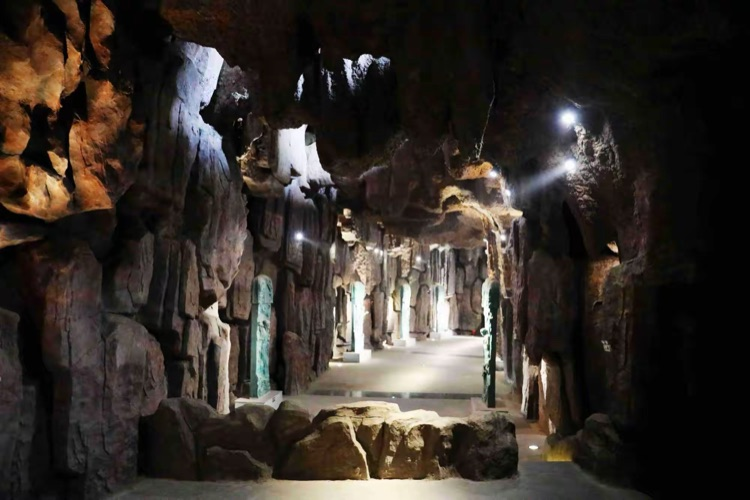

達摩來到江邊，折了一根蘆葦投入江中，在江水中的那根蘆葦忽地開出一蓬蘆葦花來，而且昂首迎風，五片蘆葉伸展開來，於是達摩赤腳踏上，飄然而過。達摩渡江北上，前往嵩山少林寺，後在河南登封五乳峰上的一個天然的石洞中面壁九年，被後人尊稱為「禪宗初祖」。

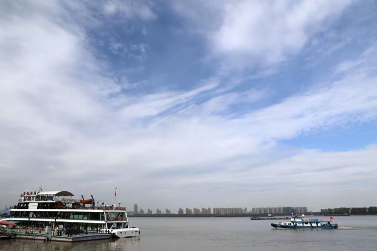

現在的「五馬渡」碼頭是遊輪碼頭，北靠幕府山臨江而建，命名為 「長江傳奇」號的豪華遊輪停靠於此。遊輪航行路線和遊覽路線將包含南京長江兩岸的自然景觀和人文風光。沿途經過八卦洲洲頭、浦口輪渡碼頭、浦口火車站、南京長江大橋、大橋公園、江豚觀賞地、渡江勝利紀念館、中山碼頭、南京下關歷史陳列館、鐵路輪渡棧橋舊址、閱江樓（遠眺）、民國首都電廠和碼頭舊址公園、中山碼頭、慕燕濱江度假區和櫻花觀賞帶、燕子磯公園、長江二橋等沿江知名自然及人文景觀點。

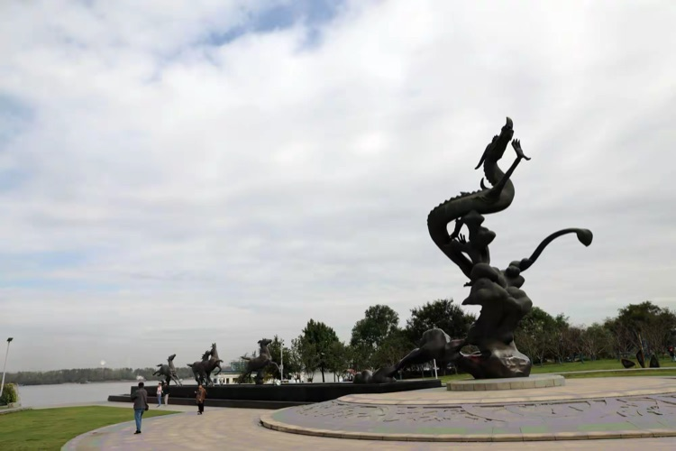

碼頭邊的「五馬渡廣場」 佔地約3萬平米，其中的「化龍麗地」（古金陵四十八景之一），指的就是「五馬浮渡江、一馬化為龍」之處。高達16米的五匹奔馬鑄銅雕塑，栩栩如生地豎立在廣場中央，其中化為龍的那匹馬就是琅邪王司馬睿的坐騎。西晉永嘉元年，也就是公元307年，司馬氏的五個王在這一帶渡過長江，分別是琅邪王、彭城王、西陽王、汝南王、南頓王。十年後，公元317年，琅琊王司馬睿稱帝，建立東晉。這就是東晉建都南京的開始，也是 「五馬渡」的來歷。

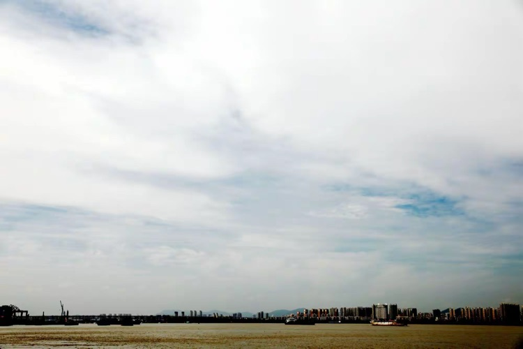

南京人要感受「秋高氣爽」，一定要去長江邊，看看真實的「江天一色」，看看藍天白雲自上而下的「碧空盡」、看看一輪暖日在江面灑下萬萬千千的金色閃光、看看百舸爭流的長江水西來東去的「天際流」。

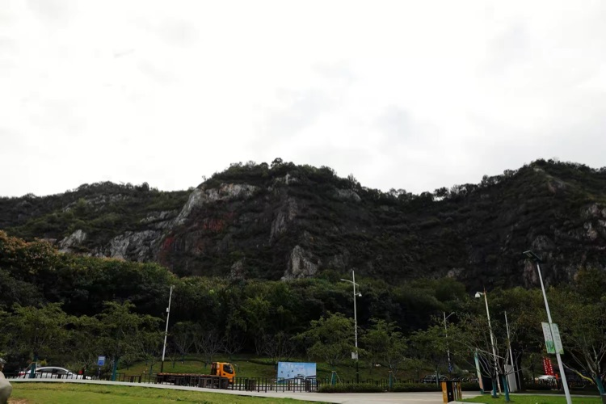

幕府山是一座位於長江南岸邊的丘陵山脈，西起上元門，東至燕子磯，長約5.5公里。燕幕風景區是燕子磯、幕府山濱江風景區的簡稱，是南京市政府近年傾力打造的力作。因遊人不多，有人說它小眾，但卻十分厚重，所謂「北來浪湧五馬，南去一葦橫渡。」多少故事，耐人尋味、任人評說。
