魚嘴濕地公園位於南京市建鄴區河西新城最南端，長江、夾江、秦淮新河三水交匯處。這是一片形狀一頭尖的綠色濕地，被形象地稱為「魚嘴」。

<!--more-->

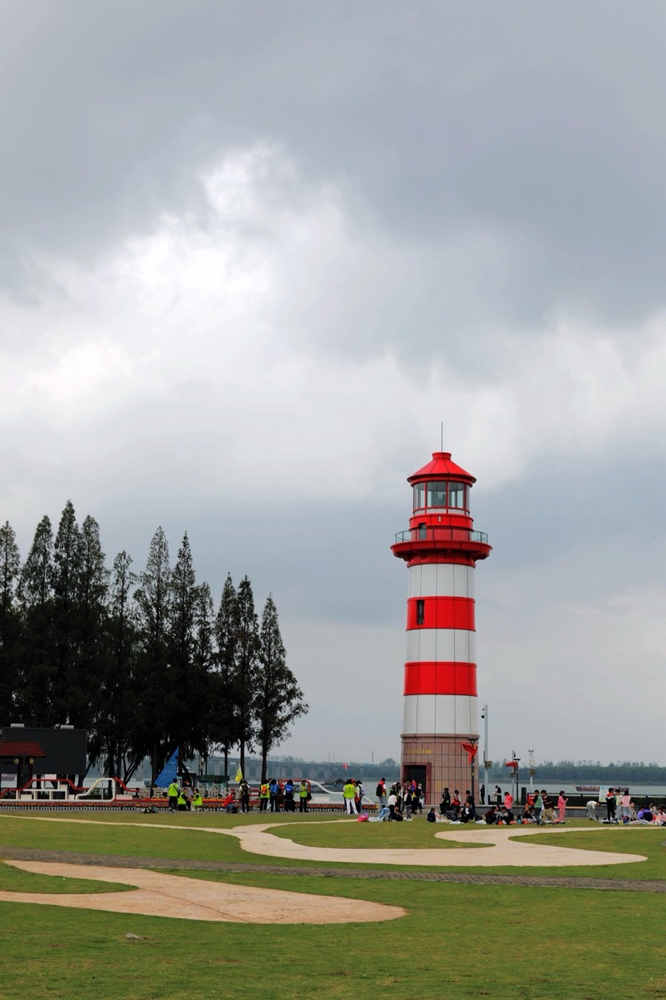

魚嘴濕地公園是免費公園，停車場就在公園大門的邊上。進了公園就見草坪上來秋遊的小學生，歡快的灑滿各個角落。天上雖然烏雲翻滾，但沒人擔心會下雨，加上孩子們活潑的氣氛，反而更感輕鬆愉快，江邊微風習習、溫度宜人。

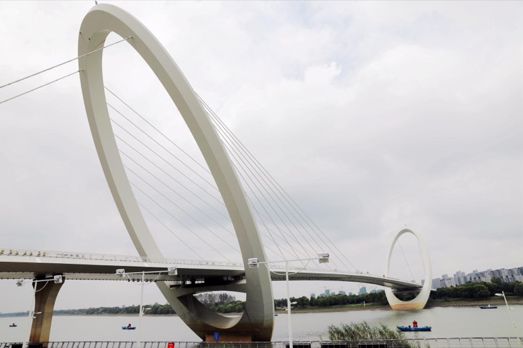

公園裡有電動遊覽車出租，管理人員告訴我們，沿江邊可去「南京眼」步行橋。於是，一行人悠閒的坐著遊覽車，沿著畫著彩虹線標記的道路先去了「南京眼」。

南京眼步行橋是一座集動感和靈秀為一體的橋梁。中國江南古橋以石拱橋居多，南京眼中部微拱起，契合小橋流水人家的中國古典詩意。整座大橋外觀造型簡潔飄逸，兩個白環既相對又似分離，動感極強。

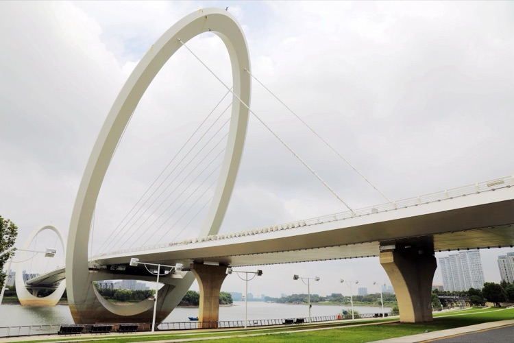

橋身似泛起的漣漪，由寬漸窄，由窄漸寬，行人穿行其間猶如琴絃上跳躍流動的音符。兩個白環支撐起大橋全部重量，橢圓橋塔暗含圓滿之意，鋼鐵之骨則展現了現代感。遠眺兩個白環像一條白玉腰帶系在夾江之上，連接新城和江心洲，城市框架向西延展；走近端詳，白環兩側如羽翼般斜拉的鋼索振翅向上，好像豎琴的琴絃。

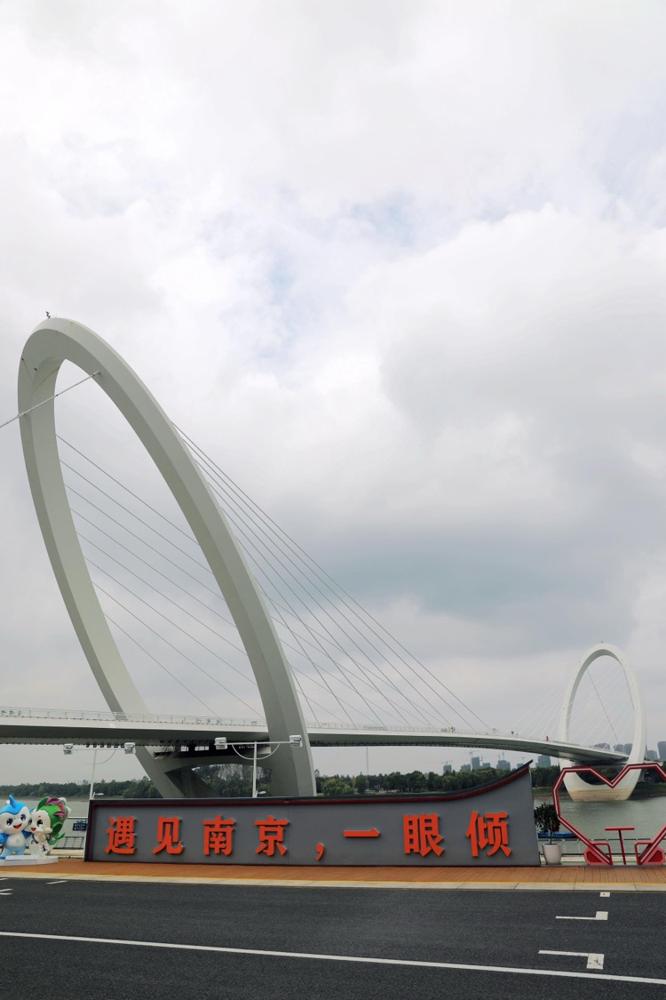

「遇見南京，一眼傾心。」

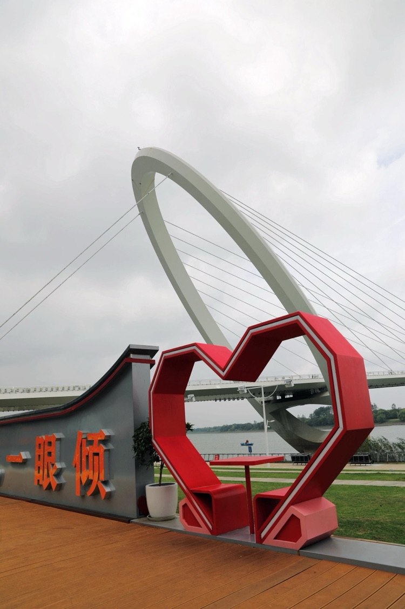

用橋上的「一眼」為愛而傾「心」。

「心形」的紅心，用圖形替代了文字，世界文化之都把中國的象形文字發揮到極致，看比讀真的更加直接、更加震撼嗎？或是讓人理解的能更加深入骨髓嗎？也許坐在「心」裡的人才能真正的體會到：「因為相互有緣，所以一眼萬年。」

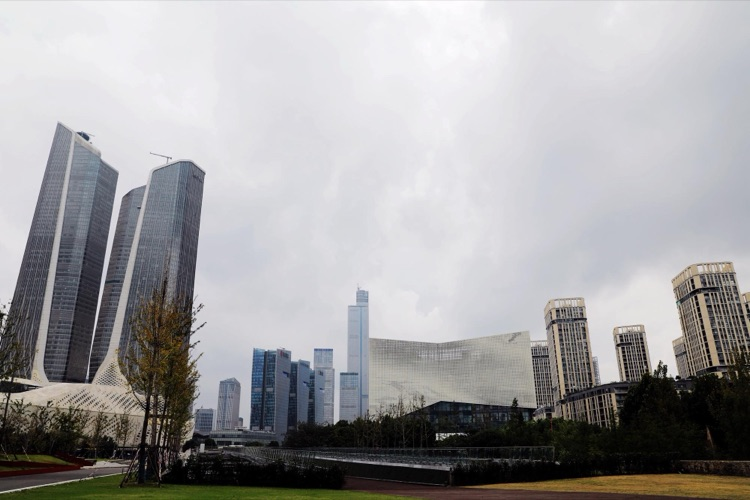

「南京眼」的南面是河西新區，那裡的現代化建築使人感覺進入了科幻、進入了未來。在那種建築裡無論是工作還是生活，休閒之餘，臨窗一望，「滾滾長江天際流」的那種感覺會突然由心而生、飄飄而然，一下使你忘卻疲勞、忘卻煩惱，只剩一個念頭：「向天再借500年。」

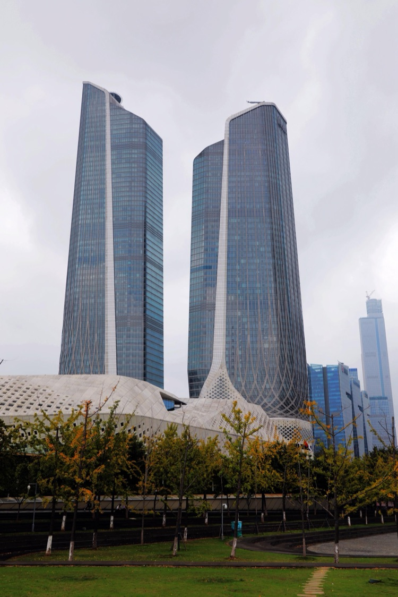

南京河西地標青奧中心雙子塔，整體造型被網友們戲稱為「路由器」。

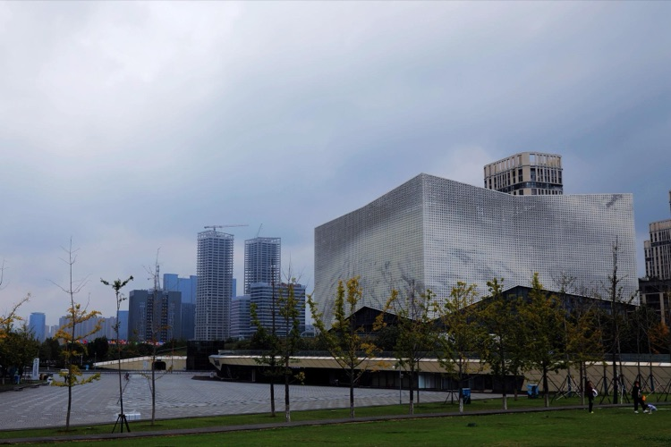

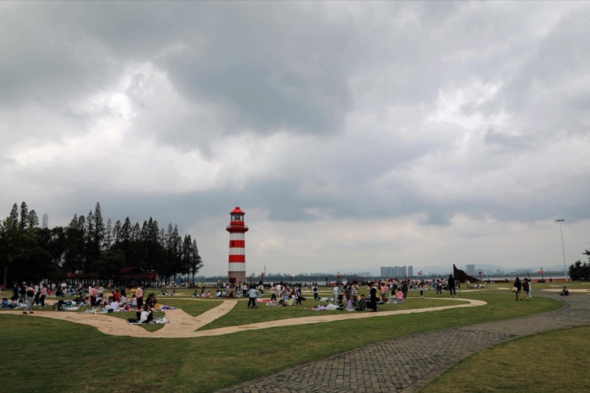

魚嘴濕地公園很大，走在其間並不能感到「魚嘴」的模樣，但高高豎起的燈塔確實明顯的標誌性建築。紅白相間的環十分醒目，燈塔下面草坪中九轉十八彎的小路，象徵萬里長江奔騰不息的流過祖國大地。

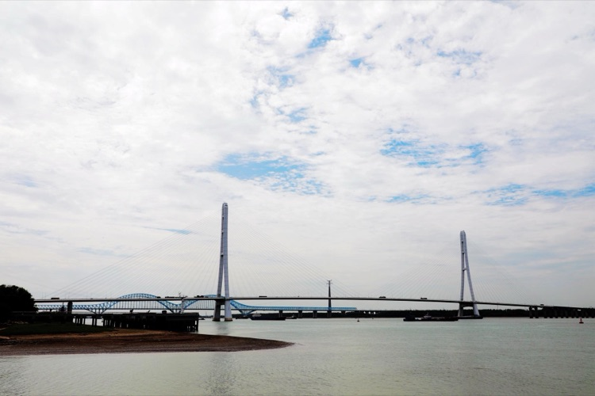

西邊的江面上是南京大勝關長江大橋，原稱三橋。南京大勝關長江大橋主橋為雙塔雙索面鋼塔鋼箱梁斜拉橋，是中國第一座鋼塔斜拉橋，也是世界上第一座弧線形鋼塔斜拉橋，其弧線形鋼塔設計具有創新性和增強建築美感的特點。後面藍色的是南京大勝關長江鐵路大橋，是一座跨長江的六線鐵路橋梁工程，雙拱連跨，本身氣勢磅礴。

大勝關，原名大城港鎮，公元1360年，朱元璋大敗陳友諒於此，並取得重大的決定性勝利，旋即改大城港為大勝港，並在大勝港設立大勝關。大勝關由此得名。如果沒有大勝關的那場勝利，也許也沒後面的「明朝的那些事。」

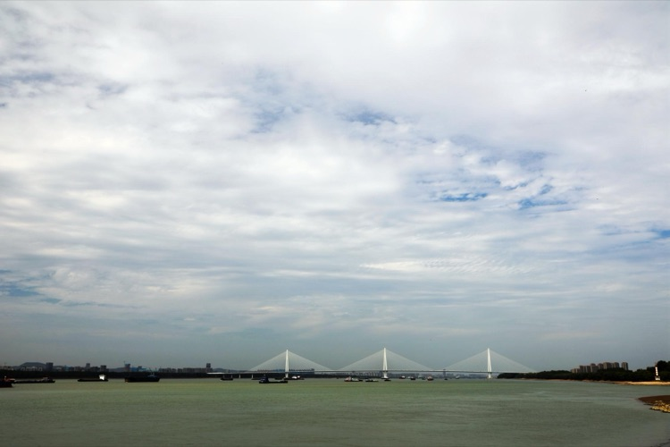

東邊的江面上是南京江心洲長江大橋，南京江心洲長江大橋為「橋+隧」佈局，整體分為橋梁段、路基段和隧道段三部分，主橋為縱向鑽石型索塔中央雙索面三塔雙跨組合梁斜拉橋。

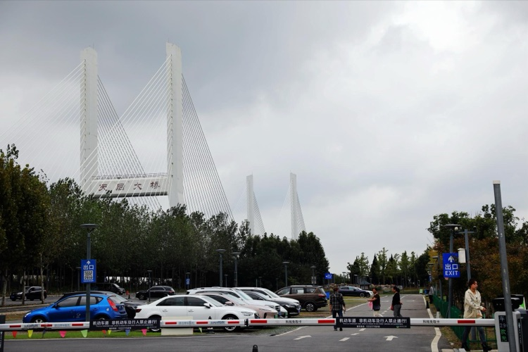

南京大勝關長江大橋全線共設四座互通立交，由南向北分別為劉村互通、天后村互通、高旺互通和張店互通。背影的拉索是「天后大橋」，用的是天后村的名字。

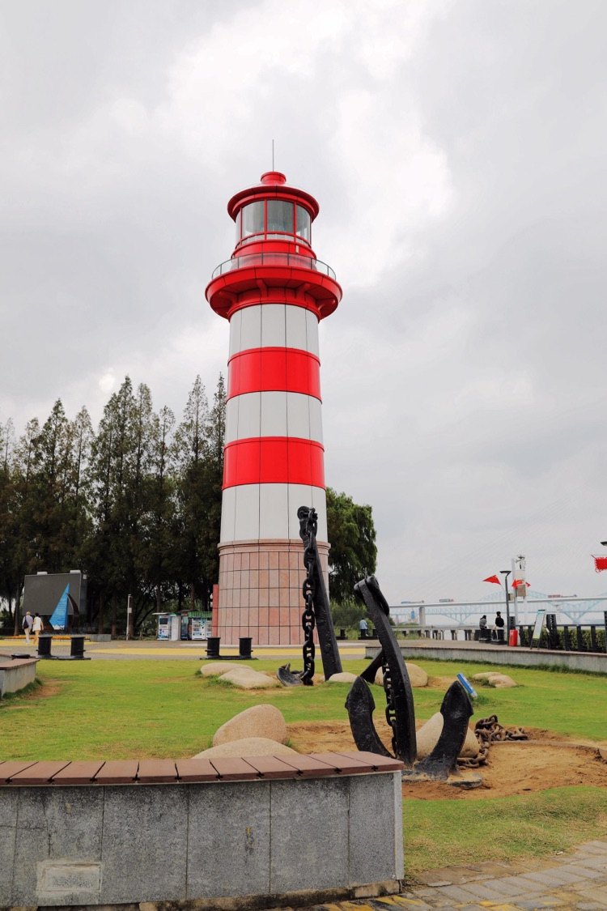

南京是個來了就不想走的地方，無論是坐火車來的、坐汽車來的、還是坐船來的，因為南京人的熱情，因為南京寬厚待人的態度，等等等等......
